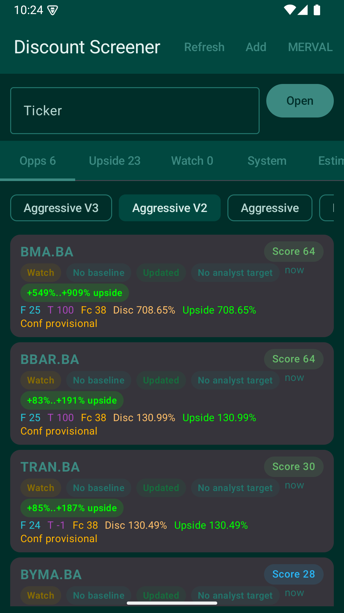
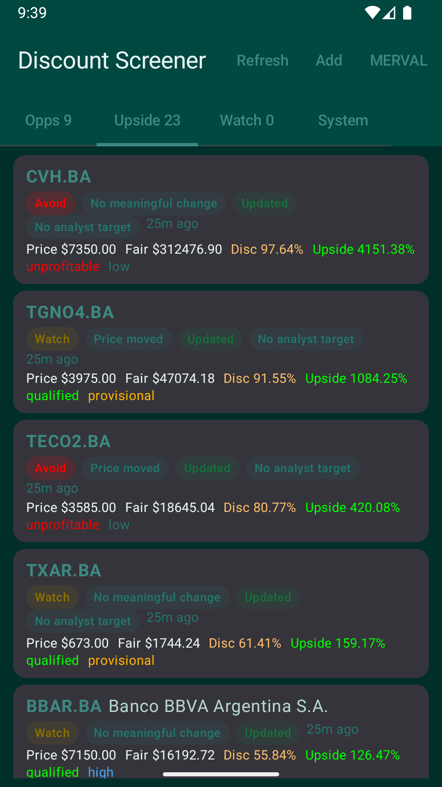
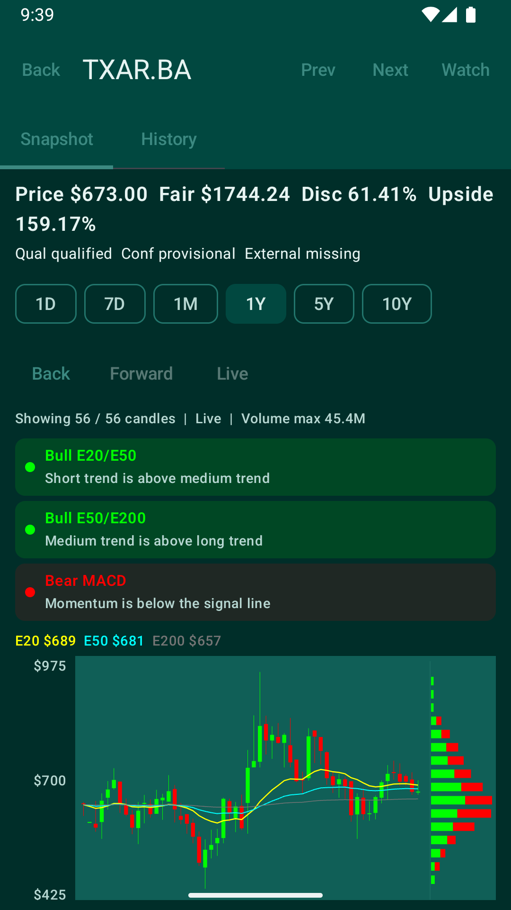
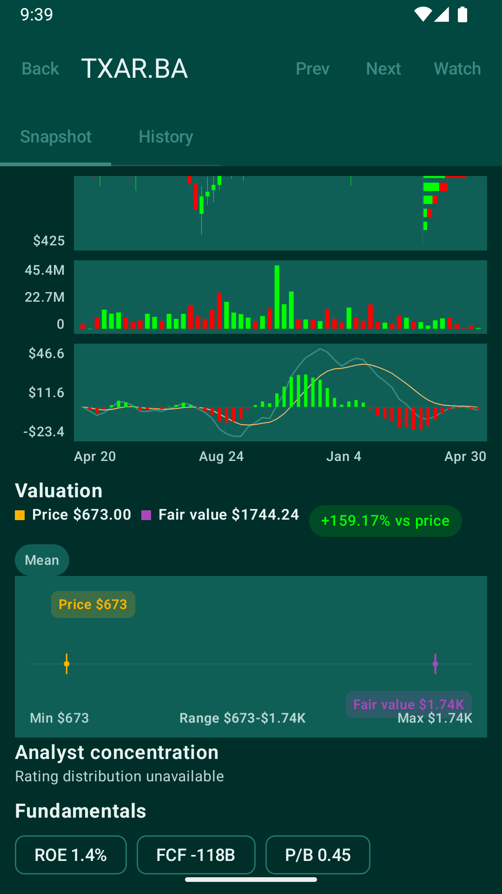
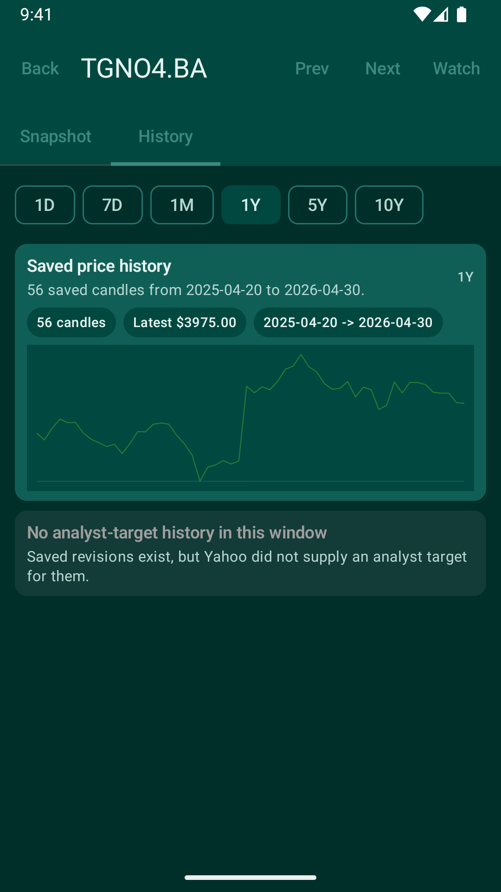
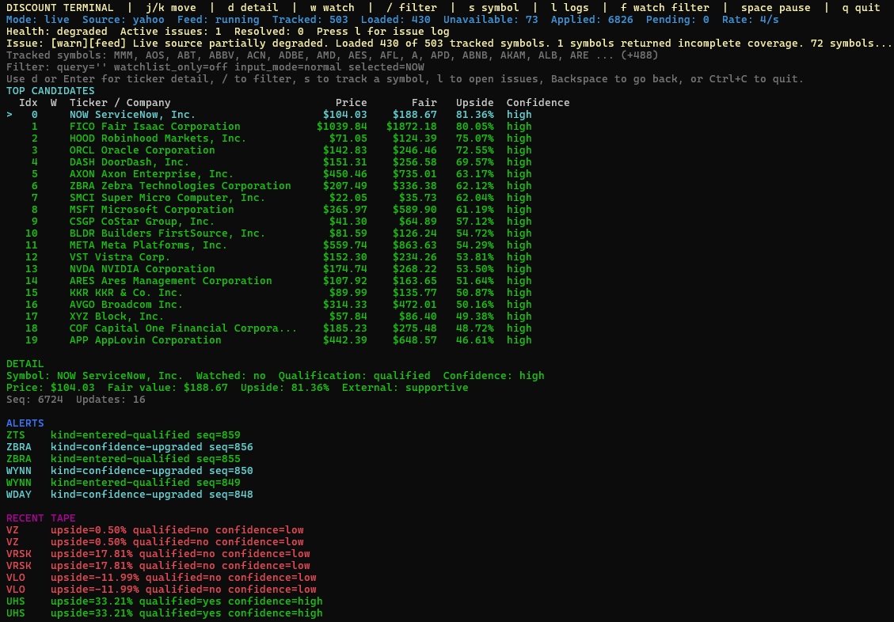
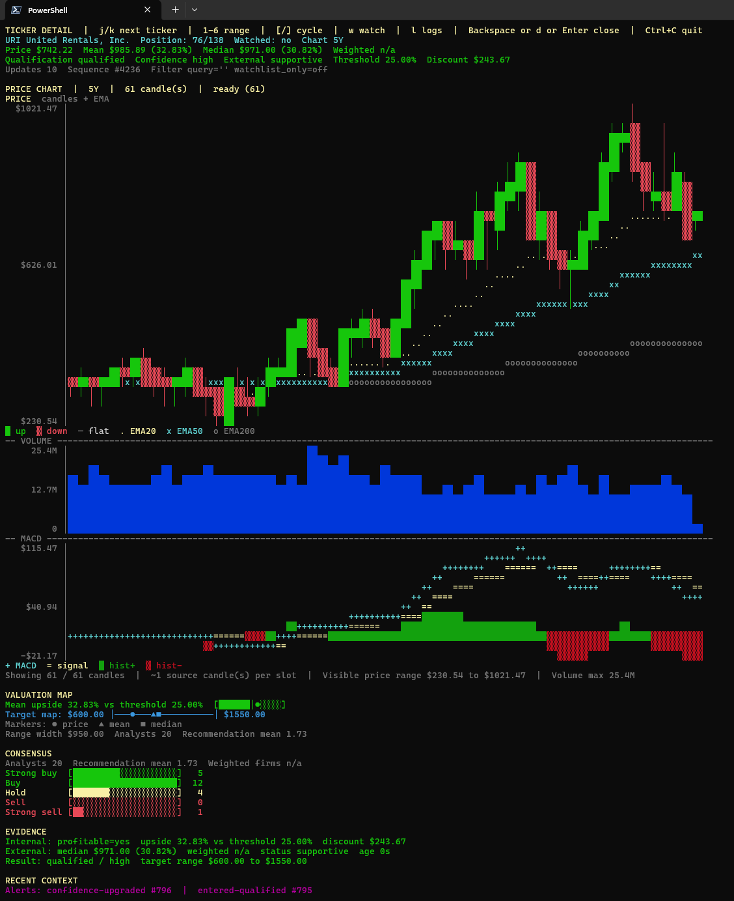

# Discount Screener

Discount Screener is a multi-app monorepo that ranks public-market opportunities using Yahoo Finance data. Each company is evaluated through DCF analysis, analyst consensus, and confidence-weighted scoring. Stocks are triaged into Act / Watch / Avoid buckets so you can focus on the most actionable candidates first.

## What's here

- `apps/desktop` — Rust terminal workstation with candlestick charts, MACD, EMA overlays, volume profile, and DCF analysis
- `apps/windows` — Tauri/React Windows workstation with model-aware opportunity scoring and live market detail
- `apps/android` — Android client built with Kotlin, Gradle, and Jetpack Compose
- `shared/contracts` — shared fixtures and golden cases used by both apps

## Android screenshots

<table>
  <tr>
    <td align="center"></td>
    <td align="center"></td>
    <td align="center"></td>
  </tr>
  <tr>
    <td align="center">Opportunities — ranked triage</td>
    <td align="center">Upside candidates — scored list</td>
    <td align="center">Ticker detail — candlestick &amp; signals</td>
  </tr>
  <tr>
    <td align="center"></td>
    <td align="center"></td>
    <td></td>
  </tr>
  <tr>
    <td align="center">Valuation map &amp; fundamentals</td>
    <td align="center">Saved price history</td>
    <td></td>
  </tr>
</table>

## Desktop screenshots

| Candidates list | Ticker detail |
|---|---|
|  |  |

## Windows scoring modes

The Windows workstation treats scoring mode as part of the presentation state:

- **Long V2 / Long V3** rank possible purchases. Upside, bullish technical signals, and intrinsic value above market are favorable.
- **Short** ranks candidates for a bearish position—not purchases. Downside and bearish evidence support the thesis; analyst upside, bullish signals, insider buying, and intrinsic value above market are displayed as risks against it.

For equities, Long V3 and Short V3 can add **Market context** as a fourth dimension beside fundamentals, technicals, and forecast. It measures whether the asset's quality, valuation, beta, sector, and price extension fit the active market environment; it is not a market-direction forecast. Windows displays the three-dimensional base, the actual context adjustment, and the final score separately. A positive context score in Short V3 means better fit for the bearish thesis. V2, ETFs, crypto, and score History retain their existing semantics and do not use this dimension.

Analyst targets remain explicitly labeled as external references in Short mode and are never presented as short profit targets. Missing targets remain missing. Short positions can lose more than the initial capital and require borrow, fee, squeeze, stop, and earnings-risk checks before trading.

## Commands

All commands run from the repository root via `make`.

### Desktop

| Command | Purpose |
|---|---|
| `make run` | Run the terminal workstation |
| `make desktop-test` | Run unit tests |
| `make desktop-smoke` | Non-interactive smoke check (no live network needed) |
| `make desktop-release` | Build optimised release binary |

### Android

| Command | Purpose |
|---|---|
| `make android-run` | Deploy and launch on a connected device or emulator |
| `make android-test` | Run unit tests |
| `make apk` | Build debug APK → `dist/discount-screener-debug.apk` |
| `make android-release` | Build signed release APK → `dist/discount-screener-release.apk` |
| `make android-signing-bootstrap` | First-time release-signing setup |

### Windows

From `apps/windows`, run `npm install`, then:

| Command | Purpose |
|---|---|
| `npm test` | Run Windows frontend tests |
| `npm run build` | Type-check and build the frontend |
| `npm exec tauri dev` | Launch the live Tauri workstation |

### Cross-platform

| Command | Purpose |
|---|---|
| `make contracts-test` | Validate shared fixture contracts across both apps |

## Requirements

- **Desktop:** Rust toolchain (`rustup` + `cargo`)
- **Windows:** Node.js, Rust toolchain, Tauri prerequisites, and Microsoft WebView2
- **Android:** JDK 17+, an Android SDK — set `ANDROID_HOME` or add `sdk.dir=<path>` to `apps/android/local.properties`

## Documentation

- [Desktop README](apps/desktop/README.md)
- [Android README](apps/android/README.md)
- [Windows README](apps/windows/README.md)
- [Shared contracts](shared/contracts/README.md)
- [Quick Start](docs/QUICK_START.md)
- [User Manual](docs/USER_MANUAL.md)

---

Not investment advice. Data may be delayed or incomplete.
