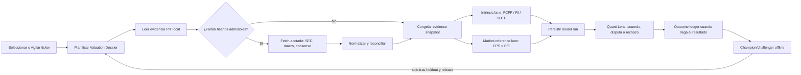

# Roadmap — automatizar estimaciones profesionales sin copiar el precio

## Decisión ejecutiva

La app debe automatizar un **expediente de valuación point-in-time** por empresa. Ese expediente conserva los datos que realmente estaban disponibles, construye varios candidatos compatibles con el negocio y explica por qué coinciden o discrepan.

No se refina el algoritmo minimizando la distancia al precio actual. Se refina separando tres errores:

1. **Earnings:** ¿pronosticamos bien ventas, márgenes, CapEx, impuestos y EPS?
2. **Valuation:** dado ese earnings power, ¿estimamos bien el múltiplo/riesgo?
3. **Data:** ¿usamos la métrica, período, moneda, revisión y disponibilidad correctos?

Esto hace que una mala estimación sea diagnosticable. Si Amazon sale bajo por EPS, la corrección está en el operating model; si el EPS es bueno pero el precio objetivo sale bajo, está en el múltiplo; si ambos parecen correctos pero la comparación es incoherente, está en horizonte o datos.

## Flujo automático objetivo



El fetch profundo es bajo demanda y single-flight. El universo completo no descarga modelos de consenso o segmentos al arrancar. En v1, “vigilado” significa un **dossier pin** persistido y fechado, separado del universo, portfolio y perfil `qa`, con hard cap propio. En background solo se actualizan tasas/macro, se descubren filings SEC incrementales y se refrescan esos pins.

## Datos necesarios y cómo obtenerlos

| Familia | Datos | Fuente v1 | Calidad/admisión | Evolución profesional |
| --- | --- | --- | --- | --- |
| Reportados | ingresos, operating income, impuestos, shares, SBC, CapEx, leases, segmentos | [SEC EDGAR APIs](https://www.sec.gov/search-filings/edgar-application-programming-interfaces), filings e iXBRL | primaria; conceptos estándar aprobados pueden automatizarse | parser de filing/segmentos para extensiones revisadas |
| Tasas | Treasury curve, risk-free y macro | [Treasury daily rates/XML](https://home.treasury.gov/treasury-daily-interest-rate-xml-feed), [FRED observations](https://fred.stlouisfed.org/docs/api/fred/series_observations.html) | fechada y versionada | [FRED vintage dates](https://fred.stlouisfed.org/docs/api/fred/series_vintagedates.html) para replay PIT |
| ERP/beta | ERP, sector beta, shrink policy | archivo de política versionado y fuente fechada | provisional si usa bootstrap; nunca constante eterna | actualización aprobada y outcome monitoring |
| Consenso actual | EPS/revenue por período, low/mean/high, analyst count, revisions | Yahoo existente, explícitamente `soft`; import JSON/CSV tipado | demanda, snapshot, métrica no asumida GAAP | adapter comercial PIT |
| Targets/opiniones | low/base/high, fecha/horizonte, analista | TipRanks existente + import tipado | familia correlacionada con research | mantener como evidencia, no como forecast EPS sustituto |
| Método declarado | EPS usado, P/E, horizonte target, fuente/location si está verificada | import JSON tipado | una transcripción sin artifact es `manual_transcription_unverified`, sin página inventada y siempre provisional | report verification o feed licenciado si expone methodology |
| Segment/KPI consensus | AWS/retail growth, margins, CapEx/KPIs | no fingir disponibilidad en v1 | `Unavailable` si falta | primer trial recomendado: [S&P Visible Alpha](https://www.spglobal.com/market-intelligence/en/solutions/products/visible-alpha-data-services) |
| Consensus PIT amplio | history, revisions, analyst detail | snapshots propios desde la fecha de captura | no permite backfill anterior | [FactSet Estimates](https://developer.factset.com/) o [LSEG I/B/E/S](https://www.lseg.com/en/data-analytics/financial-data/company-data/ibes-estimates) según cobertura/licencia |
| Precios/peers | precios PIT, market cap, EPS forward, business exposure | historial actual + provider adapter | el precio del sujeto nunca entra en su candidato | security master y corporate actions PIT |

### Política de proveedores

- **Tier A — evidencia primaria:** SEC structured entity facts, issuer IR, Treasury/FRED. Puede sustentar calidad sólida si está completa y reconciliada. Tablas/narrativa de filings, extensiones del emisor, segmentos y guidance son candidatos de admisión, no Tier A automático.
- **Tier B — agregadores actuales:** Yahoo, TipRanks y un eventual proveedor económico. Útiles como snapshots `soft`; no reconstruyen el pasado.
- **Tier C — research/licensed PIT:** reportes poseídos y feeds comerciales. Se preservan derechos, attribution, local-cache y retention; no se scrapea contenido propietario.

Para Amazon, Visible Alpha es el primer trial recomendado porque el problema no es conseguir otro target: es conseguir estimaciones point-in-time de AWS, retail, márgenes, CapEx y KPIs. La arquitectura no depende de esa marca. El trial debe comparar AMZN y dos holdouts, comprobar campos/vintages/API/derechos/costo y poder desecharse sin cambiar el core. No se compra ni se escribe el adapter hasta aprobar presupuesto, caching, derivados, attribution, cifrado y retención.

### Replay operacional versus investigación histórica

- `Operational`: publicación, disponibilidad e ingestión deben ser ≤ `decision_at`; puede alimentar la proyección live.
- `CertifiedBackfillResearch`: admite ingestión posterior solo con vintage/certificación del provider; queda aislado de la proyección live, cache de producción, ranking, alertas y `Strong`.

Ambos modos tienen fingerprints distintos. Capturar hoy Yahoo no autoriza a afirmar que ese consenso existía hace dos años.

## Brownfield: qué se reutiliza y qué cambia

| Seam actual | Decisión |
| --- | --- |
| `evidence_sotp.rs` + Android `EvidenceSotp` | preservar v1, corregir conflict parity y envolver con V2; no persistir v1 como ledger global |
| `quote_summary.rs` | reutilizar como snapshot `soft`; `+1y` no satisface FY2028 y unknown no satisface GAAP |
| `yahoo_session.rs` | reutilizar session/cooldown; no crear un segundo retry/rate limiter |
| `analyst_forecasts.rs` | mantener TipRanks explicit-load y su quota ledger; targets no sustituyen EPS |
| `edgar.rs` / `sec_normalization.rs` | reutilizar facts aprobados; agregar limiter SEC compartido y contacto configurado |
| `operating_valuation.rs` / runtime | dejar intrinsic identities intactas; no insertar `ForwardEarningsMultiple` en ese router |
| `commands.rs` current Detail worker | envolver y reemplazar progresivamente en Slice 2; un solo producer authoritative |
| `db.rs` | agregar migration runner y tablas append-only; no reutilizar replaceable provider caches ni pruning mensual |
| `state.rs` / `engine.rs` | agregar current dossier projection separada; no usar legacy intrinsic scalar maps |
| `quant_lens.rs` | extender read model/family correlation de forma aditiva |
| `api.ts` / `detailValuationPresentation.ts` / `QuantLensPanel.tsx` | DTO y presenter dedicados; assertion DOM acotada al nuevo lane |
| Desktop | unsupported para este lane inicialmente; fail-closed y nunca deserializarlo como FCFF/consensus |

## Contratos que deben existir antes de cada adapter

- **Admission/refusal policy versionada:** exact reason codes y orden para stale, sparse coverage, dispersion, filing/guidance expiry, metric ambiguity, currency/split/horizon mismatch, conflicting source y missing entitlement.
- **Horizon coordinate:** precision-aware dates, fiscal-calendar vintage y equality APIs que devuelven `HorizonMismatch` sin transformación completa.
- **Lineage:** unión transitiva de `lineage_group_id`; la misma llamada JPM por import y TipRanks cuenta una vez.
- **Provider lifecycle:** cache, quota, retry, cost, rights, storage disposition y circuit breaker son específicos por provider.
- **Job lifecycle:** `planned/fetching/frozen/computed/refused/cancelled/timed_out/budget_exhausted/provider_partial`; solo `computed` desde snapshot frozen publica.

## Cómo se calcula Amazon

### Candidato 1 — método profesional declarado

```text
User-transcribed claim: 2028E GAAP EPS $13.00 × 28.00x = $364.00
User-transcribed JPM target $365, month label Dec-2027 = validation / rounding claim
```

El golden aritmético se etiqueta `fixture_transcription`. En producción, mientras no esté adjunto y autorizado el reporte, se etiqueta `manual_transcription_unverified`, conserva “JPM/GAAP/Dec-2027” como claims de la transcripción, omite página/section y se muestra como provisional. `target_as_of` conserva precisión `month_label`; no se inventa el día 31. No se descuenta automáticamente a hoy, no se calcula retorno anualizado y no se mezcla con el DCF.

### Candidato 2 — método propio, cuando exista evidencia

```text
AWS revenue × AWS margin
+ North America revenue × NA margin
+ International revenue × Intl margin
− corporate/unallocated costs
± non-operating items
− taxes
= GAAP / normalized earnings bridge
÷ diluted shares
= forward EPS
× ex-subject peer multiple policy
= market-reference value at target horizon
```

Advertising queda dentro de los segmentos mientras no exista evidencia defendible para asignarle costos. Separar solo sus ingresos y adjudicarle un margen inventado duplicaría valor.

### CapEx de AI/AWS

No se etiqueta una fracción arbitraria como “growth CapEx” para sumarla de vuelta. La app intenta reconciliar:

```text
cash CapEx + finance leases
→ capacidad instalada
→ utilización
→ revenue y margen incremental
→ depreciación
→ incremental ROIC
```

Si faltan esos vínculos, el FCFF puede seguir deprimido y el claim sobre CapEx de crecimiento queda provisional. Es preferible una discrepancia honesta a una normalización inventada.

## Política del múltiplo propio

El múltiplo declarado por JPM puede reproducirse porque se presenta como `analyst_stated`. Para estimar un P/E propio:

| Peers elegibles | Método permitido | Calidad máxima inicial |
| ---: | --- | --- |
| 0–4 | rechazo | unavailable |
| 5–7 | mediana robusta + MAD | soft |
| 8–11 | mediana robusta con dispersión y leave-one-out | soft hasta validación explícita |
| ≥12 y ≥5 observaciones por coeficiente | ajuste robusto/regresión con shrinkage | soft hasta rolling holdout |

Todos los peers deben ser point-in-time, excluir a Amazon, compartir base EPS/horizonte/value date/currency treatment y tener exposición económica comparable. La prima se descompone en crecimiento, duración, retorno incremental, intensidad de capital, riesgo/CoE y dilución. No existe una regla `AMZN = 28x`.

## Refinamiento del algoritmo

### El ciclo correcto

1. Guardar cada forecast y evidencia **antes** de conocer el resultado.
2. Cuando llega el filing, registrar el outcome sin reescribir el forecast original.
3. Atribuir error a drivers, EPS, múltiplo, datos o intervalo.
4. Entrenar/calibrar un challenger offline sobre ventanas rolling-origin.
5. Evaluarlo en fechas y emisores nunca usados, incluyendo casos problemáticos y corporate actions.
6. Promover una policy version solo si mejora el conjunto de métricas y no degrada refusals, cobertura o estabilidad.
7. Mantener el champion anterior reproducible y permitir rollback por policy version.

### Métricas de promoción

| Capa | Métricas primarias |
| --- | --- |
| Datos | coverage, freshness, reconciliation rate, revision lineage, parser/refusal errors |
| Operación | revenue/margin/CapEx/share-count error por segmento y horizonte |
| Earnings | EPS MAE, error absoluto escalado seguro, bias y revision dispersion; política explícita para EPS ≤0/cercano a cero |
| Múltiplo | error y estabilidad del multiple prediction; leave-one-out sensitivity |
| Incertidumbre | interval coverage, width, pinball score, scenario ordering |
| Producto | rate of useful candidates, honest refusal rate, stale-cache incidents |
| Diagnóstico secundario | target-price error, forward return, distancia a consenso/mercado |

No se optimiza “porcentaje cerca del precio”. El precio contiene información, pero también sentimiento y la misma evidencia de consenso/peers. Usarlo como objetivo central generaría circularidad y falsas señales de precisión.

## Plan de entregas

### Foundation 0A — hacer seguro el contrato PIT

- Corregir la divergencia Rust/Kotlin de conflictos equal-rank en `evidence_sotp`.
- Definir `EvidenceObservationV2` sin reinterpretar v1: stable issuer/security ID, lane/provider/lineage, metric/accounting basis, clocks, replay mode y resolution partition key.
- Definir bytes canónicos SHA-256: domain/version, length prefixes, null tags, big-endian integers, Unicode NFC y sorted-set rules.
- Goldens de delimiter/newline/Unicode/null/order, clock boundary, operational versus certified backfill y lineage transitiva.

### Foundation 0B — identidad y persistencia antes del primer run

- Minimal identity substrate: issuer/CIK, security, effective ticker, currency, share/split basis e identity vintage para AMZN y el fixture sintético.
- Runner de migraciones SQLite transaccional con `user_version`, FK/uniqueness, rollback sobre DB legacy poblada y reopen tests.
- Contrato atómico: observation IDs congelados + evidence fingerprint + model run + current projection/invalidation en una transacción.
- Los FNV existentes quedan intactos; no satisfacen el nuevo lane y no se rehashean.

### Slice 1A — reproducir la aritmética profesional

**Objetivo:** probar la aritmética y refusals sin atribuir provenance no verificada ni tocar el router intrínseco.

- Golden `fixture_transcription` con `$13.00 × 28.00 = $364.00`; target `$365` es claim de validación.
- Motor puro Rust/Kotlin con exact parity, overflow y typed refusals.
- Precio, target e issuer-implied P/E mutados no cambian el candidato.
- Un fixture sintético demuestra que no hay lógica especial para AMZN.

### Slice 1B — importar y persistir sin inventar authority

- Un único formato JSON canónico; CSV puede ser converter futuro.
- `manual_transcription_unverified` si falta el artifact: sin página/section inventada y sin upgrade de evidence strength.
- Solo facts estructurados + report metadata + external-file hash/reference opcional y nullable si no existe artifact. No se copian bytes/texto propietario.
- El application service valida, congela, calcula y persiste atómicamente. Exact duplicate es no-op; conflicto rechaza; revisión usa `supersedes`.
- Una revisión incompatible/refused, split o policy bump agrega invalidation y limpia la proyección actual sin borrar historia.

### Slice 1C — proyectar el lane aditivamente

- `ValuationDossierView`/Tauri command/TypeScript type/presenter/Quant Lens element dedicados.
- El run nunca entra en `dcf_values`, `selected_valuation_values` ni `snapshots.intrinsic_value_cents`.
- UI dice “manual analyst method” y muestra metric claim, forecast period, month-precision target horizon, source-not-verified y refusal.
- Read path cache-only y evento/poll explícito para publicar el run terminado; restart/stale-revision tests.
- Shared Rust/Android core tests, `scripts/validate-android.ps1`, scoped native E2E y Windows live QA bajo un proceso `qa`.

**Fuera de 1A–1C:** peer-derived multiple, SOTP, present-equivalent, compatible-horizon dispute scoring, ranking, `Strong`, PDF NLP, raw-artifact vault y vendor comercial.

### Slice 2 — automatizar la base pública y unificar demanda

- Expandir el identity substrate a ticker/split/corporate-action history.
- Extraer el worker actual de Detail detrás de ports y reemplazarlo progresivamente; nunca mantener dos producers compitiendo.
- SEC filing discovery incremental, raw artifacts y conceptos aprobados.
- Treasury/FRED refresh con vintages.
- Invalidación por filing, guidance, split, policy o source revision.
- `ValuationDossierCoordinator` con single-flight, deadlines, cancellation y quotas.
- Budgets por provider: reutilizar Yahoo session/429 cooldown; TipRanks sigue explicit-load y fuera del gasto automático; SEC usa contacto real y limiter process-wide; feeds pagos exponen quota/retry/cost/entitlement.
- Live market params entran al ledger; antes de esto no hay present-equivalent ni horizon-normalized disagreement.

### Slice 3 — consenso multiperíodo y revisiones

- Reemplazar el supuesto `+1y` por fiscal periods explícitos.
- Mantener Yahoo como snapshot `soft` con métrica declarada/unknown.
- Iniciar snapshots diarios solo para watchlist/seleccionados.
- Si se autoriza: trial vendor-neutral Visible Alpha; FactSet/LSEG como alternativas.
- Casos de fiscal-year change, stale periods, metric GAAP/adjusted/unknown, coverage/dispersion y post-filing/guidance expiry.

### Slice 4 — multiple policy propio

- Peer taxonomy versionada y ex-subject.
- Robust median primero; dispersion/MAD/leave-one-out.
- Reverse valuation y sensitivity.
- Shared joint-scenario policy: bear/base/bull cambia drivers, EPS, risk/CoE y multiple conjuntamente; orden exacto y calibration gates.
- No regression hasta reunir la muestra y los outcomes exigidos.

### Slice 5 — Amazon segment EPS bridge y covered SOTP

- AWS, North America e International.
- Corporate, tax, non-operating y diluted shares.
- GAAP/normalized reconciliation; SBC una sola vez.
- CapEx productivity bridge.
- Reconciliar consolidated revenue/operating income, advertising embedded-or-carved-out exclusivity, SBC exactamente una vez, diluted-share roll-forward, corporate overhead negativo y un solo debt/cash/NCI/preferred/lease bridge.
- Complete reconciled SOTP puede ser intrinsic; falta material emite solo `CoveredEVOnly`, sin price/share, gap, ranking ni selection.
- CapEx productivity solo modifica un claim en estado `Reconciled`; `Unsupported` conserva cash outflow y `DiagnosticProvisional` no altera FCFF.

### Slice 6 — validation lab y promotion

- Outcome ledger, rolling-origin PIT, issuer/time holdouts.
- Cohortes distintas: investment-wave, steady compounders, cyclicals y posteriores outliers.
- Champion/challenger reports y policy release gate.
- Solo después considerar ranking/`Strong` y present-equivalent.
- Antes de evaluar el challenger se congelan cohort, mínimo sample, baseline, tolerances y no-regression rules; target/return siguen diagnósticos secundarios.

## Qué queda deliberadamente humano o sujeto a autoridad

La automatización puede preparar estas decisiones, pero no debe fingir certeza:

- mappings XBRL nuevos, segment recasts y exceptional-event classification;
- GAAP-to-normalized adjustments y costo asignado de advertising;
- nueva peer taxonomy o prima estructural;
- promoción de policies;
- extracción de research propietario sin un entitlement claro;
- elección/pago de vendor, derechos de cache/derivados, cifrado y retención.

Si en el futuro se autoriza un raw-artifact vault, su contrato mínimo es temp-write → close/fsync → atomic rename → metadata commit, hash verification on read, recoverable orphan scan, storage cap, per-provider purge/tombstone y `unreplayable_due_to_rights` cuando el artifact ya no puede conservarse. Ese vault no forma parte de Slice 1.

No hace falta que Juan arbitre las decisiones quant anteriores. Sí hará falta su autorización cuando exista gasto, contrato o una regla de almacenamiento impuesta por el proveedor.

## Criterio de éxito

El primer éxito no es que QuantEngine muestre exactamente `$365`. Es que pueda explicar y reproducir:

- `$364` por una transcripción tipada y reproducible, claramente no verificada hasta incorporar el reporte autorizado;
- un FCFF distinto por una teoría económica distinta;
- qué fecha/horizonte representa cada cifra;
- por qué no se mezclan;
- qué evidencia falta para producir un múltiplo propio;
- y cómo sabremos, con datos no vistos, si la siguiente versión del algoritmo realmente mejoró.

Cuando eso funcione para Amazon, los siguientes tickers no se arreglan con excepciones. Se diagnostican por familia de error y se incorporan como nuevas cohortes/goldens del mismo sistema.
