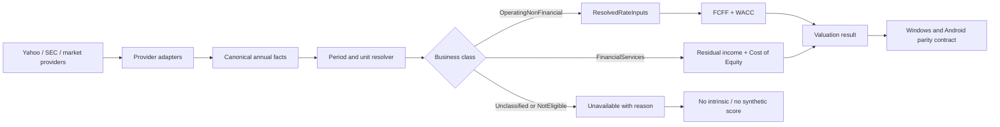
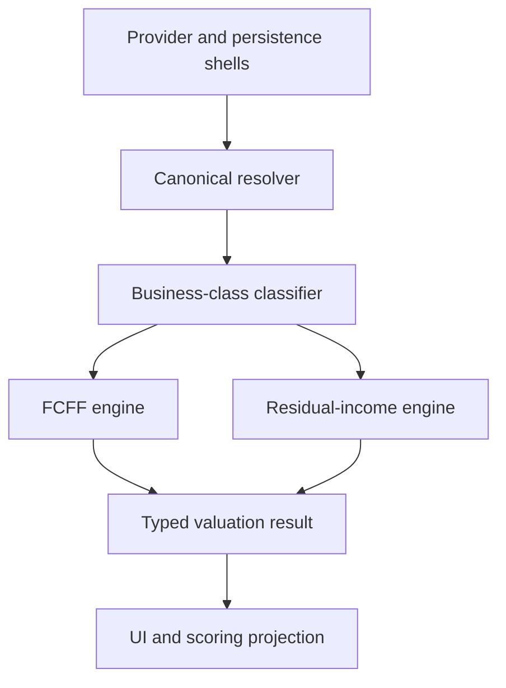

# Architecture diagrams

## Resolution and valuation flow

```mermaid
flowchart LR
  A[Yahoo / SEC / market providers] --> B[Provider adapters]
  B --> C[Canonical annual facts]
  C --> D[Period and unit resolver]
  D --> E{Business class}
  E -->|OperatingNonFinancial| F[ResolvedRateInputs]
  F --> G[FCFF + WACC]
  E -->|FinancialServices| H[Residual income + Cost of Equity]
  E -->|Unclassified or NotEligible| I[Unavailable with reason]
  G --> J[Valuation result]
  H --> J
  I --> K[No intrinsic / no synthetic score]
  J --> L[Windows and Android parity contract]
```

## Dependency direction

```mermaid
flowchart TD
  Shell[Provider and persistence shells] --> Resolver[Canonical resolver]
  Resolver --> Classifier[Business-class classifier]
  Classifier --> Operating[FCFF engine]
  Classifier --> Financial[Residual-income engine]
  Operating --> Result[Typed valuation result]
  Financial --> Result
  Result --> Projection[UI and scoring projection]
```
