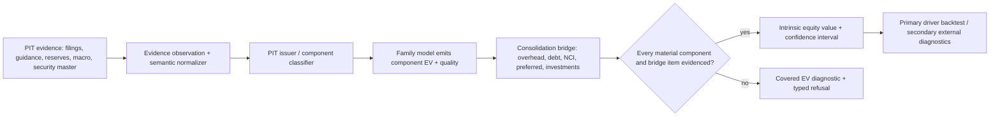
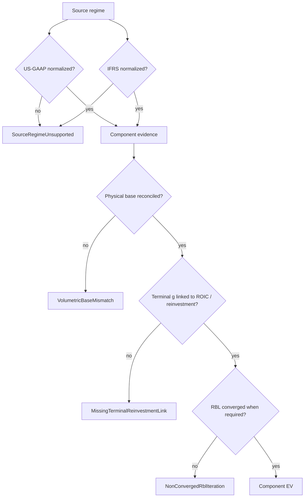

# Architecture diagrams

```mermaid
flowchart LR
    A["PIT evidence: filings, guidance, reserves, macro, security master"] --> B["Evidence observation + semantic normalizer"]
    B --> C["PIT issuer / component classifier"]
    C --> D["Family model emits component EV + quality"]
    D --> E["Consolidation bridge: overhead, debt, NCI, preferred, investments"]
    E --> F{"Every material component and bridge item evidenced?"}
    F -->|"yes"| G["Intrinsic equity value + confidence interval"]
    F -->|"no"| H["Covered EV diagnostic + typed refusal"]
    G --> I["Primary driver backtest / secondary external diagnostics"]
```

```mermaid
flowchart TD
    A["Source regime"] --> B{"US-GAAP normalized?"}
    A --> C{"IFRS normalized?"}
    B -->|"no"| R["SourceRegimeUnsupported"]
    C -->|"no"| R
    B -->|"yes"| D["Component evidence"]
    C -->|"yes"| D
    D --> E{"Physical base reconciled?"}
    E -->|"no"| V["VolumetricBaseMismatch"]
    E -->|"yes"| F{"Terminal g linked to ROIC / reinvestment?"}
    F -->|"no"| T["MissingTerminalReinvestmentLink"]
    F -->|"yes"| G{"RBL converged when required?"}
    G -->|"no"| N["NonConvergedRblIteration"]
    G -->|"yes"| H["Component EV"]
```
