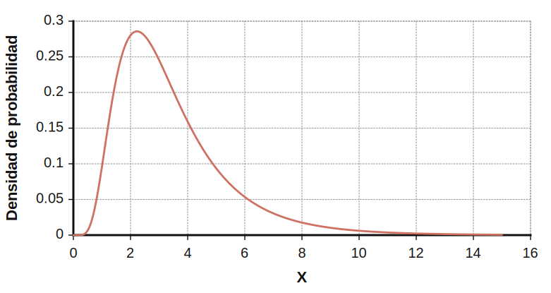
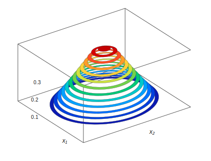

# Biblia quant

MIT Sloan Business Club

> Nota de conversión nativa: las ecuaciones y figuras PNG extraídas fueron reemplazadas por bloques matemáticos KaTeX, tablas/listas Markdown y diagramas SVG en línea.

---

## **1 Introducción**

Empecé esta guía durante el otoño de mi tercer año, en plena temporada de entrevistas para finanzas cuantitativas. Fue un proceso exigente, y a medida que avanzaba me pareció valioso volver de verdad a los fundamentos para revisar qué entra en una entrevista quant. Esa idea empezó como un banco de preguntas y terminó convirtiéndose en este escrito más extenso, que recorre muchos de los conceptos centrales de las finanzas cuantitativas. Acá vas a encontrar secciones sobre probabilidad y estadística, data science y regresiones, casos de quant research (con aportes de Kyri Chen), market making (escrito por Ravi Raghavan, Guang Cui y Evan Vogelbaum) y un banco de preguntas amplio (con aportes de Evan y Ravi).

Una de las razones principales por las que hice esta guía fue democratizar las finanzas cuantitativas como carrera dentro de la comunidad de SBC. Las finanzas quant suelen verse como una industria reservada para genios, a la que solo podés entrar si pertenecés a un círculo intelectual “de adentro”. En parte, esa percepción termina volviéndose una profecía autocumplida. Sin embargo, en mi opinión, si construís una base sólida en los conceptos de matemática y CS que sostienen el trabajo quant, y además tenés energía y entusiasmo por el campo, las finanzas quant están a tu alcance. MIT es un gran lugar para empezar ese camino, porque no solo es una de las universidades donde más reclutan para roles quant, sino que además ofrece una ruta bastante clara de materias de matemática y CS para desarrollar el conocimiento técnico necesario.

A continuación vas a encontrar una lista de esas materias. Mi recomendación es que uses esta biblia como material de apoyo mientras avanzás por esa ruta de cursos durante tus semestres en MIT, y luego como lectura principal cuando ya hayas terminado varias materias relacionadas con quant y te metas más de lleno en la preparación para entrevistas quant, probablemente hacia la primavera o el verano del segundo año.

Las finanzas quant son mucho más que una industria donde grandes cerebros matemáticos trabajan en secreto y ganan muchísimo dinero. Para la persona indicada, creo que es uno de los campos laborales más estimulantes e intelectualmente más emocionantes que existen. Es una intersección fascinante entre matemática, ciencias de la computación y economía: podés aplicar los conceptos avanzados que aprendés en las clases de matemática y CS de MIT, casi al mismo nivel que en un UROP o en un rol de SWE/ML engineer, pero en el contexto de resolver problemas y acertijos financieros.

En un trabajo quant, los mercados financieros se convierten en un gran campo de juego para el conocimiento técnico que adquirís en MIT. Funcionan como un microcosmos de lo que pasa en el mundo real, comprimido en números y datos. Además, cambian todos los días y a toda hora, lo que te obliga a adaptarte de manera constante, mantenerte informado y aprender herramientas nuevas para seguir el ritmo de la industria. Ese tipo de resolución creativa de problemas produjo muchas innovaciones en las últimas décadas; por ejemplo, el nugget de pollo de McDonald’s existe hoy porque Ray Dalio, fundador de Bridgewater, ayudó a McDonald’s y a sus proveedores a desarrollar un contrato de futuros sintético sobre pollo que los protegiera contra el riesgo y volviera viable al producto ( `https://www.cnbc.com/2018/05/03/ how-ray-dalio-helped-launch-mcdonalds-chicken-mcnugget.html` ).

Además, las finanzas quant también pueden ser una forma muy ética de trabajar dentro de la industria financiera. La cultura filantrópica en lugares como Jane Street es fuerte y, como las finanzas quant suelen pagar tan bien, podés destinar una parte importante de tu sueldo a causas benéficas. Eso convierte a quant en una de las maneras más eficientes, en términos monetarios, de usar tu potencial de ingresos como graduado de MIT para generar un bien social.

Si las finanzas quant te interesan de alguna manera, no dudes en meterte en esta biblia. Ojalá encuentres en ella algo útil, interesante y, sobre todo, accionable.

---

## **1.1 Lista de lugares a los que postularse**

- Jane Street Quant Trading, Quantitative Research, SWE

- Citadel & Citadel Securities Citadel Securities - Systematic Trading (más CS) o Semi-Systematic Trading (más matemática), Fundamental Analyst Citadel - Trading (Global Fixed Income, etc.), Quantitative Research, SWE

- The D. E. Shaw Group Prop Trading, Quantitative Analyst, SWE/Quant Developer

- Two Sigma Quantitative Research, SWE

- Hudson River Trading Algo Developer, SWE

- Jump Trading

- SIG

- Optiver

- Akuna

- J.P. Morgan Quantitative Research Extern/Intern para MIT

- Bridgewater

- QuantCo

- DRW

- IMC Trading

- Five Rings

- AQR

- Virtu Financial

- Tower Research

- Seven Eight Capital

- TransMarket Group

- Wolverine Trading

- Old Mission Capital

- Point72 (Cubist)

- Belvedere Trading

- Group One

- Flow Traders

---

## **1.2 Otros recursos**

Hay una enorme variedad de recursos que podés usar para prepararte para entrevistas de finanzas cuantitativas, desde materias de MIT hasta libros de preparación, compilaciones online y foros. Además, las entrevistas quant pueden cubrir un rango amplísimo de temas: resolución de problemas matemáticos, probabilidad y combinatoria, conceptos de CS/SWE, data science e incluso machine learning. Prepararse para este tipo de proceso puede volverse bastante intimidante, y por eso la mayoría de estas pasantías suele estar orientada al verano posterior al tercer año, y a veces al segundo.

Sobre todo si no hiciste muchas actividades extracurriculares de matemática o CS en la secundaria, tiene sentido dedicar algunos semestres de la carrera a profundizar en estos temas para construir la base y la intuición que estas entrevistas exigen. Por eso voy a empezar con algunas de las principales materias de MIT vinculadas con quant:

Materias centrales

- 18.600 (Probabilidad y variables aleatorias)

- 18.06 (Álgebra lineal)

- 14.32 (Econometría)

- 6.042 (Matemática discreta)

- 6.006/6.046 (temas de algoritmos)

- 6.034/6.036 (Machine Learning)

- 18.650 (Estadística)

- Materias extra

  - 18.615 (Procesos estocásticos, básicamente el campo principal de las finanzas matemáticas)

  - 6.867 (Machine Learning de nivel de posgrado)

  - 6.437/6.438 (Inferencia, básicamente la teoría avanzada detrás de estadística/data science/machine learning)

  - 18.211 (Combinatoria, versión avanzada)

Si completás estas materias y realmente disfrutás el material, entonces las finanzas cuantitativas son una opción de carrera muy razonable para vos. Es importante que te sientas fluido y que desarrolles una comprensión profunda de los temas que aparecen en estas clases. En entrevistas quant te vas a encontrar con muchos de esos mismos conceptos, pero recontextualizados para problemas de finanzas cuantitativas, así que vas a querer mantenerte ágil y poder aplicar lo que aprendiste en escenarios algo desconocidos, fuera de tu zona de confort.

Para afinar de verdad tu capacidad de encarar estos brainteasers, preguntas de CS y case studies, también podés explorar recursos de aprendizaje por fuera de las clases de MIT.

Libros

- _Thinking Fast and Slow_ de Daniel Kahneman (una lectura más amena sobre la psicología de cómo pensamos, relevante para los estilos mentales de los traders)

- _Heard on the Street_ de Timothy Crack (uno de los libros más usados para practicar entrevistas de finanzas en general)

- _Elements of Statistical Learning_ de Trevor Hastie, etc. (un texto esencial de data science y quant research)

- _Quant Job Interview Questions and Answers_ de Mark Joshi

- _A Practical Guide to Quantitative Finance Interviews_ de Xinfeng Zhou

- _Fifty Challenging Problems in Probability with Solutions_ de Frederick Mosteller

- _Cracking the Coding Interview_ (los roles quant ponen cada vez más énfasis en estructuras de datos, algoritmos, etc., así que esto también importa)

- Libros extra

  - _Art of Problem Solving - Intro to Counting and Probability and Intermediate Counting and Probability_ (estos son algunos de los principales libros de preparación para competencias matemáticas de secundaria sobre estos temas)

  - _Option and Volatility Pricing_ de Natenburg (libro importante de opciones en la industria quant; algunos lugares como Optiver enseñan directamente desde este libro)

  - _Options, Futures, and Other Derivatives_ de John Hull

Sitios web

- Glassdoor. Buscá empresas y pasantías puntuales, y vas a encontrar publicaciones con preguntas reportadas por candidatos que ya entrevistaron.

- The Puzzle Toad: `https://www.cs.cmu.edu/puzzle/`

- Wall Street Oasis. Tiene algo de material útil para entrevistas quant, además de consejos generales y discusión sobre carreras en finanzas.

- LeetCode. Algunos roles de trader o QR incluyen desafíos de código (Two Sigma, HRT, Akuna, Belvedere).

- Kaggle. Es un sitio muy usado para proyectos y discusión de data science, y un buen lugar para familiarizarte con numpy, pandas y scipy.

---

## **2 FUNDAMENTOS DE PROBABILIDAD**

Esta sección resume 18.600, con el foco puesto principalmente en variables aleatorias y distribuciones de probabilidad. Voy a cubrir buena parte del material de combinatoria en la sección correspondiente, así que acá solo voy a pasar más por arriba esos temas de 18.600.

## **2.1 Probabilidad condicional y teorema de Bayes**

- A las firmas quant les importa mucho que entiendas bien la probabilidad condicional. En general, muchos eventos probabilísticos de la vida real dependen unos de otros; por ejemplo, la probabilidad de que alguien esté tosiendo hoy frente a la probabilidad de que esa misma persona esté enferma hoy. Para dos eventos dependientes $A$ y $B$, la probabilidad de que ocurra $A$ dado que ocurrió $B$ se escribe como la probabilidad condicional $P(A\mid B)$, es decir, la probabilidad de $A$ dado $B$. Su fórmula definicional es

$$
P(A\mid B)=\frac{P(A\cap B)}{P(B)}
$$

El siguiente diagrama ilustra esto:

$$
P(A\mid B)=\frac{P(A\cap B)}{P(B)},\qquad P(B)>0
$$

<div align="center">
  <svg xmlns="http://www.w3.org/2000/svg" viewBox="0 0 420 220" width="420" height="220" role="img" aria-labelledby="title desc">
    <title id="title">Definición de probabilidad condicional</title>
    <desc id="desc">Diagrama de Venn que muestra A, B y su intersección A∩B para ilustrar P(A|B).</desc>
    <rect x="0" y="0" width="420" height="220" fill="white"/>
    <rect x="18" y="18" width="384" height="184" fill="white" stroke="#d0d7de"/>
    <text x="210" y="42" text-anchor="middle" font-size="18" font-family="Georgia, 'Times New Roman', serif" fill="#0f172a">Definición de probabilidad condicional</text>
    <circle cx="160" cy="120" r="70" fill="none" stroke="#475569" stroke-width="2"/>
    <circle cx="260" cy="120" r="70" fill="none" stroke="#475569" stroke-width="2"/>
    <path d="M210 71 A70 70 0 0 1 210 169 A70 70 0 0 1 210 71 Z" fill="#93c47d" fill-opacity="0.78" stroke="#6aa84f" stroke-width="1.5"/>
    <text x="118" y="94" font-size="18" font-family="Georgia, 'Times New Roman', serif" fill="#334155">A</text>
    <text x="286" y="94" font-size="18" font-family="Georgia, 'Times New Roman', serif" fill="#334155">B</text>
    <text x="210" y="126" text-anchor="middle" font-size="26" font-style="italic" font-family="Georgia, 'Times New Roman', serif" fill="white">A∩B</text>
  </svg>
</div>

Entonces podemos pensar la probabilidad de $A$ dado $B$ como la razón entre la probabilidad de que $A$ y $B$ ocurran juntos y la probabilidad de que ocurra solo $B$. En el diagrama de Venn de arriba, $P(A\mid B)$ equivale a la fracción del espacio de probabilidad de $B$ ocupada por la intersección entre $A$ y $B$.

- El término $P(A \cap B)$ introduce una simetría útil para las probabilidades condicionales: podemos escribir $P(A\mid B)P(B)=P(A\cap B)=P(B\mid A)P(A)$. De ahí obtenemos el teorema de Bayes:

$$
P(A\mid B)=\frac{P(B\mid A)P(A)}{P(B)}
$$

Esto puede verse como una simple reescritura de la fórmula definicional, donde sustituimos $P(A\cap B)$ por la probabilidad condicional en la otra dirección. La fórmula de Bayes es útil porque los tres términos ($P(B\mid A)$, $P(A)$ y $P(B)$) suelen ser relativamente fáciles de calcular en escenarios del mundo real.

Si te sirve pensarlo de forma operativa, Bayes hace dos cosas: primero pondera la hipótesis por la evidencia, y después normaliza para que el resultado final siga siendo una probabilidad entre 0 y 1.

```python
def bayes(prior_a, p_b_given_a, p_b_given_not_a):
    evidence = p_b_given_a * prior_a + p_b_given_not_a * (1 - prior_a)
    posterior = p_b_given_a * prior_a / evidence
    return posterior
```

En esa receta, `prior_a` es lo que creías antes de ver `B`, `p_b_given_a` dice qué tan compatible sería `B` si `A` fuera cierta, y `evidence` suma todos los caminos posibles para observar `B`.

- El término $P(B\mid A)$ se conoce como la verosimilitud, es decir, qué tan probable sería ver la evidencia $B$ si $A$ fuera cierta.

- El término $P(A)$ se conoce como el prior, es decir, la probabilidad a priori de $A$ antes de incorporar nueva evidencia (que en este caso sería $B$). Del mismo modo, $P(B)$ se conoce como la evidencia.

- El término de evidencia en el teorema de Bayes suele calcularse con la ley de probabilidad total usando $A$ y su complemento $\neg A$, es decir, podemos escribir $P(B)=P(B\mid A)P(A)+P(B\mid \neg A)P(\neg A)$.

- Tversky y Kahneman (pioneros célebres de la economía conductual) plantearon algunos brainteasers clásicos para entender mejor el teorema de Bayes.

  - Imaginá que sos miembro de un jurado en un caso de choque y fuga. Una noche, un taxi atropelló a un peatón y huyó de la escena. Todo el caso contra la empresa de taxis descansa sobre el testimonio de un hombre mayor que vio el accidente desde su ventana, a cierta distancia. Él afirma que vio al peatón ser atropellado por un taxi azul. Para sostener el caso, la abogada del peatón lesionado establece los siguientes hechos. Solo hay dos empresas de taxis en la ciudad, “Blue Cabs” y “Green Cabs.” La noche en cuestión, el 85 por ciento de todos los taxis en la calle eran verdes y el 15 por ciento eran azules. El testigo fue sometido a una prueba de visión exhaustiva bajo condiciones similares a las de esa noche, y demostró que puede distinguir correctamente un taxi azul de uno verde el 80 por ciento de las veces. ¿Cuál es la probabilidad de que el taxi que vio el hombre mayor haya sido realmente azul?

    - ∗ La mayoría de la gente responde de inmediato que era mucho más probable que el taxi fuera realmente azul, apoyándose en la precisión del 80% del testigo. Sin embargo, si definimos $B$ = el taxi era azul, $O$ = el hombre mayor vio azul, y $G$ = el taxi era verde, el teorema de Bayes da

$$
P(B\mid O)=\frac{P(O\mid B)P(B)}{P(O\mid B)P(B)+P(O\mid G)P(G)}=\frac{0.8\cdot 0.15}{0.8\cdot 0.15+0.2\cdot 0.85}\approx 0.41
$$

---

- Steve es muy tímido y retraído, invariablemente servicial, pero con muy poco interés en las personas o en el mundo de la realidad. Es una persona dócil y ordenada, que necesita estructura y tiene pasión por el detalle. ¿Es más probable que Steve sea bibliotecario o granjero?

  - ∗ La mayoría de la gente responde de inmediato que Steve tiene más probabilidades de ser bibliotecario que granjero, porque la descripción de personalidad parece encajar mucho mejor con un bibliotecario. Sin embargo, bibliotecario es una ocupación bastante más rara, y podemos estimar que hay 20 veces más granjeros que bibliotecarios en EE. UU. Aunque esa descripción encaje, digamos, con el 40% de todos los bibliotecarios frente a solo el 10% de todos los granjeros, el teorema de Bayes da una probabilidad mucho mayor de que Steve sea granjero, como se ilustra abajo.

$$
P(H\mid E)=\frac{P(H)P(E\mid H)}{P(H)P(E\mid H)+P(\neg H)P(E\mid \neg H)}=\frac{\frac{1}{21}\cdot 0.4}{\frac{1}{21}\cdot 0.4+\frac{20}{21}\cdot 0.1}=\frac{4}{24}=\frac{1}{6}
$$

<div align="center">
  <svg xmlns="http://www.w3.org/2000/svg" viewBox="0 0 440 280" width="440" height="280" role="img" aria-labelledby="title desc">
    <title id="title">Ejemplo de Bayes con prior y base rate</title>
    <desc id="desc">Dos rectángulos comparan H y ¬H, destacando cómo el prior grande de ¬H domina pese a una mayor verosimilitud bajo H.</desc>
    <rect x="0" y="0" width="440" height="280" fill="white"/>
    <rect x="28" y="72" width="100" height="140" fill="#384955" stroke="#94a3b8"/>
    <rect x="28" y="156" width="100" height="56" fill="#d9c94f" stroke="#94a3b8"/>
    <rect x="182" y="42" width="230" height="170" fill="#6b7280" opacity="0.72" stroke="#94a3b8"/>
    <rect x="182" y="195" width="230" height="17" fill="#d9c94f" stroke="#94a3b8"/>
    <text x="78" y="52" text-anchor="middle" font-size="20" font-family="Georgia, 'Times New Roman', serif" fill="#111827">P(H)=1/21</text>
    <text x="297" y="28" text-anchor="middle" font-size="20" font-family="Georgia, 'Times New Roman', serif" fill="#111827">P(¬H)=20/21</text>
    <text x="12" y="146" font-size="18" font-family="Georgia, 'Times New Roman', serif" fill="#111827">P(E|H)=0.4</text>
    <text x="422" y="206" text-anchor="end" font-size="18" font-family="Georgia, 'Times New Roman', serif" fill="#111827">P(E|¬H)=0.1</text>
    <text x="220" y="244" text-anchor="middle" font-size="14" font-family="Georgia, 'Times New Roman', serif" fill="#475569">El posterior favorece a ¬H aunque E encaje mejor con H,</text>
    <text x="220" y="261" text-anchor="middle" font-size="14" font-family="Georgia, 'Times New Roman', serif" fill="#475569">porque el prior de ¬H es mucho mayor.</text>
  </svg>
</div>

- Otros ejemplos de probabilidad condicional

  - Supongamos que el 1% de las personas en EE. UU. tiene Ébola. Existe un test para Ébola con una tasa de 1% de falsos positivos y 1% de falsos negativos, es decir, el 99% de las personas sanas dará negativo y el 99% de las personas enfermas dará positivo. ¿Cuál es la probabilidad de que una persona que dio positivo realmente tenga Ébola?

∗ Sea $H$ = persona sana, $S$ = persona enferma, y $+$ = dio positivo. El teorema de Bayes da

$$
P(S\mid +)=\frac{P(+\mid S)P(S)}{P(+\mid S)P(S)+P(+\mid H)P(H)}=\frac{0.99\cdot0.01}{0.99\cdot0.01+0.01\cdot0.99}=0.5
$$

así que este test en realidad es bastante impreciso. (Nota al margen: ¿mejora mucho la precisión efectiva de este test con pruebas repetidas, es decir, aumenta $P(S\mid +)$ si $+$ representa múltiples resultados positivos seguidos? El teorema de Bayes muestra que para $+=k$ tests positivos consecutivos, la precisión efectiva se vuelve

$$
P(S\mid +^k)=\frac{0.99^k\cdot0.01}{0.99^k\cdot0.01+0.01^k\cdot0.99}
$$

lo que equivale a 99% de precisión con apenas 2 tests positivos.)

**–** Esta pregunta se hace mucho en entrevistas de trading, especialmente como parte de una primera phone screen. Supongamos que tenemos 1000 monedas; 999 son monedas justas y la moneda número 1000 tiene cara en ambos lados. Elegimos una moneda al azar y la lanzamos 10 veces, y sale cara las 10 veces. ¿Cuál es la probabilidad de que hayamos elegido la moneda trucada?

∗ Sea $10H$ = la moneda sale cara 10 veces, $UF$ = la moneda es la trucada, y $F$ = la moneda es justa. El teorema de Bayes da

$$
P(UF\mid 10H)=\frac{P(10H\mid UF)P(UF)}{P(10H\mid UF)P(UF)+P(10H\mid F)P(F)}=\frac{1}{1+\frac{999}{1024}}\approx 0.5
$$

---

## **2.2 Valor esperado y varianza**

- Toda variable aleatoria tiene una función de masa de probabilidad (si es discreta) o una función de densidad de probabilidad (si es continua); las escribimos como $p(x)$ para la p.m.f. y $f(x)$ para la p.d.f., respectivamente. En discreto, la p.m.f. sí da probabilidades puntuales: $p(x)=P(X=x)$. En continuo, la p.d.f. no asigna probabilidad a un punto aislado; las probabilidades salen al integrar sobre un intervalo.

- Una de las propiedades más importantes de una v.a. es su valor esperado. Intuitivamente, es el valor que esperaríamos observar al muestrear la variable aleatoria. Más formalmente, es el promedio ponderado de los valores que la variable puede tomar, usando como pesos la probabilidad de cada uno de ellos. En otras palabras, el valor esperado es la misma idea que la media de una variable aleatoria. Podemos escribirlo como una suma o una integral para la p.m.f. o la p.d.f., respectivamente.

$$
E[X]=\mu=\sum_{x\in\Omega}x\,p(x)\quad\text{o}\quad\int_{\Omega}x\,f(x)\,dx
$$

donde $\Omega$ representa el espacio muestral de la variable aleatoria y $\mu$ se usa para denotar la media.

- También podemos pensar el valor esperado de cualquier función de una variable aleatoria de la misma manera. Esto se calcularía como el promedio ponderado de los valores de la función que la v.a. puede tomar, ponderados por la probabilidad de tomar cada valor. En otras palabras, es

$$
E[g(X)]=\sum_{x\in\Omega}g(x)\,p(x)\quad\text{o}\quad\int_{\Omega}g(x)\,f(x)\,dx
$$

Las fórmulas anteriores, o incluso la idea misma de tomar un promedio ponderado, pueden ser muy útiles en entrevistas de finanzas quant. A veces te vas a encontrar con preguntas sobre cómo calcular el valor esperado de una variable aleatoria más exótica, y todo se reduce a especificar la p.m.f. o la p.d.f. y luego hacer el promedio ponderado o la integral.

- Linealidad de la esperanza. El valor esperado es una función lineal, entonces tenemos

$E[aX+b]=aE[X]+b$.

La parte más importante es que la linealidad funciona para combinaciones (sumas) de variables aleatorias, incluso si las variables aleatorias son dependientes:

$$
E[X_1+X_2+\cdots+X_n]=E[X_1]+E[X_2]+\cdots+E[X_n]
$$

incluso si $X_1, \ldots, X_n$ son dependientes.

- Esta propiedad de linealidad de la esperanza para variables dependientes es muy importante en entrevistas quant. Muchas preguntas que parecen complicadas sobre valores esperados en un experimento o una situación probabilística pueden resolverse de manera muy simple si definís variables aleatorias, incluso dependientes, de forma ingeniosa y aplicás linealidad de la esperanza sobre ellas. La pregunta del torneo de Five Rings es un buen ejemplo. Acá va otro más simple:

- Tenemos un aula con 10 varones y 10 mujeres, y los ordenamos al azar en una fila única de 20 estudiantes. ¿Cuál es el número esperado de pares de estudiantes adyacentes que son de distinto género?

  - ∗ Sea $X_i$ el indicador de si el $i$-ésimo y el $(i+1)$-ésimo estudiante en la fila son de distinto género (es decir, 1 si sí, 0 si no). La probabilidad de que cualquier par adyacente arbitrario en la fila tenga distinto género es $2 \cdot \frac{10}{20} \cdot \frac{10}{19} = \frac{10}{19}$, así que $E[X_i] = \frac{10}{19}$ para cualquier $i$. Podríamos notar que los $X_i$ son dependientes de a pares, ya que que un par cualquiera sea de distinto género afecta las cantidades restantes de varones y mujeres que pueden ubicarse en otros lugares de la fila. Sin embargo, igual podemos usar linealidad de la esperanza, así que la respuesta es $E[X_1 + \cdots + X_{19}] = E[X_1] + \cdots + E[X_{19}] = 19 \cdot \frac{10}{19} = 10$.

- La varianza de una variable aleatoria describe cuánto se desvía de su valor esperado en promedio. Por eso usamos el cuadrado de la desviación, que evita cancelaciones entre valores positivos y negativos:

$$
\operatorname{Var}(X)=E[(X-\mu)^2]
$$

Si expandís el cuadrado y recordás que $\mu=E[X]$, sale directamente la forma alternativa:

$$
\operatorname{Var}(X)=E[X^2]-2\mu E[X]+\mu^2=E[X^2]-\mu^2=E[X^2]-E[X]^2
$$

Esta versión es más práctica porque muchas veces es más fácil calcular el primer y el segundo momento que evaluar la definición original.

- Varianza de una combinación lineal:

$$
\operatorname{Var}(aX+b)=a^2\operatorname{Var}(X)
$$

$$
\operatorname{Var}(X+Y)=\operatorname{Var}(X)+\operatorname{Var}(Y)
$$

A menudo es importante conocer la varianza de la suma o el promedio de variables aleatorias i.i.d., es decir, variables aleatorias con la misma p.m.f. o p.d.f. que se muestrean de manera independiente. Si $X_1, \ldots, X_n$ son i.i.d., cada una con varianza $\sigma^2$, entonces

$$
\operatorname{Var}\!\left(\sum_{i=1}^n X_i\right)=n\sigma^2
$$

$$
\operatorname{Var}\!\left(\frac{1}{n}\sum_{i=1}^n X_i\right)=\frac{\sigma^2}{n}
$$

---

## **2.3 Variables aleatorias**

Esta subsección resume los tipos clásicos más importantes de variables aleatorias.

También necesitamos definir una función de distribución acumulada (cdf) para v.a. continuas: es la probabilidad de que la variable aleatoria tome un valor menor o igual que la entrada de la función.

$$
F_X(a)=P(X\le a)=\int_{-\infty}^{a} f(x)\,dx
$$

A continuación aparecen varios ejemplos de variables aleatorias.

Variables aleatorias discretas

| Variable aleatoria | Experimento | PMF | Valor esperado | Varianza |
|---|---|---|---|---|
| Bernoulli | Experimento con dos resultados, 1 si sí, 0 si no; por ejemplo, lanzar una moneda justa o injusta. | $p_X(x)=p$ si $x=1$, y $p_X(x)=1-p$ si $x=0$. | $E[X]=p$ | $\operatorname{Var}(X)=p(1-p)$ |
| Binomial | Experimento con $n$ ensayos de Bernoulli independientes; cuenta la cantidad de ensayos exitosos. | $p_X(x)=\binom{n}{x}p^x(1-p)^{n-x}$ | $E[X]=np$ | $\operatorname{Var}(X)=np(1-p)$ |
| Poisson | Cuenta la cantidad de ocurrencias de un evento independiente en un intervalo fijo de tiempo o espacio. | $p_X(x)=\frac{\lambda^x e^{-\lambda}}{x!}$ | $E[X]=\lambda$ | $\operatorname{Var}(X)=\lambda$ |
| Geométrica | Ensayos de Bernoulli independientes sucesivos; cuenta cuántos ensayos ocurren hasta incluir el primer éxito. | $p_X(x)=(1-p)^{x-1}p$ | $E[X]=\frac{1}{p}$ | $\operatorname{Var}(X)=\frac{1-p}{p^2}$ |

Variables aleatorias continuas

| Variable aleatoria | Experimento | PDF | Valor esperado | Varianza |
|---|---|---|---|---|
| Uniforme | Elegir un número en $[a,b]$ con igual probabilidad para cualquier número del intervalo. | $f_X(x)=\frac{1}{b-a}$ para $a\le x\le b$, y $0$ en caso contrario. | $E[X]=\frac{a+b}{2}$ | $\operatorname{Var}(X)=\frac{(b-a)^2}{12}$ |
| Normal | La clásica curva de campana; los promedios de una cantidad asintóticamente grande de ensayos repetidos convergen a una variable aleatoria normal bajo el teorema central del límite. | $f_X(x)=\frac{1}{\sigma\sqrt{2\pi}}e^{-\frac{1}{2}\left(\frac{x-\mu}{\sigma}\right)^2}$ | $E[X]=\mu$ | $\operatorname{Var}(X)=\sigma^2$ |
| Exponencial | Medir el tiempo de espera hasta el primer evento en un proceso de Poisson con tasa $\lambda$. | $f_X(x)=\lambda e^{-\lambda x}$ para $x\ge 0$ | $E[X]=\frac{1}{\lambda}$ | $\operatorname{Var}(X)=\frac{1}{\lambda^2}$ |

Propiedades importantes:

- Un experimento de Poisson viene de un experimento binomial donde asintóticamente $n$ es muy grande y $p$ es muy pequeño, de modo que $np=\lambda$.

- Podemos construir un proceso puntual de Poisson $N(t)$ = la cantidad de eventos que ocurren durante las primeras $t$ unidades de tiempo. $N(t)$ se construye mediante una secuencia de v.a. exponenciales con la misma tasa $\lambda$.

- Tanto la variable aleatoria geométrica como la exponencial no tienen memoria, es decir, la distribución de probabilidad de $X$ geométrica o exponencial después de que ya transcurrieron algunos ensayos/tiempo es la misma que si se empezara de nuevo en el primer ensayo/en el tiempo 0. En otras palabras, el comportamiento de los experimentos que siguen la distribución geométrica o exponencial no se ve afectado por cuántos ensayos/tiempo ya pasaron.

---

## **2.4 Distribuciones de funciones y distribuciones conjuntas**

- Si conocemos la pdf de una variable aleatoria $X$, podemos calcular la pdf de cualquier función estrictamente creciente de $X$. Integramos la pdf para obtener la cdf $F_X(a)$. Sea $g(x)$ una función estrictamente creciente de $x$. Entonces, para $Y = g(X)$, tenemos $F_Y(a) = F_X(g^{-1}(a))$. Esto nos da la cdf de $Y$, y a partir de ahí podemos derivar para obtener la pdf.

- Cualquier par de variables aleatorias discretas o continuas puede tener una función de masa de probabilidad conjunta o una función de distribución conjunta:

$$
p_{X,Y}(x,y)=P(X=x,Y=y)
$$

$$
\begin{aligned}F_{X,Y}(x,y)&=P(X\le x,Y\le y)\\ f_{X,Y}(x,y)&=\frac{\partial^2F_{X,Y}(x,y)}{\partial x\,\partial y}\end{aligned}
$$

A partir de la distribución conjunta, podemos obtener distribuciones marginales, que son simplemente las distribuciones de probabilidad para una sola de las v.a. (la otra puede tomar cualquier valor):

$$
\begin{aligned}p_X(x)&=\sum_y p_{X,Y}(x,y)\\ F_X(x)&=\lim_{y\to\infty}F_{X,Y}(x,y)\end{aligned}
$$

**–** Cuando X e Y son independientes, la distribución conjunta es el producto de las distribuciones marginales, es decir

$$
p_{X,Y}(x,y)=p_X(x)p_Y(y)
$$

$$
f_{X,Y}(x,y)=f_X(x)f_Y(y)
$$

## **2.5 Covarianza y correlación**

La covarianza y la correlación describen en qué medida un par de variables aleatorias puede variar de maneras similares y dependientes.

- Fórmula para la covarianza de dos variables aleatorias $X$ e $Y$:

$$
\operatorname{Cov}(X,Y)=E[(X-E[X])(Y-E[Y])]=E[XY]-E[X]E[Y]
$$

Esto es una “esperanza del producto menos producto de esperanzas”, con varias propiedades útiles:

- Si $X$ e $Y$ son independientes, entonces $\operatorname{Cov}(X,Y)=0$. Sin embargo, la recíproca no es verdadera.

- $\operatorname{Cov}(X,X)=\operatorname{Var}(X)$

- Bilinealidad: $\operatorname{Cov}(aX_1+bX_2, Y)=a\operatorname{Cov}(X_1,Y)+b\operatorname{Cov}(X_2,Y)$.

- La correlación es una versión de la covarianza independiente de la escala, reducida para estar entre -1 y 1. Su fórmula es:

$$
\rho(X,Y)=\frac{\operatorname{Cov}(X,Y)}{\sqrt{\operatorname{Var}(X)\operatorname{Var}(Y)}}
$$

Dividimos por las desviaciones estándar para quitar unidades y escala: si cambiás la unidad de medida de $X$ o $Y$, la covarianza cambia, pero la correlación no. Por eso $\rho(X,Y)$ es comparable entre pares de variables distintos y toma valores en $[-1,1]$. En particular, $\rho=1$ significa relación lineal positiva perfecta, $\rho=-1$ relación lineal negativa perfecta, y $\rho=0$ ausencia de relación lineal.

- Si dos variables aleatorias son independientes, entonces están no correlacionadas, pero la recíproca de esto no es verdadera.

---

## **3 FUNDAMENTOS DE ESTADÍSTICA**

Esta sección resume el primer tercio de 18.650.

## **3.1 LLN y CLT**

- Estadística vs. probabilidad:

  - La probabilidad abarca problemas más simples en los que podemos partir de parámetros y modelos iniciales, y luego analizar los resultados y los datos que producen.

  - La estadística abarca problemas más complejos de aleatoriedad, donde los parámetros o la distribución subyacente son desconocidos; recolectamos datos y deducimos esos parámetros mediante técnicas cuantitativas.

- Marco principal para el modelado estadístico:

  - Tratar cada observación de datos como una variable aleatoria. Hacemos supuestos sobre qué tipo de v.a. describe esa observación, es decir, Bernoulli, uniforme, exponencial, Poisson, etc. Otros supuestos comunes son la independencia entre observaciones y que todas estén descritas por la misma variable aleatoria o distribución subyacente; en conjunto, esos supuestos se llaman “i.i.d” (“independientes e idénticamente distribuidas”).

  - Formular un vínculo entre el parámetro subyacente que querés estimar y las variables aleatorias de tus observaciones. ¿Tu parámetro objetivo es igual al promedio de esas variables aleatorias, a alguna función de ese promedio, o a otra cosa? Esa función de los datos es el “estimador”.

    - ∗ Ejemplo. Si nuestros eventos de datos son Bernoulli, entonces el promedio $X_n=\operatorname{avg}(X_1+\cdots+X_n)$ tiende al valor esperado $E(X)=p$. Entonces, para estimar el parámetro desconocido $p$ para una serie de ensayos de Bernoulli,

    - usando un estimador $\hat p$, podemos establecer $\hat p = X_n$.

  - Estimar tu nivel de confianza en cómo tu estimador predice el parámetro subyacente. Si tu estimador es p= 0.55, ¿tenés 95% de confianza de que tu parámetro real está entre 0.5 y 0.6? ¿Entre 0.45 y 0.65? ¿Entre 0.54 y 0.56?

- La ley de los grandes números crea este vínculo entre parámetros teóricos y datos empíricos:

$$
\bar X_n:=\frac{1}{n}\sum_{i=1}^n X_i\xrightarrow[n\to\infty]{p,\ \text{a.s.}}\mu
$$

- Cuando la media es una función de un parámetro desconocido de la variable aleatoria/distribución subyacente, la LLN se vuelve muy útil, y de hecho este es el caso para todos los tipos comunes de v.a.: uniforme, Bernoulli, Poisson, geométrica, exponencial, etc.

- El teorema central del límite nos ayuda a cuantificar nuestro nivel de confianza en nuestra estimación (mediante un intervalo de confianza):

$$
\sqrt{n}\,\frac{\bar X_n-\mu}{\sigma}\xrightarrow[n\to\infty]{d}\mathcal N(0,1)
$$

La notación $\xrightarrow[n\to\infty]{d}$ significa convergencia en distribución: para $n$ grande, la forma de la distribución del lado izquierdo se parece cada vez más a una normal estándar. El factor $\sqrt n$ aparece porque el error típico del promedio baja como $1/\sqrt n$, no como $1/n$.

---

## **3.2 Intervalos**

- El intervalo de confianza para un estimador en un modelo estadístico nos dice qué rango produce el procedimiento de estimación y cuánta cobertura tiene ese procedimiento sobre el parámetro verdadero.

  - “Intervalo de confianza del 95%, 99%, etc.” → si repitieras el muestreo y reconstruyeras el intervalo muchas veces con el mismo procedimiento, aproximadamente el 95%/99%/... de esos intervalos contendrían al parámetro verdadero.

  - El centro del intervalo suele venir de la LLN y coincide con el estimador; la amplitud del intervalo viene de la CLT.

- Definición: Un intervalo de confianza de nivel $1-\alpha$ para un parámetro es un intervalo $I$ donde

$P_\theta[I\ni\theta]\ge 1-\alpha,\ \forall\theta\in\Theta$

- Punto de partida: la CLT nos dice que si $q_{\alpha/2}$ es el cuantil $(1-\alpha/2)$ de $\mathcal N(0,1)$, es decir, el número de desvíos estándar que deja un área $\alpha/2$ en cada cola, entonces con probabilidad $1-\alpha$ tenemos el intervalo asintótico para el parámetro verdadero. Para un intervalo del 95%, por ejemplo, $q_{0.025}\approx 1.96$:

$$
\theta\in\left[\hat\theta-\frac{\sigma}{\sqrt n}q_{\alpha/2},\ \hat\theta+\frac{\sigma}{\sqrt n}q_{\alpha/2}\right]
$$

- Claramente necesitamos que nuestro intervalo de confianza sea independiente del parámetro verdadero; de lo contrario, en realidad no aprenderíamos nada nuevo a partir del propio intervalo. Lamentablemente, $\sigma$ depende del parámetro verdadero, así que necesitamos encontrar técnicas para eliminar esa dependencia de la varianza.

- Terminando nuestro intervalo de confianza

  - Tenemos un caso especial cuando la variable aleatoria es Bernoulli, es decir, $\sigma = \sqrt{p(1-p)}$. Entonces tenemos una cota elemental $p(1-p) \le \tfrac14$, de modo que el intervalo de confianza se vuelve

$$
\theta\in\left[\hat\theta-\frac{1}{2\sqrt n}q_{\alpha/2},\ \hat\theta+\frac{1}{2\sqrt n}q_{\alpha/2}\right]
$$

**–** En general usamos el teorema de Slutsky, que nos permite sumar y multiplicar límites en la LLN; como la varianza es una función del parámetro verdadero, simplemente sustituimos nuestro estimador en lugar del parámetro verdadero en la fórmula de la varianza y luego lo incorporamos al intervalo de confianza.

---

## **4 INVESTIGACIÓN QUANT - CIENCIA DE DATOS**

Esta sección ofrece un panorama de los capítulos "principales" de Elements of Statistical Learning. The Elements of Statistical Learning (ESL) se considera una referencia central en ciencia de datos, machine learning y estadística, y probablemente sea el primer libro al que conviene acudir para obtener una visión integral, rigurosa y relativamente concisa de los fundamentos de la regresión, el modelado de datos y la inferencia.

## **4.1 Mínimos cuadrados y vecinos más cercanos**

El modelo lineal ha sido un pilar de la estadística durante los últimos 30 años y sigue siendo una de nuestras herramientas más importantes. Dado un vector de entradas $X^\top = (X_1, X_2, \ldots, X_p)$, predecimos la salida $Y$ mediante el modelo

$$
\hat Y=\hat\beta_0+\sum_{i=1}^p X_i\hat\beta_i
$$

En otras palabras, $Y$ es una combinación lineal de las features de entrada $X$ más un término de sesgo. Nuestro objetivo es ajustar el mejor conjunto de coeficientes y el sesgo correspondiente. En general, $Y$ suele ser un escalar, en cuyo caso $\beta$ es un vector; pero $Y$ también puede ser vectorial, y entonces $\beta$ pasa a ser una matriz. La ecuación anterior representa un hiperplano en el espacio de entrada-salida.

El método más popular para ajustar un modelo lineal es usar mínimos cuadrados, es decir, elegir el hiperplano que haga mínima la suma de cuadrados de las distancias entre cada observación y el hiperplano, entre todos los hiperplanos posibles. En otras palabras, intentamos minimizar una función objetivo: la "suma de cuadrados residuales":

$$
RSS(\beta)=\sum_{i=1}^N (y_i-x_i^\top\beta)^2
$$

La suma de cuadrados residuales es una elección muy "natural" para la medida de error que queremos minimizar en un modelo, y de hecho aparece en muchos contextos además de la regresión lineal. Por ciertas razones matemáticas, la regresión lineal simple con suma de cuadrados residuales proporciona, dentro de la familia de modelos lineales, la mejor estimación "insesgada" de la esperanza condicional subyacente de la salida dado el valor de las entradas. Esa esperanza condicional se conoce como función de esperanza condicional (CEF) y es el predictor teórico óptimo para nuestro problema de datos desde una perspectiva bayesiana. Por eso, la suma de cuadrados residuales no es solo una función de error intuitiva, sino también la óptima dentro del contexto lineal.

Podemos derivar una fórmula simple para $\beta$ en el modelo lineal tomando la derivada del RSS anterior; lo haremos en unas páginas. Esa fórmula para $\beta$ es una de las expresiones centrales de la ciencia de datos y conviene saberla de memoria.

El otro modelo "simple" es vecinos más cercanos. Estos métodos usan las observaciones del conjunto de entrenamiento $T$ que quedan más cerca de $x$ en el espacio de entrada para construir $\hat Y$. En particular, el ajuste de $k$ vecinos más cercanos para $\hat Y$ es el siguiente:

$$
\hat Y(x)=\frac{1}{k}\sum_{x_i\in N_k(x)}y_i
$$

Esta fórmula equivale, esencialmente, a tomar el promedio de los $k$ puntos más cercanos a $x$, simbolizados por la función $N_k(x)$. Notá que vecinos más cercanos solo requiere cálculos directos sobre los datos de entrenamiento y no el ajuste explícito de un modelo, salvo quizá la elección de $k$; basta con recordar los datos de entrenamiento y operar con ellos.

Regiones y fronteras de decisión para vecinos más cercanos:

- Para 1 vecino más cercano, las fronteras/regiones de decisión forman una teselación de Voronoi que es fácil de calcular, y a menudo es muy disjunta + irregular

- Para valores más altos de $k$ en vecinos más cercanos, las regiones de decisión en general se vuelven menos disjuntas, pero siguen siendo muy irregulares, algo que un modelo lineal no puede hacer

- Punto importante: el número "efectivo" de parámetros es n/k en lugar de solo 1 (el único parámetro k), porque, salvo superposición, vecinos más cercanos está creando n/k regiones de decisión diferentes. Esto da una explicación intuitiva de por qué las regiones se vuelven menos disjuntas con un k más alto.

---

<div align="center">
        <svg xmlns="http://www.w3.org/2000/svg" viewBox="0 0 460 460" width="460" height="460" role="img" aria-label="Clasificador de 1 vecino más cercano">
        <rect x="8" y="8" width="444" height="444" fill="white" stroke="#9ca3af"/>
        <text x="230" y="30" text-anchor="middle" font-size="24" font-family="Arial, sans-serif" fill="#111827">Clasificador de 1 vecino más cercano</text>
        <path d="M0 0 H460 V80 L426 140 L398 188 L360 230 L325 215 L304 177 L277 160 L258 188 L246 227 L219 239 L182 220 L150 228 L120 265 L88 300 L56 334 L0 392 Z" fill="#fde68a" fill-opacity="0.18"/>
        <path d="M0 392 L56 334 L88 300 L120 265 L150 228 L182 220 L219 239 L246 227 L258 188 L277 160 L304 177 L325 215 L360 230 L398 188 L426 140 L460 80 V460 H0 Z" fill="#bfdbfe" fill-opacity="0.22"/>
        <circle cx="165.7" cy="204.9" r="5" fill="none" stroke="#d89c1d" stroke-width="2"/>
        <circle cx="101.6" cy="148.4" r="5" fill="none" stroke="#d89c1d" stroke-width="2"/>
        <circle cx="288.5" cy="184.4" r="5" fill="none" stroke="#d89c1d" stroke-width="2"/>
        <circle cx="31.7" cy="231.7" r="5" fill="none" stroke="#d89c1d" stroke-width="2"/>
        <circle cx="29.3" cy="42.0" r="5" fill="none" stroke="#d89c1d" stroke-width="2"/>
        <circle cx="219.0" cy="161.4" r="5" fill="none" stroke="#d89c1d" stroke-width="2"/>
        <circle cx="219.3" cy="195.7" r="5" fill="none" stroke="#d89c1d" stroke-width="2"/>
        <circle cx="242.9" cy="258.4" r="5" fill="none" stroke="#d89c1d" stroke-width="2"/>
        <circle cx="157.3" cy="156.7" r="5" fill="none" stroke="#d89c1d" stroke-width="2"/>
        <circle cx="147.5" cy="90.4" r="5" fill="none" stroke="#d89c1d" stroke-width="2"/>
        <circle cx="113.2" cy="184.1" r="5" fill="none" stroke="#d89c1d" stroke-width="2"/>
        <circle cx="194.6" cy="266.9" r="5" fill="none" stroke="#d89c1d" stroke-width="2"/>
        <circle cx="179.9" cy="101.3" r="5" fill="none" stroke="#d89c1d" stroke-width="2"/>
        <circle cx="50.9" cy="229.6" r="5" fill="none" stroke="#d89c1d" stroke-width="2"/>
        <circle cx="326.9" cy="193.3" r="5" fill="none" stroke="#d89c1d" stroke-width="2"/>
        <circle cx="248.5" cy="117.3" r="5" fill="none" stroke="#d89c1d" stroke-width="2"/>
        <circle cx="98.1" cy="123.6" r="5" fill="none" stroke="#d89c1d" stroke-width="2"/>
        <circle cx="51.5" cy="183.7" r="5" fill="none" stroke="#d89c1d" stroke-width="2"/>
        <circle cx="28.0" cy="42.0" r="5" fill="none" stroke="#d89c1d" stroke-width="2"/>
        <circle cx="83.6" cy="241.2" r="5" fill="none" stroke="#d89c1d" stroke-width="2"/>
        <circle cx="213.3" cy="198.9" r="5" fill="none" stroke="#d89c1d" stroke-width="2"/>
        <circle cx="239.3" cy="207.7" r="5" fill="none" stroke="#d89c1d" stroke-width="2"/>
        <circle cx="280.7" cy="206.3" r="5" fill="none" stroke="#d89c1d" stroke-width="2"/>
        <circle cx="270.0" cy="42.0" r="5" fill="none" stroke="#d89c1d" stroke-width="2"/>
        <circle cx="65.4" cy="290.6" r="5" fill="none" stroke="#d89c1d" stroke-width="2"/>
        <circle cx="220.9" cy="215.7" r="5" fill="none" stroke="#d89c1d" stroke-width="2"/>
        <circle cx="127.2" cy="132.7" r="5" fill="none" stroke="#d89c1d" stroke-width="2"/>
        <circle cx="106.4" cy="238.8" r="5" fill="none" stroke="#d89c1d" stroke-width="2"/>
        <circle cx="58.9" cy="154.5" r="5" fill="none" stroke="#d89c1d" stroke-width="2"/>
        <circle cx="323.5" cy="84.9" r="5" fill="none" stroke="#d89c1d" stroke-width="2"/>
        <circle cx="115.2" cy="214.3" r="5" fill="none" stroke="#d89c1d" stroke-width="2"/>
        <circle cx="222.8" cy="176.1" r="5" fill="none" stroke="#d89c1d" stroke-width="2"/>
        <circle cx="173.3" cy="186.6" r="5" fill="none" stroke="#d89c1d" stroke-width="2"/>
        <circle cx="262.6" cy="209.1" r="5" fill="none" stroke="#d89c1d" stroke-width="2"/>
        <circle cx="149.4" cy="135.9" r="5" fill="none" stroke="#d89c1d" stroke-width="2"/>
        <circle cx="158.0" cy="195.1" r="5" fill="none" stroke="#d89c1d" stroke-width="2"/>
        <circle cx="83.2" cy="184.0" r="5" fill="none" stroke="#d89c1d" stroke-width="2"/>
        <circle cx="149.0" cy="216.1" r="5" fill="none" stroke="#d89c1d" stroke-width="2"/>
        <circle cx="420.9" cy="192.7" r="5" fill="none" stroke="#d89c1d" stroke-width="2"/>
        <circle cx="168.6" cy="160.1" r="5" fill="none" stroke="#d89c1d" stroke-width="2"/>
        <circle cx="285.8" cy="73.9" r="5" fill="none" stroke="#d89c1d" stroke-width="2"/>
        <circle cx="271.3" cy="281.3" r="5" fill="none" stroke="#d89c1d" stroke-width="2"/>
        <circle cx="157.6" cy="213.6" r="5" fill="none" stroke="#d89c1d" stroke-width="2"/>
        <circle cx="293.4" cy="52.1" r="5" fill="none" stroke="#d89c1d" stroke-width="2"/>
        <circle cx="206.7" cy="258.2" r="5" fill="none" stroke="#d89c1d" stroke-width="2"/>
        <circle cx="265.7" cy="176.0" r="5" fill="none" stroke="#d89c1d" stroke-width="2"/>
        <circle cx="289.6" cy="142.1" r="5" fill="none" stroke="#d89c1d" stroke-width="2"/>
        <circle cx="276.9" cy="144.3" r="5" fill="none" stroke="#d89c1d" stroke-width="2"/>
        <circle cx="211.1" cy="214.8" r="5" fill="none" stroke="#d89c1d" stroke-width="2"/>
        <circle cx="248.4" cy="89.9" r="5" fill="none" stroke="#d89c1d" stroke-width="2"/>
        <circle cx="310.3" cy="223.2" r="5" fill="none" stroke="#d89c1d" stroke-width="2"/>
        <circle cx="190.1" cy="76.1" r="5" fill="none" stroke="#d89c1d" stroke-width="2"/>
        <circle cx="232.4" cy="229.2" r="5" fill="none" stroke="#60a5fa" stroke-width="2"/>
        <circle cx="336.7" cy="289.8" r="5" fill="none" stroke="#60a5fa" stroke-width="2"/>
        <circle cx="280.8" cy="270.2" r="5" fill="none" stroke="#60a5fa" stroke-width="2"/>
        <circle cx="289.5" cy="295.9" r="5" fill="none" stroke="#60a5fa" stroke-width="2"/>
        <circle cx="180.6" cy="216.6" r="5" fill="none" stroke="#60a5fa" stroke-width="2"/>
        <circle cx="290.6" cy="202.3" r="5" fill="none" stroke="#60a5fa" stroke-width="2"/>
        <circle cx="198.4" cy="395.8" r="5" fill="none" stroke="#60a5fa" stroke-width="2"/>
        <circle cx="201.6" cy="194.4" r="5" fill="none" stroke="#60a5fa" stroke-width="2"/>
        <circle cx="299.3" cy="275.4" r="5" fill="none" stroke="#60a5fa" stroke-width="2"/>
        <circle cx="209.4" cy="355.1" r="5" fill="none" stroke="#60a5fa" stroke-width="2"/>
        <circle cx="283.3" cy="132.8" r="5" fill="none" stroke="#60a5fa" stroke-width="2"/>
        <circle cx="92.9" cy="228.6" r="5" fill="none" stroke="#60a5fa" stroke-width="2"/>
        <circle cx="288.8" cy="249.9" r="5" fill="none" stroke="#60a5fa" stroke-width="2"/>
        <circle cx="302.2" cy="332.6" r="5" fill="none" stroke="#60a5fa" stroke-width="2"/>
        <circle cx="259.3" cy="148.5" r="5" fill="none" stroke="#60a5fa" stroke-width="2"/>
        <circle cx="214.7" cy="151.3" r="5" fill="none" stroke="#60a5fa" stroke-width="2"/>
        <circle cx="350.5" cy="88.4" r="5" fill="none" stroke="#60a5fa" stroke-width="2"/>
        <circle cx="362.6" cy="302.4" r="5" fill="none" stroke="#60a5fa" stroke-width="2"/>
        <circle cx="277.9" cy="194.6" r="5" fill="none" stroke="#60a5fa" stroke-width="2"/>
        <circle cx="335.9" cy="267.9" r="5" fill="none" stroke="#60a5fa" stroke-width="2"/>
        <circle cx="374.3" cy="305.8" r="5" fill="none" stroke="#60a5fa" stroke-width="2"/>
        <circle cx="127.7" cy="360.1" r="5" fill="none" stroke="#60a5fa" stroke-width="2"/>
        <circle cx="96.0" cy="203.0" r="5" fill="none" stroke="#60a5fa" stroke-width="2"/>
        <circle cx="235.6" cy="338.6" r="5" fill="none" stroke="#60a5fa" stroke-width="2"/>
        <circle cx="293.1" cy="242.7" r="5" fill="none" stroke="#60a5fa" stroke-width="2"/>
        <circle cx="259.4" cy="348.9" r="5" fill="none" stroke="#60a5fa" stroke-width="2"/>
        <circle cx="331.3" cy="257.2" r="5" fill="none" stroke="#60a5fa" stroke-width="2"/>
        <circle cx="364.3" cy="218.5" r="5" fill="none" stroke="#60a5fa" stroke-width="2"/>
        <circle cx="238.4" cy="230.6" r="5" fill="none" stroke="#60a5fa" stroke-width="2"/>
        <circle cx="348.3" cy="151.0" r="5" fill="none" stroke="#60a5fa" stroke-width="2"/>
        <circle cx="338.0" cy="325.4" r="5" fill="none" stroke="#60a5fa" stroke-width="2"/>
        <circle cx="261.9" cy="302.2" r="5" fill="none" stroke="#60a5fa" stroke-width="2"/>
        <circle cx="294.7" cy="255.1" r="5" fill="none" stroke="#60a5fa" stroke-width="2"/>
        <circle cx="406.8" cy="281.6" r="5" fill="none" stroke="#60a5fa" stroke-width="2"/>
        <circle cx="249.0" cy="330.8" r="5" fill="none" stroke="#60a5fa" stroke-width="2"/>
        <circle cx="393.3" cy="44.7" r="5" fill="none" stroke="#60a5fa" stroke-width="2"/>
        <circle cx="281.1" cy="274.6" r="5" fill="none" stroke="#60a5fa" stroke-width="2"/>
        <circle cx="272.0" cy="212.2" r="5" fill="none" stroke="#60a5fa" stroke-width="2"/>
        <circle cx="206.8" cy="246.8" r="5" fill="none" stroke="#60a5fa" stroke-width="2"/>
        <circle cx="37.2" cy="215.1" r="5" fill="none" stroke="#60a5fa" stroke-width="2"/>
        <circle cx="244.8" cy="333.2" r="5" fill="none" stroke="#60a5fa" stroke-width="2"/>
        <circle cx="117.3" cy="226.0" r="5" fill="none" stroke="#60a5fa" stroke-width="2"/>
        <circle cx="335.2" cy="42.0" r="5" fill="none" stroke="#60a5fa" stroke-width="2"/>
        <circle cx="303.3" cy="132.6" r="5" fill="none" stroke="#60a5fa" stroke-width="2"/>
        <circle cx="238.4" cy="270.7" r="5" fill="none" stroke="#60a5fa" stroke-width="2"/>
        <circle cx="243.1" cy="380.7" r="5" fill="none" stroke="#60a5fa" stroke-width="2"/>
        <circle cx="430.0" cy="161.0" r="5" fill="none" stroke="#60a5fa" stroke-width="2"/>
        <circle cx="260.3" cy="312.8" r="5" fill="none" stroke="#60a5fa" stroke-width="2"/>
        <circle cx="130.9" cy="131.2" r="5" fill="none" stroke="#60a5fa" stroke-width="2"/>
        <circle cx="169.9" cy="134.4" r="5" fill="none" stroke="#60a5fa" stroke-width="2"/>
        <circle cx="364.9" cy="178.1" r="5" fill="none" stroke="#60a5fa" stroke-width="2"/>
        <circle cx="309.8" cy="385.3" r="5" fill="none" stroke="#60a5fa" stroke-width="2"/>
        <path d="M15 372 L72 312 L94 282 L118 264 L126 212 L144 198 L145 148 L160 122 L170 76 L194 64 L202 94 L236 94 L240 78 L270 78 L274 100 L252 121 L268 151 L292 153 L303 135 L336 136 L347 96 L375 22 M163 186 L176 200 L167 232 L144 227 Z M188 150 L206 145 L220 162 L205 177 L184 170 Z M225 200 L242 200 L252 216 L244 236 L220 236 L214 214 Z M276 170 L298 164 L308 182 L298 200 L275 196 Z M206 308 L224 286 L240 304 L234 326 L212 328 Z" fill="none" stroke="#111827" stroke-width="2.5"/>
        </svg>
        </div>

<div align="center">
        <svg xmlns="http://www.w3.org/2000/svg" viewBox="0 0 460 460" width="460" height="460" role="img" aria-label="Clasificador de 15 vecinos más cercanos">
        <rect x="8" y="8" width="444" height="444" fill="white" stroke="#9ca3af"/>
        <text x="230" y="30" text-anchor="middle" font-size="24" font-family="Arial, sans-serif" fill="#111827">Clasificador de 15 vecinos más cercanos</text>
        <path d="M0 0 H460 V70 C420 90 394 122 366 156 C338 190 308 220 258 226 C214 232 182 254 146 286 C108 320 66 350 0 382 Z" fill="#fde68a" fill-opacity="0.18"/>
        <path d="M0 382 C66 350 108 320 146 286 C182 254 214 232 258 226 C308 220 338 190 366 156 C394 122 420 90 460 70 V460 H0 Z" fill="#bfdbfe" fill-opacity="0.22"/>
        <circle cx="165.7" cy="204.9" r="5" fill="none" stroke="#d89c1d" stroke-width="2"/>
        <circle cx="101.6" cy="148.4" r="5" fill="none" stroke="#d89c1d" stroke-width="2"/>
        <circle cx="288.5" cy="184.4" r="5" fill="none" stroke="#d89c1d" stroke-width="2"/>
        <circle cx="31.7" cy="231.7" r="5" fill="none" stroke="#d89c1d" stroke-width="2"/>
        <circle cx="29.3" cy="42.0" r="5" fill="none" stroke="#d89c1d" stroke-width="2"/>
        <circle cx="219.0" cy="161.4" r="5" fill="none" stroke="#d89c1d" stroke-width="2"/>
        <circle cx="219.3" cy="195.7" r="5" fill="none" stroke="#d89c1d" stroke-width="2"/>
        <circle cx="242.9" cy="258.4" r="5" fill="none" stroke="#d89c1d" stroke-width="2"/>
        <circle cx="157.3" cy="156.7" r="5" fill="none" stroke="#d89c1d" stroke-width="2"/>
        <circle cx="147.5" cy="90.4" r="5" fill="none" stroke="#d89c1d" stroke-width="2"/>
        <circle cx="113.2" cy="184.1" r="5" fill="none" stroke="#d89c1d" stroke-width="2"/>
        <circle cx="194.6" cy="266.9" r="5" fill="none" stroke="#d89c1d" stroke-width="2"/>
        <circle cx="179.9" cy="101.3" r="5" fill="none" stroke="#d89c1d" stroke-width="2"/>
        <circle cx="50.9" cy="229.6" r="5" fill="none" stroke="#d89c1d" stroke-width="2"/>
        <circle cx="326.9" cy="193.3" r="5" fill="none" stroke="#d89c1d" stroke-width="2"/>
        <circle cx="248.5" cy="117.3" r="5" fill="none" stroke="#d89c1d" stroke-width="2"/>
        <circle cx="98.1" cy="123.6" r="5" fill="none" stroke="#d89c1d" stroke-width="2"/>
        <circle cx="51.5" cy="183.7" r="5" fill="none" stroke="#d89c1d" stroke-width="2"/>
        <circle cx="28.0" cy="42.0" r="5" fill="none" stroke="#d89c1d" stroke-width="2"/>
        <circle cx="83.6" cy="241.2" r="5" fill="none" stroke="#d89c1d" stroke-width="2"/>
        <circle cx="213.3" cy="198.9" r="5" fill="none" stroke="#d89c1d" stroke-width="2"/>
        <circle cx="239.3" cy="207.7" r="5" fill="none" stroke="#d89c1d" stroke-width="2"/>
        <circle cx="280.7" cy="206.3" r="5" fill="none" stroke="#d89c1d" stroke-width="2"/>
        <circle cx="270.0" cy="42.0" r="5" fill="none" stroke="#d89c1d" stroke-width="2"/>
        <circle cx="65.4" cy="290.6" r="5" fill="none" stroke="#d89c1d" stroke-width="2"/>
        <circle cx="220.9" cy="215.7" r="5" fill="none" stroke="#d89c1d" stroke-width="2"/>
        <circle cx="127.2" cy="132.7" r="5" fill="none" stroke="#d89c1d" stroke-width="2"/>
        <circle cx="106.4" cy="238.8" r="5" fill="none" stroke="#d89c1d" stroke-width="2"/>
        <circle cx="58.9" cy="154.5" r="5" fill="none" stroke="#d89c1d" stroke-width="2"/>
        <circle cx="323.5" cy="84.9" r="5" fill="none" stroke="#d89c1d" stroke-width="2"/>
        <circle cx="115.2" cy="214.3" r="5" fill="none" stroke="#d89c1d" stroke-width="2"/>
        <circle cx="222.8" cy="176.1" r="5" fill="none" stroke="#d89c1d" stroke-width="2"/>
        <circle cx="173.3" cy="186.6" r="5" fill="none" stroke="#d89c1d" stroke-width="2"/>
        <circle cx="262.6" cy="209.1" r="5" fill="none" stroke="#d89c1d" stroke-width="2"/>
        <circle cx="149.4" cy="135.9" r="5" fill="none" stroke="#d89c1d" stroke-width="2"/>
        <circle cx="158.0" cy="195.1" r="5" fill="none" stroke="#d89c1d" stroke-width="2"/>
        <circle cx="83.2" cy="184.0" r="5" fill="none" stroke="#d89c1d" stroke-width="2"/>
        <circle cx="149.0" cy="216.1" r="5" fill="none" stroke="#d89c1d" stroke-width="2"/>
        <circle cx="420.9" cy="192.7" r="5" fill="none" stroke="#d89c1d" stroke-width="2"/>
        <circle cx="168.6" cy="160.1" r="5" fill="none" stroke="#d89c1d" stroke-width="2"/>
        <circle cx="285.8" cy="73.9" r="5" fill="none" stroke="#d89c1d" stroke-width="2"/>
        <circle cx="271.3" cy="281.3" r="5" fill="none" stroke="#d89c1d" stroke-width="2"/>
        <circle cx="157.6" cy="213.6" r="5" fill="none" stroke="#d89c1d" stroke-width="2"/>
        <circle cx="293.4" cy="52.1" r="5" fill="none" stroke="#d89c1d" stroke-width="2"/>
        <circle cx="206.7" cy="258.2" r="5" fill="none" stroke="#d89c1d" stroke-width="2"/>
        <circle cx="265.7" cy="176.0" r="5" fill="none" stroke="#d89c1d" stroke-width="2"/>
        <circle cx="289.6" cy="142.1" r="5" fill="none" stroke="#d89c1d" stroke-width="2"/>
        <circle cx="276.9" cy="144.3" r="5" fill="none" stroke="#d89c1d" stroke-width="2"/>
        <circle cx="211.1" cy="214.8" r="5" fill="none" stroke="#d89c1d" stroke-width="2"/>
        <circle cx="248.4" cy="89.9" r="5" fill="none" stroke="#d89c1d" stroke-width="2"/>
        <circle cx="310.3" cy="223.2" r="5" fill="none" stroke="#d89c1d" stroke-width="2"/>
        <circle cx="190.1" cy="76.1" r="5" fill="none" stroke="#d89c1d" stroke-width="2"/>
        <circle cx="232.4" cy="229.2" r="5" fill="none" stroke="#60a5fa" stroke-width="2"/>
        <circle cx="336.7" cy="289.8" r="5" fill="none" stroke="#60a5fa" stroke-width="2"/>
        <circle cx="280.8" cy="270.2" r="5" fill="none" stroke="#60a5fa" stroke-width="2"/>
        <circle cx="289.5" cy="295.9" r="5" fill="none" stroke="#60a5fa" stroke-width="2"/>
        <circle cx="180.6" cy="216.6" r="5" fill="none" stroke="#60a5fa" stroke-width="2"/>
        <circle cx="290.6" cy="202.3" r="5" fill="none" stroke="#60a5fa" stroke-width="2"/>
        <circle cx="198.4" cy="395.8" r="5" fill="none" stroke="#60a5fa" stroke-width="2"/>
        <circle cx="201.6" cy="194.4" r="5" fill="none" stroke="#60a5fa" stroke-width="2"/>
        <circle cx="299.3" cy="275.4" r="5" fill="none" stroke="#60a5fa" stroke-width="2"/>
        <circle cx="209.4" cy="355.1" r="5" fill="none" stroke="#60a5fa" stroke-width="2"/>
        <circle cx="283.3" cy="132.8" r="5" fill="none" stroke="#60a5fa" stroke-width="2"/>
        <circle cx="92.9" cy="228.6" r="5" fill="none" stroke="#60a5fa" stroke-width="2"/>
        <circle cx="288.8" cy="249.9" r="5" fill="none" stroke="#60a5fa" stroke-width="2"/>
        <circle cx="302.2" cy="332.6" r="5" fill="none" stroke="#60a5fa" stroke-width="2"/>
        <circle cx="259.3" cy="148.5" r="5" fill="none" stroke="#60a5fa" stroke-width="2"/>
        <circle cx="214.7" cy="151.3" r="5" fill="none" stroke="#60a5fa" stroke-width="2"/>
        <circle cx="350.5" cy="88.4" r="5" fill="none" stroke="#60a5fa" stroke-width="2"/>
        <circle cx="362.6" cy="302.4" r="5" fill="none" stroke="#60a5fa" stroke-width="2"/>
        <circle cx="277.9" cy="194.6" r="5" fill="none" stroke="#60a5fa" stroke-width="2"/>
        <circle cx="335.9" cy="267.9" r="5" fill="none" stroke="#60a5fa" stroke-width="2"/>
        <circle cx="374.3" cy="305.8" r="5" fill="none" stroke="#60a5fa" stroke-width="2"/>
        <circle cx="127.7" cy="360.1" r="5" fill="none" stroke="#60a5fa" stroke-width="2"/>
        <circle cx="96.0" cy="203.0" r="5" fill="none" stroke="#60a5fa" stroke-width="2"/>
        <circle cx="235.6" cy="338.6" r="5" fill="none" stroke="#60a5fa" stroke-width="2"/>
        <circle cx="293.1" cy="242.7" r="5" fill="none" stroke="#60a5fa" stroke-width="2"/>
        <circle cx="259.4" cy="348.9" r="5" fill="none" stroke="#60a5fa" stroke-width="2"/>
        <circle cx="331.3" cy="257.2" r="5" fill="none" stroke="#60a5fa" stroke-width="2"/>
        <circle cx="364.3" cy="218.5" r="5" fill="none" stroke="#60a5fa" stroke-width="2"/>
        <circle cx="238.4" cy="230.6" r="5" fill="none" stroke="#60a5fa" stroke-width="2"/>
        <circle cx="348.3" cy="151.0" r="5" fill="none" stroke="#60a5fa" stroke-width="2"/>
        <circle cx="338.0" cy="325.4" r="5" fill="none" stroke="#60a5fa" stroke-width="2"/>
        <circle cx="261.9" cy="302.2" r="5" fill="none" stroke="#60a5fa" stroke-width="2"/>
        <circle cx="294.7" cy="255.1" r="5" fill="none" stroke="#60a5fa" stroke-width="2"/>
        <circle cx="406.8" cy="281.6" r="5" fill="none" stroke="#60a5fa" stroke-width="2"/>
        <circle cx="249.0" cy="330.8" r="5" fill="none" stroke="#60a5fa" stroke-width="2"/>
        <circle cx="393.3" cy="44.7" r="5" fill="none" stroke="#60a5fa" stroke-width="2"/>
        <circle cx="281.1" cy="274.6" r="5" fill="none" stroke="#60a5fa" stroke-width="2"/>
        <circle cx="272.0" cy="212.2" r="5" fill="none" stroke="#60a5fa" stroke-width="2"/>
        <circle cx="206.8" cy="246.8" r="5" fill="none" stroke="#60a5fa" stroke-width="2"/>
        <circle cx="37.2" cy="215.1" r="5" fill="none" stroke="#60a5fa" stroke-width="2"/>
        <circle cx="244.8" cy="333.2" r="5" fill="none" stroke="#60a5fa" stroke-width="2"/>
        <circle cx="117.3" cy="226.0" r="5" fill="none" stroke="#60a5fa" stroke-width="2"/>
        <circle cx="335.2" cy="42.0" r="5" fill="none" stroke="#60a5fa" stroke-width="2"/>
        <circle cx="303.3" cy="132.6" r="5" fill="none" stroke="#60a5fa" stroke-width="2"/>
        <circle cx="238.4" cy="270.7" r="5" fill="none" stroke="#60a5fa" stroke-width="2"/>
        <circle cx="243.1" cy="380.7" r="5" fill="none" stroke="#60a5fa" stroke-width="2"/>
        <circle cx="430.0" cy="161.0" r="5" fill="none" stroke="#60a5fa" stroke-width="2"/>
        <circle cx="260.3" cy="312.8" r="5" fill="none" stroke="#60a5fa" stroke-width="2"/>
        <circle cx="130.9" cy="131.2" r="5" fill="none" stroke="#60a5fa" stroke-width="2"/>
        <circle cx="169.9" cy="134.4" r="5" fill="none" stroke="#60a5fa" stroke-width="2"/>
        <circle cx="364.9" cy="178.1" r="5" fill="none" stroke="#60a5fa" stroke-width="2"/>
        <circle cx="309.8" cy="385.3" r="5" fill="none" stroke="#60a5fa" stroke-width="2"/>
        <path d="M20 366 C80 335 124 296 162 268 C198 241 225 218 255 212 C297 205 330 162 352 132 C375 100 398 72 430 38" fill="none" stroke="#111827" stroke-width="2.5"/>
        </svg>
        </div>

Los métodos de kernel son aumentos de vecinos más cercanos que emplean un peso variable, que decrece suavemente con la distancia entre origen y objetivo, en lugar de un peso constante.

Comparación de los dos enfoques:

|Comparación de los dos enfoques:||
|---|---|
|Modelo lineal con mínimos cuadrados|Vecinos más cercanos|
|Baja varianza y alto sesgo|Alta varianza y bajo sesgo|
|Depende del supuesto de que los modelos<br>lineales son la elección correcta para<br>los datos|No depende<br>de<br>supuestos<br>sobre los datos subyacentes|
|Funciona bien para el "Escenario 1":<br>datos con distribución gaussiana,<br>componentes<br>no correlacionados<br>y<br>medias diferentes|Funciona bien para el "Escenario 2":<br>mezclas de distribuciones gaussianas,<br>con media de cada componente<br>gaussiano en cada mezcla<br>muestreada independientemente|
|Elección eficiente y precisa para<br>datos de alta dimensionalidad|Efectivo y, de hecho, comúnmente<br>usado en la práctica cuando los datos son<br>de baja dimensionalidad<br>y<br>abundantes,<br>pero sufre la "maldición de la dimensionalidad".|

## **4.2 Intuición para los detalles técnicos: mínimos cuadrados y vecinos más cercanos**

Hay varios detalles técnicos importantes sobre los modelos de vecinos más cercanos y la regresión lineal que conviene desarrollar aquí. Vamos a recorrer cada fila de la tabla comparativa anterior, comentando su contexto más amplio y una forma intuitiva de pensar cada punto.

Primero, la distinción entre "Escenario 1" y "Escenario 2" es la más fácil de explicar. Cuando cada clase o valor objetivo sigue una única distribución gaussiana, los datos suelen separarse con bastante limpieza: una sola recta puede distinguir de manera efectiva una gaussiana de la siguiente. Eso corresponde al "Escenario 1" y favorece el uso de modelos lineales, que trazan fronteras de predicción simples. En cambio, cuando cada clase o valor objetivo sigue una mezcla de distribuciones que se entrelazan y se superponen de manera más compleja, la predicción necesita un número mayor de regiones de decisión, muchas veces disjuntas e irregulares. Ese es el "Escenario 2", y ahí vecinos más cercanos se adapta mucho mejor que un modelo lineal.

## **Sesgo-varianza**

Podemos ampliar el tradeoff sesgo-varianza comparando vecinos más cercanos con regresión lineal. En este contexto, y en realidad en muchos otros, conviene pensar el sesgo como el nivel de supuestos y restricciones incorporados al elegir un modelo; esta intuición no coincide exactamente con la definición formal de sesgo, pero suele ser muy útil. Por otro lado, podemos pensar la varianza como la "inestabilidad" resultante del modelo, o su sensibilidad a cambios en los datos de entrada. Esa intuición, afortunadamente, está bastante cerca de la definición formal. Mirado así, el sesgo es la propiedad que controlamos de forma directa mediante los supuestos del modelo, mientras que la varianza es el costo observable de esas decisiones.

---

<div align="center">
  <svg xmlns="http://www.w3.org/2000/svg" viewBox="0 0 480 310" width="480" height="310" role="img" aria-labelledby="title desc">
    <title id="title">Tradeoff sesgo-varianza</title>
    <desc id="desc">Error de predicción frente a complejidad del modelo; la curva de entrenamiento cae y la de prueba tiene forma de U.</desc>
    <defs>
      <marker id="arrow" markerWidth="8" markerHeight="8" refX="7" refY="4" orient="auto">
        <path d="M0,0 L8,4 L0,8 z" fill="#4b5563"/>
      </marker>
    </defs>
    <rect x="0" y="0" width="480" height="310" fill="white"/>
    <rect x="14" y="18" width="452" height="252" fill="white" stroke="#9ca3af"/>
    <line x1="54" y1="250" x2="430" y2="250" stroke="#374151" stroke-width="2"/>
    <line x1="54" y1="250" x2="54" y2="48" stroke="#374151" stroke-width="2"/>
    <text x="242" y="292" text-anchor="middle" font-size="21" font-family="Georgia, 'Times New Roman', serif" fill="#4b5563">Complejidad del modelo</text>
    <text x="24" y="158" transform="rotate(-90 24 158)" text-anchor="middle" font-size="21" font-family="Georgia, 'Times New Roman', serif" fill="#4b5563">Error de predicción</text>
    <text x="68" y="40" font-size="18" font-family="Georgia, 'Times New Roman', serif" fill="#4b5563">Alto sesgo</text>
    <text x="66" y="61" font-size="18" font-family="Georgia, 'Times New Roman', serif" fill="#4b5563">Baja varianza</text>
    <text x="390" y="40" font-size="18" text-anchor="end" font-family="Georgia, 'Times New Roman', serif" fill="#4b5563">Bajo sesgo</text>
    <text x="392" y="61" font-size="18" text-anchor="end" font-family="Georgia, 'Times New Roman', serif" fill="#4b5563">Alta varianza</text>
    <path d="M90 85 C150 140 165 186 190 205 C220 228 265 228 310 214 C352 202 389 177 426 142" fill="none" stroke="#ef4444" stroke-width="4"/>
    <path d="M90 96 C126 130 155 166 180 200 C220 248 300 270 420 282" fill="none" stroke="#22d3ee" stroke-width="4"/>
    <text x="272" y="194" font-size="17" font-family="Georgia, 'Times New Roman', serif" fill="#6b7280">Muestra de prueba</text>
    <text x="132" y="230" font-size="16" font-family="Georgia, 'Times New Roman', serif" fill="#6b7280">Muestra de entrenamiento</text>
    <path d="M90 78 H145" stroke="#4b5563" stroke-dasharray="6 6" stroke-width="2" marker-end="url(#arrow)"/>
    <path d="M378 78 H430" stroke="#4b5563" stroke-dasharray="6 6" stroke-width="2" marker-end="url(#arrow)"/>
    <text x="66" y="274" font-size="18" font-family="Georgia, 'Times New Roman', serif" fill="#6b7280">Baja</text>
    <text x="406" y="274" font-size="18" font-family="Georgia, 'Times New Roman', serif" fill="#6b7280">Alta</text>
  </svg>
</div>

Todo modelo enfrenta inevitablemente un tradeoff sesgo-varianza: cuando el diseño y el ajuste reducen el sesgo, normalmente la varianza aumenta, y viceversa. En vecinos más cercanos frente a regresión lineal, este contraste está íntimamente ligado a los supuestos que hace cada modelo. Los métodos de vecinos más cercanos están entre los de menor sesgo posible y, de hecho, 1 vecino más cercano es el caso extremo: memoriza exactamente los datos de entrenamiento y construye las regiones de clasificación más numerosas y complejas. No impone supuestos sobre la forma de los datos. Una consecuencia reveladora es que 1 vecino más cercano clasifica perfectamente los datos de entrenamiento, es decir, tiene error cero en entrenamiento. La contracara es una varianza extremadamente alta: pequeñas perturbaciones en los datos pueden modificar mucho las regiones de clasificación.

Si pasamos ahora a la regresión lineal, recordemos que asume que una relación lineal es una buena forma subyacente de modelar los datos. Ese supuesto no es tan restrictivo como parece, porque podemos transformar las features, por ejemplo agregando funciones polinómicas o trigonométricas de las variables originales, para capturar relaciones no lineales. Aun así, ese marco aumenta el sesgo y reduce la varianza en comparación con vecinos más cercanos, que casi no impone supuestos. Más adelante veremos que, incluso con esa restricción, la regresión lineal sigue siendo bastante poco sesgada frente a muchos otros modelos con supuestos mucho más fuertes.

Hay otras dos notas importantes sobre sesgo-varianza:

- El sesgo también se relaciona directamente con la "complejidad del modelo", una idea muy usada en ciencia de datos y estadística. Podemos pensar cualquier problema de modelado como la tarea de capturar la complejidad real de un dataset para producir buenas predicciones. Esa complejidad proviene tanto del modelo en sí como de los supuestos que lo acompañan, que en cierto sentido funcionan como dos fuentes distintas de estructura. Si imponés supuestos más estrictos, desplazás parte de la complejidad hacia esos supuestos y la sacás del modelo; si relajás los supuestos, la complejidad vuelve a recaer sobre el modelo. Por eso, la complejidad del modelo está inversamente relacionada con la fuerza de los supuestos de diseño, y esta lectura encaja bien con la intuición de sesgo que venimos usando.

- Todo modelo tiene una propiedad implícita llamada grados de libertad (efectivos) (denotados df), que está vinculada al tradeoff sesgo-varianza. Con más grados de libertad, el sesgo disminuye y la varianza aumenta. Esto tiene sentido con nuestra discusión; se conceden más grados de libertad cuando se relajan supuestos y restricciones, pero más grados de libertad también significa más espacio para cambios en el modelo cuando cambian los datos. Señalamos antes que n/k es el número efectivo de parámetros de k vecinos más cercanos, y también es, de hecho, el número efectivo de grados de libertad.

---

## **Maldición de la dimensionalidad**

Vecinos más cercanos y los modelos lineales encajan mejor en dos dominios distintos de problemas de modelado: datos de baja dimensionalidad y de alta dimensionalidad, respectivamente. Esta dicotomía está gobernada por la maldición de la dimensionalidad, una manera formal de decir que, para ciertas clases de modelos, la inferencia se vuelve exponencialmente más difícil a medida que aumenta la dimensión de los datos. Podemos ver este problema en vecinos más cercanos mediante varias intuiciones geométricas:

- En dimensiones altas, la distancia entre dos puntos arbitrarios en alguna región aumenta en promedio en comparación con dimensiones bajas. Como vecinos más cercanos clasifica nuevos puntos según algún punto cercano a una pequeña distancia, una dimensión alta sin un aumento proporcional en el número de puntos de datos de entrenamiento resulta en menor disponibilidad de un punto de entrenamiento cercano para un punto de entrada arbitrario, y por lo tanto en una predicción menos precisa.

<div align="center">
  <svg xmlns="http://www.w3.org/2000/svg" viewBox="0 0 760 330" width="610" height="265" role="img" aria-labelledby="title desc">
    <title id="title">Maldición de la dimensionalidad</title>
    <desc id="desc">Diagrama de un cubo unitario con vecindad y curvas de distancia versus fracción del volumen para varias dimensiones.</desc>
    <defs>
      <marker id="gArrow" markerWidth="8" markerHeight="8" refX="7" refY="4" orient="auto">
        <path d="M0,0 L8,4 L0,8 z" fill="#7bbf5a"/>
      </marker>
    </defs>
    <rect x="0" y="0" width="760" height="330" fill="white"/>
    <text x="110" y="32" font-size="24" font-family="Arial, sans-serif" fill="#7bbf5a">Cubo unitario</text>
    <path d="M58 198 L188 198 L188 72 L58 72 Z M58 72 L132 28 L262 28 L188 72 M188 72 L262 28 L262 154 L188 198 M58 198 L132 154 L262 154" fill="none" stroke="#6b7280" stroke-width="2"/>
    <path d="M35 198 L82 198 L82 151 L35 151 Z M35 151 L62 134 L109 134 L82 151 M82 151 L109 134 L109 181 L82 198 M35 198 L62 181 L109 181" fill="none" stroke="#f59e0b" stroke-width="2.5"/>
    <text x="18" y="74" font-size="20" font-family="Arial, sans-serif" fill="#7bbf5a">1</text>
    <text x="20" y="206" font-size="20" font-family="Arial, sans-serif" fill="#7bbf5a">0</text>
    <text x="181" y="220" font-size="20" font-family="Arial, sans-serif" fill="#7bbf5a">1</text>
    <path d="M110 40 L122 28" stroke="#7bbf5a" stroke-width="2" marker-end="url(#gArrow)"/>
    <text x="18" y="292" font-size="18" font-family="Arial, sans-serif" fill="#7bbf5a">Vecindad</text>
    <path d="M98 270 L70 205" stroke="#7bbf5a" stroke-width="2" marker-end="url(#gArrow)"/>
    <line x1="405" y1="255" x2="706" y2="255" stroke="#374151" stroke-width="2"/>
    <line x1="405" y1="255" x2="405" y2="28" stroke="#374151" stroke-width="2"/>
    <line x1="455" y1="255" x2="455" y2="55" stroke="#93c5fd" stroke-dasharray="6 6"/>
    <line x1="532" y1="255" x2="532" y2="55" stroke="#93c5fd" stroke-dasharray="6 6"/>
    <text x="558" y="308" text-anchor="middle" font-size="20" font-family="Arial, sans-serif" fill="#111827">Fracción del volumen</text>
    <text x="352" y="160" transform="rotate(-90 352 160)" text-anchor="middle" font-size="20" font-family="Arial, sans-serif" fill="#111827">Distancia</text>
    <polyline points="420.0,255.0 424.2,126.8 428.3,117.6 432.5,112.0 436.7,107.8 440.8,104.5 445.0,101.7 449.2,99.3 453.3,97.2 457.5,95.4 461.7,93.7 465.8,92.1 470.0,90.7 474.2,89.4 478.3,88.1 482.5,87.0 486.7,85.9 490.8,84.9 495.0,83.9 499.2,83.0 503.3,82.1 507.5,81.2 511.7,80.4 515.8,79.6 520.0,78.9 524.2,78.2 528.3,77.5 532.5,76.8 536.7,76.2 540.8,75.5 545.0,74.9 549.2,74.3 553.3,73.8 557.5,73.2 561.7,72.7 565.8,72.1 570.0,71.6 574.2,71.1 578.3,70.6 582.5,70.1 586.7,69.7 590.8,69.2 595.0,68.8 599.2,68.3 603.3,67.9 607.5,67.5 611.7,67.1 615.8,66.7 620.0,66.3 624.2,65.9 628.3,65.5 632.5,65.1 636.7,64.7 640.8,64.4 645.0,64.0 649.2,63.7 653.3,63.3 657.5,63.0 661.7,62.7 665.8,62.3 670.0,62.0" fill="none" stroke="#34d399" stroke-width="3" opacity="0.95"/>
    <polyline points="420.0,255.0 424.2,205.7 428.3,192.9 432.5,183.9 436.7,176.7 440.8,170.7 445.0,165.4 449.2,160.7 453.3,156.4 457.5,152.5 461.7,148.8 465.8,145.4 470.0,142.1 474.2,139.1 478.3,136.2 482.5,133.4 486.7,130.8 490.8,128.2 495.0,125.8 499.2,123.4 503.3,121.2 507.5,119.0 511.7,116.9 515.8,114.8 520.0,112.8 524.2,110.8 528.3,109.0 532.5,107.1 536.7,105.3 540.8,103.5 545.0,101.8 549.2,100.1 553.3,98.5 557.5,96.9 561.7,95.3 565.8,93.7 570.0,92.2 574.2,90.7 578.3,89.3 582.5,87.8 586.7,86.4 590.8,85.0 595.0,83.6 599.2,82.3 603.3,81.0 607.5,79.6 611.7,78.4 615.8,77.1 620.0,75.8 624.2,74.6 628.3,73.4 632.5,72.2 636.7,71.0 640.8,69.8 645.0,68.7 649.2,67.5 653.3,66.4 657.5,65.3 661.7,64.2 665.8,63.1 670.0,62.0" fill="none" stroke="#34d399" stroke-width="3" opacity="0.90"/>
    <polyline points="420.0,255.0 424.2,230.1 428.3,219.8 432.5,211.8 436.7,205.2 440.8,199.3 445.0,194.0 449.2,189.1 453.3,184.5 457.5,180.3 461.7,176.2 465.8,172.4 470.0,168.7 474.2,165.2 478.3,161.8 482.5,158.5 486.7,155.3 490.8,152.3 495.0,149.3 499.2,146.4 503.3,143.6 507.5,140.8 511.7,138.1 515.8,135.5 520.0,132.9 524.2,130.4 528.3,128.0 532.5,125.5 536.7,123.2 540.8,120.8 545.0,118.5 549.2,116.3 553.3,114.1 557.5,111.9 561.7,109.7 565.8,107.6 570.0,105.5 574.2,103.4 578.3,101.4 582.5,99.4 586.7,97.4 590.8,95.5 595.0,93.5 599.2,91.6 603.3,89.7 607.5,87.9 611.7,86.0 615.8,84.2 620.0,82.4 624.2,80.6 628.3,78.8 632.5,77.1 636.7,75.3 640.8,73.6 645.0,71.9 649.2,70.2 653.3,68.5 657.5,66.9 661.7,65.2 665.8,63.6 670.0,62.0" fill="none" stroke="#34d399" stroke-width="3" opacity="0.82"/>
    <polyline points="420.0,255.0 424.2,251.8 428.3,248.6 432.5,245.3 436.7,242.1 440.8,238.9 445.0,235.7 449.2,232.5 453.3,229.3 457.5,226.1 461.7,222.8 465.8,219.6 470.0,216.4 474.2,213.2 478.3,210.0 482.5,206.8 486.7,203.5 490.8,200.3 495.0,197.1 499.2,193.9 503.3,190.7 507.5,187.4 511.7,184.2 515.8,181.0 520.0,177.8 524.2,174.6 528.3,171.4 532.5,168.1 536.7,164.9 540.8,161.7 545.0,158.5 549.2,155.3 553.3,152.1 557.5,148.8 561.7,145.6 565.8,142.4 570.0,139.2 574.2,136.0 578.3,132.8 582.5,129.6 586.7,126.3 590.8,123.1 595.0,119.9 599.2,116.7 603.3,113.5 607.5,110.2 611.7,107.0 615.8,103.8 620.0,100.6 624.2,97.4 628.3,94.2 632.5,91.0 636.7,87.7 640.8,84.5 645.0,81.3 649.2,78.1 653.3,74.9 657.5,71.7 661.7,68.4 665.8,65.2 670.0,62.0" fill="none" stroke="#34d399" stroke-width="3" opacity="0.72"/>
    <text x="664" y="66" font-size="16" font-family="Arial, sans-serif" fill="#111827">p=10</text>
    <text x="664" y="103" font-size="16" font-family="Arial, sans-serif" fill="#111827">p=3</text>
    <text x="664" y="123" font-size="16" font-family="Arial, sans-serif" fill="#111827">p=2</text>
    <text x="664" y="178" font-size="16" font-family="Arial, sans-serif" fill="#111827">p=1</text>
    <text x="448" y="275" font-size="16" font-family="Arial, sans-serif" fill="#111827">0.1</text>
    <text x="525" y="275" font-size="16" font-family="Arial, sans-serif" fill="#111827">0.5</text>
  </svg>
</div>

Cuando los datos son de baja dimensionalidad y abundantes, vecinos más cercanos domina y suele usarse en el mundo real para aplicaciones donde los datos disponibles siguen este paradigma. Cuando la dimensionalidad de los datos aumenta incluso una cantidad moderada, vecinos más cercanos cae muy rápido. Por ejemplo, podemos imaginar que los datos 2-dimensionales son muy fáciles de clasificar para vecinos más cercanos, mientras que los datos 10-dimensionales ya se volvieron muy ineficientes para vecinos más cercanos.

Para dimensionalidad moderada a alta, los métodos de regresión lineal dominan sobre vecinos más cercanos. El supuesto de una relación lineal subyacente proporciona cierta defensa para los modelos lineales contra la maldición de la dimensionalidad en comparación con los modelos de vecinos más cercanos. En general, la regresión lineal simple sigue estando muy afectada por la maldición de la dimensionalidad en comparación con muchos otros modelos; sin embargo, como veremos pronto, hay varios supuestos y variaciones adicionales para la regresión lineal que podemos hacer para fortalecerla en alta dimensionalidad.

---

## **4.3 Regresiones**

Esta sección se aleja de la comparación general entre vecinos más cercanos y modelo lineal para entrar en los detalles técnicos de la regresión lineal.

Empezaremos introduciendo la forma cerrada para beta en la regresión lineal simple. ¡Esta es la ecuación central de regresión que deberías saber de memoria!

$$
\hat\beta=(X^\top X)^{-1}X^\top y
$$

También podemos formar una "matriz sombrero" reescribiendo la ecuación en términos del conjunto de valores ajustados $\hat y$:

$$
\hat y=X\hat{\boldsymbol\beta}=X(X^\top X)^{-1}X^\top y
$$

de modo que tenemos una "matriz sombrero" $H = X(X^\top X)^{-1}X^\top$ que le pone el sombrero a $y$. Esta matriz sombrero es simplemente la beta con un factor adicional de $X$ a la izquierda y con la $y$ removida, pero también tiene un significado más natural que surge de pensar la regresión como una proyección de $y$ sobre el espacio columna de $X$. La beta que minimiza el RSS también minimiza la distancia de esta proyección, y la matriz sombrero es el operador que calcula la proyección ortogonal de $y$ sobre $X$.

Por cierto, la derivación de la forma cerrada de beta se ve así:

$$
\begin{aligned}RSS&=(y-X\beta)^\top(y-X\beta)\\ \frac{\partial RSS}{\partial\beta}&=-2X^\top(y-X\beta)=0\end{aligned}
$$

Puede ocurrir que las columnas de $X$ no sean linealmente independientes, de modo que $X$ no tenga rango completo. Esto pasaría, por ejemplo, si dos de las entradas estuvieran perfectamente correlacionadas (por ejemplo, $x_2 = 3x_1$). Entonces $X^\top X$ es singular y los coeficientes de mínimos cuadrados $\hat\beta$ no están definidos de manera única. Sin embargo, los valores ajustados $\hat y = X\hat\beta$ siguen siendo la proyección de $y$ sobre el espacio columna de $X$; simplemente hay más de una forma de expresar esa proyección en términos de los vectores columna de $X$. El caso de rango no completo ocurre con mayor frecuencia cuando una o más entradas cualitativas se codifican de manera redundante.

## **Varianza muestral**

Ecuación para la varianza muestral:

$$
\hat\sigma^2=\frac{1}{N-p-1}\sum_{i=1}^N (y_i-\hat y_i)^2
$$

donde $N$ es el número de puntos de datos, y $p$ es el número de entradas para cada punto (es decir, la dimensionalidad). El denominador $N-p-1$ descuenta los grados de libertad que se usan al estimar los $p$ coeficientes y el intercepto, así la varianza residual no queda sesgada. Si hacemos algunos supuestos razonables de que las distintas salidas $\hat y$ no están correlacionadas y comparten la misma varianza, entonces encontramos que la varianza de $\hat\beta$ es en realidad igual a $(X^\top X)^{-1}\sigma^2$, donde $\sigma^2$ es la varianza muestral; esta varianza se distribuye según una distribución chi-cuadrado con $N-p-1$ grados de libertad, lo que nos da el t-test de abajo.

## **Z-score para coeficientes beta individuales (t-test)**

Para probar la hipótesis de que un coeficiente particular $\beta_j$ = 0, formamos el coeficiente estandarizado o "Zscore"

$$
z_j=\frac{\hat\beta_j}{\hat\sigma\sqrt{v_j}}
$$

donde $v_j$ es el elemento diagonal $j$-ésimo de $(X^\top X)^{-1}$. Acá el z-score es el coeficiente dividido por su error estándar estimado. La distribución $t$ aparece porque $\sigma$ no se conoce de antemano y se estima a partir de los residuos. Bajo la hipótesis nula de que $\beta_j = 0$, $z_j$ se distribuye como $t_{N-p-1}$, una distribución $t$ con $N-p-1$ grados de libertad, y por lo tanto un valor absoluto grande de $z_j$ llevará al rechazo de esta hipótesis nula.

En otras palabras, el z-score para coeficientes beta individuales basado en la distribución t nos dice cuán drásticamente cambiaría un modelo si se eliminara el coeficiente; z-scores más altos (en valor absoluto) nos dicen que ese coeficiente es más importante, y z-scores más allá de un umbral (digamos, 2) significan que estos coeficientes y sus predictores correspondientes son significativos. Podríamos elegir descartar predictores cuyos coeficientes no alcancen este umbral.

El z-score para t-test también nos da intervalos de confianza para cada coeficiente beta individual:

$$
\left(\hat\beta_j-z^{(1-\alpha)}v_j^{1/2}\hat\sigma,\ \hat\beta_j+z^{(1-\alpha)}v_j^{1/2}\hat\sigma\right)
$$

Acá, $z^{(1-\alpha)}$ es el percentil $(1-\alpha)$ de la distribución normal:

$$
\begin{aligned}z^{(1-0.025)}&=1.96\\ z^{(1-0.05)}&=1.645,\ \text{etc.}\end{aligned}
$$

Por lo tanto, la práctica estándar de reportar $\hat\beta \pm 2 \cdot \operatorname{se}(\hat\beta)$ equivale a un intervalo de confianza aproximado del 95%. Incluso si no se cumple el supuesto de error gaussiano, este intervalo será aproximadamente correcto, con una cobertura que se aproxima a $1-2\alpha$ cuando el tamaño muestral $N\to\infty$.

---

## **Z-score para grupos de coeficientes beta (estadístico F)**

En lugar de probar solo la exclusión de coeficientes individuales como en el t-test, tal vez queramos probar grupos de coeficientes a la vez. Probar coeficientes individuales vs. grupos son en realidad dos tareas muy distintas; con muchas configuraciones posibles para las correlaciones entre variables, puede perfectamente darse el caso de que, por ejemplo, haya tres coeficientes que no alcanzan el umbral de significancia del Z-score, pero un grupo de esos tres coeficientes SÍ sea significativo, una propiedad que solo puede detectarse con el estadístico F y no con el t-test. Acá la idea es que un grupo puede ayudar al ajuste aunque cada z-score individual sea débil. El estadístico F se ve así:

$$
F=\frac{(RSS_0-RSS_1)/(p_1-p_0)}{RSS_1/(N-p_1-1)}
$$

Acá $RSS_1$ es el RSS original, y $RSS_0$ es el RSS para la regresión con todos los coeficientes de nuestro grupo fijados en 0. Un uso común del estadístico F es verificar la significancia de coeficientes en conjunto después de haber calculado los t-tests para todos los coeficientes individuales. Por ejemplo, si queremos descartar todo coeficiente no significativo, es decir, con $|zscore|<2$, podríamos agrupar todos los coeficientes no significativos para un estadístico F y verificar si el estadístico F sigue siendo no significativo, ayudándonos a tomar una decisión final sobre si descartar todo el grupo o conservar algunos términos.

## **Regresión multivariada a partir de univariada**

> **Algoritmo 3.1** Regresión por ortogonalización sucesiva
>
> 1. Inicializar $z_0 = x_0 = 1$.
> 2. Para $j = 1, 2, \ldots, p$:
>    regresar $x_j$ sobre $z_0, z_1, \ldots, z_{j-1}$ para producir coeficientes
>    $$
>    \hat\gamma_{\ell j} = \frac{\langle z_\ell, x_j \rangle}{\langle z_\ell, z_\ell \rangle},\qquad \ell = 0, \ldots, j-1,
>    $$
>    y el vector residual
>    $$
>    z_j = x_j - \sum_{k=0}^{j-1} \hat\gamma_{kj} z_k.
>    $$
> 3. Regresar $y$ sobre el residual $z_p$ para dar la estimación $\hat\beta_p$.
>
> El resultado de este algoritmo es
> $$
> \hat\beta_p = \frac{\langle z_p, y \rangle}{\langle z_p, z_p \rangle}.
> $$

La idea de la ortogonalización sucesiva es quitar de cada variable la parte que ya explicaron las variables anteriores, para que lo que queda sea su aporte nuevo.

En otras palabras, cuando hacemos una regresión sobre una variable y tomamos los residuales, el conjunto de residuales es ortogonal con respecto a la variable original; entonces podemos usar los residuales como las nuevas entradas para la ortonormalización sucesiva.

Esta es en realidad la forma estándar en que se hace la regresión lineal múltiple. El punto central de la regresión lineal múltiple es que el ajuste de nuestro modelo sea independiente para cada variable, es decir, que el coeficiente beta correspondiente a cada variable individual en la regresión múltiple represente el efecto de esa variable sobre la salida ajustado por los efectos entre esa variable y todas las demás variables de la regresión múltiple. Al ortonormalizar y regresar sobre el residual después de cada paso de variable individual en la regresión múltiple, nos aseguramos de que esto sea así. Otra forma de decirlo es que el coeficiente de regresión múltiple $\beta_j$ representa la contribución adicional de $x_j$ solo después de que $x_j$ haya sido ajustada por las otras $p$ variables de entrada en la regresión múltiple, $x_0, x_1, \ldots, x_{j-1}, x_{j+1}, \ldots, x_p$.

---

## **4.4 Reducción de dimensionalidad**

Un objetivo común en la regresión lineal es la reducción de dimensionalidad, donde restringimos o incluso anulamos algunos de los coeficientes de las variables originales para acotar un subconjunto más pequeño de variables de entrada importantes con menor dimensión que el original. Hay dos justificaciones principales para la reducción de dimensionalidad:

- Mejorar el error de prueba. Un detalle importante del tradeoff sesgo-varianza es que el error total generalmente está dado por la varianza más el sesgo al cuadrado. Mencionamos antes que, aunque la regresión lineal simple es más sesgada y de menor varianza que vecinos más cercanos, sigue siendo muy insesgada en relación con muchos otros modelos además de vecinos más cercanos. La regresión lineal simple suele estar en la región de sesgo vs. varianza donde introducir más supuestos y restricciones en realidad disminuirá la varianza más de lo que aumenta el sesgo, resultando en un mejor error global.

- Nos importa la interpretabilidad de la regresión, y parte de la interpretabilidad es identificar qué subconjunto de variables constituye la porción altamente significativa de la regresión.

## **Regresiones stepwise**

Hay tres regresiones stepwise para realizar selección de subconjuntos (encontrar el subconjunto de tamaño k de los parámetros que crea el mejor modelo posible entre todos esos subconjuntos). Cada una toma un enfoque ligeramente distinto, pero normalmente se apoya en el algoritmo de regresión mediante ortonormalización de antes.

- Stepwise hacia adelante

  - Empezar con un modelo vacío, sin parámetros

  - En cada paso, encontrar el único parámetro que crea el modelo de mejor ajuste (regresión univariada estándar), luego agregar ese parámetro a tu modelo total y ortonormalizar todo con respecto a ese parámetro. Repetir esto para pasos posteriores.

- Stepwise hacia atrás

  - Empezar con el modelo completo, incorporando todos los parámetros

  - En cada paso, encontrar el único parámetro que menos contribuye al ajuste, luego removerlo y ortonormalizar con respecto al parámetro removido. Repetir esto para pasos posteriores.

- Stagewise hacia adelante

  - Empezar con un modelo inicializado en cero

  - En cada paso, encontrar el parámetro más correlacionado con el residual actual, luego calcular el coeficiente beta para este parámetro y sumarlo al coeficiente correspondiente en el modelo total

  - Nota: toma mucho más que k pasos para un subconjunto de tamaño-k, lo que contrasta con los dos primeros stepwise que toman solo k pasos, pero esto en realidad rinde con mayor precisión/efectividad en dimensión muy alta.

Otra técnica que conviene conocer: para dimensión total relativamente pequeña, es decir, 30 o menos, el algoritmo "leaps-andbounds" es un método muy eficiente para esto.

## **Regresión ridge**

$$
\begin{aligned}\hat\beta^{\mathrm{ridge}}&=\arg\min_{\beta}\left\{\sum_{i=1}^N\left(y_i-\beta_0-\sum_{j=1}^p x_{ij}\beta_j\right)^2+\lambda\sum_{j=1}^p\beta_j^2\right\}\\ \hat\beta^{\mathrm{ridge}}&=(X^\top X+\lambda I)^{-1}X^\top y\end{aligned}
$$

Notá que $X^\top X + \lambda I$ siempre es no singular, lo que garantiza una solución única. Esta linda forma cerrada para la beta ridge fue en realidad la motivación original de la regresión ridge, ya que $X^\top X + \lambda I$ siempre es invertible.

Una forma de ver cómo la regresión ridge aumenta el sesgo es observar su efecto sobre los grados de libertad efectivos $df$. Se puede calcular que $df(\lambda)$ sigue una función monótonamente decreciente, donde $df(0)=p$, donde $p$ es el número de parámetros, y $df(\infty)\to 0$. Aumentar el peso de regularización $\lambda$ reduce nuestros grados de libertad y de la misma manera aumenta el sesgo, ambos resultados de imponer una restricción adicional.

Aspecto más técnico de la regresión ridge: en realidad es una implementación del "análisis de componentes principales (PCA)", que apunta a reducir la dimensionalidad transformando a nuevas features y truncando a las primeras k nuevas features más importantes.

PCA se basa en la descomposición en valores singulares (SVD) de una matriz $X$, es decir, descomponerla en $X = UDV^\top$, donde $U$ y $V$ son unitarias y $D$ es diagonal con entradas reales no negativas $d_1, d_2, \ldots$ en orden decreciente a medida que se baja por la diagonal. Esto también se llama descomposición en autovalores.

Las matrices en SVD también dan una fórmula:

$$
X^\top X = V D^2 V^\top
$$

---

La SVD da los bloques de construcción para una transformación muy similar a un "cambio de base"; las columnas de $V$ son autovectores donde cada una genera una combinación lineal de los vectores originales que es ortogonal a todos los vectores anteriores de la secuencia. Estos vectores transformados son los "componentes principales" $z$:

$$
z_1=Xv_1
$$

y los valores $d_i$ correspondientes (valores diagonales de $D$) corresponden a un "escalamiento" (en realidad, varianza muestral) para los componentes principales, de modo que el primer componente principal tiene la mayor varianza muestral (el mayor impacto en el modelo) y este impacto disminuye en orden, por lo que los últimos componentes principales tienen la menor varianza muestral y el menor impacto.

La regresión ridge encoge los últimos componentes principales.

## **Regresión lasso**

$$
\hat\beta^{\mathrm{lasso}}=\arg\min\left\{\sum_{i=1}^N\left(y_i-\beta_0-\sum_{j=1}^p x_{ij}\beta_j\right)^2+\lambda\sum_{j=1}^p |\beta_j|\right\}
$$

Notá la similitud con el problema de regresión ridge; la penalización ridge $L_2$ $\lambda \sum_{j=1}^{p} \beta_j^2$ se reemplaza por la penalización lasso $L_1$ $\lambda \sum_{j=1}^{p} |\beta_j|$. Esta última restricción hace que las soluciones sean no lineales en los $y_i$, y no hay expresión de forma cerrada como en regresión ridge.

Este es un problema de optimización más sutil con resultados diferentes en comparación con ridge. Mientras que ridge tiene la forma cerrada con la nueva ecuación matricial de beta, lasso no tiene tal forma cerrada y es en realidad un problema de programación cuadrática. Un punto interesante es que, si restringimos el término lasso a ser $< t$ para algún $t$, entonces algunos coeficientes beta se anulan a medida que $t$ se achica antes de llegar a 0, cosa que no ocurre con ridge. Esto crea una diferencia importante en casos de uso entre lasso y ridge; lasso puede crear modelos esparsos removiendo algunas variables por completo, mientras que ridge comprime variables a valores no nulos, por lo que no induce la misma esparsidad.

Comparación de los distintos enfoques de reducción de dimensionalidad:

|Selección de subconjuntos (stepwises)|Ridge|Lasso|
|---|---|---|
|"Umbralización dura", descarta/trunca<br>por completo las features más allá<br>del tamaño de subconjunto deseado.|Contracción proporcional: las features<br>más importantes se encogen menos<br>que las menos importantes.|"Umbralización suave", transforma<br>cada coeficiente por el mismo factor<br>constante y trunca en 0.|

| Estimador | Fórmula |
|---|---|
| Mejor subconjunto (tamaño $M$) | $\hat\beta_j \cdot I(|\hat\beta_j| \ge |\hat\beta_{(M)}|)$ |
| Ridge | $\hat\beta_j / (1+\lambda)$ |
| Lasso | $\operatorname{sign}(\hat\beta_j)(|\hat\beta_j|-\lambda)_+$ |

<div align="center">
  <svg xmlns="http://www.w3.org/2000/svg" viewBox="0 0 690 195" width="690" height="195" role="img" aria-labelledby="title desc">
    <title id="title">Comparación entre mejor subconjunto, ridge y lasso</title>
    <desc id="desc">Tres minigráficos muestran umbralización dura, contracción ridge y umbralización suave lasso.</desc>
    <rect x="0" y="0" width="690" height="195" fill="white"/>
    <g transform="translate(0,0)">
      <text x="120" y="28" text-anchor="middle" font-size="20" font-family="Arial, sans-serif" fill="#1d4ed8">Mejor subconjunto</text>
      <line x1="110" y1="50" x2="110" y2="170" stroke="#374151" stroke-width="2"/>
      <line x1="30" y1="110" x2="190" y2="110" stroke="#374151" stroke-width="2"/>
      <line x1="30" y1="170" x2="190" y2="50" stroke="#9ca3af" stroke-width="3"/>
      <path d="M30 110 H78 M78 110 L78 73 L145 50" fill="none" stroke="#ef4444" stroke-width="3" stroke-dasharray="7 6"/>
      <text x="141" y="94" font-size="16" font-family="Georgia, 'Times New Roman', serif" fill="#6b7280">|β̂(M)|</text>
      <text x="112" y="124" font-size="16" font-family="Arial, sans-serif" fill="#374151">(0,0)</text>
    </g>
    <g transform="translate(230,0)">
      <text x="120" y="28" text-anchor="middle" font-size="22" font-family="Arial, sans-serif" fill="#1d4ed8">Ridge</text>
      <line x1="110" y1="50" x2="110" y2="170" stroke="#374151" stroke-width="2"/>
      <line x1="30" y1="110" x2="190" y2="110" stroke="#374151" stroke-width="2"/>
      <line x1="30" y1="170" x2="190" y2="50" stroke="#9ca3af" stroke-width="3"/>
      <line x1="38" y1="148" x2="180" y2="68" stroke="#ef4444" stroke-width="3" stroke-dasharray="7 6"/>
      <text x="112" y="124" font-size="16" font-family="Arial, sans-serif" fill="#374151">(0,0)</text>
    </g>
    <g transform="translate(460,0)">
      <text x="120" y="28" text-anchor="middle" font-size="22" font-family="Arial, sans-serif" fill="#1d4ed8">Lasso</text>
      <line x1="110" y1="50" x2="110" y2="170" stroke="#374151" stroke-width="2"/>
      <line x1="30" y1="110" x2="190" y2="110" stroke="#374151" stroke-width="2"/>
      <line x1="30" y1="170" x2="190" y2="50" stroke="#9ca3af" stroke-width="3"/>
      <path d="M35 145 L82 110 H138 L185 73" fill="none" stroke="#ef4444" stroke-width="3" stroke-dasharray="7 6"/>
      <text x="112" y="124" font-size="16" font-family="Arial, sans-serif" fill="#374151">(0,0)</text>
    </g>
  </svg>
</div>

También vale mencionar que la regresión lasso y la regresión ridge son los casos $q=1$ y $q=2$, respectivamente, de regularización con la norma $L_q$ de beta. Cualquier valor no negativo de $q$ es posible para la regularización $L_q$, incluido $q=0$ (que corresponde a la selección de subconjuntos de variables) e incluso potencias mayores como $q=3$ o $q=4$. En la práctica es común que un valor óptimo o muy efectivo de $q$ esté entre 1 y 2. Por esta razón, "elastic-net" se usa a menudo como un promedio ponderado entre lasso y ridge, para aproximar eficientemente el cálculo en el régimen $q\in(1,2)$. Elastic-net usa el siguiente término de regularización para regresión:

$$
\lambda\sum_{j=1}^p\left(\alpha\beta_j^2+(1-\alpha)|\beta_j|\right)
$$

---

## **Regresión de ángulo mínimo**

Similar al enfoque stepwise hacia adelante, pero esta vez, en lugar de agregar parámetros completos del conjunto de features al modelo uno por uno, los coeficientes del modelo se aumentan continuamente, con seguimiento constante de qué parámetros (pueden ser múltiples) tienen la mayor correlación con los residuales y aumentando continuamente esos.

- LAR solo agrega al modelo la cantidad de coeficiente que "merece".

- LAR es útil porque es un algoritmo greedy $→$ fácil de calcular, pero también produce un resultado muy similar a lasso, básicamente idéntico hasta que algún coeficiente cruza 0.

- Esto lleva a una "modificación lasso" para LAR: al descartar cualquier variable cuyo coeficiente cruza 0 y recalcular la distribución conjunta de mínimos cuadrados después de descartarla, podemos obtener todo el camino lasso.

- Después de $k$ iteraciones de LAR, el ajuste tiene $k$ grados de libertad, muy elegante

> **Algoritmo 3.2** Regresión de ángulo mínimo
>
> 1. Estandarizar los predictores para que tengan media cero y norma unitaria. Empezar con el residual $r = y - \bar y$ y $\beta_1, \beta_2, \ldots, \beta_p = 0$.
> 2. Encontrar el predictor $x_j$ más correlacionado con $r$.
> 3. Mover $\beta_j$ desde $0$ hacia su coeficiente de mínimos cuadrados $\langle x_j, r \rangle$ hasta que algún otro competidor $x_k$ tenga tanta correlación con el residual actual como $x_j$.
> 4. Mover $\beta_j$ y $\beta_k$ en la dirección definida por su coeficiente conjunto de mínimos cuadrados del residual actual sobre $(x_j, x_k)$ hasta que algún otro competidor $x_\ell$ tenga tanta correlación con el residual actual.
> 5. Continuar de esta manera hasta que hayan entrado los $p$ predictores. Después de $\min(N-1, p)$ pasos, llegamos a la solución completa de mínimos cuadrados.

## **Regresión por componentes principales**

Continuando desde la derivación de componentes principales de regresión ridge, hacemos una regresión de $y$ directamente sobre los componentes principales, y después de obtener los coeficientes beta para los componentes principales, los expandimos como combinaciones lineales de las features originales para obtener una regresión sobre las features originales.

Los componentes principales ya son ortonormales, así que la regresión termina simplificándose a regresiones univariadas sobre cada uno.

Por lo general descartamos un montón de los últimos componentes principales, es decir, solo hacemos regresión de $y$ sobre los primeros $M$ componentes principales donde $M<p$. Esta es la mayor diferencia entre PCR y ridge; PCR trunca directamente los últimos componentes principales mientras que ridge los encoge proporcionalmente desde el primero hasta el último, pero retiene al menos algo de todos los componentes principales.

## **Nota: Análisis de componentes principales**

El proceso de componentes principales descrito arriba no tiene por qué aplicarse solo a regresiones. El paso de transformar la base de entrada en un conjunto de bases de componentes principales de menor dimensión puede hacerse sobre los puntos de datos de entrada antes de ajustar cualquier modelo o incluso considerar los valores objetivo de esos puntos; esta es una forma de aprendizaje no supervisado y permite que la ventaja de reducción de dimensionalidad de las transformaciones de componentes principales se aplique en muchos contextos además de regresión ridge o PCR.

---

## **4.5 Preguntas de ingenio sobre regresión**

- ¿Cuáles son algunos de los principales supuestos de la regresión lineal?

  - La relación subyacente entre las features de entrada y la salida objetivo es efectivamente lineal (esta es la distinción principal que facilita usar regresión lineal por encima del otro método “simple” de k-nearest neighbors).

  - A partir del primer supuesto, la regresión lineal en general se apoya en que el objetivo tenga una relación lineal con las entradas más cierta cantidad de error. También suponemos que este término de error está centrado alrededor de 0, de modo que no haya sesgo. También podemos suponer que el término de error sigue una distribución normal, pero esto no es estrictamente necesario.

  - Poca o ninguna multicolinealidad, es decir, las features de entrada no están muy correlacionadas entre sí y son independientes entre sí. Por supuesto, en la práctica la multicolinealidad puede aparecer a menudo, así que como mínimo queremos que ninguna de las entradas sea una combinación lineal perfecta de las otras entradas.

  - Homocedasticidad, lo que significa que los errores deberían tener la misma varianza para distintos valores de cualquiera de las entradas.

  - Sin autocorrelación, es decir, los residuos de una sola variable son independientes entre sí. Esto significa que el error no debería estar correlacionado con ninguna variable de entrada, es decir, debería ser realmente un error aleatorio impredecible.

- Supongamos que tengo dos entradas $X$ e $Y$, y hago dos regresiones distintas, cada una para una entrada con respecto a la otra. En otras palabras, hago la regresión $\hat Y = \alpha_1 + \beta_1 X$ y también $\hat X = \alpha_2 + \beta_2 Y$. ¿Es cierto que $\beta_1 = 1/\beta_2$?

  - No; la intuición es que la primera regresión intenta minimizar la suma de los residuos verticales, mientras que la segunda regresión intenta minimizar la suma de los residuos horizontales, y no hay razón para que estas sumas lleven a una coincidencia exacta de los betas.

- ¿Qué le pasa a la regresión si las features de entrada no son todas linealmente independientes?

  - La solución de la regresión lineal no es única

- Hago una regresión sobre tres features que están muy correlacionadas; dos de las features ajustan bien, pero la tercera tiene un error estándar alto. ¿Cómo manejo esto?

  - Esto es una señal de multicolinealidad, que en la práctica es un problema desafiante con muchas soluciones posibles. La forma más simple de manejarlo es eliminar por completo la tercera variable. Sin embargo, la tercera variable todavía puede contener información valiosa que no está presente en la otra variable, así que esto podría no ser deseable.

  - Otras soluciones para la multicolinealidad sin eliminar la variable incluyen distintos tipos de transformaciones, como probar distintas transformaciones de features, por ejemplo polinomios, centrar las variables restando la media, o usar combinaciones lineales de las variables.

  - También podemos probar otros tipos de regresión mejor preparados para manejar la multicolinealidad. Cualquiera de las regresiones de reducción de dimensionalidad, como ridge, lasso o PCA, funciona bien.

- Supongamos que duplico mis puntos de datos, es decir, repito cada punto una vez; ¿qué pasa con mi regresión?

  - Los betas quedan iguales. Para ver esto analíticamente, podemos observar la forma cerrada $\beta = (X^\top X)^{-1}X^\top y$ y ver que duplicar los puntos lleva a duplicar las matrices con valores repetidos, de modo que la forma cerrada no cambia, o podemos mirar $\beta = \operatorname{Cov}(X,Y)/\operatorname{Var}(X)$ y argumentar que ambos términos no cambian.

- Entre la regresión lasso y ridge, ¿cuál exhibe menor sesgo/mayor varianza?

  - Intuitivamente podemos comparar las formas de la norma $L_q$ para lasso frente a ridge. La norma $L_2$ se expande más hacia afuera, es decir, toma valores más altos, que la norma $L_1$, de modo que imponer una penalización sobre la norma $L_2$ es una restricción más estricta que la misma penalización ponderada sobre la norma $L_1$. Usando nuestra perspectiva de supuestos del modelo para el sesgo, esto implica que la regresión lasso debería tener menor sesgo y mayor varianza, y de hecho esto suele ser así en la práctica.

  - Un caso en el que la diferencia de varianza entre lasso y ridge es muy evidente es con un grupo de variables que son individualmente insignificantes según sus z-scores y que tienen efectos similares sobre la salida. Como lasso aplica soft thresholding truncando algunos de los términos menos significativos, una pequeña perturbación de los datos puede cambiar el orden de los términos significativos y modificar la elección de los términos truncados en lasso, lo que hace que la regresión lasso sea más inestable en este caso. Por otro lado, la regresión ridge realiza contracción proporcional sobre los términos insignificantes, y esta contracción no cambia mucho si se altera el orden de significancia, así que la regresión ridge es más estable en este caso.

---

## **4.6 La perspectiva econométrica**

## **Ensayos aleatorizados**

- El objetivo de la econometría es deducir relaciones de causa y efecto entre distintos aspectos de la sociedad y la economía; para hacerlo tenemos acceso a muchas herramientas de data science.

- Un ejemplo de un problema de econometría que resalta algunos de los mayores obstáculos iniciales:

  - Tenemos muestras de datos sobre estado de seguro de salud, salud y otros atributos para muchas personas distintas en una población. Queremos deducir si mayores niveles de seguro de salud son una causa de mejores resultados de salud.

  - Idealmente podemos demostrar causalidad si tenemos “todo lo demás igual” (ceteris paribus). Sin embargo, esto casi nunca ocurre y tenemos muchas otras variables, conocidas y desconocidas, que varían junto con la variable de entrada y/o de salida que nos interesa.

  - Para el problema del seguro de salud, podemos medir otros factores como nivel educativo, ingresos/riqueza, edad, etc. Encontramos que todos estos factores, y probablemente muchos más, también se correlacionan de alguna forma con el estado de seguro de salud y/o la salud, así que no tenemos todo lo demás igual.

- Sin todo lo demás igual, nos encontramos con sesgo de selección al calcular el efecto causal promedio. Explicación matemática del sesgo de selección:

  - Intuitivamente, imaginate que el ingreso también influye en el seguro y en la salud: las personas con más ingreso suelen conseguir más fácilmente seguro de salud y además suelen tener mejores resultados de salud por razones que no tienen nada que ver con el seguro. Si comparamos asegurados contra no asegurados sin controlar por ingreso, vamos a mezclar el efecto del seguro con el efecto del ingreso.

  - Supongamos que tenemos dos posibilidades de entrada, 0 = sin seguro de salud, 1 = con seguro de salud. Sea $Y_i$ el resultado de salud de la persona $i$, y definamos además $Y_i^0$ como el resultado si la persona $i$ no tiene seguro de salud y $Y_i^1$ como el resultado si la persona $i$ tiene seguro de salud.

  - Sea $D$ nuestra entrada para seguro de salud, es decir, $D=0$ corresponde a no tener seguro de salud y $D=1$ corresponde a tener seguro de salud. Nuestro efecto causal promedio es

$$
\operatorname{Avg}_n[Y_i^1-Y_i^0]=\operatorname{Avg}_n[Y_i\mid D=1]-\operatorname{Avg}_n[Y_i\mid D=0]=\operatorname{Avg}_n[Y_i^1\mid D=1]-\operatorname{Avg}_n[Y_i^0\mid D=0]
$$

A partir de las ecuaciones anteriores, el sesgo de selección surge cualitativamente; vemos el resultado dependiente de $D=1$ solo para las personas del grupo $D=1$, y lo comparamos con el resultado dependiente de $D=0$ solo para las personas del grupo $D=0$. Si estos grupos no son iguales en todo lo demás, entonces la comparación calculada entre $Y_i^1$ y $Y_i^0$ es defectuosa.

- Para extraer un término de sesgo de selección, escribimos

$$
\operatorname{Avg}_n[Y_i^1-Y_i^0]=\operatorname{Avg}_n[Y_i^1\mid D=1]-\operatorname{Avg}_n[Y_i^0\mid D=0]+\operatorname{Avg}_n[Y_i^0\mid D=1]-\operatorname{Avg}_n[Y_i^0\mid D=1]
$$

= ( _efecto causal promedio_ ) + ( _sesgo de selección_ )

- Aleatorizar la asignación de personas a grupos mitiga en gran medida el sesgo de selección. Esto implica asignar aleatoriamente a cada persona de nuestro conjunto total de población a recibir tratamiento o control, es decir, los grupos $D=1$ y $D=0$.

  - La LLN en este contexto nos dice que los promedios muestrales tienden a las expectativas poblacionales subyacentes a medida que aumenta nuestro tamaño muestral, es decir, todo promedio tomado para dos grandes grupos muestrales aleatorizados de la misma población tenderá a ser igual.

  - La LLN implica que nuestro término de sesgo de selección $\operatorname{Avg}_n[Y_i^0\mid D=1]-\operatorname{Avg}_n[Y_i^0\mid D=0]$ también se volverá 0.

  - “Chequeo de balance”: después de realizar la aleatorización, es útil medir varios promedios muestrales y verificar que efectivamente sean aproximadamente iguales.

## **Fundamentos de estadística en econometría**

- Repaso de fundamentos importantes de estadística:

  - La media muestral es insesgada:

$$
E[Y]=E[Y_i]
$$

- Varianza poblacional:

$$
\operatorname{Var}(Y_i)=\sigma_Y^2=E[(Y_i-E[Y_i])^2]
$$

- Varianza muestral de $Y_i$ en una muestra de tamaño $n$:

$$
S(Y_i)^2=\frac{1}{n}\sum_{i=1}^n (Y_i-\bar Y)^2
$$

**–** Varianza muestral de la media:

$$
\operatorname{Var}(\bar Y)=\frac{\sigma_Y^2}{n}
$$

Podemos obtener un estimador de la varianza muestral de la media sustituyendo la varianza muestral de $Y_i$:

$$
\widehat{\operatorname{Var}}(\bar Y)=\frac{S(Y_i)^2}{n}
$$

---

$$
\widehat{SE}(\bar Y)=\frac{S(Y_i)}{\sqrt n}
$$

- A partir de los datos podemos calcular un estadístico t como la diferencia entre la media muestral y la media poblacional supuesta, escalada por el error estándar:

$$
t(\mu)=\frac{\bar Y-\mu}{\widehat{SE}(\bar Y)}
$$

**–** El CLT establece que la distribución de $t(\mu)$ se aproxima a la distribución normal estándar a medida que crece nuestro tamaño muestral. Este hecho nos permite testear significancia estadística en dos direcciones. Podemos verificar si la media muestral es estadísticamente distinta de la media poblacional comprobando si $|t|$ está por encima de algún valor umbral, a menudo 2. También podemos construir intervalos de confianza para qué valores de $\mu$ son razonables para los datos:

$$
I=[\bar Y-C \times \widehat{SE}(\bar Y),\ \bar Y+C \times \widehat{SE}(\bar Y)]
$$

donde $C$ es un valor umbral similar al anterior, a menudo $C=2$.

- Testeo de dos medias muestrales: tenemos un grupo muestral de tratamiento con $\bar Y^{1}$ y $\mu_1$, y tenemos un grupo muestral de control con $\bar Y^{0}$ y $\mu_0$. Nuestro objetivo es testear si $\mu_1 = \mu_0$. Nuestro error estándar estimado se ve así

$$
SE(\bar Y^1-\bar Y^0)=S(Y_i)\sqrt{\frac{1}{n_1}+\frac{1}{n_0}}
$$

donde $n_1$ y $n_0$ son nuestros tamaños muestrales. Bajo la hipótesis nula de que $\mu_1-\mu_0=\mu$, el estadístico t se ve así

$$
t(\mu)=\frac{\bar Y^1-\bar Y^0-\mu}{\widehat{SE}(\bar Y^1-\bar Y^0)}
$$

y nuestros intervalos de confianza se construyen de manera similar a antes.

- Nota importante: un estadístico t grande a menudo proviene simultáneamente de un efecto subyacente significativo y de un error estándar pequeño (tamaño muestral grande). Por lo tanto, un estadístico t pequeño no significa necesariamente que el efecto subyacente sea insignificante, sino que puede reflejar falta de precisión estadística (alta varianza muestral).

## **Regresión en econometría**

- Sin asignación aleatoria, usamos regresión para deducir relaciones causales; hacemos el supuesto de que, cuando las variables observadas son iguales entre los grupos de tratamiento y control, el sesgo de selección proveniente de variables no observadas también queda mayormente eliminado.

  - Esta es la “conditional independence assumption” (CIA), o “selection on observables,” es decir, la idea de que no hay sesgo de selección en el efecto causal promedio condicional a un conjunto dado de observables cuando se comparan resultados condicionales al mismo conjunto de observables.

- Las variables de tratamiento y control se codifican numéricamente

  - Codificación cruda (a menudo para variables continuas o discretas)

  - Codificación one-hot o “dummy” (a menudo para variables categóricas o de “sí/no”)

- Un modelo de regresión vincula la variable de tratamiento con el resultado, y también mantiene fijas las variables de control al incluirlas en el modelo. Sea $X$ un vector que representa nuestro tratamiento, y sea $A$ un vector (o matriz) que representa los controles. Nuestro modelo es

$$
Y_i=\alpha+\beta X_i+\gamma A+\epsilon
$$

El término $\epsilon$ es el residuo, o la diferencia entre la salida ajustada $\hat Y_i = \alpha + \beta X_i + \gamma A$ y la salida real $Y_i$. La regresión ajusta $\alpha$, $\beta$ y $\gamma$ para hacer que la suma de residuos al cuadrado (RSS) sea lo más pequeña posible; las estimaciones resultantes se llaman mínimos cuadrados ordinarios (OLS).

- La regresión se realiza comúnmente en la mayoría de los estudios de econometría como benchmark frente a técnicas más avanzadas.

- Detalle técnico: bajo ciertas condiciones técnicas, la regresión proporciona las estimaciones con la mayor precisión estadística posible para efectos causales promedio a partir de una muestra dada.

- **–** Hacer una regresión sobre el logaritmo de la variable de resultado es útil para obtener estimaciones que pueden interpretarse como cambios porcentuales.

- Un obstáculo principal en la regresión es el sesgo por variables omitidas (OVB); como la regresión solo elimina el sesgo de selección entre variables observadas que están codificadas como controles en el modelo, un conjunto inadecuado de controles (es decir, no incluimos variables importantes que no son de tratamiento) puede hacer que el sesgo de selección persista en nuestra regresión.

---

- Para una variable de control dada, su efecto OVB puede cuantificarse realizando dos regresiones, una con el control (“long”) y una sin él (“short”), y midiendo la diferencia entre los betas de la siguiente manera:

$OVB = (\text{efecto del tratamiento en el modelo corto}) - (\text{efecto del tratamiento en el modelo largo}) = \beta_s - \beta_\ell$

- $= (\text{relación entre la variable omitida y el tratamiento}) \times (\text{efecto de la variable omitida en el modelo largo}) = \pi_1 \times \gamma$

En lo anterior, $\beta_s$ y $\beta_\ell$ son los coeficientes de regresión para la variable de tratamiento en las regresiones short y long, respectivamente; $\gamma$ es el coeficiente de regresión del control omitido en la regresión long; y $\pi_1$ es el coeficiente de regresión del control omitido sobre el tratamiento, es decir,

$$
A_{\mathrm{omitted}}=\pi_0+\pi_1 X+e_{\mathrm{omitted}}
$$

Intuitivamente, la regresión short le atribuye al tratamiento dos cosas a la vez: el efecto real del tratamiento y la parte del control omitido que se mueve junto con ese tratamiento. Por eso el OVB aparece exactamente cuando la variable omitida está correlacionada con el tratamiento y además afecta a la salida.

- Cita importante sobre OVB: “La importancia de la fórmula de OVB surge del hecho de que, si afirmás que no hay sesgo por variables omitidas, entonces típicamente también estás diciendo que la regresión que tenés es la que querés. Y la regresión que querés usualmente tiene una interpretación causal. En otras palabras, estás preparado para apoyarte en la CIA para una interpretación causal de las estimaciones de la regresión long.” (extracto de MHE)

- La fórmula de OVB no puede generar cantidades exactas para variables omitidas sobre las que no tenemos datos, pero podemos razonar cualitativamente con ella para deducir si los efectos de las variables omitidas deberían ser positivos o negativos. Ejemplo en estudios de caso.

- Robustez de la regresión: nuestra confianza en un modelo de regresión aumenta cuando el efecto OVB es pequeño para cualquier variable fuera de un conjunto de unas pocas variables de control centrales, es decir, el efecto del tratamiento es insensible a variables omitidas externas.

## **Detalles técnicos de la regresión**

- Detalles técnicos de la regresión.

  - La regresión encuentra el mejor ajuste posible a la función de expectativa condicional desconocida (CEF) $E[Y_i\mid X_i]$; esto es una coincidencia exacta si la CEF es lineal, y una aproximación lineal cercana si la CEF es no lineal.

**–** En el caso bivariado, es decir, $Y$ y $X$ son variables individuales, la regresión está estrechamente relacionada con la covarianza mediante fórmulas directas para los coeficientes de regresión:

$$
\begin{aligned}\beta&=\frac{\operatorname{Cov}(Y,X)}{\operatorname{Var}(X)}\\ \alpha&=E[Y]-\beta E[X]\end{aligned}
$$

- Los residuos tienen media cero (esperanza y media muestral) y además no están correlacionados con ninguna de las variables de entrada ni con las salidas ajustadas.

**–** “Anatomía de la regresión”: en una regresión multivariada, el coeficiente de una variable de entrada $X_1$ proviene del residuo de su regresión sobre la otra variable de control $X_2$. En otras palabras, para $Y=\alpha+\beta X_1+\gamma X_2+\epsilon$, tenemos

$$
\beta=\frac{\operatorname{Cov}(Y,\widetilde X_1)}{\operatorname{Var}(\widetilde X_1)}
$$

donde $X_1$ es el residuo de la entrada sobre el control, es decir,

$$
X_1=\pi_0+\pi_1 X_2+\widetilde X_1
$$

Esto tiene sentido porque implica que el coeficiente de cualquier entrada en una regresión multivariada depende de su residuo (lo que queda) después de hacer una regresión sobre todas las demás variables, es decir, el coeficiente de cualquier entrada encapsula información solo sobre sí misma.

- ∗ Otra forma de decir esto. Si $X_2$ no está correlacionada con $X_1$, entonces esperamos que el beta en la regresión “short” (que excluye $X_2$) sea muy cercano al beta de la regresión “long” que incluye $X_2$, y cuanto más correlacionadas estén, más diferirán los betas short y long. (MHE)

**–** El error estándar de una regresión puede expandirse de la siguiente manera:

$$
SE(\hat\beta)=\frac{\sigma_\epsilon}{\sqrt n}\times\frac{1}{\sigma_X}
$$

Para minimizar nuestro error estándar de los coeficientes estimados, queremos menos varianza en los residuos $\sigma_\epsilon$, y/o más varianza en las entradas $\sigma_X^2$. Una varianza residual alta significa que la regresión es un ajuste más pobre, pero una varianza alta en las entradas de hecho es buena.

**–** La regresión con el error estándar anterior supone homocedasticidad (uno de los supuestos centrales de la regresión), que consiste en que la varianza de los residuos no está correlacionada con las entradas. Si el modelo es heterocedástico (la varianza de los residuos SÍ está correlacionada con las entradas), entonces necesitamos “error estándar robusto” (fórmula no mostrada aquí).

---

      - ∗ La homocedasticidad puede ser difícil de lograr. Siempre que la CEF es no lineal tenemos heterocedasticidad porque la varianza residual es proporcional al cuadrado de la brecha entre la línea de regresión y la CEF. Muchas CEF lineales subyacentes tampoco implican homocedasticidad, como el modelo de probabilidad lineal (LPM), que es una regresión sobre una entrada cero-uno. 

      - ∗ La homocedasticidad no es un requisito muy estricto para que la regresión funcione y, en la práctica, la heterocedasticidad no marca tanta diferencia (el error estándar robusto suele estar cerca del error estándar convencional (homocedástico). 

- Detalles técnicos sobre la CEF

  - Descomposición de la CEF. El objetivo es igual a la CEF más un residuo (escrito $\epsilon_i$) que no está correlacionado con $X_i$ y tiene la propiedad $E[\epsilon_i\mid X_i]=0$ (“independiente en media”).

$$
Y_i = E[Y_i\mid X_i] + \epsilon_i
$$

**–** La CEF es el predictor de mínimo error cuadrático medio de $Y_i$ dado $X_i$. De todos los $m(X_i)$, la clase de todas las funciones posibles de $X$, tenemos

$$
E[Y_i\mid X_i] = \arg\min_{m(X_i)} E[(Y_i-m(X_i))^2]
$$

**–** El teorema ANOVA (análisis de varianza):

$$
\operatorname{Var}(Y_i)=\operatorname{Var}(E[Y_i\mid X_i])+E[\operatorname{Var}(Y_i\mid X_i)]
$$

- Detalles técnicos sobre la solución de regresión poblacional frente a la inferencia OLS asintótica

  - El mejor vector de coeficientes de regresión, es decir, la solución de $\beta = \arg\min_b E[(Y_i - X_i b)^2]$, está dado por

$$
\beta=E[X_i^\top X_i]^{-1}E[X_i^\top Y_i]
$$

Este también es el mejor beta para la CEF $E[Y_i\mid X_i]$, no solo para $Y_i$. Esta intuición nos permite aplicar estrategias de “datos agrupados” donde, cuando no tenemos acceso a microdatos (puntos de datos individuales), podemos hacer una regresión sobre puntos de datos agregados que son promedios condicionales a nuestras features de entrada.

- El análogo muestral de nuestro beta poblacional es

$$
\hat\beta=(X^\top X)^{-1}X^\top Y
$$

donde X e Y son nuestros puntos de datos muestrales y objetivos respectivos. Como esperamos, $\hat\beta$ converge en probabilidad a nuestro $β$ poblacional de arriba y tiene una distribución normal asintótica (con matriz de covarianza)

$$
\hat\beta \xrightarrow{d} \mathcal{N}\!\left(\beta,\ E[X^\top X]^{-1}E[X^\top X\epsilon^2]E[X^\top X]^{-1}\right)
$$

Bajo supuestos de homocedasticidad, donde la varianza residual es $\sigma^2$, la matriz de covarianza se vuelve $\sigma^2 E[X^\top X]^{-1}$.

## **Detalles adicionales de regresión**

- Pesos muestrales y cuándo usarlos

  - Una situación común es tener muestras que son no aleatorias, muestreadas de manera distinta en comparación con la distribución poblacional subyacente, pero donde nuestro objetivo sigue siendo la función de regresión poblacional. Si sabemos que nuestros datos están construidos con pesos muestrales $w_i$ iguales a la probabilidad inversa de muestrear la observación $i$, entonces podemos usar mínimos cuadrados ponderados usando $w_i$.

  - También podemos usar mínimos cuadrados ponderados sobre datos agrupados, ponderados por las frecuencias subyacentes de los datos en cada grupo, pero esto no es estrictamente necesario (especialmente en macroeconomía, donde la convención científica es el análisis no ponderado de variables agregadas).

  - La heterocedasticidad no es una buena razón para usar mínimos cuadrados ponderados por encima de OLS con error estándar robusto.

- Las regresiones saturadas son una forma de construir una regresión con una CEF lineal garantizada, y están disponibles cuando todas nuestras variables de entrada son discretas.

  - Podemos crear variables dummy que representen todos los valores posibles de cada variable de entrada (los “efectos principales”), así como variables dummy para todos los productos posibles de nuestras variables de entrada (los “términos de interacción”).

  - Genera coeficientes para cada efecto principal y término de interacción, y como todo es una dummy cero-uno, la CEF subyacente es lineal, así que la regresión la ajustará perfectamente.

  - Los modelos saturados son la estrategia más restrictiva para modelar; crean un ajuste perfecto, pero los términos de interacción y sus coeficientes pueden ser muy ruidosos/imprecisos/sin sentido.

---

## **5 INVESTIGACIÓN QUANT - ESTUDIOS DE CASO**

## **5.1 Two Sigma - Precios de viviendas en NY**

Nuestro objetivo en este estudio de caso es tomar un conjunto de datos hipotético sobre viviendas de NYC y usarlo para predecir precios de venta y valuaciones futuras, tanto de esas viviendas como de otras cuyos precios todavía no conocemos. Este es un escenario muy típico de ciencia de datos, y existen datasets bastante parecidos a este:

| precio_tx | dormitorios | baños | pies_cuadrados | año_construido | tamaño_lote | tipo_propiedad | paredes_exteriores | techo | sótano | restaurantes | supermercados | vida_nocturna |
| ---: | ---: | ---: | ---: | ---: | ---: | --- | --- | --- | ---: | ---: | ---: | ---: |
| 295850 | 1 | 1 | 584 | 2013 | 0 | Departamento / Condominio / Casa adosada | Revestimiento de madera |  |  | 107 | 9 | 30 |
| 216500 | 1 | 1 | 612 | 1965 | 0 | Departamento / Condominio / Casa adosada | Ladrillo | Teja asfáltica compuesta | 1.0 | 105 | 15 | 6 |
| 279900 | 1 | 1 | 615 | 1963 | 0 | Departamento / Condominio / Casa adosada | Revestimiento de madera |  |  | 183 | 13 | 31 |
| 379900 | 1 | 1 | 618 | 2000 | 33541 | Departamento / Condominio / Casa adosada | Revestimiento de madera |  |  | 198 | 9 | 38 |
| 340000 | 1 | 1 | 634 | 1992 | 0 | Departamento / Condominio / Casa adosada | Ladrillo |  |  | 149 | 7 | 22 |
| 265000 | 1 | 1 | 641 | 1947 | 0 | Departamento / Condominio / Casa adosada | Ladrillo |  |  | 146 | 10 | 23 |
| 240000 | 1 | 1 | 642 | 1944 | 0 | Vivienda unifamiliar | Ladrillo |  |  | 159 | 13 | 36 |

En la práctica, asumimos que nuestro conjunto de datos contiene solo las primeras variables de la tabla: el precio de venta más reciente, el número de dormitorios, el número de baños, la superficie en pies cuadrados, el año de construcción y la ubicación (borough, barrio).

Nuestra primera idea, y también la principal, es hacer una regresión multivariada donde la salida sea el precio de venta y las entradas sean la superficie en pies cuadrados, el número de dormitorios, el número de baños, el año de construcción y la ubicación. Pero ese marco general abre varias preguntas importantes: ¿cómo preprocesamos los datos y cómo tratamos los problemas de regresión que pueden aparecer?

## **Preprocesamiento**

Empecemos por el preprocesamiento. La primera preocupación es codificar cada variable de una manera que permita aplicar regresión lineal sin introducir artefactos innecesarios. La superficie en pies cuadrados y el año de construcción son variables efectivamente continuas: aunque aparezcan como enteros en el dataset, la discretización es lo bastante fina como para tratarlas como continuas. El número de dormitorios y el número de baños pueden manejarse como variables discretas sin mayor problema. Por último, la ubicación (boroughs) es un dato categórico, así que lo más razonable es usar codificación one-hot.

## **Normalización**

Después, puede que queramos normalizar los datos codificados. La normalización sirve para mitigar problemas numéricos que aparecen en regresiones multivariadas con variables de distinta escala y, además, suele mejorar la interpretación. Para muchas de nuestras entradas alcanza con asumir una distribución aproximadamente normal o uniforme y luego restar la media y dividir por la varianza. Pero la superficie en pies cuadrados merece un tratamiento más cuidadoso. No sigue una distribución normal: siempre es no negativa y está concentrada alrededor de un tamaño típico de vivienda familiar de una o dos plantas. La cola izquierda contiene pocos ejemplos y permanece relativamente cerca de la media; en cambio, la cola derecha es mucho más extensa, porque hay casas grandes y mansiones cuya superficie puede ser decenas de veces superior al promedio. Esa forma sugiere que la variable es lognormal:

<div align="center">
  
  </div>

Por lo tanto, una buena estrategia es tomar el logaritmo de la superficie en pies cuadrados y normalizar esa transformación antes de usarla como entrada.

---

## **Correlaciones**

Por último, conviene mirar las correlaciones. Es natural sospechar que la superficie en pies cuadrados, el número de dormitorios y el número de baños están correlacionados entre sí, así que el primer paso es medir esa dependencia de manera explícita. La correlación de Pearson puede servir, pero quizá no sea la herramienta más adecuada. Como la superficie en pies cuadrados es efectivamente continua y el número de dormitorios es discreto, una medida más apropiada puede ser el coeficiente de rangos de Spearman, que primero ordena los valores y luego mira si las dos variables tienden a subir o bajar juntas, sin exigir una relación lineal exacta. Según el nivel de correlación que encontremos, después quizá tengamos que enfrentar la multicolinealidad.

## **Multicolinealidad**

Durante y después de correr la regresión, podemos explorar varias estrategias de selección de subconjuntos y reducción de dimensionalidad, especialmente si detectamos correlaciones fuertes entre superficie en pies cuadrados, dormitorios y baños. Podemos usar ridge regression para reducir el peso de variables poco informativas, o lasso regression para eliminar por completo la menos significativa dentro de un grupo correlacionado. En términos simples, ridge encoge a todas las variables correlacionadas, mientras que lasso puede dejar alguna en cero. También podemos aplicar regresión por ortonormalización sucesiva o alguna variante stepwise, que prioriza primero las variables más relevantes y luego regresa sobre los residuos de las demás para compensar la dependencia entre covariables. Finalmente, en la etapa de interpretación, podemos usar pruebas t para obtener z-scores sobre entradas individuales y detectar qué predictores son significativos y cuáles no, lo que quizá nos lleve a volver atrás y probar una selección de subconjuntos más agresiva.

En su mayor parte, podemos hacer con éxito una regresión multivariada para la predicción de precios de viviendas después de tratar estas consideraciones extra.

## **5.2 QuantCo - Teatro de ópera**

Nuestro objetivo en este estudio de caso es tomar datos sobre ventas de entradas en una sala de conciertos y usarlos para construir un modelo de pricing futuro. Podemos asumir que tenemos acceso a cualquier aspecto relevante de esas ventas: para cada fila, columna y sección, tenemos un historial de precios, el momento en que se vendió la entrada, el concierto al que correspondía, la fecha del evento, etc. Este problema puede volverse mucho más complejo y menos convencional que el caso de viviendas, porque hay factores que afectan al modelo y no provienen solo de las entradas observadas. Si estamos asesorando a la sala para maximizar ganancias, y no solo para predecir precios futuros, entonces conviene incorporar además ideas de consumo, ingresos y psicología del gasto.

Hay muchas maneras razonables de responder esta pregunta, así que simplemente vamos a recorrer un par de enfoques.


**Nota de la figura:** La interfaz del mapa de asientos importa porque la fila, columna, sección, distancia al escenario, ángulo de visión, timing y señales de estado de reventa sugieren todas variables útiles de pricing. La Sección 118 está resaltada para enfatizar la geometría local que motiva la valuación de asientos basada en nearest-neighbor y regresión.

**Vecinos más cercanos y regresiones**

Si nos enfocamos en las variables de fila, columna y sección, es natural pensar en alguno de los enfoques clásicos de regresión o clasificación. Incluso antes de entrar en regresión, nearest neighbors tiene mucho sentido en este contexto. Filas, columnas y secciones, vistas dentro del diagrama real de los asientos, generan relaciones espaciales genuinas en 2D o 3D. La distancia al escenario, el ángulo de visión y la cercanía con otros sectores afectan directamente el valor del asiento. Por eso, dos asientos contiguos deberían tener precios muy parecidos, mientras que asientos muy lejanos entre sí pueden diferir bastante. En nearest neighbors, el principal control es cuántos vecinos queremos considerar para cada asiento y, si queremos más sutileza, podemos sumar un kernel, que es simplemente

---

poner pesos a cada vecino según su distancia al punto original. Entonces, en este modelo, el precio de cada asiento es un promedio ponderado de los precios de asientos cercanos. Una última cosa a considerar son los puntos de frontera, o los asientos de esquina y borde en secciones. Vamos a querer tener una ventana más grande (tal vez incluyendo puntos a dos o tres asientos de distancia) y ajustar nuestra elección de kernel para modelar correctamente la frontera.

Más allá de nearest neighbors, también podemos hacer una regresión lineal multivariada del precio de venta respecto de fila, columna y sección. Esto también tiene lógica porque, como dijimos antes, la distancia al frente del escenario cambia con la fila y el ángulo de visión cambia con la columna, así que modificaciones en cualquiera de esas dos dimensiones deberían impactar el valor del asiento. Dado este razonamiento espacial, conviene preprocesar las variables con esa geometría en mente. Por ejemplo, el número de fila podría tratarse como un dato ordinal o incluso reemplazarse por la distancia euclidiana al escenario; algo parecido puede hacerse con las columnas. También podríamos emparejar puntos usando la simetría izquierda-derecha del teatro. La principal preocupación vuelve a ser la correlación: fila, columna y sección probablemente estén bastante correlacionadas entre sí. Si queremos tratar la multicolinealidad, podemos usar lasso o selección de subconjuntos para descartar alguna variable, y si preferimos conservarlas a todas, podemos recurrir a ridge o a regresión por ortonormalización sucesiva.

Con solo nearest neighbors y regresiones sobre fila, columna y sección, es posible que aparezcan muchos valores atípicos o comportamientos raros en los datos, o que directamente no capturemos toda la complejidad del problema. Ahí es donde entran en juego ideas de microeconomía del consumo y psicología.

## **Ideas avanzadas**

## Las ideas de esta sección están tomadas de

```
https://towardsdatascience.com/statistics-for-dynamic-pricing-of-theatre-87df073a0848
```

Todavía no incorporamos los tiempos de venta al modelo, pero por simple intuición de mercado sabemos que el tiempo restante hasta el concierto afecta de manera fuerte el precio de una entrada. La tasa de compra suele aumentar a medida que se acerca la fecha del evento; es razonable modelar ese aumento como algo cercano a una dinámica exponencial y, por lo tanto, ajustar una relación exponencial entre número de entradas vendidas y tiempo restante hasta el concierto. Si interpretamos esto como una demanda que crece exponencialmente mientras la oferta disponible cae también con el tiempo, entonces es natural inferir que el precio puede responder al tiempo de forma parecida.

Una forma directa de incorporar esta información es tomar el logaritmo de (fecha del concierto menos fecha de venta) y agregarlo como entrada a la regresión multivariada anterior. Como este análisis temporal está bastante separado del análisis espacial de fila, columna y sección, no esperaríamos una correlación demasiado alta entre la variable de log-tiempo y las variables espaciales. Con eso capturamos una dimensión importante de la complejidad del problema que antes no estaba modelada. De todos modos, sigue siendo prudente verificar multicolinealidad con las técnicas que venimos discutiendo.

Podemos volver a nuestro punto sobre la oferta que disminuye drásticamente a medida que el tiempo se acerca a la fecha del concierto. Acá, algunos efectos de psicología del gasto pueden entrar en juego y aumentar aún más la presión alcista sobre los precios. Por ejemplo, si quedan muy pocos asientos, aparece la aversión a la pérdida/FOMO, ya que la gente podría perderse el concierto por completo si no compra uno de los últimos asientos, lo que aumenta su disposición a pagar.

Una forma de incorporar esto en nuestro modelo es crear una nueva variable de escasez, es decir, agregar las entradas vendidas antes de la entrada actual y restar ese conteo del total disponible, y luego agregar la escasez como entrada en nuestra regresión multivariada. Es más probable que haya cierta correlación entre escasez y log-tiempo, así que podemos incorporar enfoques de multicolinealidad y prestar atención a estas dos variables en ese contexto. La idea de escasez también ayuda con la interpretación. Algo que podríamos notar es que la última fila del fondo tiene precios más altos de lo que debería dar la regresión lineal sobre fila/columna/sección, y eso puede explicarse por la escasez, ya que los asientos indeseables de la fila del fondo suelen ser los últimos en venderse y pueden ser ocupados por personas movidas por FOMO con una disposición a pagar mucho más alta.

Como nota final, si estamos maximizando ganancias, puede que queramos incorporar datos microeconómicos sobre consumo. Para la población general, la distribución del ingreso disponible es lognormal (como la superficie en pies cuadrados del caso de viviendas), y la disposición a pagar por entradas de conciertos probablemente siga el mismo patrón lognormal. Como la gente comprará las entradas si están en o por debajo del precio que está dispuesta a pagar, pero no por encima, podemos abordar la maximización de ganancias modelando la distribución de la disposición a pagar, y luego ajustando precios a través de fila/columna/sección/log-tiempo/escasez de modo que capturemos apenas suficientes personas dispuestas a pagar como caben en nuestra sala. Esto va más allá de nuestra regresión multivariada principal, pero es un comienzo para cómo modificaríamos precios realmente para aumentar ganancias.

---

## **5.3 Two Sigma - CitiBikes [¡Avanzado!]**

Este estudio de caso es más abierto que los anteriores de viviendas y teatro. Nuestro objetivo aquí es construir un modelo predictivo para el uso de CitiBike en Manhattan: para cualquier estación que especifiquemos, y dado cualquier dato reciente que consideremos relevante para los patrones de uso, queremos predecir tanto la cantidad de CitiBikes ancladas en la estación como sus cambios en el futuro cercano. A diferencia de los casos anteriores, ya no partimos de un conjunto explícito de variables de entrada; primero tenemos que decidir qué variables vale la pena incorporar entre toda la información posible sobre Manhattan, y recién después pasar a los detalles técnicos de la regresión.

En una entrevista, probablemente alternarías entre proponer nuevas variables, preprocesarlas y ajustar o evaluar el modelo con esas incorporaciones. Para este texto, vamos a resumir ese proceso en dos iteraciones de ampliación del conjunto de variables.

En nuestra primera ronda de ideas, se nos ocurre un puñado de las variables más obvias que muy probablemente tengan efectos fuertes sobre los patrones de uso de CitiBike en Manhattan. Estas variables de primera pasada incluyen la hora del día, ubicación/barrio, mes/estación, temperatura y patrón climático (es decir, soleado, nublado, lluvioso). Cada una de estas variables tiene un tratamiento relativamente complejo en nuestro preprocesamiento.

Primero, la hora del día y el mes/estación son variables cíclicas; aunque ambas están ordenadas, este orden vuelve sobre sí mismo, de modo que no tenemos una definición de menor a mayor. Un enfoque ingenuo sería convertirlas igualmente en variables discretas o continuas ordenadas, es decir, la hora del día se usaría como la hora y minuto numéricos (0 a 23, 0 a 59), mientras que el mes también se usaría numéricamente (1 a 12 para enero a diciembre). Esto puede producir resultados viables, pero el problema evidente es la discontinuidad que introduce el ordenamiento, descartando la ciclicidad de los datos. Un enfoque común para procesar los datos cíclicos es codificarlos como one-hot, de modo que la hora y el mes se conviertan en 24 y 12 variables indicadoras distintas, respectivamente, en un vector one-hot. Como esto introduce muchas más dimensiones de datos y además elimina el ordenamiento, puede que queramos agrupar las variables en buckets más pequeños antes de la codificación one-hot. Por ejemplo, la hora del día puede agruparse en mañana, tarde, noche y medianoche, mientras que el mes puede agruparse en las cuatro estaciones; estos puñados más pequeños de variables categóricas pueden luego codificarse one-hot con menor dimensionalidad que antes. El bucketing también recupera parte del ordenamiento de estas variables cíclicas, ya que segmentos secuenciales de las variables se reúnen en cada bucket. Otro enfoque más avanzado es capturar directamente los ciclos con una función cíclica; esto implica una transformación de base con una función cíclica, que podemos lograr de algunas maneras, quizá con una función trigonométrica o un spline cíclico. (Los splines son esencialmente transformaciones polinómicas por partes, y sus detalles técnicos quedan bastante fuera del alcance de esta biblia; podés buscar en Google y aprender más sobre splines por tu cuenta.)

Después, ubicación/barrio es potencialmente la variable más compleja de tratar, ya que los barrios están distribuidos irregularmente alrededor de la geografía de Manhattan y además tienen patrones de actividad irregulares y arbitrarios con factores sociales complejos que quedan muy fuera del alcance de este problema de regresión. Un enfoque básico es hacer una suposición razonable de que el uso de CitiBike dentro del mismo barrio, o incluso entre barrios adyacentes, es más uniforme, de modo que podemos codificar directamente el barrio de manera one-hot. Otro enfoque, único para este contexto, surge cuando notamos que ubicación/barrio puede codificarse como un par de coordenadas de latitud y longitud, ambas variables continuas. Entonces la irregularidad de los patrones de actividad barrial se reduce a dependencias no lineales arbitrarias de la actividad del barrio respecto de latitud y longitud, lo que requiere una transformación de base. Si reintroducimos la suposición de uniformidad de actividad dentro de los barrios, podemos pensar el problema como regredir el uso de CitiBike sobre el barrio y simultáneamente regredir el barrio sobre alguna transformación no lineal de latitud y longitud. Podemos esbozar un argumento, usando la naturaleza lineal de la ecuación de regresión, de que estas dos capas de regresiones tienen un efecto equivalente a regredir directamente el uso de CitiBike sobre exactamente la misma transformación no lineal de latitud y longitud. Con el número relativamente pequeño de barrios, podemos argumentar que una transformación polinómica de grado medio de latitud y longitud puede capturar adecuadamente la no linealidad. Como incluso una transformación de grado medio puede introducir una gran cantidad de nuevas variables, podemos observar además splines polinómicos de bajo grado, como splines cuadráticos o cúbicos, para intentar reducir la dimensionalidad de esta transformación.

Por último, las variables de temperatura y clima son las más simples de codificar en aislamiento. La temperatura es una variable continua que puede codificarse directamente (quizá después de alguna normalización), y el clima es una variable categórica que puede codificarse one-hot. La parte delicada de estas variables es la correlación entre sí y con nuestras otras variables. Primero, la temperatura y la condición climática pueden estar muy correlacionadas entre sí. La solución acá es incluir primero tanto temperatura como clima en la regresión, y luego calcular la correlación entre ambas; como estamos tratando con una variable categórica vs. continua, algunas medidas de correlación apropiadas pueden venir de la “correlación biserial puntual” o de la regresión logística. Si la correlación es lo suficientemente alta como para preocuparnos, entonces podemos recurrir a los distintos enfoques de reducción de dimensionalidad o selección de subconjuntos para tal vez truncar una de temperatura o condición climática, o reducir proporcionalmente ambas variables en el caso de ridge regression, o incluso hacer alguna transformación que combine las dos variables en una. Otra preocupación es la correlación entre temperatura/clima y las variables de tiempo/estación de antes, ya que la temperatura promedio, así como las tendencias en condiciones climáticas, siguen explícitamente la hora del día o la estación del año. Para variables que siguen un patrón cíclico con una variable cíclica también en las entradas, una forma común de emparchar esta multicolinealidad es normalizar la variable restando las medias del ciclo anterior. Por ejemplo, la temperatura puede normalizarse en una “diferencia de temperatura” con respecto a la hora del día restando la temperatura a exactamente la misma hora del día anterior. Estas variables normalizadas pueden luego usarse como entradas en la regresión, sus correlaciones evaluarse después, y enfoques de reducción de dimensionalidad/selección de subconjuntos usarse si hace falta, como siempre.

---

Con el primer lote de variables preprocesado y ajustado adecuadamente, ahora podemos pasar a idear otro lote de variables. Ejemplos de variables menos obvias que se nos pueden ocurrir son día de la semana, feriados, intensidad de tráfico, uso del subte, pulgadas de lluvia, índice de calidad del aire, precios locales de viviendas y actividad comercial local. Estas variables también tienen consideraciones complejas, pero estas consideraciones son similares a las preocupaciones cíclicas, correlacionales o geográficas que discutimos en detalle con el primer lote de variables, así que no necesitamos discutir el preprocesamiento acá. En cambio, vale la pena notar el aspecto de tuning de nuestra regresión después de haber incorporado las diez variables. Con un número relativamente alto de variables, será necesario testear inclusión/exclusión, así como probar varios enfoques de reducción de dimensionalidad. Primero, querremos calcular z-scores para cada variable individual y notar qué variables no superan el umbral de significancia. Dependiendo de las correlaciones entre estas variables insignificantes, luego querremos calcular F-statistics para grupos de variables insignificantes correlacionadas para verificar si todo el grupo puede excluirse. Luego, para tareas de reducción de dimensionalidad, podemos optar por una regresión regularizada como lasso o ridge. Debido al alto número de variables intercorrelacionadas con varias varianzas, podemos argumentar que distintos intentos de elastic-net, que incorpora tanto el aspecto de shrinkage proporcional de ridge como el soft thresholding/truncamiento de lasso, pueden resultar en la reducción de dimensionalidad más efectiva. Si queremos extraer una vista de alto nivel de la regresión, podemos optar por enfoques de selección de subconjuntos como forward o backward stepwise regression.

---

## **6 TRADING QUANT - MARKET MAKING**

## **6.1 ¿Qué es Market Making? por Evan y Guang**

Cuando vos, o una institución, querés colocar una orden, por ejemplo “Buy TSLA Calls”, necesitás que haya alguien del otro lado dispuesto a venderte esos calls. Lo mismo ocurre si querés vender acciones de AAPL: hace falta una contraparte que te las compre y te entregue dinero a cambio. Pero ¿qué pasa si no hay nadie disponible en ese momento? ¿O si sí hay alguien, pero no quiere vender al precio de mercado porque es el único vendedor y vos querés comprar ya? Ahí es donde entran los _Market Makers_. En su forma más simple, el trabajo de un Market Maker es estar siempre disponible para comprar o vender un instrumento financiero específico a los precios que cotiza. Muchas bolsas trabajan con Market Makers para asegurar que los activos negociados sean líquidos, es decir, que no sufran saltos bruscos de precio por falta de contrapartida. A cambio, esos Market Makers suelen recibir acceso especial a cierta información del flujo de órdenes para poder cotizar con mayor precisión.

En la mayoría de los casos, un Market Maker hace mercado en un instrumento financiero particular, ya sea una acción, una opción, un bono, un warrant o un ETF, y mantiene siempre un spread bid-ask. Ese spread suele escribirse como $x@y$, donde $x$ es el bid y $y$ es el ask (también llamado offer). El precio _bid_ es el precio al que el Market Maker está dispuesto a comprar el activo, y el precio _ask_ es el precio al que está dispuesto a venderlo. A veces el spread tiene una restricción de _ancho_, lo que significa que $\text{ask}-\text{bid}<k$ para algún valor dado $k$, a menudo muy pequeño. En casi todos los casos, los Market Makers están obligados a ejecutar una transacción a los precios bid o ask que cotizan.

La ejecución de una transacción, por ejemplo cuando el Market Maker le compra una acción a alguien que quiere vender, implica riesgo. En ese caso, el riesgo es que el precio del activo caiga justo después de la compra. En teoría, el spread bid-ask debería compensar al market maker por asumir cualquiera de los dos lados de la operación. Después de operar, además, el Market Maker puede cubrirse con opciones u otros instrumentos para reducir ese riesgo. Este principio, es decir, mitigar riesgo mediante coberturas, aparece con frecuencia en entrevistas de Market Making.

---

## **6.2 Teoría por Ravi**

En la práctica, hay tres determinantes principales de tu mercado (bid@ask).

**Valor teórico** : es lo que pensás que vale el activo o el evento. Si hacés mercado sobre el resultado de tirar un dado, podés cotizar más ajustado porque se trata de una cantidad conocida (3.5). Si, en cambio, el mercado es sobre algo oscuro, como cuántas pelotas de ping pong caben en el Empire State Building, vas a necesitar un mercado más ancho. El entrevistador quiere ver que ajustás tu mercado por el riesgo asociado a la incertidumbre.

**Último precio negociado** : es el precio vigente en el mercado. A veces ese precio se desvía de tu valor teórico, y en ese caso el trader tiene que equilibrar la confianza que le inspira el mercado con la confianza que tiene en sus propios modelos. Los entrevistadores no siempre te van a dar el último precio operado, pero si estás jugando un ejercicio iterativo con varias operaciones, esa información te ayuda a ir ajustando el mercado con el tiempo.

**Posición actual** : es tu exposición neta long o short. Idealmente, a los market makers les gusta estar flat, es decir, no tener exposición direccional al movimiento del activo. Si acumulaste una posición importante, conviene volver tus mercados asimétricos para hacer más atractivo comprar o vender, según lo que necesites. Por ejemplo, supongamos que estás extremadamente long en un activo que vale $0.50. Un mercado razonable podría ser entonces $0.43@$0.53. Eso significa que estás dispuesto a vender resignando parte de la ganancia teórica que exigirías en una situación neutral. En otras palabras, cedés algo de “edge” para reducir exposición. En general, si estás flat, tu mercado debería ser simétrico, es decir, bid y ask equidistantes del valor teórico.

El mercado de un trader surge del equilibrio entre estas tres variables. No es raro que, además, los entrevistadores te pidan tu intervalo.

**Intervalo de confianza** : un intervalo de confianza es un rango dentro del cual el valor verdadero cae cierto porcentaje de las veces. Por ejemplo, si estoy eligiendo números reales de una distribución normal con media 100 y desviación estándar 10, un intervalo de confianza del 95% sería 80@120, porque el 95% de los datos queda dentro de dos desvíos estándar de la media. Estas preguntas pueden aparecer de manera menos directa; por ejemplo, SIG ha pedido generar un intervalo de confianza del 90% sobre el número de ventanas de su edificio, que no es una cantidad que se obtenga con una fórmula cerrada. Lo importante es recordar que, a mayor incertidumbre, más ancho debe ser el intervalo, exactamente igual que un mercado.

Finalmente, es importante que tus mercados sean realistas. Respuestas como 0@1.000 millones podrían abarcar el valor verdadero, pero nunca recibirán operaciones, lo que frustra el propósito de un Market Maker. En el mundo real, el bid más alto y el ask más bajo determinan el mercado. Los mercados más ajustados y rápidos suelen obtener la mayoría de las operaciones, y nadie operará con market makers que coticen mercados absurdamente anchos.

Si volvemos al ejemplo de las ventanas, es decir, cuántas ventanas hay en el edificio de SIG, podemos desarrollar un escenario que ilustra la importancia del ancho de mercado y de la asimetría informacional. Digamos que te piden hacer un mercado que luego tu entrevistador operará sobre el número de ventanas del edificio.

Tu bid es el precio al que estás dispuesto a “comprar” el número de ventanas. En general, tu bid estará por debajo de tu valor estimado teórico del número de ventanas, pero hay algunos casos en los que puede estar por encima (hablaremos de esos después). Tu ask es el precio al que estás dispuesto a “vender” el número de ventanas. La noción de “comprar” y “vender” el número de ventanas puede ser un poco confusa, ya que estos son instrumentos no financieros, pero el proceso es muy intuitivo. Supongamos que “comprás” el número de ventanas a 300 ventanas. Si hubiera 350 ventanas totales, entonces ganás 50 unidades de lo que vos y tu contraparte estuvieran operando (dólares, pases de comedor, horas de ayuda con tareas, etc.), así que ganás algún bien deseado. Si solo hubiera 275 ventanas, entonces perderías 25 unidades de lo que vos y tu contraparte estuvieran operando, así que perdés algún bien deseado.

Volviendo al ejemplo de las ventanas, supongamos que hay 400 ventanas en total (vos no sabés esto), y tu primer mercado es 350@370. Tu entrevistador (si conoce el número real) te comprará a 370. En esa operación, ganará 30 unidades y vos perderás 30 unidades, ya que 400-370 = 30. Si no conociera el valor verdadero y por casualidad vendiera a 350, vos ganarías 50 unidades y esa persona perdería 50 unidades.

Tomando el caso simple de solo vos y el entrevistador, incluso si sabés con 100% de certeza el número de ventanas, te conviene hacer el mercado más ancho posible al que pensás que tu contraparte efectivamente operará. Cuanto más ancho sea tu mercado, menos probable será que tu contraparte opere. Por lo tanto, si pensás que tu contraparte tiene una visión muy distinta de la tuya, podrías dar un mercado más ancho, o sesgar el mercado hacia un lado. Por ejemplo, si pensás que el entrevistador estimará que hay al menos 600 ventanas, podrías abrir tu mercado como 550@600, porque sabés que el entrevistador tiene más probabilidades de comprar a 600 ventanas que de vender a 550 ventanas. Aunque tu bid de 550 ventanas sea más alto que tu valor teórico inicial, desplazar el mercado hacia arriba te dará más compensación cuando el entrevistador elija comprarte.

---

## **6.3 Casos por Ravi**

Muchas firmas quant usan preguntas de market making para simular un mercado de trading real. Es muy importante llevar un registro claro de tu posición actual y ajustar tus mercados en función de las operaciones que ya ocurrieron. Otro aspecto clave es tener buena “memoria de trader”, es decir, poder seguir el historial de tus posiciones y del PNL generado hasta el momento presente.

Ilustramos muchos de los principios de la teoría de market making con algunos estudios de caso similares a escenarios que pueden aparecer en entrevistas.

## **Caso 1: Apuestas deportivas**

_Hacé un mercado de ancho 10 sobre el número de partidos de temporada regular que los Boston Red Sox ganarán en 2021. Luego hacé un intervalo de confianza del 50% y del 90%. El entrevistador luego operará (comprará o venderá) y vos entonces harás un mercado nuevo, y así sucesivamente._

El primer paso para hacer un mercado es generar un valor teórico. Al generar este valor teórico, es importante explicarle al entrevistador cualquier supuesto que estés haciendo. Supongamos que habrá una temporada completa de 162 partidos, como indicó el comisionado. El siguiente supuesto viene con un poco de conocimiento de béisbol, así que no es completamente necesario, pero ayudará a generar un buen valor teórico. Los Red Sox tuvieron múltiples lesiones en 2020, especialmente en su staff de pitchers, y mejoraron su equipo en la offseason, así que es seguro asumir que se desempeñarán mejor este año.

En 2020, solo ganaron 24 partidos, pero la temporada tuvo apenas 60 partidos, así que eso es aproximadamente un porcentaje de victorias de 0.400, mientras que en 2019 ganaron 84 de 162 partidos, para un porcentaje de victorias de 0.519. En 2018, cuando ganaron la World Series, ganaron 108 de 162 partidos, bueno para un porcentaje de victorias de 0.667. Usando los datos de las últimas tres temporadas (podríamos mirar más, pero la rotación de roster implicaría que temporadas más recientes predicen mejor el éxito futuro), podemos concluir razonablemente que el porcentaje de victorias de los Red Sox este año probablemente estará más cerca de 0.519 que de 0.400 o 0.667. Usando esto, podemos construir un valor teórico. Sesgamos nuestra estimación de porcentaje de victorias un poco hacia abajo desde 0.519, dado que la temporada 2020 fue más reciente y el equipo perdió muchos de sus integrantes del equipo de 2018. Supongamos que decimos que los Red Sox ganarán el 50 por ciento de sus partidos este año. Eso da un valor teórico de 81 partidos, y ahora podemos construir un mercado. Dado el requisito de ancho 10, nuestro mercado será 76@86 partidos.

En cuanto a los intervalos de confianza, podemos asumir que el número de victorias es una variable aleatoria Binomial con $N=162$ y $p=0.5$. Podemos asumir que $N$ es suficientemente grande y que esta distribución será aproximadamente normal. Entonces tenemos que el número esperado de victorias es $162\cdot 0.5=81$ y la desviación estándar del número de victorias es $\sqrt{162\cdot 0.5\cdot 0.5}$, que es aproximadamente 6.36.

Como el z-score para un intervalo de confianza del 50% es alrededor de 0.67 y el z-score para un intervalo de confianza del 90% es alrededor de 1.64, podemos generar nuestros intervalos de confianza aproximados:

Intervalo de confianza del 50%: $81 \pm (0.67 \cdot 6.36) \Rightarrow [76.75, 85.25]$  Intervalo de confianza del 90%: $81 \pm (1.64 \cdot 6.36) \Rightarrow [70.5, 91.5]$

Volviendo a tu mercado original de 76@86 partidos, ahora desarrollamos la parte de trading del juego. Tu entrevistador operará en cada mercado, después de lo cual tendrás que dar un nuevo mercado. Esto continuará durante una serie de operaciones hasta que el entrevistador elija detener el juego. Supongamos que la conversación entre vos (V) y el entrevistador (E) ocurre de la siguiente manera:

V: 76@86 E: ¡Compra! V: 81@91 E: ¡Compra! V: 85@95 E: ¡Vende! V: 83@93 E: ¡Compra! V: 84@94 E: ¡Vende! Detener el juego. ¿Cuál es tu PNL y posición actual? Si los Red Sox ganan 90 partidos, ¿cuánto ganás/perdés? ¿Cuál es el número de victorias de breakeven para vos?

Antes de responder las preguntas del entrevistador, vamos a recorrer el proceso de generar cada mercado. Tu mercado inicial es 76@86, que calculamos antes. Ahora el entrevistador compra. Deberías mover tu mercado hacia arriba por algunas razones. Primero, el entrevistador probablemente piensa que el valor es mayor que 86, y querés incorporar esta información adicional a tu nuevo mercado. Segundo, si el entrevistador compra a 86, entonces sabés que muy probablemente comprará a 86 de nuevo si mostrás 76@86 como tu segundo mercado. Entonces, incluso si estás contento vendiendo a 86 victorias, podés subir el mercado para vender a un precio más alto. Finalmente, el entrevistador te compró, así que estás short un contrato, y querés idealmente aplanar tu posición. Obviamente, si movés tu mercado hacia abajo, el entrevistador comprará otra vez, y si movés tu mercado hacia arriba, es más probable que el entrevistador te venda. Ahora que establecimos que deberías mover tu mercado hacia arriba, empezamos a generar el nuevo mercado. Lamentablemente, no hay realmente una fórmula fija para esto, pero dada nuestra relativa falta de información sobre la valuación del entrevistador, movemos más nuestro mercado al comienzo. Movimos nuestro mercado hacia arriba por la mitad de nuestro ancho de mercado y hasta el borde de nuestro intervalo de confianza del 90 por ciento, de modo que estamos relativamente seguros de que estamos bien si el entrevistador compra otra vez, y estamos muy contentos si el entrevistador vende. Por lo tanto, nuestro segundo mercado es 81@91.

---

Una vez que el entrevistador nos compra a 91, tenemos que mover nuestro mercado un poco más hacia arriba (quizá un poco menos esta vez, ya que todavía tenemos algo de fe en nuestra predicción original). Nuestro tercer mercado es 85@95. El entrevistador nos vende a 85. Este es un buen lugar, porque acabamos de vender a 91 y comprar a 85. Ahora podemos acotar razonablemente el precio entre 86 y 90 (cuando el entrevistador compra en nuestro mercado 81@91, probablemente piensa que el valor justo está en el lado mayor del midmarket, 86, y cuando el entrevistador vende en nuestro mercado 85@95, probablemente piensa que el valor justo está en el lado menor del midmarket, 90). El entrevistador acaba de vendernos en nuestro mercado 85@95, así que bajémoslo a 83@93 (notá que el midmarket de esto es 88, justo en el medio de donde acotamos el valor justo del entrevistador). Una vez que el entrevistador nos compra a 93, deberíamos subir el mercado, pero recordá que vendió 85@95, así que probemos 84@94. El entrevistador nos vende a 84 como la última operación del juego. Notá que estas dos últimas operaciones generaron PNL sin riesgo, simplemente por tener una idea de la valuación teórica del entrevistador. Le vendimos al entrevistador a 93 y luego le compramos a 84, generando un PNL sin riesgo de 9 en solo 2 operaciones.

Pasemos a las preguntas suplementarias del entrevistador. Nuestra posición actual y PNL son fáciles de calcular si emparejás lados opuestos de operaciones. Esta es la lista completa de operaciones: vendido a 86, vendido a 91, comprado a 85, vendido a 93, comprado a 84. Si emparejamos la primera y la tercera operación, vemos un PNL de 1 unidad y una posición flat. Si emparejamos la cuarta y la quinta operación, vemos un PNL de 9 unidades y una posición flat. Esto solo deja la segunda operación, así que nuestra posición actual es short 1 contrato de 91 victorias y un PNL de 10. También podrías dar un PNL y contrato distintos en los que estuviste short si emparejaste las operaciones de otra manera, siempre que el PNL y el número de victorias del contrato sumen 101. Si los Red Sox ganan 90 partidos, nuestra posición short gana 1 PNL, así que nuestro PNL total es 11. El número de victorias de breakeven es 101 victorias, lo que significa que mientras los Red Sox ganen menos de 101 partidos, de lo cual parecemos bastante seguros, generaremos PNL positivo.

Este juego ilustra muchos aspectos de market making. Se enfoca en la importancia de la generación de valor teórico, intervalos de confianza, asimetría informacional y adaptación de mercado en respuesta a operaciones. Si podés recorrer un ejemplo similar que enfatice estos puntos, vas a estar bien preparado para cualquier escenario puro de market making durante una entrevista.

## **Caso 2: Población de un país**

_Hacé un mercado sobre la población de Tanzania. El entrevistador operará en el mercado, después de lo cual vos seguirás haciendo mercados y el entrevistador seguirá operando. Como regla adicional, el ask de cada mercado puede ser como máximo 1.5 veces el bid._

La población real es 56 millones. Salvo que seas fanático de datos de países africanos, probablemente no lo sepas exactamente, así que supongamos que estamos errados con nuestro primer valor teórico. Podemos desarrollar el juego desde ahí, de la siguiente manera (notá que se asume que los mercados están en millones de personas):

V: 20@30

E: ¡Compra! V: 60@90 E: ¡Vende! V: 40@60 E: ¡Compra! V: 50@75

E: ¡Vende! Detener el juego. ¿Cuál es tu PNL, asumiendo un dólar por millón de personas, y tu posición actual?

Sabemos que la población de EE. UU. es 325 millones, y dado que Tanzania es mucho más pequeña, generemos un valor teórico de 25 millones. Como se mencionó arriba, la población verdadera es más del doble de este número, pero desarrollaremos este juego desde acá para mostrar cómo hacer estos ejercicios cuando se empieza con poca información. Dada nuestra estimación de 25 millones de personas en Tanzania, nuestro mercado inicial es 20@30.

Cuando el entrevistador compra, tenemos que mover nuestro mercado hacia arriba. Como no tenemos ninguna otra información además de esta 1 operación, deberíamos inclinarnos por mover nuestro mercado hacia arriba más, dado que la desventaja potencial de moverlo muy poco supera la desventaja potencial de moverlo demasiado. Dado que la población de EE. UU. es 325 millones, podemos acotar razonablemente la población de Tanzania por debajo de 100 millones. Ahora podemos triplicar nuestro valor teórico original para obtener un nuevo valor teórico de 75 millones, y construir nuestro mercado alrededor de eso, lo que da 60@90.

Cuando el entrevistador posteriormente vende, estamos en una posición mucho mejor, ya que tenemos algunos límites razonables para nuestra estimación de población. Probablemente esté entre 30 millones y 60 millones, pero podría estar ligeramente fuera de ese rango. Entonces nuestro nuevo mercado podría ser cualquier cosa desde 30@45 hasta 40@60. Dado que hicimos el primer mercado con menos información, mover el mercado un poco menos esta vez y mantenerlo más cerca de 60 millones que de 30 millones tiene sentido. Además, la primera operación sugiere que el valor verdadero es mayor que 25 millones, mientras que la segunda operación sugiere que el valor verdadero es menor que 75 millones. El punto medio de esos valores es 50 millones, y construir un mercado alrededor de eso da 40@60. Por lo tanto, 40@60 parece un mercado razonable dadas las operaciones previas.

Cuando el entrevistador compra, estamos en una posición realmente excelente. En nuestro segundo mercado, el entrevistador nos vendió a 60 en lugar de comprar a 90, y acá el entrevistador elige comprarnos a 60 en lugar de vender a 40. Esto sugiere que el valor verdadero de la población está bastante cerca de 60 millones. Tomando un enfoque similar al anterior, la segunda operación sugiere que el valor verdadero está por debajo de 75 millones, mientras que la tercera operación sugiere que el valor verdadero está por encima de 50 millones. Dado que el entrevistador nos compró cuando dimos 40@60 como nuestro mercado, necesitamos

---

mover nuestro mercado hacia arriba. 50@75 parece muy razonable, dada la explicación anterior, pero validemos simplemente el tamaño de nuestros movimientos de mercado. Del primer al segundo mercado, movimos el midmarket en 50 (25 a 75). Del segundo al tercer mercado, movimos el midmarket en 25 (75 a 50). Por lo tanto, 50@75 movería entonces el midmarket de 50 a 62.5, que es 12.5. Esto valida nuestro nuevo mercado, ya que cuando tenemos operaciones en ambos lados que acotan nuestra estimación, generalmente queremos mover nuestro mercado menos en operaciones posteriores (porque nuestros mercados se vuelven cada vez más precisos con el tiempo). Por lo tanto, nuestro cuarto mercado es 50@75.

El entrevistador vende y nos pregunta nuestro PNL y posición. La posición es bastante simple, ya que el entrevistador compró dos veces y vendió dos veces, así que tenemos una posición flat. Nuestro PNL puede calcularse fácilmente emparejando compras y ventas. Emparejando las primeras dos operaciones, le vendimos al entrevistador a 30 y compramos a 60, lo que nos da una pérdida de 30 dólares. Emparejando las últimas dos operaciones, le vendimos al entrevistador a 60 y compramos a 50, lo que nos da una ganancia de 10 dólares. En total, nuestro PNL es -$20.

Notá que perdimos dinero jugando este juego. Eso está más que bien y suele pasar en estos juegos. Los entrevistadores no esperan que sepas la población de países del África subsahariana. Este juego es más una prueba de tu reacción a las operaciones y de cómo movés tu mercado para maximizar tus ganancias y minimizar tus pérdidas.

## **Caso 3: Operar o estrechar**

_Supongamos que vos y tu entrevistador van a jugar un juego que ocurre de la siguiente manera. Antes del juego, a cada uno se le da un valor teórico para la acción XYZ. Cada valor teórico se extrae independientemente de una distribución uniforme de 90 a 110. Vas a abrir con un mercado, después de lo cual el entrevistador puede elegir estrechar el mercado (aumentando el bid y/o disminuyendo el ask) u operar en el mercado actual. Si el entrevistador estrecha el mercado, entonces vos tenés la opción de estrechar su nuevo mercado u operar en su mercado. El proceso de estrechamiento continúa hasta que alguien elige operar. El valor teórico que recibís para XYZ es 100. El entrevistador también recibe su valor teórico, que vos no conocés. Tu objetivo ahora es hacer la mejor operación posible según tu valor teórico._

Un juego bien jugado entre vos (V) y el entrevistador (E) podría darse así:

V: 90@110 E: 95@107 V: 97@106 E: 100 bid V: 101 bid E: 102 bid V: @105 E: 103 bid V: @104 E: ¡Compra!

Notá que abrimos con 90@110, ya que sabemos que la distribución de la cual se extraen los valores teóricos va de 90 a 110. El entrevistador responde entonces con 95@107. Aunque no deberíamos operar en este mercado (tanto vender a 95 como comprar a 107 serían operaciones perdedoras para nosotros), este nuevo mercado sí nos da información sobre el valor teórico del entrevistador. Si el mercado del entrevistador fuera simétrico alrededor del valor teórico, entonces esto sugiere un valor teórico de 101. Ahora bien, no podemos asumir que el valor teórico esté directamente en el midmarket, pero es más probable que el valor teórico del entrevistador sea mayor que 100, y por lo tanto mayor que nuestro valor teórico.

Usando esta información, podemos responder con 97@106, dando la impresión de que nuestro valor teórico también es mayor que 100. También estamos contentos si el entrevistador opera en este mercado. El entrevistador entonces responde con 100 bid, lo que cimenta nuestra confianza en que el valor teórico del entrevistador es mayor que 100.

Ahora, el inside market es 100@106 (el entrevistador está en el bid y nosotros estamos en el ask). Tenemos una opción acá. Podemos decir @105, o ser 101 bid. La primera es una estrategia menos riesgosa, pero podría revelar demasiado de nuestro pricing, así que elijamos la segunda opción. Si respondemos con 101 bid, esta opción tendrá una recompensa mayor para compensarnos por el riesgo. Este es un buen riesgo para tomar porque es poco probable que el entrevistador nos venda a 101, dado que estaba 100 bid y el hecho de que ambas partes estuvieron empujando el precio hacia arriba con los últimos mercados. Por lo tanto, nuestro 101 bid nos da la opción de vender a un precio mucho más alto en el futuro que si estuviéramos @105.

El entrevistador entonces está 102 bid después de que nosotros estuvimos 101 bid. Ahora, este es un punto bastante claro entre mostrar @105 o 103 bid. Vamos a elegir la primera, ya que el riesgo de que nos vendan a 103 es demasiado alto para obtener un precio marginalmente mejor. Después de mostrar nuestra oferta de 105, el entrevistador responde con 103 bid.

Ahora, el inside market es 103@105 (el entrevistador nuevamente está en el bid y nosotros estamos en el ask. Obviamente, no podemos comprarnos a nosotros mismos, así que mostramos @104 como nuestro estrechamiento final del mercado. El entrevistador compra, y hacemos un PNL de 4 marcado a nuestro valor teórico que se nos dio.

El valor teórico del entrevistador fue 105 en este juego (lo cual obviamente no sabíamos, pero a medida que avanzó el juego, nos fuimos haciendo una mejor idea). Como ejercicio bonus, fijate si podrías haber deducido ese valor teórico dadas las operaciones que hizo el entrevistador.

---

## **7 BANCO DE PREGUNTAS**

## **7.1 Preliminares**

Más allá de las preguntas específicas por compañía que aparecen más adelante, hay muchísimos tipos “clásicos” de preguntas quant que pueden surgir en cualquier entrevista, especialmente en las primeras rondas telefónicas. Hay decenas, si no cientos, de estas preguntas y, en vez de seleccionar apenas unas pocas, decidimos incluir una muestra amplia para que puedas repasarlas a medida que te acercás a la temporada de recruiting. Acá vas a encontrar varias preguntas importantes tomadas de dos libros que ya mencionamos en la introducción:

- _Heard on the Street_ , Capítulo 2. Contiene 70 acertijos matemáticos que probablemente te vas a cruzar en cualquier proceso de recruiting en finanzas, y ciertamente en el proceso quant.

- _A Practical Guide to Quantitative Finance Interviews_ , Capítulos 2 y 4. Este es el “libro verde” quant que quizás escuches mencionar en MIT.

Como estas preguntas son más fundamentales que buena parte del resto del material de la sección, conviene mirar esos libros primero, pero idealmente después de haber construido una base sólida en matemática y CS y de haber repasado probabilidad, estadística y data science con el resto de la biblia quant.

---

## **7.2 JANE STREET por Evan y Brian**

(Ronda 1)

- Hay 10 personas en una sala; ¿de cuántas maneras se puede elegir a tres de ellas?

**–** $\binom{10}{3}$

- Vamos a jugar un juego de dados con un d6.

  - Pagás para recibir el monto que salga en una tirada; ¿cuál es un precio justo?

    - ∗ 3.5; $E[\text{roll}] = \sum_{i=1}^{6} i \cdot \frac{1}{6} = 3.5$.

  - Vas a tirar el dado y después elegir si volver a tirar. Si volvés a tirar, recibís el valor que salga en esa nueva tirada. ¿Cuál es un precio justo?

    - ∗ Solo deberíamos volver a tirar si obtenemos menos de 3.5 en la primera tirada, ya que en la siguiente también esperamos obtener 3.5. Entonces nuestro pago esperado es $\frac{3}{6}\cdot 3.5 + \frac{1}{6}(4+5+6) = 4.25$.

  - Vas a tirar el dado y después elegir si volver a tirar. Si volvés a tirar, recibís el valor que salga en esa nueva tirada. Volver a tirar cuesta $1. ¿Cuál es un precio justo?

    - ∗ Ahora, si volvemos a tirar, solo esperamos obtener 2.5 después de pagar 1, así que solo volvemos a tirar si obtenemos menos de 2.5. El pago esperado es $\frac{2}{6}(3.5-1) + \frac{1}{6}(3+4+5+6) = \frac{23}{6}$.

**–** Igual que arriba, pero ahora tenés infinitas repeticiones de tirada, _cada una_ de las cuales cuesta $1. ¿Cuál es un precio justo/la estrategia óptima?

- ∗ Sea $X$ el valor del juego y $p$ la probabilidad de volver a tirar. Entonces $X = 3.5(1-p) + (X-1)p$, por lo que $X = \frac{3.5-4.5p}{1-p}$. Esto es asintótico cuando $p \to 1$, y al revisar el signo se ve que el óptimo ocurre en $p=0$. Entonces la estrategia óptima es nunca volver a tirar, y el precio justo sigue siendo 3.5.

(Ronda 2)

- Ordená los siguientes por expectativa: el producto de dos d6, el cuadrado de un d6 y el cuadrado de la mediana de 5 d6

  - El producto de dos tiradas independientes de d6 se puede calcular por independencia como $3.5^2 = 12.25$. El cuadrado de un d6 se puede calcular directamente como $E[X^2] = (1^2+2^2+3^2+4^2+5^2+6^2)/6 = 91/6 \approx 15.17$. La pregunta restante es dónde cae el cuadrado de la mediana. Su distribución está sesgada hacia el centro, así que queda entre esos dos valores. El orden correcto es: producto de dos tiradas de d6, cuadrado de la mediana de 5 tiradas de d6, cuadrado de una tirada de d6.

- Vamos a jugar un juego de dados con un d100; vas a tirar una vez por un precio fijo (x), y luego podés elegir si volver a tirar. Cada vez que elegís volver a tirar, cuesta $1. Cuando finalmente decidís no volver a tirar, recibís el valor del d100. ¿Cuál es la estrategia óptima, y cuáles son los costos fijos justos ($x)?

**–** X = (50.5)*p

## (Ronda 3)

- Vos y yo vamos a jugar un juego; cada uno tiene un d6 (oculto para la otra persona). Ambos tiramos, y luego un tercero ve ambas tiradas y pone la suma en un frasco oculto para nosotros. Después nos turnamos para pujar por el frasco. En cada paso, podés subir la puja por un monto entero positivo (+1, +2, . . . ) o pasar. Si un jugador pasa, la persona que hizo la última puja le paga esa puja al tercero y recibe lo que había en el frasco. ¿Cuál es tu estrategia?

  - Este no es un problema resoluble; quieren ver cómo pensás, y hay varias maneras de abordarlo. En mi caso, elegí tomar el enfoque ultra conservador y garantizar que nunca perdería dinero con mi estrategia de apuestas. Al final se requiere que propongas una estrategia específica sobre qué vas a hacer para cada posible tirada que obtengas, y hacerlo me exigió pensar cada paso del proceso de puja para evaluar qué podía tener mi oponente en su dado. Una suposición útil es que tu oponente tiene la misma estrategia que vos (después de todo, estás afirmando que tu estrategia es óptima).

(Presencial; virtual)

- Haceme un market sobre la cantidad de revistas en el AirBnB donde me estoy quedando (más que nada para comprobar qué tan bien conocés la terminología de Market Making; Fermi no pesa mucho)

- Market Making sobre una variedad de juegos con dados (producto de d6, d12, máximo de d3, d4, d8, etc. . . ). Tienen garantizado tomar un lado, pero van a elegir cuál.

---

- ¡Ski-Ball! Tenés una máquina virtual de ski-ball en la que se te da (para cada juego) la probabilidad de embocar con éxito una pelota en un agujero si apuntás a ese agujero. Luego te enfrentan a una serie de oponentes que juegan con distintas estrategias. Te dan 5 rondas de práctica (para evaluar la estrategia de tu oponente) y después jugás 1 ronda contra el oponente. Ponés una cierta cantidad de fichas para jugar el juego, y si ganás contra el oponente (sacás más puntos que él en 10 tiros), ganás lo que pusiste y recibís tu apuesta de vuelta (o sea 2x). Si perdés, no recibís nada. Estrategias con las que jugaron oponentes y que observé: 1) siempre ir por el agujero de 10 puntos (ese agujero tenía 100% de probabilidad de éxito si apuntabas ahí); 2) siempre ir por el agujero de 100 puntos salvo que lo embocaran, en cuyo caso iban por el agujero de 10 puntos, aunque a veces si fallaban demasiado el agujero de 100 puntos cambiaban a simplemente ir por el agujero de 10 puntos de todos modos

- Hay 10 monedas, 9 de peso desconocido y 1 de peso conocido (50/50). Se te da la PMF sobre los pesos de las monedas. Pagás 50 fichas para jugar, y luego recibís 100 lanzamientos de las monedas. Cada cara que obtenés te da una ficha. Primera pregunta: ¿querés jugar el juego? (respuesta: sí, observando la PMF). Al jugar efectivamente, se te da la capacidad de registrar el ratio H/T observado para cada moneda, así como la cantidad de veces que la lanzaste. Tenés que encontrar una estrategia de exploration vs exploitation.

- Jugás un juego en el que tirás tus fichas contra la pared, contra tu entrevistador. En cada paso tenés dos opciones: tirar una ficha o pasar. Si pasás, pasa al turno de tu oponente. Si dos personas pasan seguidas, la persona que tiró la ficha que quedó más cerca de la pared (entre todos los tiros) recibe 20 fichas; la otra persona no recibe nada. No recuperás ninguna ficha que hayas tirado contra la pared. Como esta fue una entrevista virtual, en vez de una pared teníamos dos generadores de números aleatorios totalmente desconocidos que emitían una distancia a la pared.

Extras

- Problema de las tres correlaciones. Este es un ejemplo importante de acertijo en álgebra lineal que no vi en ninguno de los libros “clásicos” de entrevistas quant, y aunque no lo escuché preguntar en ninguna entrevista del último año o dos, lo incluyo en la sección de Jane Street porque aparentemente antes se preguntaba en Jane Street. La pregunta: supongamos que tenemos tres variables aleatorias $X$, $Y$ y $Z$, y conocemos dos de las tres correlaciones por pares. Sabemos que $X,Y$ tienen una correlación de 0.9, y que $Y,Z$ tienen una correlación de 0.8, pero no conocemos exactamente la correlación de $X,Z$. ¿Cuáles son las mejores cotas que podemos encontrar para la correlación de $X,Z$?

  - Este problema depende de una propiedad de todas las matrices de correlación. Para ilustrar la matriz de correlación de este problema, sea $c$ la correlación desconocida entre $X,Z$, y creemos una matriz 3x3 (filas/columnas indexadas en el orden de $X,Y,Z$), de modo que la entrada $(i,j)$-ésima sea la correlación de las variables aleatorias correspondientes:

$$
\begin{bmatrix}1 & 0.9 & c\\ 0.9 & 1 & 0.8\\ c & 0.8 & 1\end{bmatrix}
$$

Un hecho importante sobre todas estas matrices de correlación es que son semidefinidas positivas, lo que significa que todos sus autovalores son no negativos; como el determinante es igual al producto de los autovalores, el determinante debe ser no negativo. Podemos obtener cotas para $c$ a partir de esta propiedad: $\det = -c^2 + 1.44c - 0.45 \ge 0$, lo que da, redondeado a dos decimales, $0.46 \le c \le 0.98$.

- Se puede encontrar una discusión de las ideas detrás de este problema desde una perspectiva geométrica en: `http: //www.johndcook.com/blog/2010/06/17/covariance-and-law-of-cosines/`

- Problema de las hormigas en un círculo. Esta pregunta puede o no haber sido realmente hecha antes en Jane Street, pero es muy al estilo Jane Street. Ubicamos $n$ hormigas igualmente espaciadas alrededor de un círculo. Todas las hormigas caminan a una velocidad constante que les permite completar 1 vuelta alrededor del círculo, o el equivalente de 1 vuelta, en 1 minuto. Realizamos un experimento en el que aleatoriamente hacemos que cada hormiga mire hacia una de las dos direcciones posibles (sentido horario o antihorario), y luego dejamos que las hormigas caminen durante 1 minuto. Cada vez que dos hormigas chocan, ambas se dan vuelta y empiezan a caminar en la dirección opuesta. Al final del minuto las hormigas se detienen y revisamos sus posiciones. ¿Cuál es la probabilidad de que todas las $n$ hormigas estén en las mismas posiciones que al principio?

  - Primera idea clave: el conjunto de las $n$ posiciones de las hormigas al final es el mismo que el conjunto de posiciones originales. Podemos ver esto considerando una variante más simple en la que las hormigas son indistinguibles; entonces, cuando dos hormigas se encuentran y se dan vuelta, se ve exactamente igual a si las dos hormigas atravesaran una a la otra. Luego podemos considerar el experimento simplificado como todas las $n$ hormigas caminando una vuelta completa sin interrupciones y terminando con el mismo conjunto de posiciones.

  - Segunda idea clave: en cualquier punto del experimento tenemos un invariante, que es el número total de hormigas que se mueven en sentido horario. Cada vez que dos hormigas chocan, pasamos de una hormiga en sentido horario y una en sentido antihorario a una en sentido antihorario y una en sentido horario, respectivamente, así que el número total de hormigas que caminan en sentido horario no cambió. Podemos reformular este invariante como la velocidad horaria total de las hormigas, que también queda determinada al inicio del experimento y se mantiene igual durante todo el proceso; esta velocidad horaria total constante conduce a una distancia horaria total recorrida entre las $n$ hormigas al final del experimento, y esta es la última idea que necesitamos.

  - Estas dos ideas clave alcanzan para resolver el problema. Para que las $n$ posiciones de las hormigas sean las mismas al final, necesitamos que cada hormiga haya recorrido el mismo número de vueltas, ya sea 1 vuelta en sentido horario, 1 vuelta en sentido antihorario o 0 vueltas. Esto significa que la distancia horaria total

---

recorrida debe ser $0$, $n$ o $-n$ vueltas, lo que corresponde a una velocidad horaria total de $0$, $n$ o $-n$ respectivamente. Entonces tenemos a todas las $n$ hormigas en sus mismas posiciones al final si y solo si el inicio del experimento puso a las $n$ hormigas en sentido horario, a las $n$ hormigas en sentido antihorario, o a números iguales de hormigas en sentido horario y antihorario. Hay $2^n$ configuraciones posibles de direcciones para las $n$ hormigas, y 1 configuración para cada caso de todas las $n$ hormigas en sentido horario o antihorario. Para el número de configuraciones con cantidades iguales de hormigas en sentido horario y antihorario, tenemos 0 configuraciones si $n$ es impar y $\binom{n}{n/2}$ si $n$ es par. Por lo tanto, la probabilidad final es $2^{-(n-1)}$ si $n$ es impar, y $\frac{2 + \binom{n}{n/2}}{2^n}$ si $n$ es par.

- Problema de extracción de bolas. Esta también es una pregunta aleatoria al estilo Jane Street. Tenemos dos bolsas con bolas rojas y azules; la bolsa A tiene 8 bolas azules y 4 rojas, mientras que la bolsa B tiene 4 bolas azules y 8 rojas. Elegimos una de las bolsas al azar y extraemos 3 bolas sin reemplazo; vemos que sacamos 2 bolas azules y 1 bola roja. Condicionado a este resultado de las extracciones, ¿cuál es la probabilidad de que originalmente hayamos elegido la bolsa B?

  - Esta probabilidad condicional es lo bastante manejable como para calcularla por fuerza bruta, pero la solución super-rápida de estadística bayesiana es esta: en probabilidad condicional, cualquier subconjunto de la condición dada (o de la evidencia, en términos más rigurosos) que aporta cero información puede eliminarse sin cambiar el resultado. Una extracción de 1 bola roja y 1 bola azul es simétrica respecto de la elección de la bolsa A o la bolsa B, y por lo tanto aporta cero información. Entonces podemos eliminar ese subconjunto de la extracción de la condición, y la pregunta se reduce a preguntar qué bolsa elegimos originalmente dado que sacamos 1 bola azul; la respuesta es claramente 2/3.

---

## **7.3 VIRTU FINANCIAL por Evan**

- Hay 40% de probabilidad de que llueva el sábado y 70% de probabilidad de que llueva el domingo; ¿cuál es la probabilidad de que no llueva este fin de semana (qué supuestos hacés?); da una cota inferior y una superior para la probabilidad de que no llueva este fin de semana.

  - Suponiendo independencia entre los dos eventos, la probabilidad de que no llueva es la probabilidad de que no llueva el sábado *probabilidad de que no llueva el domingo = 0.6*0.3 = 0.18

  - Sin ningún supuesto, sea $A$ el evento de que llueve el sábado y $B$ el evento de que llueve el domingo. Queremos cotas para $P((A\cup B)^c) = 1 - P(A\cup B) = 1 - (P(A)+P(B)-P(A\cap B))$. El análisis de esta expresión muestra que $0.7 \le P(A\cup B) \le 1$, así que $0 \le P((A\cup B)^c) \le 0.3$.

- Distribuimos 20 puntos aleatoriamente sobre un círculo y luego elegimos 4 de esos puntos al azar, etiquetándolos $A$ , $B$ , $C$ y $D$ (por ejemplo, elegimos $A$ al azar, de los restantes elegimos $B$ , . . . ). Dibujamos las cuerdas $AB$ y $CD$ ; ¿cuál es la probabilidad de que se intersecten dentro del círculo?

  - Lo primero que hay que notar aquí es que los 20 puntos no importan. Elegir 4 puntos al azar de 20 puntos aleatorios es lo mismo que elegir directamente 4 puntos aleatorios. Con esto en mente, considerá los arreglos de $A,B,C,D$ si leemos alrededor del círculo en sentido horario. Si $C$ o $D$ separa a $A$ y $B$, las cuerdas se intersectan; si ambos lo hacen (por ejemplo $ACDB$), no se intersectan. Por simetría, las 24 permutaciones son igualmente probables. Hay dos patrones cíclicos que intersectan, $(ABCD)$ y $(CADB)$, y 2 maneras de ordenar $(A,B)$ y $(C,D)$ dentro de cada uno, así que hay $2 \cdot (2 \cdot 2)=8$ configuraciones favorables de 24. Por lo tanto, la respuesta es $\frac{1}{3}$.

- Tenemos dos aviones, uno de 4 motores y uno de 2 motores. Cada motor falla independientemente de cualquier otro con probabilidad $p$; el avión de 4 motores cae si fallan 3 motores, el avión de 2 motores cae si fallan ambos. ¿Alguno de los dos aviones es directamente más seguro? ¿Cuál es el valor de $p$ que hace que ambos sean igual de seguros?

  - Ambas son variables aleatorias binomiales, una con parámetros $p$ y $n=2$, y otra con parámetros $p$ y $n=4$.

  - La probabilidad de que falle el avión de 4 motores es $\binom{4}{3}p^3(1-p)+\binom{4}{4}p^4$, y la probabilidad de que falle el avión de 2 motores es $\binom{2}{2}p^2$. Probar puntos como $p=\tfrac12$ y $p=\tfrac14$ muestra que no hay valor de $p$ para el cual un avión sea uniformemente más seguro.

  - Igualar las probabilidades anteriores da $p = \tfrac{1}{3}$.

- Vamos a jugar un juego en el que tirás una moneda, y recibís un monto igual al número de lanzamientos necesarios para obtener cara. ¿Cuál es un precio justo a pagar por este juego? ¿Y si en cambio te pagan $2^{(\#\text{ de lanzamientos hasta obtener cara})}$? Tomando esa última situación, ¿cuánto pagarías _realmente_?

  - En el primer caso, sea $X$ el monto que recibimos. Entonces, por expectativa condicional, tenemos $X = \tfrac12(1) + \tfrac12(X+1)$, lo que se resuelve como $X=2$. Por lo tanto 2 es un precio justo.

  - En el segundo caso, la definición de expectativa da $\sum_{i=1}^{\infty} 2^i \cdot (\tfrac12)^i = \sum_{i=1}^{\infty} 1 = \infty$. Entonces el pago esperado es infinito, aunque en la práctica no pagarías realmente un monto infinito para jugar.

- Tenés una cámara que puede mantener 1 foto en memoria en todo momento (así que si sacás una nueva foto y ya había una en memoria, la que estaba en memoria se pierde para siempre). Tenés una fila de casas para fotografiar, de longitud desconocida pero finita. Se te da un generador Uniform(0, 1). Diseñá una estrategia para fotografiar las casas tal que, después de la última casa, cualquier casa tenga la misma probabilidad de estar en la memoria de la cámara

  - La intuición sugiere considerar un enfoque donde, para cada casa $i$, sacamos una foto con probabilidad $p_i$. La pregunta pasa a ser cómo asignar $p_i$ cuando ni siquiera sabemos cuántas casas hay. Ciertamente deberíamos sacar una foto de la primera casa, ya que si hay solo una casa y $p_1=0$, no tenemos una distribución uniforme sobre las casas. Ahora que sacamos una foto de la primera casa con probabilidad $p_1=1$, elegimos la segunda casa con probabilidad $p_2$ y mantenemos la primera con probabilidad $1-p_2$. Si hubiera solo dos casas, ambas deberían ser igualmente probables, así que $p_2=\tfrac12$. Continuar este razonamiento nos dice que la $n$-ésima casa debe tener probabilidad $\tfrac1n$ de estar en la cámara si es la última casa, así que $p_n=\tfrac1n$.

- Tenés un conjunto de números de tamaño $n$: $\{0,1,2,\ldots,n-1\}$. En cada paso, seleccionás un número al azar de los números disponibles y luego reducís tu conjunto a todos los números menores que ese número (por ejemplo, $n=4$: $\{0,1,2,3\}$; seleccionás 2, ahora te quedan $\{0,1\}$). Luego repetís esto continuamente hasta seleccionar el número 0. ¿Cuál es el número esperado de selecciones necesarias para que esto ocurra? (por ejemplo, $n=4$: $\{0,1,2,3\}$; seleccionás 2; $\{0,1\}$; seleccionás 1; $\{0\}$; seleccionás 0 $\to_3$ selecciones, incluyendo la última).

---

- Sea $X_n$ el número de selecciones requeridas para el conjunto $\{0,1,2,\ldots,n-1\}$. Para $n=1$ la respuesta es claramente 1. Para $n+1$ general, hay una probabilidad $\tfrac{1}{n+1}$ de seleccionar 0 inmediatamente, y si no, el problema se reduce al mismo problema con $n$ números. Por lo tanto $X_{n+1}=\tfrac{1}{n+1}+X_n$. Induciendo desde $X_1=1$, obtenemos $X_n = \sum_{i=1}^{n} \frac{1}{i}$.

- ¿Cómo testeás la significancia de la pendiente de una regresión en regresión lineal simple?

  - T-Test (VER SECCIÓN DE QR DATA SCIENCE)

- Supongamos que tenés una regresión lineal con varias covariables; ¿cómo prevenís el overfitting? **–** regularización $Lp$ (lasso, ridge, elastic)

- Queremos crear un algoritmo que mantenga un mínimo móvil de 30 minutos para datos de precio de SPX; tu código será consultado por el mínimo en momentos aleatorios, y recibís una cantidad completamente aleatoria de datos de precio en momentos aleatorios. ¿Cómo diseñás un algoritmo eficiente para esto?

  - Podemos mantener una lista ordenada de todos los puntos de precio recientes dentro del límite de 30 minutos; junto a esta lista, tenemos un diccionario donde cada precio se mapea a la diferencia de tiempo entre su recepción y la consulta más reciente (ya sea pedir el precio mínimo o agregar nuevos datos de precio). Tenemos una variable que registra el momento de la consulta más reciente, y cada vez que se hace una nueva consulta, se calcula la diferencia de tiempo con la consulta previa más reciente y se suma a todos los tiempos del diccionario. Si cualquier diferencia de tiempo de recepción para cualquier precio de la lista ahora excede 30 minutos, el precio se elimina de la lista y del diccionario. Cuando consultamos el mínimo, realizamos esta actualización y luego devolvemos el mínimo en la lista ordenada. Cuando “consultamos” agregando nuevos datos, realizamos esta actualización y luego insertamos los nuevos datos en la lista, manteniendo el orden, además de agregar los nuevos datos al diccionario, cada uno inicializado con diferencia de tiempo de recepción 0.

---

## **7.4 OPTIVER por Ravi**

- Cálculo mental – preguntas de raíz cuadrada

- Hora de inicio laboral 9 AM; salir de casa y llegar en 20, 40, 35, 15, 25 minutos, querer llegar temprano el 95% de las veces.

  - Suponiendo distribución normal, ¿aproximadamente cuál es la hora más tarde a la que deberías salir?

∗ 8:15 AM

- ¿Preferirías reducir la media o la desviación estándar en un minuto si querés salir más tarde pero seguir llegando al trabajo a tiempo la misma proporción de veces?

  - ∗ Desviación estándar

- Una función de shuffle puede mezclar dos letras de ABCD.

  - ¿Cuántas maneras hay de que 1, 2, 3, 4 letras queden fuera de orden?

∗ 0, 6, 8, 9

**–** ¿Valor esperado de shuffles para volver al orden dado que la lista está fuera de orden?

∗ 2

- Varias partes

**–** ¿Mayor cantidad posible de sencillos con 100 AB, 0.300 BA, 0.500 SLG?

∗ 23

**–** ¿Cuántos arreglos posibles si 100 AB, 0.300 BA, 0.500 SLG, sin home runs?

∗ 11

- ¿Fórmula general para x AB?

  - ∗ x/10 + 1, siempre que x sea divisible por 10

---

## **7.5 AKUNA CAPITAL**

- Tomamos $n$ muestras i.i.d. de una distribución Uniform(0,1). ¿Cuál es la probabilidad de que nuestras $n$ muestras sumen como máximo 1?

**–** Esta es una pregunta de probabilidad geométrica. Como cada uno de los $n$ términos está uniformemente distribuido entre 0 y 1, el espacio de resultados posibles para la secuencia de $n$ muestras es el hipercubo $n$-dimensional, es decir, entre $(0,0,0,\ldots,0)$ y $(1,1,1,\ldots,1)$. El subconjunto de resultados posibles donde las $n$ muestras suman 1 o menos es la región del hipercubo por debajo del hiperplano $x_1+x_2+\cdots+x_n=1$, donde $x_1$ hasta $x_n$ son las coordenadas. En dos dimensiones esto es un triángulo rectángulo isósceles, y en tres dimensiones es el tetraedro recto con los tres bordes en ángulo recto; en dimensiones superiores la región es la generalización de estas formas, es decir, el politopo formado al conectar el origen con todos los puntos sobre los ejes coordenados que están a distancia 1 del origen. El área del triángulo rectángulo bidimensional es $1/2$, y el volumen del tetraedro tridimensional es $1/6$. Es razonable generalizar estas fórmulas de volumen como $1/n!$, donde $n$ es el número de dimensiones. Entonces la probabilidad geométrica es el volumen de nuestro politopo dividido por el volumen del hipercubo unitario, que es 1; por lo tanto, la probabilidad geométrica termina siendo $1/n!$.

- Usando lanzamientos de una moneda justa, queremos simular distintas distribuciones de probabilidades de 1 $/n$.

  - ¿Simular tres probabilidades iguales de 1/3?

    - ∗ Necesitamos al menos dos lanzamientos de moneda, lo que crea 4 resultados igualmente probables; asignamos tres de los cuatro resultados, por ejemplo $(HH, HT, TH)$, a las tres salidas, y el cuarto resultado, por ejemplo $TT$, se descarta, es decir, si obtenemos el cuarto resultado rehacemos los lanzamientos de moneda.

  - En general, ¿cuántos lanzamientos de moneda se necesitan para $n$ probabilidades iguales 1 $/n$ ?

    - ∗ Necesitamos $k$ lanzamientos de moneda para producir $2^k$ resultados, y necesitamos $2^k \ge n$, es decir, necesitamos al menos $\lceil \log_2 n \rceil$ lanzamientos de moneda.

  - Supongamos que solo necesitamos una probabilidad 1/3. ¿Cómo generamos esta probabilidad con el menor número esperado de lanzamientos de moneda, y cuál es este menor número esperado?

    - ∗ Podemos comenzar con la estrategia anterior de lanzar la moneda dos veces y descartar uno de los cuatro resultados. Ahora solo necesitamos que uno de los tres resultados válidos se mapee a una única probabilidad 1/3. Luego, para parte del espacio restante de resultados, podemos combinar esos resultados en solo el primer lanzamiento de moneda. Para aclarar esta idea, supongamos que siempre descartamos $TT$ , y tomamos $TH$ como la única salida válida para la probabilidad 1/3. Entonces los resultados restantes son $HH$ y $HT$ , que ya podemos contabilizar cuando el primer lanzamiento de moneda es $H$ . Nuestra estrategia es lanzar la moneda una vez, y devolver que fallamos la probabilidad 1/3 si obtenemos $H$ ; si el primer lanzamiento es $T$ , entonces lanzamos de nuevo, devolviendo la probabilidad 1/3 si obtenemos $TH$ y reiniciando nuestros dos lanzamientos si obtenemos $TT$ .

  - ∗ Esta estrategia efectivamente tiene el menor número esperado de lanzamientos de moneda. Su expectativa satisface $E = \tfrac12(1) + \tfrac14(2) + \tfrac14(2+E)$, así que $E = \tfrac43$.

---

## **7.6 CITADEL**

- 2 hormigas en extremos opuestos de un octaedro. La hormiga A se mueve a un vértice vecino aleatorio, cada uno con probabilidad ¼. Luego la hormiga B hace lo mismo. Siguen así hasta que una hormiga se mueve a un vértice donde está la otra. ¿Cuál es la probabilidad de que, si A va primero, el juego termine con A moviéndose al vértice de B?

  - Probabilidades de estado. Cualquier punto del juego puede describirse por qué tan separadas están A y B (1 o 2 vértices) y si A o B se mueve a continuación, así que tenemos cuatro probabilidades $P_{A,1}$, $P_{B,1}$, $P_{A,2}$ y $P_{B,2}$, cada una representando la probabilidad de que A gane en el estado descripto. Podemos escribir un sistema de ecuaciones para las transiciones de movimiento, junto con $P_{A,1} = 1 - P_{B,1}$ y $P_{A,2} = 1 - P_{B,2}$. Resolver ese sistema da $\tfrac{2}{5}$.

- $X \sim N(0,1)$ y $Y \sim N(0,4)$. Dada la función PDF de una variable aleatoria, podés buscar esto porque fue dado durante la entrevista. Calculá $E[|Y-X|]$, es decir, la expectativa de la diferencia absoluta entre $Y$ y $X$.

  - Este es el truco del straddle de opciones; $\sqrt{10/\pi}$.

  - La diferencia $Y-X \sim N(0,5)$, y luego la pdf del valor absoluto $|Y-X|$ es simplemente el lado derecho de la pdf normal, duplicado en escala para tener 1 bajo la integral, así que podemos escribir la densidad explícitamente.

  - Por lo tanto podemos calcular su expectativa a mano: $E[|Y-X|] = \int_0^{\infty} x f(x)\,dx$, donde $f(x)$ es la pdf de $|Y-X|$. Esto da $\sqrt{10/\pi}$.

- ¿Cuál es la probabilidad de que, si tomo 6 conjuntos de 3 cartas de un mazo estándar de 52 cartas, exactamente uno de los conjuntos contenga exactamente un as?

  - 4*(48C17)/(52C18), esto es aprox. 0.4

- Tenemos 100 pasajeros de avión etiquetados 1, . . . , 100; el avión tiene 100 asientos etiquetados 1, . . . 100. Cada pasajero sube en orden numérico y se supone que cada uno debe tomar el asiento con la misma etiqueta. Sin embargo, el pasajero 1 está borracho, sube primero y toma un asiento aleatorio. Para cada pasajero posterior, tomará su asiento etiquetado si está libre y tomará un asiento aleatorio restante si su asiento está ocupado. ¿Cuál es la probabilidad de que el pasajero 100 llegue a sentarse en su propio asiento?

  - Notá que hay una simetría con cualquier secuencia de asignaciones de asientos; si el pasajero $n$ tiene su propio asiento ocupado, tiene igual probabilidad de elegir el asiento 1 o el asiento 100. Por esta simetría, la respuesta es $\tfrac12$.

- (Systematic) ¿Cómo encontrar los k elementos máximos en un arreglo de tamaño n? ¿Algoritmo más eficiente?

  - Lo más eficiente en el régimen de ordenamiento es usar un sort $O$ ( $n$ log $n$ ) como merge o quick, y luego consultar los k elementos al inicio del arreglo.

  - Se puede tener un arreglo de respuesta de tamaño k que almacene los k máximos; recorrer el arreglo una vez y luego comparar con el arreglo ordenado de k, agregar/reemplazar y reordenar el arreglo de k si es necesario. $O$ ( $nk$ ) para el recorrido, $O$ ( $k$ log $k$ ) para mantener el arreglo ordenado; total $O$ ( $nk$ + $k$ log $k$ )

  - Conclusión: el recorrido único es mejor cuando k es pequeño, pero el tiempo de ejecución se vuelve alto para k grande, así que el mergesort o quicksort completo es mejor para k grande.

  - Solución extra: se puede construir un max heap en $O$ ( $n$ ) y luego consultar el máximo k veces; cada consulta toma $O$ (log $n$ ), así que el tiempo total es $O$ ( $n$ + $k$ log $n$ )

- (Systematic) ¿Cómo encontrar el número de pares de elementos en un arreglo de tamaño n que suman algún número m?

  - Se puede hacer un diccionario que enumere cada valor único y la cantidad de veces que aparece en el arreglo, en tiempo lineal. Luego recorrer el diccionario en tiempo lineal; para cada clave k, consultar la clave m-k y sumar el producto de los valores a una suma acumulada; devolver la respuesta en tiempo lineal

- Tenemos media hora de datos de precio de una acción; ¿cómo encontramos la ganancia máxima que podríamos haber obtenido con una única transacción? Sin shorting, así que la transacción debe ser una compra seguida de una venta.

  - Este es un problema de Leetcode que puede resolverse con un único recorrido de los datos, es decir, en tiempo lineal. Usamos el enfoque de recorrido hacia atrás, aunque la dirección hacia adelante debería ser esencialmente similar. Mientras iteramos hacia atrás por la serie temporal de precios de la acción, mantenemos registro del precio mínimo visto hasta ahora, así como de la mayor ganancia posible hasta ahora (inicializados al precio final y 0, respectivamente, cuando comenzamos el recorrido). En cada punto de precio que vemos, si el punto de precio actual - precio mínimo $>$ mayor ganancia posible, actualizamos la mayor ganancia posible; además, si el punto de precio actual está por debajo del mínimo hasta ahora, actualizamos el mínimo. Cuando llegamos al inicio de la serie temporal deberíamos tener nuestra respuesta.

- Supongamos que hacemos regresión lineal simple con una característica de entrada, es decir, la entrada $X$ y la salida $Y$ son vectores. Obtenemos una beta cuando regresamos $Y$ sobre $X$ , y por el otro lado obtenemos una segunda beta cuando regresamos $X$ sobre $Y$ . ¿Podés acotar el producto de las dos betas?

  - Usamos aquí la forma cerrada de beta. Nuestras dos betas son $\beta = (X^\top X)^{-1}X^\top Y$ y $\beta' = (Y^\top Y)^{-1}Y^\top X$. Su producto se simplifica a $\beta\beta' = \frac{\langle X,Y \rangle^2}{\lVert X \rVert^2 \lVert Y \rVert^2}$.

---

producto, para cualesquiera dos vectores $X$ e $Y$. Entonces $\beta\beta' = \frac{\langle X,Y \rangle^2}{\lVert X \rVert^2 \lVert Y \rVert^2}$, que es el cuadrado del coseno entre $X$ e $Y$. Por lo tanto $0 \le \beta\beta' \le 1$.

- Nota: en general, la desigualdad $\langle X,Y \rangle^2 \le \lVert X \rVert^2 \lVert Y \rVert^2$ es la desigualdad de Cauchy-Schwarz, y aplica también a productos internos más generales.

- Supongamos que tenemos una secuencia de números i.i.d. con media $\mu$ y varianza $\sigma^2$. Reemplazamos esta secuencia por la secuencia de diferencias sucesivas, es decir, si la secuencia original era $a_1, a_2, \ldots, a_n$, ahora tenemos $a_2-a_1, a_3-a_2, \ldots, a_n-a_{n-1}$. ¿Cuáles son la media y la varianza (esperadas) de la nueva secuencia y cómo se relacionan con las originales $\mu$ y $\sigma^2$?

  - La secuencia de diferencias muestra una “suma telescópica”, es decir, cuando sumamos todos los términos, se cancelan muchas cosas y terminamos con $a_n-a_1$. Como nuestros $a$ originales eran i.i.d., esperamos $a_n-a_1=0$, así que esperamos que la nueva media sea 0.

  - La varianza sigue la linealidad, es decir, $\operatorname{Var}(a+b)=\operatorname{Var}(a)+\operatorname{Var}(b)$. Esto implica que $\operatorname{Var}(a_i-a_{i-1})=2\operatorname{Var}(a_i)$ para todos los términos de nuestra nueva secuencia. Podemos usar esta idea para intuir que se espera que la varianza se duplique respecto de la original, es decir, ahora tenemos varianza $2\sigma^2$.

---

## **7.7 HUDSON RIVER TRADING**

- Tenemos dos variables normales estándar i.i.d. $X$ e $Y$. ¿Cuál es la probabilidad de que $Y>3X$?

  - Solución 1: Queremos $P(Y-3X>0)$. Como $3X \sim N(0,9)$ y $Y \sim N(0,1)$, la variable aleatoria $Y-3X$ se distribuye como $N(0,10)$. Por simetría de una distribución normal centrada, $P(Y-3X>0)=\tfrac12$.

  - Solución 2: Mirando la pdf conjunta de $3X$ e $Y$ en el espacio 3D, tiene simetría radial. El evento $Y>3X$ corresponde al plano $y=3x$, que corta esa densidad simétrica exactamente por la mitad, así que la respuesta es $\tfrac12$.



**Nota de la figura:** Esta superficie de densidad 3D visualiza el argumento de simetría detrás de $P(Y > 3X)=\tfrac12$. La campana es radialmente simétrica, por lo que el plano $y=3x$ divide la masa en dos mitades iguales.

- Tenemos dos variables normales estándar i.i.d. $X$ e $Y$. ¿Cuál es la probabilidad de que $Y>3X$ bajo la condición de que $X$ sea positiva?

  - Esto es más fácil con la imagen de la pdf conjunta. La condición $X>0$ corresponde al semiplano del lado positivo del eje $x$, y $P(Y>3X\mid X>0)$ es la porción de ese semiplano por encima de la recta $y=3x$. Por simetría radial, la respuesta es el cociente de los ángulos subtendidos, es decir $\arctan(1/3)/\pi$.

- Estamos parados en una calle y registramos las alturas de las personas que pasan. Anotamos la altura de la primera persona que pasa; luego, para cada persona posterior, comparamos su altura con la de la primera persona. ¿Cuál es el número esperado de personas que pasan después de la primera antes de que veamos a alguien más alto que la primera persona?

  - El número esperado depende de qué tan alta era la primera persona. Si la primera persona está en el percentil $p$ de la población, entonces la expectativa condicional satisface $E_p = (1-p) + p(1+E_p)$, así que $E_p = 1/(1-p)$. El percentil $p$ en sí está uniformemente distribuido en $[0,1]$, así que la expectativa no condicional surge de integrar $1/(1-p)$ sobre $[0,1]$.

  - Entonces la respuesta es $\int_0^1 \frac{1}{1-p}\,dp = \infty$.

  - Notá que solo usamos el percentil y no la pdf real de alturas; el percentil es uniforme [0,1] sin importar cuál sea la pdf real de altura, así que no dependemos de ningún supuesto sobre la pdf de altura. Es común suponer que la altura es gaussiana, pero eso en realidad no importa en absoluto.

  - Intuición: probabilidad no nula de obtener como primera persona a alguien en la cola derecha extrema de altura (una de las personas más altas del mundo, si no la más alta), y entonces se necesita que pasen infinitas/casi infinitas personas antes de encontrar a alguien más alto. La cola derecha hace que el valor esperado diverja a infinito.

- Partiendo de una suma acumulada de 0, extraemos un número de la distribución uniforme de 0 a 1 y lo sumamos a la suma acumulada; ¿cuál es el número esperado de extracciones antes de que nuestra suma acumulada exceda 1?

  - Sea $f$ ( $x$ ) = el número esperado de extracciones para llegar a x empezando desde 0. La respuesta que queremos es $f$ (1), y después de una única extracción de la distribución uniforme, digamos extrayendo un número t, agregamos 1 al valor esperado y ahora nos quedan $f$ (1 _− t_ ) extracciones esperadas. Como t viene de la distribución uniforme entre 0 y 1, podemos cuantificar una única extracción desde 0 como

$$
f(t)=1+\int_0^1 f(1-t)\,dt=1+\int_0^1 f(t)\,dt
$$

> **–** Este paso requiere ingenio, pero al mirar la ecuación parece que f es la integral de sí misma (es decir, $f$ = $e[x]$ ), así que probamos $f$ = $e[x]$ y notamos que efectivamente funciona: $f$ (1) = 1 + $f$ (1) _− f_ (0) [es decir, $f$ (0) = 1, verdadero para $f$ = $e[x]$ ] así que $f$ (1) = $e$ . Nuestro número esperado de extracciones es $e$ .

---

## **7.8 TWO SIGMA**

Nota: Two Sigma muy rara vez pregunta acertijos, así que seguí preparándote principalmente para data science, pero me preguntaron estos acertijos en una ronda.

- Tenés varias botellas de vino, de las cuales solo una está envenenada; necesitás encontrar una estrategia para testear las botellas de vino en varias ratas para determinar cuál está envenenada.

  - Tenés 1000 botellas de vino y una envenenada, 10 ratas para testear, cualquier rata muere después de una hora si toma cualquier cantidad de veneno. ¿Cuál es la estrategia?

    - ∗ Usar codificaciones binarias; etiquetar cada botella 1, 2, . . . , 1000, convertir cada etiqueta en un número binario de 10 dígitos, darle a la rata $i$ si el dígito $i$-ésimo es 1 y no darle a la rata $i$ si el dígito $i$-ésimo es 0. El patrón de ratas que mueren corresponderá exactamente a una de las codificaciones binarias, lo que nos dice qué botella está envenenada.

  - Todavía con 10 ratas y 1 hora, ¿máximo número de botellas de vino que todavía podemos reducir a una única botella envenenada?

    - ∗ 2[10] , con las codificaciones binarias

  - n ratas

    - ∗ $2^n$

  - ¿Qué pasa si tenemos dos horas?

    - ∗ $3^n$. Podemos usar una codificación en base 3 muy similar al caso de 1 hora. Etiquetar cada botella $1,2,\ldots,3^n$, convertir cada etiqueta en un número en base 3 de $n$ dígitos, darle a la rata $i$ en la primera hora si el dígito $i$-ésimo es 1, darle a la rata $i$ en la segunda hora si el dígito $i$-ésimo es 2, y no darle si el dígito es 0. Esto crea una codificación única para cada botella.

  - ¿Qué pasa si tenemos $k$ horas?

    - ∗ $(k+1)^n$. Esta es la generalización natural del caso de 2 horas a codificaciones en base-$(k+1)$.

- Construimos una secuencia de tiradas de dado de la siguiente manera. Para cada tirada, si es 1, terminamos la secuencia; si es par, la agregamos a la secuencia y seguimos, y de lo contrario (si es 3 o 5) descartamos toda la secuencia y empezamos de nuevo con la secuencia y las tiradas del dado. ¿Cuál es la longitud esperada de esa secuencia?

  - Notá que nuestra secuencia nunca puede contener 3 ni 5, es decir, los excluimos como tiradas posibles en el espacio condicional y solo incluimos 1, 2, 4, 6 como tiradas posibles en nuestra secuencia. Entonces buscamos el número esperado de tiradas de 1, 2, 4, 6 antes de obtener 1. Esperamos tirar 1 entre estas 4 posibilidades después de 4 tiradas, así que la longitud esperada es 4.

---

## **7.9 FIVE RINGS**

- Armamos un torneo de eliminación simple; cada ronda empareja aleatoriamente a cada equipo que queda en esa ronda, y todos los equipos tienen la misma habilidad, así que hay igual probabilidad de que cualquiera de los dos equipos de un partido pase a la siguiente ronda. Si hay un número impar de equipos en una ronda, un equipo se selecciona aleatoriamente para un bye (pasa automáticamente a la siguiente ronda). Tenemos dos equipos A, B en el torneo; ¿cuál es la probabilidad de que jueguen en algún partido?

  - ¿Qué pasa si el torneo empieza con 8 equipos?

    - ∗ Se puede calcular haciendo casos sobre en qué ronda pueden jugar A y B y si ambos llegan a esa ronda. La respuesta es 2/8.

  - ¿9 equipos?

    - ∗ Más análisis por casos. 2/9

  - ¿n equipos?

    - ∗ Notá que A y B pueden jugar en 1 partido del torneo o no jugar en absoluto, así que la probabilidad es la misma que el número esperado de partidos en los que ambos juegan. Por linealidad de la expectativa, esto es igual a la expectativa de que A y B jueguen en cualquier partido dado. Hay $n$

    - Hay $n-1$ partidos en un torneo de $n$ equipos, y cualquier partido dado tiene probabilidad $1/\binom{n}{2}$ de ser aquel en el que $A$ y $B$ se encuentran. Entonces el número esperado de veces que se encuentran es $(n-1)/\binom{n}{2}$.

    - Por lo tanto la probabilidad es $(n-1)/\binom{n}{2} = 2/n$.

    - ∗ Nota importante. La idea central anterior de que la probabilidad de que A y B jueguen juntos equivale al número esperado de partidos que juegan juntos a lo largo del torneo es única en este contexto. La variable que describe si A y B juegan o no un partido juntos es una variable indicadora que vale 1 con probabilidad $p$ (la respuesta que buscamos) y 0 con probabilidad 1 _− p_ . El valor esperado de esta indicadora es por lo tanto $p$ . Este es un truco muy elegante que en general podemos aplicar con variables indicadoras. Tené en cuenta que muchas de las otras variables aleatorias “elementales” (es decir, Bernoulli, Poisson, exponencial, etc.) también tienen valores esperados (medias) que son funciones simples de su parámetro principal; simplemente ocurre que el parámetro principal de la variable indicadora/Bernoulli es una probabilidad.

- Armamos un juego en el que tenemos $n$ pares de medias en un cajón, cada par etiquetado del 1 al $n$ respectivamente. En nuestro juego, sacamos aleatoriamente 2 medias del cajón sin reemplazo para formar un par; el par de medias extraído es “satisfactorio” si sus etiquetas difieren como máximo en 1, es decir, sacar un (2,2) o un (1,2) es satisfactorio pero un (1,3) no lo es. Perdemos el juego si sacamos cualquier par insatisfactorio; ganamos si sacamos todas las medias del cajón, es decir, sacamos un par $n$ veces, y obtenemos un par satisfactorio cada vez.

  - Primero examiná el caso pequeño de $n$ = 3. ¿Cuál es la probabilidad de ganar el juego?

    - ∗ Por la definición de satisfactorio, ganamos siempre que nunca saquemos un par (1,3). Las distintas configuraciones de extraer 3 pares son manejables para calcular a mano en unos minutos; la respuesta resulta ser 2/3.

  - Caso general de $n$ . ¿Cómo encontramos la probabilidad de ganar el juego?

    - ∗ Primera idea clave. Imaginá extraer primero $n$ pares aleatorios de medias, y luego revisar si ganamos o perdimos después del hecho, es decir, si los $n$ pares son satisfactorios entonces ganamos y si al menos un par es insatisfactorio entonces perdemos. Esto es idéntico al planteo original en términos de probabilidad de ganar. La diferencia aquí es que cualquier orden de los $n$ pares aleatorios es igual cuando revisamos después del hecho. En otras palabras, podemos considerar nuestras medias extraídas en cualquier orden, y como necesitamos extraer todas las medias para ganar (o para terminar el juego en absoluto en nuestro planteo modificado), podemos condicionar sobre el resultado de algún par específico... ¿quizás algún caso borde?

    - ∗ Segunda idea clave. Cuando extraemos un par satisfactorio cuyas etiquetas difieren en 1, necesitamos extraer ese mismo par otra vez o no podremos ganar. Intuitivamente, cuando extraemos un par satisfactorio separado por 1, digamos $(k,k+1)$ para algún $k$, nos queda una media $k$ y una media $k+1$, cada una de las cuales necesita emparejarse de alguna manera. Si $k$ se empareja con $k-1$, entonces más tarde la otra $k-1$ debe emparejarse, y así sucesivamente; esto se reduce inductivamente a una única media 1 sin ningún par satisfactorio posible, así que perdemos. El argumento es simétrico para la media $k+1$. Entonces debe extraerse otro par $(k,k+1)$.

    - ∗ Las dos ideas clave conducen a una solución recursiva. Sea $P_n$ la probabilidad de ganar para el juego con $n$ pares de medias. Cualquier juego ganador debe resolver las medias con etiqueta 1 ya sea como un par $(1,1)$, lo que ocurre con probabilidad $1/(2n-1)$ y deja un problema de $n-1$, o como dos pares $(1,2)$, lo que ocurre con probabilidad $\frac{2}{2n-1}\cdot \frac{1}{2n-3}$ y deja un problema de $n-2$. Entonces la recursión es $P_n = \frac{1}{2n-1}P_{n-1} + \frac{2}{(2n-1)(2n-3)}P_{n-2}$.

- Vos y el entrevistador apuestan en lados opuestos en el juego del cajón de medias con $n$ = 3 de arriba. El entrevistador te permite apostar con odds 1 : 1, es decir, si el juego del cajón de medias se gana entonces duplicás tu dinero (y si el juego del cajón de medias se pierde, perdés lo que apostaste). Si empezás con 100 dólares, ¿cuánto dinero apostás en este juego?

  - Primero calculá el retorno esperado del juego.

---

- ∗ Antes calculamos que la probabilidad de ganar para el juego del cajón de medias con $n$ = 3 es 2/3. Cuando apostamos 1 dólar, nuestros resultados son 0 dólares con probabilidad 1/3 y 2 dólares con probabilidad 2/3, es decir, el resultado esperado es 4/3, y el retorno esperado del juego es 1/3.

- Supongamos que solo hacemos una ronda de apuestas. ¿Cuánto dinero apostás?

  - ∗ No hay una respuesta exactamente correcta o incorrecta; el entrevistador busca cómo gestionás el riesgo en relación con tu patrimonio total. Para este tipo de pregunta, el número que digas no es ninguna forma de resolución matemática del problema, pero la probabilidad ilumina tu aversión al riesgo.

- Supongamos que podemos hacer infinitas rondas de apuestas. ¿Podés formular una estrategia de apuestas?

  - ∗ Esto se hace usando el criterio de Kelly, un marco muy útil de trade sizing en la industria. Sentite libre de buscar Kelly criterion en Wikipedia; las ideas centrales son simples de recordar, y aunque los quants muy rara vez esperan que conozcas el criterio de Kelly en entrevistas, es un buen truco para tener bajo la manga.

  - ∗ El criterio de Kelly te dice qué fracción de tu riqueza apostar cuando conocés el retorno esperado. Si perdés una fracción $a$ de tu inversión con probabilidad $q$ y ganás una fracción $b$ con probabilidad $p$, la fracción óptima de Kelly es $f = (bp-aq)/(ab)$. Aplicado al juego de las medias, tenemos $a=b=1$, $p=2/3$ y $q=1/3$, así que $f=1/3$.

---

## **7.10 SIG por Ravi**

- Pintá de rojo el exterior de un cubo 3*3*3. Cortalo en 27 cubos más pequeños de 1*1*1. Elegimos un cubo al azar y lo hacemos rodar. La cara es roja. ¿Cuál es la probabilidad de que el cubo que hicimos rodar provenga de una esquina del cubo grande?

  - Hay 54 caras rojas en total (espacio total de nuestra probabilidad condicional) y 8 cubos de esquina * 3 caras rojas en cada cubo de esquina = 24 caras rojas correspondientes al evento de que el cubo sea de una esquina. La respuesta es 24/54 = 4/9.

- El oponente tiene 2 dólares, vos tenés 1 dólar. Jugás un juego donde cada uno apuesta 1 dólar. El oponente tiene 1/3 de probabilidad de ganar cada juego; vos tenés 2/3 de probabilidad de ganar cada juego. Juegan hasta que alguien queda en bancarrota, y entonces pierde. ¿Cuál es la probabilidad de que ganes el juego?

  - Sea $P_x$ la probabilidad de que eventualmente ganes dado que actualmente tenés $x$ dólares. Entonces $P_0=0$ y $P_3=1$, mientras que los estados restantes satisfacen $P_1 = \tfrac23 P_2 + \tfrac13 P_0$ y $P_2 = \tfrac23 P_3 + \tfrac13 P_1$. Resolver el sistema da $P_1 = 4/7$.

- Un informe de analista dice que la acción será adquirida con probabilidad 50%. Si no la adquieren, se moverá a 5 dólares con 40% de probabilidad, y a 0 dólares con 60% de probabilidad. Si la adquieren, se moverá a 15 dólares con 80% de probabilidad, y a x con 20% de probabilidad. La acción cotiza a 10 dólares. ¿Cuánto pagarías, suponiendo que no hay valor temporal del dinero, por la opción de comprar la acción a 22 dólares después de que todo se resuelva? Esto significa que podés ver si la adquieren o no, y luego ver a dónde se mueve después de eso.

  - $0.80

---
