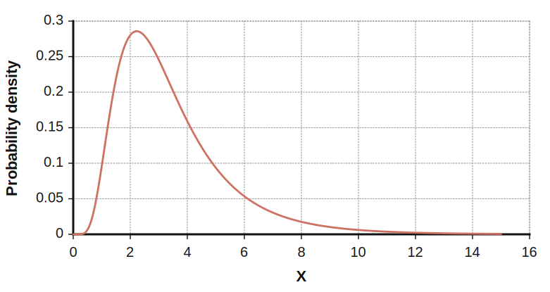
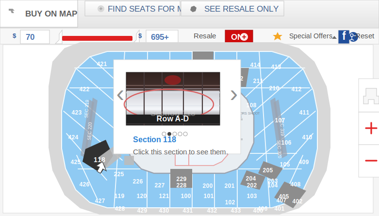
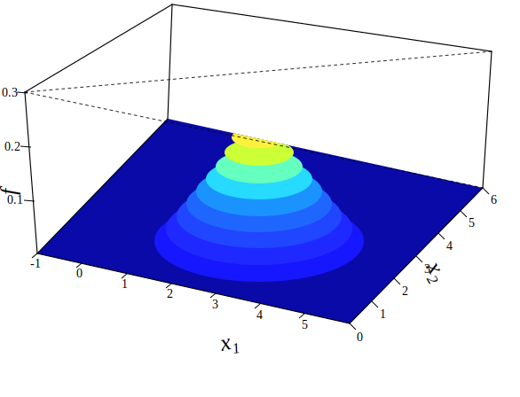

QUANT BIBLE

MIT Sloan Business Club

> Native conversion note: extracted PNG equations and figures were replaced with KaTeX math blocks, Markdown tables/lists, and inline SVG diagrams.

---

## **Contents**

|**1**|**Introduction**|**Introduction**|||**2**|
|---|---|---|---|---|---|
||1.1|List of Places to Apply . . . . . . . .|. . . . .|. . . . . . . . . . . . . . . . . . . . . . . . . . .|3|
||1.2|Other Resources<br>. . . . . . . . . . .|. . . . .|. . . . . . . . . . . . . . . . . . . . . . . . . . .|4|
|**2**|**PROBABILITY FUNDAMENTALS**||||**5**|
||2.1|Conditional Probability and Bayes’ Theorem||. . . . . . . . . . . . . . . . . . . . . . . . . . .|5|
||2.2|Expected Value and Variance . . . .|. . . . .|. . . . . . . . . . . . . . . . . . . . . . . . . . .|7|
||2.3|Random Variables<br>. . . . . . . . . .|. . . . .|. . . . . . . . . . . . . . . . . . . . . . . . . . .|8|
||2.4|Distributions of Functions and Joint Distributions<br>. . . . . . . . . . . . . . . . . . . . . . . .|||9|
||2.5|Covariance and Correlation . . . . .|. . . . .|. . . . . . . . . . . . . . . . . . . . . . . . . . .|9|
|**3**|**STATS FUNDAMENTALS**||||**10**|
||3.1|LLN and CLT . . . . . . . . . . . . .|. . . . .|. . . . . . . . . . . . . . . . . . . . . . . . . . .|10|
||3.2|Confdence Intervals<br>. . . . . . . . .|. . . . .|. . . . . . . . . . . . . . . . . . . . . . . . . . .|11|
|**4**|**QUANT RESEARCH - DATA SCIENCE**||||**12**|
||4.1|Least Squares and Nearest Neighbors|. . . . .|. . . . . . . . . . . . . . . . . . . . . . . . . . .|12|
||4.2|Intuition for Technical Details: Least|Squares|and Nearest Neighbors . . . . . . . . . . . . . .|13|
||4.3|Regressions . . . . . . . . . . . . . .|. . . . .|. . . . . . . . . . . . . . . . . . . . . . . . . . .|16|
||4.4|Dimensionality Reduction . . . . . .|. . . . .|. . . . . . . . . . . . . . . . . . . . . . . . . . .|18|
||4.5|Brainteasers about Regression . . . .|. . . . .|. . . . . . . . . . . . . . . . . . . . . . . . . . .|21|
||4.6|The Econometrics Perspective . . . .|. . . . .|. . . . . . . . . . . . . . . . . . . . . . . . . . .|22|
|**5**|**QUANT RESEARCH - CASE STUDIES**||||**26**|
||5.1|Two Sigma - NY Housing Prices<br>. .|. . . . .|. . . . . . . . . . . . . . . . . . . . . . . . . . .|26|
||5.2|QuantCo - Opera House . . . . . . .|. . . . .|. . . . . . . . . . . . . . . . . . . . . . . . . . .|27|
||5.3|Two Sigma - CitiBikes [Advanced!] .|. . . . .|. . . . . . . . . . . . . . . . . . . . . . . . . . .|29|
|**6**|**QUANT TRADING - MARKET MAKING**||||**31**|
||6.1|What is Market Making? by Evan and Guang||. . . . . . . . . . . . . . . . . . . . . . . . . . .|31|
||6.2|Theory by Ravi . . . . . . . . . . . .|. . . . .|. . . . . . . . . . . . . . . . . . . . . . . . . . .|32|
||6.3|Cases by Ravi . . . . . . . . . . . . .|. . . . .|. . . . . . . . . . . . . . . . . . . . . . . . . . .|33|
|**7**|**QUESTION BANK**||||**36**|
||7.1|Preliminaries<br>. . . . . . . . . . . . .|. . . . .|. . . . . . . . . . . . . . . . . . . . . . . . . . .|36|
||7.2|JANE STREET by Evan and Brian|. . . . .|. . . . . . . . . . . . . . . . . . . . . . . . . . .|37|
||7.3|VIRTU FINANCIAL by Evan . . . .|. . . . .|. . . . . . . . . . . . . . . . . . . . . . . . . . .|40|
||7.4|OPTIVER by Ravi . . . . . . . . . .|. . . . .|. . . . . . . . . . . . . . . . . . . . . . . . . . .|42|
||7.5|AKUNA CAPITAL . . . . . . . . . .|. . . . .|. . . . . . . . . . . . . . . . . . . . . . . . . . .|43|
||7.6|CITADEL . . . . . . . . . . . . . . .|. . . . .|. . . . . . . . . . . . . . . . . . . . . . . . . . .|44|
||7.7|HUDSON RIVER TRADING . . . .|. . . . .|. . . . . . . . . . . . . . . . . . . . . . . . . . .|46|
||7.8|TWO SIGMA . . . . . . . . . . . . .|. . . . .|. . . . . . . . . . . . . . . . . . . . . . . . . . .|47|
||7.9|FIVE RINGS . . . . . . . . . . . . .|. . . . .|. . . . . . . . . . . . . . . . . . . . . . . . . . .|48|
||7.10|SIG by Ravi . . . . . . . . . . . . . .|. . . . .|. . . . . . . . . . . . . . . . . . . . . . . . . . .|50|

---

## **1 Introduction**

I started this guide sometime in my junior fall during an interview season for quantitative finance that I found super-challenging. As interviews wrapped up, I thought it would be a good idea to really go back to the basics and examine the fundamentals of what goes into interviewing for quant. That idea ended up turning into a question bank, and then a long write-up spanning a lot of the core concepts that apply to quantitative finance. Here, there’s sections on probability and statistics, data science and regressions, quant research cases (with contributions from Kyri Chen), market making (written by Ravi Raghavan, Guang Cui, and Evan Vogelbaum), and an expansive question bank (with contributions by Evan and Ravi).

One big reason I made this guide was to democratize quantitative finance as a career for the SBC community. Quant finance definitely has a reputation as the kind of industry that’s only for geniuses, that you can only break into if you’re part of the intellectual “in”-group. As a result, this ends up being true to some extent as a self-fulfilling prophecy. In my opinion, though, as long as you build up a good amount of familiarity with the math and CS concepts behind quant, and you have a lot of energy and enthusiasm toward the field, quant finance is definitely within your reach. MIT is a great place to start building a path toward quant finance because not only is MIT one of the main colleges that quant recruits from, but there is a clear courseroad to building quant-related technical knowledge from math and CS courses here.

There’s a list of these classes a bit later on in this intro; I recommend using this bible as a supplement as you go through the course-road in your semesters at MIT, and then as a primary piece of reading material as you finish quant-related coursework and dive more directly into quant interview prep (around sophomore spring or summer, probably).

Quant finance is more than an industry for big math brains to work in secrecy and make boatloads of money in; I think that for the right person, it’s one of the most intellectually stimulating and exciting fields of work out there. Quant finance is a great intersection of math, computer science, and economics, in that you get to use the advanced concepts you learn in MIT math and CS classes, almost on the same level as a UROP student or SWE/ML engineer, but in the context of solving financial problems and puzzles. In a quant job, the financial markets become a prime playing ground for MIT technical knowledge. They’re a microcosm of literally everything that happens in current events and the real world, boiled down to numbers and data, and they change and evolve literally every day and every hour, forcing you to constantly adapt, stay informed, and learn new, cutting-edge technical skills to keep up with the industry. The kind of creative problem-solving that goes into quantitative finance work has led to many innovations over the past few decades; for example, the McDonald’s chicken nugget only exists today because Ray Dalio, founder of Bridgewater, helped McDonald’s and their suppliers develop a new synthetic future for chicken that would protect them against risk and make chicken nuggets a viable product ( `https://www.cnbc.com/2018/05/03/ how-ray-dalio-helped-launch-mcdonalds-chicken-mcnugget.html` ). In addition, quant finance can be a highly ethical way of working in the finance industry. The culture of philanthropy at places such as Jane Street is strong, and since quant finance pays so well, you can devote a large portion of your paycheck towards philanthropic causes, making quant one of the most money-efficient ways to use your earnings potential as an MIT grad towards social good.

If quant finance interests you in any way, feel free to delve into this bible; I hope you get something interesting or useful out of it!

---

## **1.1 List of Places to Apply**

- Jane Street

  - Quant Trading, Quantitative Research, SWE

- Citadel & Citadel Securities

  -

  -

Citadel Securities - Systematic Trading (more CS) or Semi-Systematic Trading (more math), Fundamental Analyst

      - Citadel - Trading (Global Fixed Income, etc), Quantitative Research, SWE 

- The D. E. Shaw Group

  -

      - Prop Trading, Quantitative Analyst, SWE/Quant Developer 

- Two Sigma

  - Quantitative Research, SWE

- Hudson River Trading

  - Algo Developer, SWE

- Jump Trading

- SIG

- Optiver

- Akuna

- J.P. Morgan

  -

  - Quantitative Research Extern/Intern for MIT

- Bridgewater

- QuantCo

- DRW

- IMC Trading

- Five Rings

- AQR

- Virtu Financial

- Tower Research

- Seven Eight Capital

- TransMarket Group

- Wolverine Trading

- Old Mission Capital

- Point72 (Cubist)

- Belvedere Trading

- Group One

- Flow Traders

---

## **1.2 Other Resources**

There’s a very wide variety of resources you can use to prepare for quantitative finance interviews, from MIT classes to interview prep books to online listings and forums. In addition, quant interviews can cover a really wide range of topics and pretty much anything in the realm of math-y problem solving, probability and combinatorics, CS/SWE concepts, data science, even machine learning, etc, can be asked. It can definitely get pretty daunting to prepare for this kind of interview, and that’s why most of these internships are intended for summer after junior year and maybe sophomore year. Especially if you didn’t do a lot of math/CS extracurriculars in high school, it makes sense to spend a few semesters diving into these topics throughout your academic college career to build the foundation and intuition necessary for these interviews. For that reason, I’ll start off with some of the prime MIT classes for quant-related material:

Core Classes

- 18.600 (Probability and Random Variables)

- 18.06 (Linear Algebra)

- 14.32 (Econometrics)

- 6.042 (Discrete Math)

- 6.006/6.046 (Algorithms stuff)

- 6.034/6.036 (Machine Learning)

- 18.650 (Statistics)

- Extra Classes

  - 18.615 (Stochastic Processes, basically the main field of mathematical finance)

  - 6.867 (Graduate-level Machine Learning)

  - 6.437/6.438 (Inference, basically the advanced theory behind stats/data science/machine learning)

  - 18.211 (Combinatorics, advanced version)

If you get through these classes and really enjoy the material then quantitative finance makes sense as a career option. It’s important to feel fluent in and have a deep understanding of things from these classes. In quant interviews, you’ll encounter a lot of the same concepts from these classes but recontextualized for quant finance instead, so you’ll want to be able to stay on your feet and apply what you’ve learned in some unfamiliar, out-of-comfort-zone ways. To really hone your ability to tackle these brainteasers, CS questions, and “case studies,” you can explore learning resources for quant-related topics outside of MIT classes: Books

- _Thinking Fast and Slow_ by Daniel Kahneman (a more fun, relaxed read on the psychology of how we think, relevant to trader thinking styles)

- _Heard on the Street_ by Timothy Crack (one of the main books for finance interview practice in general)

- _Elements of Statistical Learning_ by Trevor Hastie, etc. (essential data science/quant research book)

- _Quant Job Interview Questions and Answers_ by Mark Joshi

- _A Practical Guide to Quantitative Finance Interviews_ by Xinfeng Zhou

- _Fifty Challenging Problems in Probability with Solutions_ by Frederick Mosteller

- _Cracking the Coding Interview_ (quant jobs are increasingly placing emphasis on data structures, algorithms, etc. so this is important)

- Extra Books

  - _Art of Problem Solving - Intro to Counting and Probability and Intermediate Counting and Probability_ (these are some of the main books for high school math competition prep on these topics)

  - _Option and Volatility Pricing_ by Natenburg (important options book in the quant industry; some places such as Optiver teach directly from this book)

  - _Options, Futures, and Other Derivatives_ by John Hull

Websites

- Glassdoor. Look up individual companies and internships and you’ll find question postings by past interviewers.

- The Puzzle Toad: `https://www.cs.cmu.edu/puzzle/`

- Wall Street Oasis. Some quant interview help, but also general advice and discussion about finance careers.

- LeetCode. Some trader/QR roles will give coding challenges (Two Sigma, HRT, Akuna, Belvedere).

- Kaggle. Popular site for data science projects/discussion and good place to familiarize yourself with numpy/pandas/scipy.

---

## **2 PROBABILITY FUNDAMENTALS**

This section is an overview of all of 18.600, with most of the focus on random variables and probability distributions; I’ll cover a lot of combinatorics material in the combinatorics section so this section will gloss over those aspects of 18.600 more.

## **2.1 Conditional Probability and Bayes’ Theorem**

- Quant firms care a lot about your understanding of conditional probability. In general, many real-life probabilistic events we can think of are dependent on each other (the chance someone is coughing today vs. the chance that person is sick today, etc.); for two dependent events $A$ and $B$, the chance of $A$ occurring given that $B$ has occurred is written as the conditional probability $P(A\mid B)$, the probability of $A$ given $B$. This conditional probability has the definitional formula

$$
P(A\mid B)=\frac{P(A\cap B)}{P(B)}
$$

The following diagram illustrates this:

$$
P(A\mid B)=\frac{P(A\cap B)}{P(B)},\qquad P(B)>0
$$

<div align="center">
        <svg xmlns="http://www.w3.org/2000/svg" viewBox="0 0 420 220" width="420" height="220" role="img" aria-label="Venn diagram showing events A and B with shaded intersection A intersect B">
        <rect x="18" y="18" width="384" height="184" fill="white" stroke="#d0d7de"/>
        <text x="210" y="42" text-anchor="middle" font-size="20" font-family="Georgia, 'Times New Roman', serif" fill="#0f172a">Conditional Probability Definition</text>
        <circle cx="160" cy="120" r="70" fill="none" stroke="#475569" stroke-width="2"/>
        <circle cx="260" cy="120" r="70" fill="none" stroke="#475569" stroke-width="2"/>
        <path d="M210 71 A70 70 0 0 1 210 169 A70 70 0 0 1 210 71 Z" fill="#93c47d" fill-opacity="0.75" stroke="#6aa84f" stroke-width="1.5"/>
        <text x="118" y="94" font-size="18" font-family="Georgia, 'Times New Roman', serif" fill="#334155">A</text>
        <text x="286" y="94" font-size="18" font-family="Georgia, 'Times New Roman', serif" fill="#334155">B</text>
        <text x="210" y="126" text-anchor="middle" font-size="26" font-style="italic" font-family="Georgia, 'Times New Roman', serif" fill="white">A∩B</text>
        </svg>
        </div>

So we can think of the probability of $A$ given $B$ as the ratio of the probability of $A$ and $B$ occurring together vs. the probability of just $B$ happening. In the Venn diagram above, $P(A\mid B)$ equals the fraction of the probability space for $B$ that is taken up by the intersection space of $A$ and $B$.

- We notice that the term $P(A \cap B)$ gives us a symmetry for conditional probabilities, i.e. we can write $P(A\mid B)P(B)=P(A\cap B)=P(B\mid A)P(A)$. From this we get Bayes’ theorem:

$$
P(A\mid B)=\frac{P(B\mid A)P(A)}{P(B)}
$$

This can be seen as a simple rewriting of the definitional formula, where we substitute $P(A\cap B)$ for the conditional probability in the other direction. Bayes’ formula is useful because all three terms ($P(B\mid A)$, $P(A)$, $P(B)$) are often easily computable in real-world scenarios.

- The term $P(B\mid A)$ is known as the likelihood.

- The term $P(A)$ is known as the prior, i.e. the probability of $A$ “prior” to new evidence (which would be $B$) being collected. Likewise $P(B)$ is known as the evidence.

- The evidence term in Bayes’ theorem is often calculated with the law of total probability using $A$ and its complement $\neg A$ , i.e. we can write $P(B)=P(B\mid A)P(A)+P(B\mid \neg A)P(\neg A)$.

- Tversky and Kahneman (famous pioneers of behavioral economics) formulated some classic brainteasers for wrapping your head around Bayes’ theorem.

  - Imagine you are a member of a jury judging a hit-and-run driving case. A taxi hit a pedestrian one night and fled the scene. The entire case against the taxi company rests on the evidence of one witness, an elderly man who saw the accident from his window some distance away. He says that he saw the pedestrian struck by a blue taxi. In trying to establish her case, the lawyer for the injured pedestrian establishes the following facts. There are only two taxi companies in town, “Blue Cabs” and “Green Cabs.” On the night in question, 85 percent of all taxis on the road were green and 15 percent were blue. The witness has undergone an extensive vision test under conditions similar to those on the night in question, and has demonstrated that he can successfully distinguish a blue taxi from a green taxi 80 percent of the time. What is the probability that the taxi the old man saw was actually blue?

    - ∗ Most people immediately answer that the taxi was significantly more likely to actually be blue, because of the old man’s 80% accuracy rate. However, let $B$ = taxi was blue, $O$ = old man saw blue, and $G$ = taxi was green; Bayes’ theorem gives

$$
P(B\mid O)=\frac{P(O\mid B)P(B)}{P(O\mid B)P(B)+P(O\mid G)P(G)}=\frac{0.8\cdot 0.15}{0.8\cdot 0.15+0.2\cdot 0.85}\approx 0.41
$$

---

- Steve is very shy and withdrawn, invariably helpful but with very little interest in people or in the world of reality. A meek and tidy soul, he has a need for order and structure, and a passion for detail. Is Steve more likely to be a librarian or a farmer?

  - ∗ Most people immediately answer that Steve is more likely to be a librarian than a farmer, since the personality description seems to fit much more closely with a librarian than a farmer. However, librarian is relatively a much rarer occupation, and we can estimate that there are 20x more farmers than librarians in the U.S. Even if this personality description fits, say, 40% of all librarians vs. just 10% of all farmers, Bayes’ theorem gives a much greater likelihood that Steve is a farmer, as illustrated below.

$$
P(H\mid E)=\frac{P(H)P(E\mid H)}{P(H)P(E\mid H)+P(\neg H)P(E\mid \neg H)}=\frac{\frac{1}{21}\cdot 0.4}{\frac{1}{21}\cdot 0.4+\frac{20}{21}\cdot 0.1}=\frac{4}{24}=\frac{1}{6}
$$

<div align="center">
        <svg xmlns="http://www.w3.org/2000/svg" viewBox="0 0 440 260" width="440" height="260" role="img" aria-label="Population rectangles comparing H and not H with highlighted evidence rates">
        <rect x="28" y="72" width="100" height="140" fill="#2f3e46" stroke="#94a3b8"/>
        <rect x="28" y="156" width="100" height="56" fill="#d9c94f" stroke="#94a3b8"/>
        <rect x="182" y="42" width="230" height="170" fill="#6b7280" opacity="0.65" stroke="#94a3b8"/>
        <rect x="182" y="195" width="230" height="17" fill="#d9c94f" stroke="#94a3b8"/>
        <text x="78" y="52" text-anchor="middle" font-size="20" font-family="Georgia, 'Times New Roman', serif">P(H)=1/21</text>
        <text x="297" y="28" text-anchor="middle" font-size="20" font-family="Georgia, 'Times New Roman', serif">P(¬H)=20/21</text>
        <text x="12" y="146" font-size="18" font-family="Georgia, 'Times New Roman', serif">P(E|H)=0.4</text>
        <text x="422" y="206" text-anchor="end" font-size="18" font-family="Georgia, 'Times New Roman', serif">P(E|¬H)=0.1</text>
        <text x="210" y="242" text-anchor="middle" font-size="16" font-family="Georgia, 'Times New Roman', serif" fill="#475569">Posterior odds favor ¬H despite stronger fit under H because the prior for ¬H is much larger.</text>
        </svg>
        </div>

- More conditional probability examples

  - Suppose 1% of people in the U.S. have Ebola. There is a test for Ebola that has a 1% false positive and 1% false negative rate, i.e. 99% of healthy people will test negative and 99% of sick people will test positive. What is the probability that a person who tested positive actually has Ebola?

∗ Let $H$ = healthy, $S$ = sick, and $+$ = tested positive. Bayes’ theorem gives

$$
P(S\mid +)=\frac{P(+\mid S)P(S)}{P(+\mid S)P(S)+P(+\mid H)P(H)}=\frac{0.99\cdot0.01}{0.99\cdot0.01+0.01\cdot0.99}=0.5
$$

so this test is actually pretty inaccurate. (Side note: does the effective accuracy of this test improve a lot from repeated trials, i.e. higher $P(S\mid +)$ if $+$ represents multiple positive test results in a row? Bayes’ theorem shows that for $+=k$ positive tests in a row, the effective accuracy becomes

$$
P(S\mid +^k)=\frac{0.99^k\cdot0.01}{0.99^k\cdot0.01+0.01^k\cdot0.99}
$$

which equals 99% accuracy for even just 2 positive tests.)

**–** This question is asked a lot in trading interviews, especially as part of an earlier phone screen. Suppose we have 1000 coins; 999 are fair coins and the 1000th has heads on both sides. We pick a random coin and flip it 10 times, and it lands heads all 10 times. What is the probability that we picked the unfair coin?

∗ Let $10H$ = coin lands heads 10 times, $UF$ = coin is the unfair one, and $F$ = coin is fair. Bayes’ theorem gives

$$
P(UF\mid 10H)=\frac{P(10H\mid UF)P(UF)}{P(10H\mid UF)P(UF)+P(10H\mid F)P(F)}=\frac{1}{1+\frac{999}{1024}}\approx 0.5
$$

---

## **2.2 Expected Value and Variance**

- Any random variable has a probability mass function (if discrete) or probability distribution function (if continuous); write these as $p(x)$ for the p.m.f. or $f(x)$ for the p.d.f., respectively.

- One of the most important properties of an r.v. is its expected value. Intuitively, this is the value we expect the random variable to take on any arbitrary polling of its outcome, and more formally, it is the weighted average of the values it can take, weighted by the probability of taking each value. Therefore the expected value is the same idea as the mean of a random variable. We can write the expected value as a sum or integral for the p.m.f. or p.d.f., respectively.

$$
E[X]=\mu=\sum_{x\in\Omega}x\,p(x)\quad\text{or}\quad\int_{\Omega}x\,f(x)\,dx
$$

where $\Omega$ represents the sample space of the random variable and $\mu$ is used to denote the mean.

- We can also think of the expected value of any function of a random variable in the same way. This would be calculated as the weighted average of the function values that the r.v. can take, weighted by the probability of taking each value. In other words, it is

$$
E[g(X)]=\sum_{x\in\Omega}g(x)\,p(x)\quad\text{or}\quad\int_{\Omega}g(x)\,f(x)\,dx
$$

The above formulas, or even just the idea of taking a weighted average, can be very useful for quant finance interviews; you will sometimes run into questions about calculating the expected value of some more esoteric random value, and that will just come down to specifying the p.m.f. or p.d.f. and doing the weighted average or integral.

- Linearity of expectation. The expected value is a linear function so we have

$E[aX+b]=aE[X]+b$.

The most important part is that the linearity works for combinations (sums) of random variables, even if the random variables are dependent:

$$
E[X_1+X_2+\cdots+X_n]=E[X_1]+E[X_2]+\cdots+E[X_n]
$$

even if $X_1, \ldots, X_n$ are dependent.

- This linearity of expectation property for dependent variables is very important for quant interviews; a lot of seemingly complicated questions about expected values for some probabilistic experiment/situation can be solved very easily by setting up possibly dependent random variables for the experiment in a clever way and applying linearity of expectation on them. The Five Rings tournament question is a good example of this. Another simpler example:

- We have a classroom of 10 boys and 10 girls, and we arrange them randomly into a single-file line of 20 students. What is the expected number of pairs of adjacent students who are different genders?

  - ∗ Let $X_i$ be the indicator for whether the $i$-th and $(i+1)$-th student in the line are different genders (i.e. 1 if yes, 0 if no). The chance of any arbitrary adjacent pair in the line having different genders is $2 \cdot \frac{10}{20} \cdot \frac{10}{19} = \frac{10}{19}$, so $E[X_i] = \frac{10}{19}$ for any $i$. We might notice that the $X_i$ are pairwise dependent, since whether any one pair is different gender affects the remaining amounts of boys and girls that can be arranged elsewhere in the line. However, we can still use linearity of expectation, so the answer is $E[X_1 + \cdots + X_{19}] = E[X_1] + \cdots + E[X_{19}] = 19 \cdot \frac{10}{19} = 10$.

- The variance of a random variable describes how much it deviates from its expected value on average. It can therefore be written as the expected value of the square of the difference between an r.v. and its mean:

$$
\operatorname{Var}(X)=E[(X-\mu)^2]
$$

**–** The variance also has an alternate form that comes directly from applying linearity of expectation to the above:

$$
\operatorname{Var}(X)=E[X^2]-E[X]^2
$$

- Variance of linear combination:

$$
\operatorname{Var}(aX+b)=a^2\operatorname{Var}(X)
$$

$$
\operatorname{Var}(X+Y)=\operatorname{Var}(X)+\operatorname{Var}(Y)
$$

It’s often important to know variance for the sum or average of i.i.d. random variables, i.e. random variables with the same p.m.f. or p.d.f. that are sampled independently. If $X_1, \ldots, X_n$ are i.i.d., each with variance $\sigma^2$, then

$$
\operatorname{Var}\!\left(\sum_{i=1}^n X_i\right)=n\sigma^2
$$

$$
\operatorname{Var}\!\left(\frac{1}{n}\sum_{i=1}^n X_i\right)=\frac{\sigma^2}{n}
$$

---

## **2.3 Random Variables**

This subsection gives information on the most important classical types of random variables.

We also need to define a cumulative distribution function (cdf) for continuous r.v.s, as the probability that the r.v. takes a value less than the function input:

$$
F_X(a)=P(X\le a)=\int_{-\infty}^{a} f(x)\,dx
$$

Below are several examples of random variables.

Discrete Random Variables

| Random Variable | Experiment | PMF | Expected Value | Variance |
|---|---|---|---|---|
| Bernoulli | Experiment with two outcomes, 1 if yes, 0 if no; for example, a fair or unfair coin flip. | $p_X(x)=p$ if $x=1$, and $p_X(x)=1-p$ if $x=0$. | $E[X]=p$ | $\operatorname{Var}(X)=p(1-p)$ |
| Binomial | Experiment with $n$ independent Bernoulli trials; count the number of successful trials. | $p_X(x)=\binom{n}{x}p^x(1-p)^{n-x}$ | $E[X]=np$ | $\operatorname{Var}(X)=np(1-p)$ |
| Poisson | Count the number of occurrences of an independent event in a fixed time or space interval. | $p_X(x)=\frac{\lambda^x e^{-\lambda}}{x!}$ | $E[X]=\lambda$ | $\operatorname{Var}(X)=\lambda$ |
| Geometric | Successive independent Bernoulli trials; count how many trials occur until and including the first success. | $p_X(x)=(1-p)^{x-1}p$ | $E[X]=\frac{1}{p}$ | $\operatorname{Var}(X)=\frac{1-p}{p^2}$ |

Continuous Random Variables

| Random Variable | Experiment | PDF | Expected Value | Variance |
|---|---|---|---|---|
| Uniform | Draw a number in $[a,b]$ with equal chance for any number in the interval. | $f_X(x)=\frac{1}{b-a}$ for $a\le x\le b$, and $0$ otherwise. | $E[X]=\frac{a+b}{2}$ | $\operatorname{Var}(X)=\frac{(b-a)^2}{12}$ |
| Normal | The classic bell curve; averages of asymptotically many repeated trials converge to a normal random variable under the central limit theorem. | $f_X(x)=\frac{1}{\sigma\sqrt{2\pi}}e^{-\frac{1}{2}\left(\frac{x-\mu}{\sigma}\right)^2}$ | $E[X]=\mu$ | $\operatorname{Var}(X)=\sigma^2$ |
| Exponential | Measure the waiting time until the first event in a Poisson process with rate $\lambda$. | $f_X(x)=\lambda e^{-\lambda x}$ for $x\ge 0$ | $E[X]=\frac{1}{\lambda}$ | $\operatorname{Var}(X)=\frac{1}{\lambda^2}$ |

Important properties:

- A Poisson experiment comes from a binomial experiment where asymptotically $n$ is very large and $p$ is very small, so that $np=\lambda$.

- We can construct a Poisson point process $N(t)$ = the number of events that occur during the first $t$ units of time. $N(t)$ is constructed by a sequence of exponential r.v.s with the same rate $\lambda$.

- Both the geometric and exponential random variables are memoryless, i.e. the probability distribution of geometric or exponential $X$ after some trials/time has already elapsed is the same as if starting over at the first trial/at time 0. In other words, the behavior of experiments following the geometric or exponential distribution is not affected by how many trials/time has already passed.

---

## **2.4 Distributions of Functions and Joint Distributions**

- If we know the pdf of a random variable $X$, we can compute the pdf of any strictly increasing function of $X$. Integrate the pdf to obtain the cdf $F_X(a)$. Let $g(x)$ be any strictly increasing function of $x$. Then for $Y = g(X)$, we have $F_Y(a) = F_X(g^{-1}(a))$. This gives us the cdf of $Y$, and we can take the derivative to obtain the pdf.

- Any pair of discrete or continuous random variables can have a joint probability mass function or distribution function:

$$
p_{X,Y}(x,y)=P(X=x,Y=y)
$$

$$
\begin{aligned}F_{X,Y}(x,y)&=P(X\le x,Y\le y)\\ f_{X,Y}(x,y)&=\frac{\partial^2F_{X,Y}(x,y)}{\partial x\,\partial y}\end{aligned}
$$

From the joint distribution, we can obtain marginal distributions, which are just the probability distributions for a single one of the r.v.s (the other can take any value):

$$
\begin{aligned}p_X(x)&=\sum_y p_{X,Y}(x,y)\\ F_X(x)&=\lim_{y\to\infty}F_{X,Y}(x,y)\end{aligned}
$$

**–** When X and Y are independent, the joint distribution is the product of the marginal distributions, i.e.

$$
p_{X,Y}(x,y)=p_X(x)p_Y(y)
$$

$$
f_{X,Y}(x,y)=f_X(x)f_Y(y)
$$

## **2.5 Covariance and Correlation**

Covariance and correlation both describe the degree to which a pair of random variables can vary in similar and dependent ways.

- Formula for covariance of two random variables $X$ and $Y$:

$$
\operatorname{Cov}(X,Y)=E[(X-E[X])(Y-E[Y])]=E[XY]-E[X]E[Y]
$$

This is an “expectation of product minus product of expectations”, with several useful properties:

- If $X$ and $Y$ are independent, then $\operatorname{Cov}(X,Y)=0$. The converse is not true, however.

- $\operatorname{Cov}(X,X)=\operatorname{Var}(X)$

- Bilinearity: $\operatorname{Cov}(aX_1+bX_2, Y)=a\operatorname{Cov}(X_1,Y)+b\operatorname{Cov}(X_2,Y)$.

- Correlation is a scale-independent version of covariance, scaled down to between -1 and 1. Its formula is:

$$
\rho(X,Y)=\frac{\operatorname{Cov}(X,Y)}{\sqrt{\operatorname{Var}(X)\operatorname{Var}(Y)}}
$$

- If two random variables are independent then they are uncorrelated, but the converse of this is not true.

---

## **3 STATS FUNDAMENTALS**

This section is an overview of the first third of 18.650.

## **3.1 LLN and CLT**

- Statistics vs. probability:

  - Probability encompasses simpler problems where we can start with the initial parameters and models, then analyze the proceeding outcomes and data.

  - Statistics encompasses complex problems about randomness where our underlying parameters/distribution are unknown; we collect data and deduce the parameters through quantitative techniques.

- Main framework for statistical modeling:

  - Treat each data event as a random variable. We make assumptions for what kind of r.v. describes the data event, i.e. Bernoulli, uniform, exponential, Poisson, etc. Some additional common assumptions are independence of each data event as well as that each data event is described by the same random variable/underlying distribution; together, these assumptions are called “i.i.d” (“independent and identically distributed”)

  - Formulate a link between the underlying parameter you want to estimate vs. your data event random variables. Is your desired parameter equal to the average of your random variables, or some function of the average, or something else? This function of the data is the “estimator”.

    - ∗ Example. If our data events are Bernoulli, then the average $X_n=\operatorname{avg}(X_1+\cdots+X_n)$ tends to the expected value $E(X)=p$. So to estimate the unknown parameter $p$ for a series of Bernoulli trials,

    - using an estimator $\hat p$, we can set $\hat p = X_n$.

  - Estimate your level of confidence in how your estimator predicts the underlying parameter. If your estimator is p= 0.55, are you 95% confident that your actual parameter is between 0.5 to 0.6? 0.45 to 0.65? 0.54 to 0.56?

- The law of large numbers creates this link between theoretical parameters and empirical data:

$$
\bar X_n:=\frac{1}{n}\sum_{i=1}^n X_i\xrightarrow[n\to\infty]{p,\ \text{a.s.}}\mu
$$

- When the mean is a function of an unknown parameter of the random variable/underlying distribution then the LLN becomes very useful, and indeed this is the case for all common r.v. types: uniform, Bernoulli, Poisson, geometric, exponential, etc.

- The central limit theorem helps us quantify our level of confidence in our estimation (through a confidence interval):

$$
\sqrt{n}\,\frac{\bar X_n-\mu}{\sigma}\xrightarrow[n\to\infty]{d}\mathcal N(0,1)
$$

---

## **3.2 Intervals**

- The confidence interval for some estimator in a statistical model tells us what range of values we believe the true parameter may lie in, as well as the chance that the true parameter actually lies in this range.

  - “95% confidence interval, 99%, etc.” → there is a 95%/99%/etc. chance that the true parameter lies within the bounds of the CI.

  - The center of the interval often comes from the LLN and is equal to the estimator; the range of the interval comes from the CLT.

- Definition: A confidence interval of level $1-\alpha$ for a parameter is an interval $I$ where

$P_\theta[I\ni\theta]\ge 1-\alpha,\ \forall\theta\in\Theta$

- Starting point: the CLT tells us that if $q_{\alpha/2}$ is the $(1-\alpha/2)$ quantile of $\mathcal N(0,1)$, then with probability $1-\alpha$, we have the asymptotic interval for the true parameter:

$$
\theta\in\left[\hat\theta-\frac{\sigma}{\sqrt n}q_{\alpha/2},\ \hat\theta+\frac{\sigma}{\sqrt n}q_{\alpha/2}\right]
$$

- Clearly we need to have our confidence interval be independent from the true parameter; otherwise we don’t actually know anything meaningfully new about the true parameter from the confidence interval. Unfortunately, $\sigma$ depends on the true parameter, so we need to find techniques for getting rid of the variance.

- Finishing our confidence interval

  - We have a special case when the random variable is Bernoulli, i.e. $\sigma = \sqrt{p(1-p)}$. Then we have an elementary bound $p(1-p) \le \tfrac14$, so the confidence interval becomes

$$
\theta\in\left[\hat\theta-\frac{1}{2\sqrt n}q_{\alpha/2},\ \hat\theta+\frac{1}{2\sqrt n}q_{\alpha/2}\right]
$$

**–** Generally we use Slutsky’s theorem which allows us to add and multiply limits in the LLN; since the variance is a function of the true parameter, we just substitute this our estimator in place of the true parameter in the variance formula, then plug that into the confidence interval.

---

## **4 QUANT RESEARCH - DATA SCIENCE**

This section is an overview of the ”main” chapters of Elements of Statistical Learning. The Elements of Statistical Learning (ESL) book is considered GOATed in the fields of data science, machine learning, and statistics, and is essentially the first book you’ll want to consult for a comprehensive and rigorous yet concise overview of basics about regression, data modeling, and inference.

## **4.1 Least Squares and Nearest Neighbors**

The linear model has been a mainstay of statistics for the past 30 years and remains one of our most important tools. Given a vector of inputs $X^\top = (X_1, X_2, \ldots, X_p)$, we predict the output $Y$ via the model

$$
\hat Y=\hat\beta_0+\sum_{i=1}^p X_i\hat\beta_i
$$

In other words, $Y$ is a linear combination of the input features $X$ plus a bias term. Our goal is to fit the best set $\beta$ of coefficients and bias. $Y$ is often just a scalar (so $\beta$ would be a vector), but $Y$ can also be a vector, so that $\beta$ would be a matrix. The equation above represents a hyperplane in the input-output space.

The most popular method for fitting a linear model is using least squares, i.e. picking the right hyperplane so that the sum of squares of distances of each input feature to the hyperplane is minimized across all possible hyperplanes. In other words, we are trying to minimize an objective function, the “residual sum of squares”:

$$
RSS(\beta)=\sum_{i=1}^N (y_i-x_i^\top\beta)^2
$$

The residual sum of squares is a highly “natural” choice for the measure of error that we want to minimize for a model, and it’s indeed used in many contexts besides linear regression. Due to some technical math, it actually turns out that simple linear regression, using residual sum of squares, for the linear model provides the best ”unbiased” estimate among all linear models for the underlying conditional expectation of output values given input values. This conditional expectation is known as the conditional expectation function (CEF) and is the optimal theoretical predictor for our data problem from a Bayesian standpoint. It is for this reason that residual sum of squares is not only a “natural” choice of error function, but actually the mathematically optimal one in the linear context.

We can derive a simple formula for $\beta$ for the linear model by taking the derivative of the RSS above; we’ll do this in a few pages, and this $\beta$ formula is one of the core formulas in data science and is very important to memorize by heart.

The other “simplest” model is nearest neighbors. Nearest-neighbor methods use those observations in the training set $T$ closest in the input space to $x$ to form $\hat Y$. Specifically, the $k$-nearest-neighbor fit for $\hat Y$ is as follows:

$$
\hat Y(x)=\frac{1}{k}\sum_{x_i\in N_k(x)}y_i
$$

This formula essentially corresponds to taking the average of the $k$ nearest points for $x$, which are symbolized by the $N_k(x)$ function. Note that nearest neighbors just involves direct calculations on the training data, and not fitting a model (except maybe the choice of $k$); we just have to memorize the training data and compute with it!

Decision regions and boundaries for nearest neighbors:

- For 1-nearest-neighbor, the decision boundaries/regions form a Voronoi tessellation which is easily computable, and often highly disjoint + irregular

- For highest k-nearest-neighbor, the decision regions generally get less disjoint but are still highly irregular, something that a linear model can’t do

- Impt point: the “effective” number of parameters is n/k instead of just 1 (the single parameter k), because up to overlap, nearest neighbors is creating n/k different decision regions. This gives an intuitive explanation for why regions get less disjoint with higher k.

---

<div align="center">
        <svg xmlns="http://www.w3.org/2000/svg" viewBox="0 0 460 460" width="460" height="460" role="img" aria-label="1-Nearest Neighbor Classifier">
        <rect x="8" y="8" width="444" height="444" fill="white" stroke="#9ca3af"/>
        <text x="230" y="30" text-anchor="middle" font-size="24" font-family="Arial, sans-serif" fill="#111827">1-Nearest Neighbor Classifier</text>
        <path d="M0 0 H460 V80 L426 140 L398 188 L360 230 L325 215 L304 177 L277 160 L258 188 L246 227 L219 239 L182 220 L150 228 L120 265 L88 300 L56 334 L0 392 Z" fill="#fde68a" fill-opacity="0.18"/>
        <path d="M0 392 L56 334 L88 300 L120 265 L150 228 L182 220 L219 239 L246 227 L258 188 L277 160 L304 177 L325 215 L360 230 L398 188 L426 140 L460 80 V460 H0 Z" fill="#bfdbfe" fill-opacity="0.22"/>
        <circle cx="165.7" cy="204.9" r="5" fill="none" stroke="#d89c1d" stroke-width="2"/>
        <circle cx="101.6" cy="148.4" r="5" fill="none" stroke="#d89c1d" stroke-width="2"/>
        <circle cx="288.5" cy="184.4" r="5" fill="none" stroke="#d89c1d" stroke-width="2"/>
        <circle cx="31.7" cy="231.7" r="5" fill="none" stroke="#d89c1d" stroke-width="2"/>
        <circle cx="29.3" cy="42.0" r="5" fill="none" stroke="#d89c1d" stroke-width="2"/>
        <circle cx="219.0" cy="161.4" r="5" fill="none" stroke="#d89c1d" stroke-width="2"/>
        <circle cx="219.3" cy="195.7" r="5" fill="none" stroke="#d89c1d" stroke-width="2"/>
        <circle cx="242.9" cy="258.4" r="5" fill="none" stroke="#d89c1d" stroke-width="2"/>
        <circle cx="157.3" cy="156.7" r="5" fill="none" stroke="#d89c1d" stroke-width="2"/>
        <circle cx="147.5" cy="90.4" r="5" fill="none" stroke="#d89c1d" stroke-width="2"/>
        <circle cx="113.2" cy="184.1" r="5" fill="none" stroke="#d89c1d" stroke-width="2"/>
        <circle cx="194.6" cy="266.9" r="5" fill="none" stroke="#d89c1d" stroke-width="2"/>
        <circle cx="179.9" cy="101.3" r="5" fill="none" stroke="#d89c1d" stroke-width="2"/>
        <circle cx="50.9" cy="229.6" r="5" fill="none" stroke="#d89c1d" stroke-width="2"/>
        <circle cx="326.9" cy="193.3" r="5" fill="none" stroke="#d89c1d" stroke-width="2"/>
        <circle cx="248.5" cy="117.3" r="5" fill="none" stroke="#d89c1d" stroke-width="2"/>
        <circle cx="98.1" cy="123.6" r="5" fill="none" stroke="#d89c1d" stroke-width="2"/>
        <circle cx="51.5" cy="183.7" r="5" fill="none" stroke="#d89c1d" stroke-width="2"/>
        <circle cx="28.0" cy="42.0" r="5" fill="none" stroke="#d89c1d" stroke-width="2"/>
        <circle cx="83.6" cy="241.2" r="5" fill="none" stroke="#d89c1d" stroke-width="2"/>
        <circle cx="213.3" cy="198.9" r="5" fill="none" stroke="#d89c1d" stroke-width="2"/>
        <circle cx="239.3" cy="207.7" r="5" fill="none" stroke="#d89c1d" stroke-width="2"/>
        <circle cx="280.7" cy="206.3" r="5" fill="none" stroke="#d89c1d" stroke-width="2"/>
        <circle cx="270.0" cy="42.0" r="5" fill="none" stroke="#d89c1d" stroke-width="2"/>
        <circle cx="65.4" cy="290.6" r="5" fill="none" stroke="#d89c1d" stroke-width="2"/>
        <circle cx="220.9" cy="215.7" r="5" fill="none" stroke="#d89c1d" stroke-width="2"/>
        <circle cx="127.2" cy="132.7" r="5" fill="none" stroke="#d89c1d" stroke-width="2"/>
        <circle cx="106.4" cy="238.8" r="5" fill="none" stroke="#d89c1d" stroke-width="2"/>
        <circle cx="58.9" cy="154.5" r="5" fill="none" stroke="#d89c1d" stroke-width="2"/>
        <circle cx="323.5" cy="84.9" r="5" fill="none" stroke="#d89c1d" stroke-width="2"/>
        <circle cx="115.2" cy="214.3" r="5" fill="none" stroke="#d89c1d" stroke-width="2"/>
        <circle cx="222.8" cy="176.1" r="5" fill="none" stroke="#d89c1d" stroke-width="2"/>
        <circle cx="173.3" cy="186.6" r="5" fill="none" stroke="#d89c1d" stroke-width="2"/>
        <circle cx="262.6" cy="209.1" r="5" fill="none" stroke="#d89c1d" stroke-width="2"/>
        <circle cx="149.4" cy="135.9" r="5" fill="none" stroke="#d89c1d" stroke-width="2"/>
        <circle cx="158.0" cy="195.1" r="5" fill="none" stroke="#d89c1d" stroke-width="2"/>
        <circle cx="83.2" cy="184.0" r="5" fill="none" stroke="#d89c1d" stroke-width="2"/>
        <circle cx="149.0" cy="216.1" r="5" fill="none" stroke="#d89c1d" stroke-width="2"/>
        <circle cx="420.9" cy="192.7" r="5" fill="none" stroke="#d89c1d" stroke-width="2"/>
        <circle cx="168.6" cy="160.1" r="5" fill="none" stroke="#d89c1d" stroke-width="2"/>
        <circle cx="285.8" cy="73.9" r="5" fill="none" stroke="#d89c1d" stroke-width="2"/>
        <circle cx="271.3" cy="281.3" r="5" fill="none" stroke="#d89c1d" stroke-width="2"/>
        <circle cx="157.6" cy="213.6" r="5" fill="none" stroke="#d89c1d" stroke-width="2"/>
        <circle cx="293.4" cy="52.1" r="5" fill="none" stroke="#d89c1d" stroke-width="2"/>
        <circle cx="206.7" cy="258.2" r="5" fill="none" stroke="#d89c1d" stroke-width="2"/>
        <circle cx="265.7" cy="176.0" r="5" fill="none" stroke="#d89c1d" stroke-width="2"/>
        <circle cx="289.6" cy="142.1" r="5" fill="none" stroke="#d89c1d" stroke-width="2"/>
        <circle cx="276.9" cy="144.3" r="5" fill="none" stroke="#d89c1d" stroke-width="2"/>
        <circle cx="211.1" cy="214.8" r="5" fill="none" stroke="#d89c1d" stroke-width="2"/>
        <circle cx="248.4" cy="89.9" r="5" fill="none" stroke="#d89c1d" stroke-width="2"/>
        <circle cx="310.3" cy="223.2" r="5" fill="none" stroke="#d89c1d" stroke-width="2"/>
        <circle cx="190.1" cy="76.1" r="5" fill="none" stroke="#d89c1d" stroke-width="2"/>
        <circle cx="232.4" cy="229.2" r="5" fill="none" stroke="#60a5fa" stroke-width="2"/>
        <circle cx="336.7" cy="289.8" r="5" fill="none" stroke="#60a5fa" stroke-width="2"/>
        <circle cx="280.8" cy="270.2" r="5" fill="none" stroke="#60a5fa" stroke-width="2"/>
        <circle cx="289.5" cy="295.9" r="5" fill="none" stroke="#60a5fa" stroke-width="2"/>
        <circle cx="180.6" cy="216.6" r="5" fill="none" stroke="#60a5fa" stroke-width="2"/>
        <circle cx="290.6" cy="202.3" r="5" fill="none" stroke="#60a5fa" stroke-width="2"/>
        <circle cx="198.4" cy="395.8" r="5" fill="none" stroke="#60a5fa" stroke-width="2"/>
        <circle cx="201.6" cy="194.4" r="5" fill="none" stroke="#60a5fa" stroke-width="2"/>
        <circle cx="299.3" cy="275.4" r="5" fill="none" stroke="#60a5fa" stroke-width="2"/>
        <circle cx="209.4" cy="355.1" r="5" fill="none" stroke="#60a5fa" stroke-width="2"/>
        <circle cx="283.3" cy="132.8" r="5" fill="none" stroke="#60a5fa" stroke-width="2"/>
        <circle cx="92.9" cy="228.6" r="5" fill="none" stroke="#60a5fa" stroke-width="2"/>
        <circle cx="288.8" cy="249.9" r="5" fill="none" stroke="#60a5fa" stroke-width="2"/>
        <circle cx="302.2" cy="332.6" r="5" fill="none" stroke="#60a5fa" stroke-width="2"/>
        <circle cx="259.3" cy="148.5" r="5" fill="none" stroke="#60a5fa" stroke-width="2"/>
        <circle cx="214.7" cy="151.3" r="5" fill="none" stroke="#60a5fa" stroke-width="2"/>
        <circle cx="350.5" cy="88.4" r="5" fill="none" stroke="#60a5fa" stroke-width="2"/>
        <circle cx="362.6" cy="302.4" r="5" fill="none" stroke="#60a5fa" stroke-width="2"/>
        <circle cx="277.9" cy="194.6" r="5" fill="none" stroke="#60a5fa" stroke-width="2"/>
        <circle cx="335.9" cy="267.9" r="5" fill="none" stroke="#60a5fa" stroke-width="2"/>
        <circle cx="374.3" cy="305.8" r="5" fill="none" stroke="#60a5fa" stroke-width="2"/>
        <circle cx="127.7" cy="360.1" r="5" fill="none" stroke="#60a5fa" stroke-width="2"/>
        <circle cx="96.0" cy="203.0" r="5" fill="none" stroke="#60a5fa" stroke-width="2"/>
        <circle cx="235.6" cy="338.6" r="5" fill="none" stroke="#60a5fa" stroke-width="2"/>
        <circle cx="293.1" cy="242.7" r="5" fill="none" stroke="#60a5fa" stroke-width="2"/>
        <circle cx="259.4" cy="348.9" r="5" fill="none" stroke="#60a5fa" stroke-width="2"/>
        <circle cx="331.3" cy="257.2" r="5" fill="none" stroke="#60a5fa" stroke-width="2"/>
        <circle cx="364.3" cy="218.5" r="5" fill="none" stroke="#60a5fa" stroke-width="2"/>
        <circle cx="238.4" cy="230.6" r="5" fill="none" stroke="#60a5fa" stroke-width="2"/>
        <circle cx="348.3" cy="151.0" r="5" fill="none" stroke="#60a5fa" stroke-width="2"/>
        <circle cx="338.0" cy="325.4" r="5" fill="none" stroke="#60a5fa" stroke-width="2"/>
        <circle cx="261.9" cy="302.2" r="5" fill="none" stroke="#60a5fa" stroke-width="2"/>
        <circle cx="294.7" cy="255.1" r="5" fill="none" stroke="#60a5fa" stroke-width="2"/>
        <circle cx="406.8" cy="281.6" r="5" fill="none" stroke="#60a5fa" stroke-width="2"/>
        <circle cx="249.0" cy="330.8" r="5" fill="none" stroke="#60a5fa" stroke-width="2"/>
        <circle cx="393.3" cy="44.7" r="5" fill="none" stroke="#60a5fa" stroke-width="2"/>
        <circle cx="281.1" cy="274.6" r="5" fill="none" stroke="#60a5fa" stroke-width="2"/>
        <circle cx="272.0" cy="212.2" r="5" fill="none" stroke="#60a5fa" stroke-width="2"/>
        <circle cx="206.8" cy="246.8" r="5" fill="none" stroke="#60a5fa" stroke-width="2"/>
        <circle cx="37.2" cy="215.1" r="5" fill="none" stroke="#60a5fa" stroke-width="2"/>
        <circle cx="244.8" cy="333.2" r="5" fill="none" stroke="#60a5fa" stroke-width="2"/>
        <circle cx="117.3" cy="226.0" r="5" fill="none" stroke="#60a5fa" stroke-width="2"/>
        <circle cx="335.2" cy="42.0" r="5" fill="none" stroke="#60a5fa" stroke-width="2"/>
        <circle cx="303.3" cy="132.6" r="5" fill="none" stroke="#60a5fa" stroke-width="2"/>
        <circle cx="238.4" cy="270.7" r="5" fill="none" stroke="#60a5fa" stroke-width="2"/>
        <circle cx="243.1" cy="380.7" r="5" fill="none" stroke="#60a5fa" stroke-width="2"/>
        <circle cx="430.0" cy="161.0" r="5" fill="none" stroke="#60a5fa" stroke-width="2"/>
        <circle cx="260.3" cy="312.8" r="5" fill="none" stroke="#60a5fa" stroke-width="2"/>
        <circle cx="130.9" cy="131.2" r="5" fill="none" stroke="#60a5fa" stroke-width="2"/>
        <circle cx="169.9" cy="134.4" r="5" fill="none" stroke="#60a5fa" stroke-width="2"/>
        <circle cx="364.9" cy="178.1" r="5" fill="none" stroke="#60a5fa" stroke-width="2"/>
        <circle cx="309.8" cy="385.3" r="5" fill="none" stroke="#60a5fa" stroke-width="2"/>
        <path d="M15 372 L72 312 L94 282 L118 264 L126 212 L144 198 L145 148 L160 122 L170 76 L194 64 L202 94 L236 94 L240 78 L270 78 L274 100 L252 121 L268 151 L292 153 L303 135 L336 136 L347 96 L375 22 M163 186 L176 200 L167 232 L144 227 Z M188 150 L206 145 L220 162 L205 177 L184 170 Z M225 200 L242 200 L252 216 L244 236 L220 236 L214 214 Z M276 170 L298 164 L308 182 L298 200 L275 196 Z M206 308 L224 286 L240 304 L234 326 L212 328 Z" fill="none" stroke="#111827" stroke-width="2.5"/>
        </svg>
        </div>

<div align="center">
        <svg xmlns="http://www.w3.org/2000/svg" viewBox="0 0 460 460" width="460" height="460" role="img" aria-label="15-Nearest Neighbor Classifier">
        <rect x="8" y="8" width="444" height="444" fill="white" stroke="#9ca3af"/>
        <text x="230" y="30" text-anchor="middle" font-size="24" font-family="Arial, sans-serif" fill="#111827">15-Nearest Neighbor Classifier</text>
        <path d="M0 0 H460 V70 C420 90 394 122 366 156 C338 190 308 220 258 226 C214 232 182 254 146 286 C108 320 66 350 0 382 Z" fill="#fde68a" fill-opacity="0.18"/>
        <path d="M0 382 C66 350 108 320 146 286 C182 254 214 232 258 226 C308 220 338 190 366 156 C394 122 420 90 460 70 V460 H0 Z" fill="#bfdbfe" fill-opacity="0.22"/>
        <circle cx="165.7" cy="204.9" r="5" fill="none" stroke="#d89c1d" stroke-width="2"/>
        <circle cx="101.6" cy="148.4" r="5" fill="none" stroke="#d89c1d" stroke-width="2"/>
        <circle cx="288.5" cy="184.4" r="5" fill="none" stroke="#d89c1d" stroke-width="2"/>
        <circle cx="31.7" cy="231.7" r="5" fill="none" stroke="#d89c1d" stroke-width="2"/>
        <circle cx="29.3" cy="42.0" r="5" fill="none" stroke="#d89c1d" stroke-width="2"/>
        <circle cx="219.0" cy="161.4" r="5" fill="none" stroke="#d89c1d" stroke-width="2"/>
        <circle cx="219.3" cy="195.7" r="5" fill="none" stroke="#d89c1d" stroke-width="2"/>
        <circle cx="242.9" cy="258.4" r="5" fill="none" stroke="#d89c1d" stroke-width="2"/>
        <circle cx="157.3" cy="156.7" r="5" fill="none" stroke="#d89c1d" stroke-width="2"/>
        <circle cx="147.5" cy="90.4" r="5" fill="none" stroke="#d89c1d" stroke-width="2"/>
        <circle cx="113.2" cy="184.1" r="5" fill="none" stroke="#d89c1d" stroke-width="2"/>
        <circle cx="194.6" cy="266.9" r="5" fill="none" stroke="#d89c1d" stroke-width="2"/>
        <circle cx="179.9" cy="101.3" r="5" fill="none" stroke="#d89c1d" stroke-width="2"/>
        <circle cx="50.9" cy="229.6" r="5" fill="none" stroke="#d89c1d" stroke-width="2"/>
        <circle cx="326.9" cy="193.3" r="5" fill="none" stroke="#d89c1d" stroke-width="2"/>
        <circle cx="248.5" cy="117.3" r="5" fill="none" stroke="#d89c1d" stroke-width="2"/>
        <circle cx="98.1" cy="123.6" r="5" fill="none" stroke="#d89c1d" stroke-width="2"/>
        <circle cx="51.5" cy="183.7" r="5" fill="none" stroke="#d89c1d" stroke-width="2"/>
        <circle cx="28.0" cy="42.0" r="5" fill="none" stroke="#d89c1d" stroke-width="2"/>
        <circle cx="83.6" cy="241.2" r="5" fill="none" stroke="#d89c1d" stroke-width="2"/>
        <circle cx="213.3" cy="198.9" r="5" fill="none" stroke="#d89c1d" stroke-width="2"/>
        <circle cx="239.3" cy="207.7" r="5" fill="none" stroke="#d89c1d" stroke-width="2"/>
        <circle cx="280.7" cy="206.3" r="5" fill="none" stroke="#d89c1d" stroke-width="2"/>
        <circle cx="270.0" cy="42.0" r="5" fill="none" stroke="#d89c1d" stroke-width="2"/>
        <circle cx="65.4" cy="290.6" r="5" fill="none" stroke="#d89c1d" stroke-width="2"/>
        <circle cx="220.9" cy="215.7" r="5" fill="none" stroke="#d89c1d" stroke-width="2"/>
        <circle cx="127.2" cy="132.7" r="5" fill="none" stroke="#d89c1d" stroke-width="2"/>
        <circle cx="106.4" cy="238.8" r="5" fill="none" stroke="#d89c1d" stroke-width="2"/>
        <circle cx="58.9" cy="154.5" r="5" fill="none" stroke="#d89c1d" stroke-width="2"/>
        <circle cx="323.5" cy="84.9" r="5" fill="none" stroke="#d89c1d" stroke-width="2"/>
        <circle cx="115.2" cy="214.3" r="5" fill="none" stroke="#d89c1d" stroke-width="2"/>
        <circle cx="222.8" cy="176.1" r="5" fill="none" stroke="#d89c1d" stroke-width="2"/>
        <circle cx="173.3" cy="186.6" r="5" fill="none" stroke="#d89c1d" stroke-width="2"/>
        <circle cx="262.6" cy="209.1" r="5" fill="none" stroke="#d89c1d" stroke-width="2"/>
        <circle cx="149.4" cy="135.9" r="5" fill="none" stroke="#d89c1d" stroke-width="2"/>
        <circle cx="158.0" cy="195.1" r="5" fill="none" stroke="#d89c1d" stroke-width="2"/>
        <circle cx="83.2" cy="184.0" r="5" fill="none" stroke="#d89c1d" stroke-width="2"/>
        <circle cx="149.0" cy="216.1" r="5" fill="none" stroke="#d89c1d" stroke-width="2"/>
        <circle cx="420.9" cy="192.7" r="5" fill="none" stroke="#d89c1d" stroke-width="2"/>
        <circle cx="168.6" cy="160.1" r="5" fill="none" stroke="#d89c1d" stroke-width="2"/>
        <circle cx="285.8" cy="73.9" r="5" fill="none" stroke="#d89c1d" stroke-width="2"/>
        <circle cx="271.3" cy="281.3" r="5" fill="none" stroke="#d89c1d" stroke-width="2"/>
        <circle cx="157.6" cy="213.6" r="5" fill="none" stroke="#d89c1d" stroke-width="2"/>
        <circle cx="293.4" cy="52.1" r="5" fill="none" stroke="#d89c1d" stroke-width="2"/>
        <circle cx="206.7" cy="258.2" r="5" fill="none" stroke="#d89c1d" stroke-width="2"/>
        <circle cx="265.7" cy="176.0" r="5" fill="none" stroke="#d89c1d" stroke-width="2"/>
        <circle cx="289.6" cy="142.1" r="5" fill="none" stroke="#d89c1d" stroke-width="2"/>
        <circle cx="276.9" cy="144.3" r="5" fill="none" stroke="#d89c1d" stroke-width="2"/>
        <circle cx="211.1" cy="214.8" r="5" fill="none" stroke="#d89c1d" stroke-width="2"/>
        <circle cx="248.4" cy="89.9" r="5" fill="none" stroke="#d89c1d" stroke-width="2"/>
        <circle cx="310.3" cy="223.2" r="5" fill="none" stroke="#d89c1d" stroke-width="2"/>
        <circle cx="190.1" cy="76.1" r="5" fill="none" stroke="#d89c1d" stroke-width="2"/>
        <circle cx="232.4" cy="229.2" r="5" fill="none" stroke="#60a5fa" stroke-width="2"/>
        <circle cx="336.7" cy="289.8" r="5" fill="none" stroke="#60a5fa" stroke-width="2"/>
        <circle cx="280.8" cy="270.2" r="5" fill="none" stroke="#60a5fa" stroke-width="2"/>
        <circle cx="289.5" cy="295.9" r="5" fill="none" stroke="#60a5fa" stroke-width="2"/>
        <circle cx="180.6" cy="216.6" r="5" fill="none" stroke="#60a5fa" stroke-width="2"/>
        <circle cx="290.6" cy="202.3" r="5" fill="none" stroke="#60a5fa" stroke-width="2"/>
        <circle cx="198.4" cy="395.8" r="5" fill="none" stroke="#60a5fa" stroke-width="2"/>
        <circle cx="201.6" cy="194.4" r="5" fill="none" stroke="#60a5fa" stroke-width="2"/>
        <circle cx="299.3" cy="275.4" r="5" fill="none" stroke="#60a5fa" stroke-width="2"/>
        <circle cx="209.4" cy="355.1" r="5" fill="none" stroke="#60a5fa" stroke-width="2"/>
        <circle cx="283.3" cy="132.8" r="5" fill="none" stroke="#60a5fa" stroke-width="2"/>
        <circle cx="92.9" cy="228.6" r="5" fill="none" stroke="#60a5fa" stroke-width="2"/>
        <circle cx="288.8" cy="249.9" r="5" fill="none" stroke="#60a5fa" stroke-width="2"/>
        <circle cx="302.2" cy="332.6" r="5" fill="none" stroke="#60a5fa" stroke-width="2"/>
        <circle cx="259.3" cy="148.5" r="5" fill="none" stroke="#60a5fa" stroke-width="2"/>
        <circle cx="214.7" cy="151.3" r="5" fill="none" stroke="#60a5fa" stroke-width="2"/>
        <circle cx="350.5" cy="88.4" r="5" fill="none" stroke="#60a5fa" stroke-width="2"/>
        <circle cx="362.6" cy="302.4" r="5" fill="none" stroke="#60a5fa" stroke-width="2"/>
        <circle cx="277.9" cy="194.6" r="5" fill="none" stroke="#60a5fa" stroke-width="2"/>
        <circle cx="335.9" cy="267.9" r="5" fill="none" stroke="#60a5fa" stroke-width="2"/>
        <circle cx="374.3" cy="305.8" r="5" fill="none" stroke="#60a5fa" stroke-width="2"/>
        <circle cx="127.7" cy="360.1" r="5" fill="none" stroke="#60a5fa" stroke-width="2"/>
        <circle cx="96.0" cy="203.0" r="5" fill="none" stroke="#60a5fa" stroke-width="2"/>
        <circle cx="235.6" cy="338.6" r="5" fill="none" stroke="#60a5fa" stroke-width="2"/>
        <circle cx="293.1" cy="242.7" r="5" fill="none" stroke="#60a5fa" stroke-width="2"/>
        <circle cx="259.4" cy="348.9" r="5" fill="none" stroke="#60a5fa" stroke-width="2"/>
        <circle cx="331.3" cy="257.2" r="5" fill="none" stroke="#60a5fa" stroke-width="2"/>
        <circle cx="364.3" cy="218.5" r="5" fill="none" stroke="#60a5fa" stroke-width="2"/>
        <circle cx="238.4" cy="230.6" r="5" fill="none" stroke="#60a5fa" stroke-width="2"/>
        <circle cx="348.3" cy="151.0" r="5" fill="none" stroke="#60a5fa" stroke-width="2"/>
        <circle cx="338.0" cy="325.4" r="5" fill="none" stroke="#60a5fa" stroke-width="2"/>
        <circle cx="261.9" cy="302.2" r="5" fill="none" stroke="#60a5fa" stroke-width="2"/>
        <circle cx="294.7" cy="255.1" r="5" fill="none" stroke="#60a5fa" stroke-width="2"/>
        <circle cx="406.8" cy="281.6" r="5" fill="none" stroke="#60a5fa" stroke-width="2"/>
        <circle cx="249.0" cy="330.8" r="5" fill="none" stroke="#60a5fa" stroke-width="2"/>
        <circle cx="393.3" cy="44.7" r="5" fill="none" stroke="#60a5fa" stroke-width="2"/>
        <circle cx="281.1" cy="274.6" r="5" fill="none" stroke="#60a5fa" stroke-width="2"/>
        <circle cx="272.0" cy="212.2" r="5" fill="none" stroke="#60a5fa" stroke-width="2"/>
        <circle cx="206.8" cy="246.8" r="5" fill="none" stroke="#60a5fa" stroke-width="2"/>
        <circle cx="37.2" cy="215.1" r="5" fill="none" stroke="#60a5fa" stroke-width="2"/>
        <circle cx="244.8" cy="333.2" r="5" fill="none" stroke="#60a5fa" stroke-width="2"/>
        <circle cx="117.3" cy="226.0" r="5" fill="none" stroke="#60a5fa" stroke-width="2"/>
        <circle cx="335.2" cy="42.0" r="5" fill="none" stroke="#60a5fa" stroke-width="2"/>
        <circle cx="303.3" cy="132.6" r="5" fill="none" stroke="#60a5fa" stroke-width="2"/>
        <circle cx="238.4" cy="270.7" r="5" fill="none" stroke="#60a5fa" stroke-width="2"/>
        <circle cx="243.1" cy="380.7" r="5" fill="none" stroke="#60a5fa" stroke-width="2"/>
        <circle cx="430.0" cy="161.0" r="5" fill="none" stroke="#60a5fa" stroke-width="2"/>
        <circle cx="260.3" cy="312.8" r="5" fill="none" stroke="#60a5fa" stroke-width="2"/>
        <circle cx="130.9" cy="131.2" r="5" fill="none" stroke="#60a5fa" stroke-width="2"/>
        <circle cx="169.9" cy="134.4" r="5" fill="none" stroke="#60a5fa" stroke-width="2"/>
        <circle cx="364.9" cy="178.1" r="5" fill="none" stroke="#60a5fa" stroke-width="2"/>
        <circle cx="309.8" cy="385.3" r="5" fill="none" stroke="#60a5fa" stroke-width="2"/>
        <path d="M20 366 C80 335 124 296 162 268 C198 241 225 218 255 212 C297 205 330 162 352 132 C375 100 398 72 430 38" fill="none" stroke="#111827" stroke-width="2.5"/>
        </svg>
        </div>

Kernel methods are augmentations of nearest neighbors that employ a varying weight, smoothly decreasing with distance between source and target, rather than a constant weight.

Comparing and contrasting the two approaches:

|Contrasting the two approaches:||
|---|---|
|Linear model w/ least squares|Nearest neighbors|
|Low variance and high bias|High variance and low bias|
|Relies on assumption that linear<br>models are the right choice for<br>the data|Doesn’t<br>rely<br>on<br>assumptions<br>about underlying data|
|Works well for “Scenario 1”:<br>Gaussian distributed data with<br>uncorrelated<br>components<br>and<br>diferent means|Works well for “Scenario 2”:<br>mixtures of Gaussian distribu-<br>tions, with mean of each com-<br>ponent Gaussian in each mixture<br>independently sampled|
|Efficient and accurate choice for<br>high-dimensional data|Effective and indeed commonly<br>used in practice when data is<br>low-dimensional<br>and<br>plentiful,<br>but suffers from the “curse of di-<br>mensionality”.|

## **4.2 Intuition for Technical Details: Least Squares and Nearest Neighbors**

There are some important technical details about the nearest neighbor and linear regression models that we will discuss here; we’ll address each row of the above compare-and-contrast table, discussing their broader context and important intuitive ways of thinking about them.

First, the details about ”Scenario 1” vs. ”Scenario 2” are the easiest to address. When each class or target value of data follows a single Gaussian distribution, the data are more cleanly separable, i.e. a single line can effectively delineate the difference between one Gaussian and the next. This corresponds to ”Scenario 1” and the use of linear models, which create these simpler delineations for prediction. On the other hand, when each class or target value of data follows a mixture of distributions that can intertwine and overlap with each other in more complex ways, the prediction must be done with a larger number of disjoint and often irregular decision regions. This corresponds to ”Scenario 2” and the use of nearest neighbors, which naturally creates these disjoint regions when the linear model doesn’t.

## **Bias-Variance**

We expand on the bias-variance tradeoff for nearest neighbors vs. linear regression. In this context, and actually in general, we can think of bias as the degree of assumptions and constraints inherent in the choice of model; this intuition is a bit different from the formal definition of bias as the expected difference between the model’s prediction vs. the actual output for an arbitrary data point. On the other hand, we can think of variance as the resulting ”instability” of the model, or its degree of sensitivity to changes in the input data; fortunately this intuition pretty closely captures the formal definition of variance. These intuitive viewpoints of bias and variance allow us to think of bias as the property we directly control, via the assumptions and constraints we bake into the design and tuning of our model, and variance as the property we observe as an output result.

---

<div align="center">
        <svg xmlns="http://www.w3.org/2000/svg" viewBox="0 0 480 310" width="480" height="310" role="img" aria-label="Bias variance tradeoff plot comparing training and test sample error over model complexity">
        <defs>
          <marker id="arrow" markerWidth="8" markerHeight="8" refX="7" refY="4" orient="auto">
            <path d="M0,0 L8,4 L0,8 z" fill="#4b5563"/>
          </marker>
        </defs>
        <rect x="14" y="18" width="452" height="252" fill="white" stroke="#9ca3af"/>
        <line x1="54" y1="250" x2="430" y2="250" stroke="#374151" stroke-width="2"/>
        <line x1="54" y1="250" x2="54" y2="48" stroke="#374151" stroke-width="2"/>
        <text x="242" y="292" text-anchor="middle" font-size="24" font-family="Georgia, 'Times New Roman', serif" fill="#4b5563">Model Complexity</text>
        <text x="24" y="158" transform="rotate(-90 24 158)" text-anchor="middle" font-size="24" font-family="Georgia, 'Times New Roman', serif" fill="#4b5563">Prediction Error</text>
        <text x="68" y="40" font-size="20" font-family="Georgia, 'Times New Roman', serif" fill="#4b5563">High Bias</text>
        <text x="66" y="63" font-size="20" font-family="Georgia, 'Times New Roman', serif" fill="#4b5563">Low Variance</text>
        <text x="390" y="40" font-size="20" text-anchor="end" font-family="Georgia, 'Times New Roman', serif" fill="#4b5563">Low Bias</text>
        <text x="392" y="63" font-size="20" text-anchor="end" font-family="Georgia, 'Times New Roman', serif" fill="#4b5563">High Variance</text>
        <path d="M90 85 C150 140 165 186 190 205 C220 228 265 228 310 214 C352 202 389 177 426 142" fill="none" stroke="#ef4444" stroke-width="4"/>
        <path d="M90 96 C126 130 155 166 180 200 C220 248 300 270 420 282" fill="none" stroke="#22d3ee" stroke-width="4"/>
        <text x="272" y="194" font-size="18" font-family="Georgia, 'Times New Roman', serif" fill="#6b7280">Test Sample</text>
        <text x="140" y="230" font-size="18" font-family="Georgia, 'Times New Roman', serif" fill="#6b7280">Training Sample</text>
        <path d="M90 78 H145" stroke="#4b5563" stroke-dasharray="6 6" stroke-width="2" marker-end="url(#arrow)"/>
        <path d="M378 78 H430" stroke="#4b5563" stroke-dasharray="6 6" stroke-width="2" marker-end="url(#arrow)"/>
        <text x="66" y="274" font-size="18" font-family="Georgia, 'Times New Roman', serif" fill="#6b7280">Low</text>
        <text x="406" y="274" font-size="18" font-family="Georgia, 'Times New Roman', serif" fill="#6b7280">High</text>
        </svg>
        </div>

Any model inevitably faces a bias-variance tradeoff, in which model design and tuning that decreases bias results in increased variance, and vice versa. The relative levels of this tradeoff for nearest neighbors vs. linear regression are then closely linked to the second row of our table, which mentions the assumptions that each model makes. Nearest neighbor models are some of the lowest-bias models possible, and in fact 1-nearest neighbor is THE lowest, by exactly memorizing the training data and creating the most complex and numerous disjoint regions of classification. 1-nearest neighbor makes no assumptions about the data, no matter what the data is. One illuminating aspect of 1-nearest neighbor is that it is the only model that always perfectly classifies the training data, i.e. there is zero error; any other model will have some assumptions or generality that causes it to misclassify or mispredict at least some points in the training data. The other side of the coin is that 1-nearest neighbor displays extremely high variance; we usually make significant changes to the classification regions if we add or perturb even a single data point.

Now pivoting to linear regression, we mentioned that linear regression assumes a linear relationship is the right underlying approach for modeling the data. This assumption is not as strict as it sounds, for various reasons; for example, we can make transformations to the features such as introducing new parameters that polynomial or trigonometric functions of the original parameters, so that nonlinear relationships are captured. Even so, this lenient assumption increases the bias and decreases the variance of linear regression relative to nearest neighbors, which has virtually no assumptions (or for 1-nearest neighbors, actually no assumptions). We’ll see later on that linear regression is still highly unbiased compared to most other models, which have stricter assumptions.

There are two other notes about bias-variance important to note:

- Bias is also directly correlated with ”model complexity,” which is a more common consideration in data science and statistics generally than our intuitive perspective of bias from earlier. We can think of any data science/statistics problem as taking a dataset which has some set amount of information or ”complexity” baked into it, and trying to accurately capture this complexity to make good predictions. Complexity comes from both the model itself and the assumptions behind the model, which in a sense are two independent sources of complexity. Make stricter assumptions, and complexity shifts towards the assumptions and away from the model; likewise, relax your assumptions and complexity shifts back towards the model. In this way model complexity is inversely related to the level of our underlying assumptions in designing the model, and the model complexity viewpoint of bias cleanly aligns with our intuitive viewpoint about model assumptions.

- Any model has an implicit property called (effective) degrees of freedom (denoted df), which is linked to the bias-variance tradeoff. With higher degrees of freedom, bias decreases and variance increases. This makes sense with our discussion; more degrees of freedom are granted when assumptions and constraints are relaxed, but more degrees of freedom also means more room for change in the model when the data changes. We noted earlier that n/k is the effective number of parameters of k-nearest neighbors, and it’s also in fact the effective degrees of freedom.

---

## **Curse of Dimensionality**

Nearest neighbors and linear models are better fits for two different domains of data modeling problems, respectively low-dimensional and high-dimensional data. This dichotomy is governed by the curse of dimensionality, which is a formal way of saying that inference becomes exponentially harder as the data becomes high-dimensional for certain classes of models. We can observe the curse of dimensionality for nearest neighbors in a few geometrically intuitive ways:

- In high dimensions, the distance between two arbitrary points in some region increases on average compared to low dimensions. Because nearest neighbors classifies new points according to some nearby point a small distance away, high dimension without a proportional increase in the number of training data points results in less availability of a nearby training point for an arbitrary input point, and therefore less accurate prediction.

- In high dimensions, it becomes exponentially more likely for data points to lie on the edge of the range of input values, and boundary points are harder to predict because they more often require extrapolating from one nearby training point rather than interpolating between training points.

<div align="center">
        <svg xmlns="http://www.w3.org/2000/svg" viewBox="0 0 760 330" width="760" height="330" role="img" aria-label="Unit cube neighborhood and distance versus fraction of volume curves for several dimensions">
        <defs>
          <marker id="gArrow" markerWidth="8" markerHeight="8" refX="7" refY="4" orient="auto">
            <path d="M0,0 L8,4 L0,8 z" fill="#7bbf5a"/>
          </marker>
        </defs>
        <text x="110" y="32" font-size="24" font-family="Arial, sans-serif" fill="#7bbf5a">Unit Cube</text>
        <path d="M58 198 L188 198 L188 72 L58 72 Z M58 72 L132 28 L262 28 L188 72 M188 72 L262 28 L262 154 L188 198 M58 198 L132 154 L262 154" fill="none" stroke="#6b7280" stroke-width="2"/>
        <path d="M35 198 L82 198 L82 151 L35 151 Z M35 151 L62 134 L109 134 L82 151 M82 151 L109 134 L109 181 L82 198 M35 198 L62 181 L109 181" fill="none" stroke="#f59e0b" stroke-width="2.5"/>
        <text x="18" y="74" font-size="20" font-family="Arial, sans-serif" fill="#7bbf5a">1</text>
        <text x="20" y="206" font-size="20" font-family="Arial, sans-serif" fill="#7bbf5a">0</text>
        <text x="181" y="220" font-size="20" font-family="Arial, sans-serif" fill="#7bbf5a">1</text>
        <path d="M110 40 L122 28" stroke="#7bbf5a" stroke-width="2" marker-end="url(#gArrow)"/>
        <text x="18" y="292" font-size="18" font-family="Arial, sans-serif" fill="#7bbf5a">Neighborhood</text>
        <path d="M98 270 L70 205" stroke="#7bbf5a" stroke-width="2" marker-end="url(#gArrow)"/>
        <line x1="405" y1="255" x2="706" y2="255" stroke="#374151" stroke-width="2"/>
        <line x1="405" y1="255" x2="405" y2="28" stroke="#374151" stroke-width="2"/>
        <line x1="455" y1="255" x2="455" y2="55" stroke="#93c5fd" stroke-dasharray="6 6"/>
        <line x1="532" y1="255" x2="532" y2="55" stroke="#93c5fd" stroke-dasharray="6 6"/>
        <text x="558" y="308" text-anchor="middle" font-size="20" font-family="Arial, sans-serif">Fraction of Volume</text>
        <text x="352" y="160" transform="rotate(-90 352 160)" text-anchor="middle" font-size="20" font-family="Arial, sans-serif">Distance</text>
        <polyline points="420.0,255.0 424.2,126.8 428.3,117.6 432.5,112.0 436.7,107.8 440.8,104.5 445.0,101.7 449.2,99.3 453.3,97.2 457.5,95.4 461.7,93.7 465.8,92.1 470.0,90.7 474.2,89.4 478.3,88.1 482.5,87.0 486.7,85.9 490.8,84.9 495.0,83.9 499.2,83.0 503.3,82.1 507.5,81.2 511.7,80.4 515.8,79.6 520.0,78.9 524.2,78.2 528.3,77.5 532.5,76.8 536.7,76.2 540.8,75.5 545.0,74.9 549.2,74.3 553.3,73.8 557.5,73.2 561.7,72.7 565.8,72.1 570.0,71.6 574.2,71.1 578.3,70.6 582.5,70.1 586.7,69.7 590.8,69.2 595.0,68.8 599.2,68.3 603.3,67.9 607.5,67.5 611.7,67.1 615.8,66.7 620.0,66.3 624.2,65.9 628.3,65.5 632.5,65.1 636.7,64.7 640.8,64.4 645.0,64.0 649.2,63.7 653.3,63.3 657.5,63.0 661.7,62.7 665.8,62.3 670.0,62.0" fill="none" stroke="#34d399" stroke-width="3" opacity="0.95"/>
        <polyline points="420.0,255.0 424.2,205.7 428.3,192.9 432.5,183.9 436.7,176.7 440.8,170.7 445.0,165.4 449.2,160.7 453.3,156.4 457.5,152.5 461.7,148.8 465.8,145.4 470.0,142.1 474.2,139.1 478.3,136.2 482.5,133.4 486.7,130.8 490.8,128.2 495.0,125.8 499.2,123.4 503.3,121.2 507.5,119.0 511.7,116.9 515.8,114.8 520.0,112.8 524.2,110.8 528.3,109.0 532.5,107.1 536.7,105.3 540.8,103.5 545.0,101.8 549.2,100.1 553.3,98.5 557.5,96.9 561.7,95.3 565.8,93.7 570.0,92.2 574.2,90.7 578.3,89.3 582.5,87.8 586.7,86.4 590.8,85.0 595.0,83.6 599.2,82.3 603.3,81.0 607.5,79.6 611.7,78.4 615.8,77.1 620.0,75.8 624.2,74.6 628.3,73.4 632.5,72.2 636.7,71.0 640.8,69.8 645.0,68.7 649.2,67.5 653.3,66.4 657.5,65.3 661.7,64.2 665.8,63.1 670.0,62.0" fill="none" stroke="#34d399" stroke-width="3" opacity="0.90"/>
        <polyline points="420.0,255.0 424.2,230.1 428.3,219.8 432.5,211.8 436.7,205.2 440.8,199.3 445.0,194.0 449.2,189.1 453.3,184.5 457.5,180.3 461.7,176.2 465.8,172.4 470.0,168.7 474.2,165.2 478.3,161.8 482.5,158.5 486.7,155.3 490.8,152.3 495.0,149.3 499.2,146.4 503.3,143.6 507.5,140.8 511.7,138.1 515.8,135.5 520.0,132.9 524.2,130.4 528.3,128.0 532.5,125.5 536.7,123.2 540.8,120.8 545.0,118.5 549.2,116.3 553.3,114.1 557.5,111.9 561.7,109.7 565.8,107.6 570.0,105.5 574.2,103.4 578.3,101.4 582.5,99.4 586.7,97.4 590.8,95.5 595.0,93.5 599.2,91.6 603.3,89.7 607.5,87.9 611.7,86.0 615.8,84.2 620.0,82.4 624.2,80.6 628.3,78.8 632.5,77.1 636.7,75.3 640.8,73.6 645.0,71.9 649.2,70.2 653.3,68.5 657.5,66.9 661.7,65.2 665.8,63.6 670.0,62.0" fill="none" stroke="#34d399" stroke-width="3" opacity="0.82"/>
        <polyline points="420.0,255.0 424.2,251.8 428.3,248.6 432.5,245.3 436.7,242.1 440.8,238.9 445.0,235.7 449.2,232.5 453.3,229.3 457.5,226.1 461.7,222.8 465.8,219.6 470.0,216.4 474.2,213.2 478.3,210.0 482.5,206.8 486.7,203.5 490.8,200.3 495.0,197.1 499.2,193.9 503.3,190.7 507.5,187.4 511.7,184.2 515.8,181.0 520.0,177.8 524.2,174.6 528.3,171.4 532.5,168.1 536.7,164.9 540.8,161.7 545.0,158.5 549.2,155.3 553.3,152.1 557.5,148.8 561.7,145.6 565.8,142.4 570.0,139.2 574.2,136.0 578.3,132.8 582.5,129.6 586.7,126.3 590.8,123.1 595.0,119.9 599.2,116.7 603.3,113.5 607.5,110.2 611.7,107.0 615.8,103.8 620.0,100.6 624.2,97.4 628.3,94.2 632.5,91.0 636.7,87.7 640.8,84.5 645.0,81.3 649.2,78.1 653.3,74.9 657.5,71.7 661.7,68.4 665.8,65.2 670.0,62.0" fill="none" stroke="#34d399" stroke-width="3" opacity="0.72"/>
        <text x="664" y="66" font-size="16" font-family="Arial, sans-serif" fill="#111827">p=10</text>
        <text x="664" y="103" font-size="16" font-family="Arial, sans-serif" fill="#111827">p=3</text>
        <text x="664" y="123" font-size="16" font-family="Arial, sans-serif" fill="#111827">p=2</text>
        <text x="664" y="178" font-size="16" font-family="Arial, sans-serif" fill="#111827">p=1</text>
        <text x="448" y="275" font-size="16" font-family="Arial, sans-serif" fill="#111827">0.1</text>
        <text x="525" y="275" font-size="16" font-family="Arial, sans-serif" fill="#111827">0.5</text>
        </svg>
        </div>

When data is low-dimensional and plentiful, nearest neighbors dominates and is often used in the real world for applications where available data follows this paradigm. When data dimensionality increases even a moderate amount, nearest neighbors falls off very quickly. For example, we can imagine that 2-dimensional data is very easy for nearest neighbors to classify, while 10-dimensional data has already grown to be very inefficient for nearest neighbors.

For moderate to high dimensionality, linear regression methods dominate over nearest neighbors. The assumption of linear underlying relationship provides some defense for linear models against the curse of dimensionality compared to nearest neighbor models. In general, simple linear regression is still highly impacted by the curse of dimensionality when compared to many other models; however, as we’ll see soon, there are various additional assumptions and variations for linear regression we can make that strengthen linear regression in high dimensionality.

---

## **4.3 Regressions**

This section will pivot away from the more general nearest neighbors vs. linear model discussion as we go into the deep technical details of linear regression.

We’ll start by introducing the closed form for the beta in simple linear regression. This is the core regression equation you should know off the top of your head!

$$
\hat\beta=(X^\top X)^{-1}X^\top y
$$

We can also form a “hat matrix” by rewriting the equation in terms of the set of fitted values $\hat y$:

$$
\hat y=X\hat{\boldsymbol\beta}=X(X^\top X)^{-1}X^\top y
$$

so we have a “hat matrix” $H = X(X^\top X)^{-1}X^\top$ that puts the hat on $y$. This hat matrix is just the beta with an extra factor of $X$ on the left and with the $y$ removed, but it also has a more natural meaning that comes from thinking of regression as a projection of $y$ onto the column space of $X$. The beta that minimizes the RSS also minimizes the distance of this projection, and the hat matrix is the operator that computes the orthogonal projection of $y$ onto $X$.

BTW, the derivation of the beta closed form looks like this:

$$
\begin{aligned}RSS&=(y-X\beta)^\top(y-X\beta)\\ \frac{\partial RSS}{\partial\beta}&=-2X^\top(y-X\beta)=0\end{aligned}
$$

It might happen that the columns of $X$ are not linearly independent, so that $X$ is not of full rank. This would occur, for example, if two of the inputs were perfectly correlated (e.g. $x_2 = 3x_1$). Then $X^\top X$ is singular and the least-squares coefficients $\hat\beta$ are not uniquely defined. However, the fitted values $\hat y = X\hat\beta$ are still the projection of $y$ onto the column space of $X$; there is just more than one way to express that projection in terms of the column vectors of $X$. The non-full-rank case occurs most often when one or more qualitative inputs are coded in a redundant fashion.

## **Sample Variance**

Equation for sample variance:

$$
\hat\sigma^2=\frac{1}{N-p-1}\sum_{i=1}^N (y_i-\hat y_i)^2
$$

where $N$ is the number of data points, and $p$ is the number of inputs for each point (i.e. dimensionality). If we make some reasonable assumptions that the different outputs $\hat y$ are uncorrelated and share the same variance, then we find that the variance of $\hat\beta$ is actually equal to $(X^\top X)^{-1}\sigma^2$, where $\sigma^2$ is the sample variance; this variance is distributed according to a chi-squared distribution with $N-p-1$ degrees of freedom, which gives us the t-test below.

## **Z-Score for Individual Beta Coefficients (T-Test)**

To test the hypothesis that a particular coefficient $\beta_j$ = 0, we form the standardized coefficient or “Zscore”

$$
z_j=\frac{\hat\beta_j}{\hat\sigma\sqrt{v_j}}
$$

where $v_j$ is the $j$-th diagonal element of $(X^\top X)^{-1}$. Under the null hypothesis that $\beta_j = 0$, $z_j$ is distributed as $t_{N-p-1}$, a $t$ distribution with $N-p-1$ degrees of freedom, and hence a large absolute value of $z_j$ will lead to rejection of this null hypothesis.

In other words, the z-score for individual beta coefficients based on t distribution tells us how dramatically a model would change if the coefficient was removed; higher z-scores (absolute value) tell us that that coefficient is more important, and z-scores beyond a threshold (say, 2) mean that these coefficients and corresponding predictors are significant. We might choose to discard predictors whose coefficients do not reach this threshold.

The z-score for t-test also gives us confidence intervals for each individual beta coefficient:

$$
\left(\hat\beta_j-z^{(1-\alpha)}v_j^{1/2}\hat\sigma,\ \hat\beta_j+z^{(1-\alpha)}v_j^{1/2}\hat\sigma\right)
$$

Here, $z^{(1-\alpha)}$ is the $(1-\alpha)$ percentile of the normal distribution:

$$
\begin{aligned}z^{(1-0.025)}&=1.96\\ z^{(1-0.05)}&=1.645,\ \text{etc.}\end{aligned}
$$

Hence the standard practice of reporting $\hat\beta \pm 2 \cdot \operatorname{se}(\hat\beta)$ amounts to an approximate 95% confidence interval. Even if the Gaussian error assumption does not hold, this interval will be approximately correct, with its coverage approaching $1-2\alpha$ as the sample size $N\to\infty$.

---

## **Z-Score for Groups of Beta Coefficients (F-Statistic)**

Instead of just testing for the exclusion of single coefficients like in the t-test, we may want to test groups of coefficients at once. Testing singletons vs. groups is actually two highly distinct tasks; with a lot of possible configurations for correlations between variables, it may very well be the case that, for example, there are three coefficients that do not meet the Z-score significance threshold, but a group of those three coefficients IS significant, a property that can only be detected with the F-statistic and not the t-test. The F-statistic looks like:

$$
F=\frac{(RSS_0-RSS_1)/(p_1-p_0)}{RSS_1/(N-p_1-1)}
$$

Here $RSS_1$ is the original RSS, and $RSS_0$ is the RSS for the regression with all coefficients in our group set to 0. One common use of the F-statistic is to verify the significance of coefficients together after t-tests for all single coefficients have been calculated. For example, if we want to drop every non-significant coefficient, i.e. with $|zscore|<2$, we might group all the non-significant coefficients for an F-statistic and verify whether the F-statistic is still non-significant, helping us make a final decision on whether to drop the entire group or keep some terms.

## **Multivariate Regression from Univariate**

> **Algorithm 3.1** Regression by Successive Orthogonalization
>
> 1. Initialize $z_0 = x_0 = 1$.
> 2. For $j = 1, 2, \ldots, p$:
>    regress $x_j$ on $z_0, z_1, \ldots, z_{j-1}$ to produce coefficients
>    $$
>    \hat\gamma_{\ell j} = \frac{\langle z_\ell, x_j \rangle}{\langle z_\ell, z_\ell \rangle},\qquad \ell = 0, \ldots, j-1,
>    $$
>    and residual vector
>    $$
>    z_j = x_j - \sum_{k=0}^{j-1} \hat\gamma_{kj} z_k.
>    $$
> 3. Regress $y$ on the residual $z_p$ to give the estimate $\hat\beta_p$.
>
> The result of this algorithm is
> $$
> \hat\beta_p = \frac{\langle z_p, y \rangle}{\langle z_p, z_p \rangle}.
> $$

In other words, when we regress on one variable and take the residuals, the set of residuals is orthogonal with respect to the original variable; then we can use the residuals as the new inputs for the successive orthonormalization.

This is actually the standard way multiple linear regression is done. The whole point of multiple linear regression is for the fitting of our model to be independent for each variable, i.e. for the beta coefficient corresponding to each single variable in the multiple regression to represent that variable’s effect on the output adjusted for the effects between that variable and all other variables in the multiple regression. By orthonormalizing and regressing on the residual after each single variable step in the multiple regression, we ensure this is the case. Another way of saying this is that the multiple regression coefficient $\beta_j$ represents the additional contribution of $x_j$ only after $x_j$ has been adjusted for the $p$ other input variables in the multiple regression, $x_0, x_1, \ldots, x_{j-1}, x_{j+1}, \ldots, x_p$.

---

## **4.4 Dimensionality Reduction**

One common goal in linear regression is dimensionality reduction, where we restrict or even vanish some of the original variables’ coefficients in order to narrow down a smaller subset of important input variables with smaller dimension than the original. There are two main justifications for dimensionality reduction:

- Improving test error. One important detail of the bias-variance tradeoff is that total error is generally given by variance plus bias squared. We mentioned earlier that, although simple linear regression is more biased and lower-variance than nearest neighbors, it’s still highly unbiased relative to many other models beyond nearest neighbors. Simple linear regression is often in the region of bias vs. variance where introducing further assumptions and restrictions will actually decrease variance more than it increases bias, resulting in improved overall error.

- We care about interpretability of the regression, and part of interpretability is pinpointing what subset of variables are the highly significant portion of the regression.

## **Stepwise Regressions**

There are three stepwise regressions for performing subset selection (finding subset of size k of the parameters that creates the best possible model out of all such subsets). Each one takes a slightly different approach but is usually built on the regression through orthonormalization algorithm from earlier.

- Forward stepwise

  - Start with empty model, no parameters

  - At each step, find the one parameter that creates the model of best fit (vanilla univariate regression), then add that parameter to your total model and orthonormalize everything with respect to that parameter. Repeat this for further steps.

- Backward stepwise

  - Start with full model, incorporating all parameters

  - At each step, find the one parameter that contributes least to the fit, then remove it, then orthonormalize with respect to the removed parameter. Repeat this for further steps.

- Forward stagewise

  - Start with zero-initialized model

  - At each step, find the parameter most correlated w the current residual, then compute the beta coefficient for this parameter and add it to the corresponding coefficient in the total model

  - Note: takes much longer than k steps for size-k subset, which is in contrast to the first two stepwises taking just k steps, but this actually pays off with greater accuracy/effectiveness in very high dimension.

One other technique is good to know: for relatively small total dimension, i.e. 30 or less, the “leaps-andbounds” algorithm is a highly efficient method for this.

## **Ridge Regression**

$$
\begin{aligned}\hat\beta^{\mathrm{ridge}}&=\arg\min_{\beta}\left\{\sum_{i=1}^N\left(y_i-\beta_0-\sum_{j=1}^p x_{ij}\beta_j\right)^2+\lambda\sum_{j=1}^p\beta_j^2\right\}\\ \hat\beta^{\mathrm{ridge}}&=(X^\top X+\lambda I)^{-1}X^\top y\end{aligned}
$$

Note that $X^\top X + \lambda I$ is always nonsingular, guaranteeing a unique solution. This nice closed form for the ridge beta was actually the original motivation for ridge regression, since $X^\top X + \lambda I$ is always invertible.

One way of seeing how ridge regression increases bias is by observing its effect on the effective degrees of freedom $df$. It can be calculated that $df(\lambda)$ follows a monotone decreasing function, where $df(0)=p$, where $p$ is the number of parameters, and $df(\infty)\to 0$. Increasing the regularization weight $\lambda$ reduces our degrees of freedom and likewise increases bias, both results of imposing additional restriction.

More technical aspect of ridge regression: it is actually an implementation of “principal components analysis (PCA),” which aims to reduce dimensionality by transforming to new features and truncating to the first k most important new features.

PCA relies on the singular value decomposition (SVD) of a matrix $X$, i.e. decomposing it into $X = UDV^\top$, where $U$ and $V$ are unitary and $D$ is diagonal with real nonnegative entries $d_1, d_2, \ldots$ in decreasing order as you go down the diagonal. This is also called eigen-decomposition.

The matrices in SVD also give a formula:

$$
X^\top X = V D^2 V^\top
$$

---

The SVD gives the building blocks for a transformation very similar to a “change of basis”; the columns of $V$ are eigenvectors where each one generates a linear combination of the original vectors which is orthogonal to all the previous vectors in the sequence. These transformed vectors are the “principal components” $z$:

$$
z_1=Xv_1
$$

and the corresponding $d_i$ values (diagonal values of $D$) correspond to a “scaling” (actually sample variance) for the principal components, so that the first principal has the highest sample variance (the biggest impact on the model) and this impact decreases in order so the last principal components has the smallest sample variance and the smallest impact.

Ridge regression shrinks the last principal components.

## **Lasso Regression**

$$
\hat\beta^{\mathrm{lasso}}=\arg\min\left\{\sum_{i=1}^N\left(y_i-\beta_0-\sum_{j=1}^p x_{ij}\beta_j\right)^2+\lambda\sum_{j=1}^p |\beta_j|\right\}
$$

Note the similarity to the ridge regression problem; the $L_2$ ridge penalty $\lambda \sum_{j=1}^{p} \beta_j^2$ is replaced by the $L_1$ lasso penalty $\lambda \sum_{j=1}^{p} |\beta_j|$. This latter constraint makes the solutions nonlinear in the $y_i$, and there is no closed-form expression as in ridge regression.

This is a more subtle optimization problem with different results compared to ridge. While ridge has the closed form with the new beta matrix equation, the lasso has no such closed form and is actually a quadratic programming problem. An interesting point is that, if we constrain the lasso term to be $< t$ for some $t$, then some beta coefficients vanish as $t$ gets smaller before hitting 0, which doesn’t happen for ridge. This creates an important difference in use cases between lasso and ridge; lasso can create sparse models by removing some variables entirely, while ridge compresses variables to nonzero values, so it doesn’t induce the same sparsity.

Comparing and contrasting the various dimensionality reduction approaches:

|Subset selection (stepwises)|Ridge|Lasso|
|---|---|---|
|“Hard thresholding”, completely<br>drops/truncates features beyond<br>the desired subset size.|Proportional shrinkage, most im-<br>portant features are shrunk less<br>than least important features.|“Soft thresholding”, transforms<br>each coefcient by the same con-<br>stant factor and truncates at 0.|

| Estimator | Formula |
|---|---|
| Best subset (size $M$) | $\hat\beta_j \cdot I(|\hat\beta_j| \ge |\hat\beta_{(M)}|)$ |
| Ridge | $\hat\beta_j / (1+\lambda)$ |
| Lasso | $\operatorname{sign}(\hat\beta_j)(|\hat\beta_j|-\lambda)_+$ |

<div align="center">
        <svg xmlns="http://www.w3.org/2000/svg" viewBox="0 0 690 195" width="690" height="195" role="img" aria-label="Hard thresholding, ridge shrinkage, and lasso soft thresholding plots">
        <g transform="translate(0,0)">
          <text x="120" y="28" text-anchor="middle" font-size="22" font-family="Arial, sans-serif" fill="#1d4ed8">Best Subset</text>
          <line x1="110" y1="50" x2="110" y2="170" stroke="#374151" stroke-width="2"/>
          <line x1="30" y1="110" x2="190" y2="110" stroke="#374151" stroke-width="2"/>
          <line x1="30" y1="170" x2="190" y2="50" stroke="#9ca3af" stroke-width="3"/>
          <path d="M30 110 H78 M78 110 L78 73 L145 50" fill="none" stroke="#ef4444" stroke-width="3" stroke-dasharray="7 6"/>
          <text x="141" y="94" font-size="16" font-family="Georgia, 'Times New Roman', serif" fill="#6b7280">|β̂(M)|</text>
          <text x="112" y="124" font-size="16" font-family="Arial, sans-serif" fill="#374151">(0,0)</text>
        </g>
        <g transform="translate(230,0)">
          <text x="120" y="28" text-anchor="middle" font-size="22" font-family="Arial, sans-serif" fill="#1d4ed8">Ridge</text>
          <line x1="110" y1="50" x2="110" y2="170" stroke="#374151" stroke-width="2"/>
          <line x1="30" y1="110" x2="190" y2="110" stroke="#374151" stroke-width="2"/>
          <line x1="30" y1="170" x2="190" y2="50" stroke="#9ca3af" stroke-width="3"/>
          <line x1="38" y1="148" x2="180" y2="68" stroke="#ef4444" stroke-width="3" stroke-dasharray="7 6"/>
          <text x="112" y="124" font-size="16" font-family="Arial, sans-serif" fill="#374151">(0,0)</text>
        </g>
        <g transform="translate(460,0)">
          <text x="120" y="28" text-anchor="middle" font-size="22" font-family="Arial, sans-serif" fill="#1d4ed8">Lasso</text>
          <line x1="110" y1="50" x2="110" y2="170" stroke="#374151" stroke-width="2"/>
          <line x1="30" y1="110" x2="190" y2="110" stroke="#374151" stroke-width="2"/>
          <line x1="30" y1="170" x2="190" y2="50" stroke="#9ca3af" stroke-width="3"/>
          <path d="M35 145 L82 110 H138 L185 73" fill="none" stroke="#ef4444" stroke-width="3" stroke-dasharray="7 6"/>
          <text x="112" y="124" font-size="16" font-family="Arial, sans-serif" fill="#374151">(0,0)</text>
        </g>
        </svg>
        </div>

It’s also worth mentioning that lasso and ridge regression are the $q=1$ and $q=2$ cases, respectively, of regularization with the $L_q$ norm of the beta. Any non-negative values of $q$ are possible for $L_q$ regularization, including $q=0$ (which corresponds to variable subset selection) and even higher powers like $q=3$ or $q=4$. In practice it’s common for an optimal or highly effective value of $q$ to lie between 1 and 2. For this reason, “elastic-net” is often used as a weighted average between lasso and ridge, to efficiently approximate calculation in the $q\in(1,2)$ regime. Elastic-net uses the following regularization term for regression:

$$
\lambda\sum_{j=1}^p\left(\alpha\beta_j^2+(1-\alpha)|\beta_j|\right)
$$

---

## **Least Angle Regression**

Similar to the forward stepwise approach, but this time instead of adding whole parameters from the feature set to the model one by one, the coefficients in the model are continuously increased, with constant tracking of which parameters (can be multiple) have the highest correlation with the residuals and continuously increasing those.

- LAR only adds to the model the amount of coefficient that it “deserves”.

- LAR is useful because it is a greedy algorithm $→$ easily computable but it also produces a very similar result to lasso, basically identical until any coeff crosses 0.

- This leads to a “lasso modification” for LAR: by dropping any variable whose coefficient crosses 0 and recomputing the joint least squares distribution after dropping, we can obtain the entire lasso path.

- After $k$ iterations of LAR, the fit has $k$ degrees of freedom, super elegant

> **Algorithm 3.2** Least Angle Regression
>
> 1. Standardize the predictors to have mean zero and unit norm. Start with the residual $r = y - \bar y$ and $\beta_1, \beta_2, \ldots, \beta_p = 0$.
> 2. Find the predictor $x_j$ most correlated with $r$.
> 3. Move $\beta_j$ from $0$ toward its least-squares coefficient $\langle x_j, r \rangle$ until some other competitor $x_k$ has as much correlation with the current residual as does $x_j$.
> 4. Move $\beta_j$ and $\beta_k$ in the direction defined by their joint least-squares coefficient of the current residual on $(x_j, x_k)$ until some other competitor $x_\ell$ has as much correlation with the current residual.
> 5. Continue in this way until all $p$ predictors have been entered. After $\min(N-1, p)$ steps, we arrive at the full least-squares solution.

## **Principal Components Regression**

Continuing from the principal components derivation from ridge regression, we regress $y$ directly on the principal components, and after obtaining the beta coefficients for the principal components, we expand them out as linear combinations of the original features to obtain a regression on the original features.

The principal components are already orthonormal so regression ends up simplifying to univariate regressions on each.

We usually drop out a bunch of the last principal components, i.e. only regress $y$ on the first $M$ principal components where $M<p$. This is the biggest difference between PCR and ridge; PCR directly truncates the last principal components while ridge proportionally shrinks them from first to last but retains at least some to all principal components.

## **Note: Principal Components Analysis**

The principal components process described above doesn’t have to apply to just regressions. The step of transforming the input basis into a smaller-dimension set of principal components bases can be done on the input data points before fitting any model or even considering the target values of those points; this is a form of unsupervised learning and allows the dimensionality reduction advantage of principal components transformations to be applied in many contexts besides ridge regression or PCR.

---

## **4.5 Brainteasers about Regression**

- What are some of the main assumptions of linear regression?

  - The underlying relationship between the input features and the target output is actually linear (this is the main distinction that facilitates using linear regression over the other “simple” method of k-nearest neighbors).

  - Building off of the first assumption, linear regression generally relies on the target having a linear relationship with the inputs plus some amount of error. We also assume that this error term is centered around 0 so that there is no bias. We can also assume the error term follows a normal distribution but this is not strictly necessary.

  - Little to no multicollinearity, i.e. the input features are not highly correlated with each other and are independent from each other. Of course, in practice multicollinearity can happen often so at the very least we want none of the inputs to be a perfect linear combination of the other inputs.

  - Homoskedasticity, which means that the errors should have the same variance at different values of any of the input.

  - No autocollinearity, i.e. the residuals for a single variable are independent of each other. This means that the error should be uncorrelated with any input variable, i.e. it should actually be an unpredictable random error.

- Suppose I have two inputs $X$ and $Y$, and I do two different regressions, each for one input with respect to the other. In other words, I regress $\hat Y = \alpha_1 + \beta_1 X$ and also $\hat X = \alpha_2 + \beta_2 Y$. Is it true that $\beta_1 = 1/\beta_2$?

  - No; the intuition is that the first regression is trying to minimize the sum of vertical residuals while the second regression is trying to minimize the sum of horizontal residuals, and there is no reason that these sums should lead to an exact match for the betas.

- What happens to the regression if the input features are not all linearly independent?

  - The solution to linear regression is not unique

- I perform a regression on three features that are highly correlated; two of the features fit well but the third has a high standard error. How do I deal with this?

  - This is a sign of multicollinearity, which is a challenging issue in practice that has a lot of possible remedies. The simplest way to deal with it is to drop the third variable entirely. However, the third variable can still carry valuable information not present in the other variable so this might be undesirable.

  - Other remedies to multicollinearly without dropping the variable include different types of transformations, such as trying different kinds of feature transformations like polynomials, centering the variables by subtracting the mean, or using linear combinations of the variables.

  - We can also try other types of regression more equipped to deal with multicollinearity. Any of the dimensionality reduction regressions, like ridge, lasso, or PCA work well.

- Suppose I double my data points, i.e. repeat each point once; what happens to my regression?

  - The betas stay the same. To see this analytically, we can either observe the closed form $\beta = (X^\top X)^{-1}X^\top y$ and see that doubling the points leads to doubling the matrices with duplicate values so that the closed form is unchanged, or we can look at $\beta = \operatorname{Cov}(X,Y)/\operatorname{Var}(X)$ and argue that both terms do not change.

- Between lasso and ridge regression, which exhibits lower bias/higher variance?

  - Intuitively we can compare the shapes of the $L_q$ norm for lasso vs. ridge. The $L_2$ norm expands further outwards, i.e. takes higher values, than the $L_1$ norm, so that imposing a penalty on the $L_2$ norm is a stricter constraint than the same weight penalty on the $L_1$ norm. Using our model assumption perspective for bias, this implies that lasso regression should have the lower bias and higher variance, and indeed this is usually the case in practice.

  - One case where the variance difference between lasso and ridge is highly apparent is with a group of variables that are each insignificant according to their z-scores and that each have similar effects on the output. Because lasso soft thresholds by truncating some of the least significant terms, a small perturbation of the data can shift the order of significant terms and change the choice of truncated terms in lasso, which makes the lasso regression more unstable in this case. On the other hand, ridge regression performs proportional shrinkage on the insignificant terms and this shrinkage does not change much if the order of significance shifts, so ridge regression is more stable in this case.

---

## **4.6 The Econometrics Perspective**

## **Randomized Trials**

- The goal of econometrics is to deduce cause and effect relationships between different aspects of society and economics; we have access to many data science tools for doing so.

- An example of an econometrics problem that highlights some of the biggest initial roadblocks:

  - We have data samples for health insurance status, health, and other attributes for many different people in a population. We want to deduce whether greater levels of health insurance are a cause of better health outcomes.

  - Ideally we can prove causality if we have “other things equal” (ceteris paribus). However, this almost never happens and we have many other variables, known and unknown, that vary with the input and/or output variable we care about.

  - For the health insurance problem, we can measure other factors such as education level, income/wealth, age, etc. We find that all of these factors, and probably many more, also correlate with health insurance status and/or health in some way, so we don’t have other things equal.

- Without other things equal, we run into selection bias with calculating the average causal effect. Mathematical explanation of selection bias:

  - Suppose we have two input possibilities, 0 = not on health insurance, 1 = on health insurance. Let $Y_i$ be the health outcome for person $i$, and further define $Y_i^0$ as the outcome if person $i$ is not on health insurance and $Y_i^1$ as the outcome if person $i$ is on health insurance.

  - Let $D$ be our input for health insurance, i.e. $D=0$ corresponds to no health insurance and $D=1$ corresponds to health insurance. Our average causal effect is

$$
\operatorname{Avg}_n[Y_i^1-Y_i^0]=\operatorname{Avg}_n[Y_i\mid D=1]-\operatorname{Avg}_n[Y_i\mid D=0]=\operatorname{Avg}_n[Y_i^1\mid D=1]-\operatorname{Avg}_n[Y_i^0\mid D=0]
$$

From the above equations, the selection bias qualitatively arises; we see the $D=1$ dependent outcome only for the people in the $D=1$ group, and we compare it to the $D=0$ dependent outcome only for the people in the $D=0$ group. If these groups are not the same in other things equal, then the calculated comparison between $Y_i^1$ and $Y_i^0$ is faulty.

- To extract a selection bias term, write

$$
\operatorname{Avg}_n[Y_i^1-Y_i^0]=\operatorname{Avg}_n[Y_i^1\mid D=1]-\operatorname{Avg}_n[Y_i^0\mid D=0]+\operatorname{Avg}_n[Y_i^0\mid D=1]-\operatorname{Avg}_n[Y_i^0\mid D=1]
$$

= ( _average causal effect_ ) + ( _selection bias_ )

- Randomizing the assignment of people to groups greatly mitigates selection bias. This involves randomly assigning each person in our total population set to either receive treatment or control, i.e. the $D=1$ and $D=0$ groups.

  - LLN in this context tells us that sample averages tend towards underlying population expectations as our sample size gets larger, i.e. every average taken for two large randomized sample groups from the same population will tend to be equal.

  - LLN implies that our selection bias term $\operatorname{Avg}_n[Y_i^0\mid D=1]-\operatorname{Avg}_n[Y_i^0\mid D=0]$ will also become 0.

  - “Checking for balance”: after performing the randomization, it is useful to measure various sample averages and check that they are actually roughly equal.

## **Statistics Fundamentals in Econometrics**

- Refresher on important stats fundamentals:

  - The sample mean is unbiased:

$$
E[Y]=E[Y_i]
$$

- Population variance:

$$
\operatorname{Var}(Y_i)=\sigma_Y^2=E[(Y_i-E[Y_i])^2]
$$

- Sample variance of $Y_i$ in a sample of size $n$:

$$
S(Y_i)^2=\frac{1}{n}\sum_{i=1}^n (Y_i-\bar Y)^2
$$

**–** Sampling variance:

$$
\operatorname{Var}(\bar Y)=\frac{\sigma_Y^2}{n}
$$

We can obtain an estimator for the sampling variance by plugging in the sample variance for $Y_i$:

$$
\widehat{\operatorname{Var}}(\bar Y)=\frac{S(Y_i)^2}{n}
$$

---

$$
\widehat{SE}(\bar Y)=\frac{S(Y_i)}{\sqrt n}
$$

- From the data we can calculate a t-statistic as the difference between sample mean and assumed population mean, scaled by standard error:

$$
t(\mu)=\frac{\bar Y-\mu}{\widehat{SE}(\bar Y)}
$$

**–** The CLT states that the distribution of $t(\mu)$ approaches the standard normal distribution as our sample size grows larger. This fact allows us to test for statistical significance in two directions. We can check whether the sample mean is statistically different from the population mean by checking whether $|t|$ is above some threshold value, often 2. We can also construct confidence intervals for what values of $\mu$ are reasonable for the data:

$$
I=[\bar Y-C \times \widehat{SE}(\bar Y),\ \bar Y+C \times \widehat{SE}(\bar Y)]
$$

where $C$ is a similar threshold value to before, often $C=2$.

- Testing two sample means: we have a treatment sample group with $\bar Y^{1}$ and $\mu_1$, and we have a control sample group with $\bar Y^{0}$ and $\mu_0$. Our goal is to test whether $\mu_1 = \mu_0$. Our estimated standard error looks like

$$
SE(\bar Y^1-\bar Y^0)=S(Y_i)\sqrt{\frac{1}{n_1}+\frac{1}{n_0}}
$$

where $n_1$ and $n_0$ are our sample sizes. Under the null hypothesis that $\mu_1-\mu_0=\mu$, the t-statistic looks like

$$
t(\mu)=\frac{\bar Y^1-\bar Y^0-\mu}{\widehat{SE}(\bar Y^1-\bar Y^0)}
$$

and our confidence intervals are constructed similarly as before.

- Important note: a large t-statistic often comes simultaneously from a significant underlying effect and from a small standard error (large sample size). Therefore, a small t-statistic doesn’t necessarily mean that the underlying effect is insignificant, but rather may reflect a lack of statistical precision (high sampling variance).

## **Regression in Econometrics**

- Without random assignment, we instead use regression to deduce causal relationships; we make the assumption that when observed variables are the same across treatment and control groups, selection bias from unobserved variables is also mostly eliminated.

  - This is the “conditional independence assumption” (CIA), or “selection on observables,” i.e. the idea that there is no selection bias in the average causal effect conditional on a given set of observables when comparing outcomes conditional on the same set of observables.

- Treatment and control variables are encoded numerically

  - Raw encoding (often for continuous or discrete variables)

  - One-hot or “dummy” encoding (often for categorical or “yes/no” variables)

- A regression model links the treatment variable to the outcome, and also holds control variables fixed by including them in the model. Let $X$ be a vector representing our treatment, and let $A$ be a vector (or matrix) representing the controls. Our model is

$$
Y_i=\alpha+\beta X_i+\gamma A+\epsilon
$$

The $\epsilon$ term is the residual, or the difference between the fitted output $\hat Y_i = \alpha + \beta X_i + \gamma A$ and the actual output $Y_i$. Regression fits $\alpha$, $\beta$, and $\gamma$ so as to make the sum of squared residuals (RSS) as small as possible; the resulting estimates are called ordinary least squares (OLS).

- Regression is commonly performed in most econometrics studies as a benchmark against more advanced techniques.

- Technical detail: under certain technical conditions, regression provides the most statistically precise estimates possible for average causal effects from a given sample.

- **–** Regressing on the log of the outcome variable is useful for obtaining estimates that can be interpreted as percentage changes.

- One main roadblock in regression is omitted variables bias (OVB); since regression only eliminates selection bias across observed variables that are encoded as controls in the model, an inadequate set of controls (i.e. we failed to include important non-treatment variables) can cause selection bias to persist in our regression.

---

- For a given control variable, its OVB effect can be quantified by performing two regressions, one with the control (“long”) and one without (“short”), and measuring the difference between the betas as follows:

$OVB = (\text{treatment effect in short}) - (\text{treatment effect in long}) = \beta_s - \beta_\ell$

- $= (\text{relationship between omitted and treatment}) \times (\text{omitted effect in long}) = \pi_1 \times \gamma$

In the above, the $\beta_s$ and $\beta_\ell$ are the regression coefficients for the treatment variable in the short and long regressions, respectively; $\gamma$ is the regression coefficient of the omitted control in the long regression; and $\pi_1$ is the regression coefficient of the omitted control on the treatment, i.e.

$$
A_{\mathrm{omitted}}=\pi_0+\pi_1 X+e_{\mathrm{omitted}}
$$

- Important quote about OVB: “The importance of the OVB formula stems from the fact that if you claim an absence of omitted variables bias, then typically you’re also saying that the regression you’ve got is the one you want. And the regression you want usually has a causal interpretation. In other words, you’re prepared to lean on the CIA for a causal interpretation of the long regression estimates.” (excerpt from MHE)

- The OVB formula can’t generate exact quantities for omitted variables we have no data on, but we can perform qualitative reasoning with it to deduce whether the effects of omitted variables should be positive or negative. Example in case studies.

- Robustness of regression: our confidence in a regression model grows when the OVB effect is small for any variables besides a set of a few core control variables, i.e. the treatment effect is insensitive to outside omitted variables.

## **Technical Details of Regression**

- Technical details of regression.

  - Regression finds the best possible fit to the unknown conditional expectation function (CEF) $E[Y_i\mid X_i]$; this is the exact match if the CEF is linear, and a close linear approximation if the CEF is nonlinear.

**–** In the bivariate case, i.e. $Y$ and $X$ are single variables, regression is closely related to the covariance through direct formulas for the regression coefficients:

$$
\begin{aligned}\beta&=\frac{\operatorname{Cov}(Y,X)}{\operatorname{Var}(X)}\\ \alpha&=E[Y]-\beta E[X]\end{aligned}
$$

- Residuals have zero mean (expectation and sample mean) and are also uncorrelated with all input variables and fitted outputs.

**–** “Regression anatomy”: in a multivariate regression, the coefficient for one input variable $X_1$ comes from the residual of its regression on the other control variable $X_2$. In other words, for $Y=\alpha+\beta X_1+\gamma X_2+\epsilon$, we have

$$
\beta=\frac{\operatorname{Cov}(Y,\widetilde X_1)}{\operatorname{Var}(\widetilde X_1)}
$$

where $X_1$ is the residual from input on control, i.e.

$$
X_1=\pi_0+\pi_1 X_2+\widetilde X_1
$$

This makes sense because it implies that the coefficient for any input in a multivariate regression depends on its residual (the leftover) after regressing on all other variables, i.e. the coefficient for any input encapsulates information only about itself.

- ∗ Another way of stating this. If $X_2$ is uncorrelated to $X_1$ then we expect the beta in the “short” regression (excluding $X_2$) to be very close to the beta from the “long” regression including $X_2$, and the more correlated they are, the more the short and long betas will differ. (MHE)

**–** Standard error for a regression can be expanded out as follows:

$$
SE(\hat\beta)=\frac{\sigma_\epsilon}{\sqrt n}\times\frac{1}{\sigma_X}
$$

To minimize our standard error for the estimated coefficients, we want less variance in the residuals $\sigma_\epsilon$, and/or more variance in the inputs $\sigma_X^2$. A high residual variance means the regression is a poorer fit, but high input variance is actually good.

**–** Regression with the above standard error assumes homoskedasticity (one of the core assumptions of regression), which is that the variance of residuals is uncorrelated to inputs. If the model is heteroskedastic (variance of residuals IS correlated to inputs) then we need “robust standard error” (formula not shown here).

---

      - ∗ Homoskedasticity can be hard to attain. Whenever the CEF is nonlinear we have heteroskedasticity because the residual variance is proportional to the square of the gap between the regression line and the CEF. Many underlying linear CEFs also do not imply homoskedasticity, such as the linear probability model (LPM) which is a regression on a zero-one input. 

      - ∗ Homoskedasticity is not a very strict requirement for regression to work and in practice, heteroskedasticity doesn’t make that much of a difference (the robust standard error is usually close to the conventional (homoskedastic) standard error. 

- Technical details about the CEF

  - CEF decomposition. The target is equal to the CEF plus a residual (written $\epsilon_i$) that is uncorrelated to $X_i$ and has property $E[\epsilon_i\mid X_i]=0$ (“mean independent”).

$$
Y_i = E[Y_i\mid X_i] + \epsilon_i
$$

**–** The CEF is the minimum mean square error predictor of $Y_i$ given $X_i$. Out of all $m(X_i)$, the class of all possible functions of $X$, we have

$$
E[Y_i\mid X_i] = \arg\min_{m(X_i)} E[(Y_i-m(X_i))^2]
$$

**–** The ANOVA theorem (analysis of variance):

$$
\operatorname{Var}(Y_i)=\operatorname{Var}(E[Y_i\mid X_i])+E[\operatorname{Var}(Y_i\mid X_i)]
$$

- Technical details about the population regression solution vs. asymptotic OLS inference

  - The best regression coefficient vector, i.e. the solution to $\beta = \arg\min_b E[(Y_i - X_i b)^2]$, is given by

$$
\beta=E[X_i^\top X_i]^{-1}E[X_i^\top Y_i]
$$

This is also the best beta for the CEF $E[Y_i\mid X_i]$, not only $Y_i$. This insight allows us to apply “grouped data” strategies where, when we don’t have access to microdata (individual data points), we can regress on aggregated data points which are averages conditional on our input features.

- The sample analog of our population beta is

$$
\hat\beta=(X^\top X)^{-1}X^\top Y
$$

where X and Y are our sample data points and respective targets. As we expect, $\hat\beta$ converges in probability to our population $β$ from above and has an asymptotic normal distribution (with covariance matrix)

$$
\hat\beta \xrightarrow{d} \mathcal{N}\!\left(\beta,\ E[X^\top X]^{-1}E[X^\top X\epsilon^2]E[X^\top X]^{-1}\right)
$$

Under homoskedasticity assumptions, where the residual variance is $\sigma^2$, the covariance matrix becomes $\sigma^2 E[X^\top X]^{-1}$.

## **Extra Regression Details**

- Sample weights and when to use them

  - One common situation is having samples that are nonrandom, sampled differently compared to the underlying population distribution, but our target is still the population regression function. If we know our data is constructed with sampling weights $w_i$ equal to the inverse probability of sampling observation $i$, then we can use weighted least squares using $w_i$.

  - We can also use weighted least squares on grouped data, weighted by the underlying frequencies of the data in each group, but this is not strictly necessary (especially in macroeconomics where the scientific convention is the unweighted analysis of aggregate variables).

  - Heteroskedasticity is not a good reason to use weighted least squares over OLS with robust standard error.

- Saturated regressions are a way of constructing a regression with a guaranteed linear CEF, and are available to us when all our input variables are discrete.

  - We can create dummy variables representing all possible values of each input variable (the “main effects”) as well as dummy variables for all possible products of our input variables (the “interaction terms”).

  - Generates coefficients for each main effect and interaction term, and since everything is a zero-one dummy, the underlying CEF is linear so the regression will fit it perfectly.

  - Saturated models are the most restrictive strategy for modeling; creates a perfect fit but the interaction terms and their coefficients may be highly noisy/imprecise/meaningless.

---

## **5 QUANT RESEARCH - CASE STUDIES**

## **5.1 Two Sigma - NY Housing Prices**

Our goal for this case study is to take a hypothetical dataset about NYC housing and use it to predict sales prices and valuations for NYC houses in the future and for other houses whose sales prices are unknown. This is a somewhat common data science scenario and similar datasets exist out there which look something like:

| tx_price | beds | baths | sqft | year_built | lot_size | property_type | exterior_walls | roof | basement | restaurants | groceries | nightlife |
|---:|---:|---:|---:|---:|---:|---|---|---|---:|---:|---:|---:|
| 295850 | 1 | 1 | 584 | 2013 | 0 | Apartment / Condo / Townhouse | Wood Siding |  |  | 107 | 9 | 30 |
| 216500 | 1 | 1 | 612 | 1965 | 0 | Apartment / Condo / Townhouse | Brick | Composition Shingle | 1.0 | 105 | 15 | 6 |
| 279900 | 1 | 1 | 615 | 1963 | 0 | Apartment / Condo / Townhouse | Wood Siding |  |  | 183 | 13 | 31 |
| 379900 | 1 | 1 | 618 | 2000 | 33541 | Apartment / Condo / Townhouse | Wood Siding |  |  | 198 | 9 | 38 |
| 340000 | 1 | 1 | 634 | 1992 | 0 | Apartment / Condo / Townhouse | Brick |  |  | 149 | 7 | 22 |
| 265000 | 1 | 1 | 641 | 1947 | 0 | Apartment / Condo / Townhouse | Brick |  |  | 146 | 10 | 23 |
| 240000 | 1 | 1 | 642 | 1944 | 0 | Single-Family | Brick |  |  | 159 | 13 | 36 |

Indeed, we assume our dataset just contains the first few variables here: i.e., we have access to most recent sales price, number of beds, number of baths, square footage, year built, and location (borough, neighborhood).

Our first and main idea is to perform a multivariate regression on the output, sales price, with respect to all our inputs, including square footage, num beds, num baths, year built, and location. Beyond this main framework, there are many considerations we need to dive into. How do we preprocess the data, and how do we deal with main regression issues that might come up?

## **Preprocessing**

Let’s look at preprocessing the data. Our first concern is encoding each variable so that we can perform linear regression properly on them. Square footage and year built are effectively continuous variables, i.e. even though they take integer values in our dataset the discretization is insignificant enough that they look continuous to the regression, so we can start of by keeping both variables as is. Number of beds and number of baths can be treated as discrete variables, which also work easily in a regression. Finally, the location (boroughs) is categorical data, so it’s best treated with a one-hot encoding.

## **Normalization**

Next, we may want to normalize our encoded data; normalization is good for mitigating numerical issues that can arise in multivariate regressions with different data types, and also generally helps with interpretation. For most of our input variables, it makes sense to just assume something like normal or uniform distribution and subtract mean, divide by variance, etc. But what about square footage? It’s not exactly a normally distributed variable. We notice that it’s always nonnegative and concentrated around a mean corresponding to a standard one- or two-story family home; the square footages in the left tail have less examples and are closer to the mean, since once you get to half or one-quarter of the size of a one-story family home, square footages at those sizes become very uncommon. However, the right tail has more examples and extends farther; there’s plenty of large multi-story houses and mansions whose square footage can be dozens of times as large as average. The shape of this distribution suggests that square footage is lognormal:

<div align="center">
  
  </div>

Therefore, we can take the logarithm of square footage then normalize, using that as the input.

---

## **Correlations**

Finally, we can start paying attention to correlations. Naturally, we suspect that square footage, number of beds, and number of baths are all correlated with each other, so how do we deal with this or potentially correct for this later? Our first task is to actually measure the correlation. The most well-known type of correlation, Pearson correlation, may work here but may not be the most effective. Since square footage is effectively continuous and number of bedrooms is discrete, the most appropriate type of correlation is a lesser known one called Spearman rank coefficient, which is the best for comparing continuous vs. discrete ordinal variables. Depending on the correlation value found, we may need to deal with multicollinearity later.

## **Multicollinearity**

During and after we run the regression, we can explore various avenues of subset selection and dimensionality reduction, especially given the square footage vs. num beds or baths correlation we may have found earlier. We can perform ridge regression to reduce weighting on the insignificant variables, or lasso regression to cut out the less significant of the correlated variables entirely. We can also perform regression by successive orthonormalization or one of the stepwise regressions, which would prioritize the most important variables to regress on first and then, in later steps, regress on other variables’ residuals with respect to the first variables, compensating for the correlation in less important variables. Finally, in the interpretation stage, we can perform t-tests to obtain z-scores on individual inputs, telling us which predictors are significant and which are not (potentially telling us to go back and try a subset selection cutting these out).

For the most part, we can successfully perform a multivariate regression for housing price prediction after dealing with these extra considerations.

## **5.2 QuantCo - Opera House**

Our goal for this case study is to take data about ticket sales at a concert venue and use it to construct a model for how to price tickets in the future. We can assume we have access to any aspect of ticket sales we want, i.e. for each row/column/section number, we have a history of price, when it was sold, what concert it was for when that concert happened, etc. This problem can get much more involved and out-of-the-box because there are factors affecting our model that don’t just come from the inputs. If we’re consulting for the concert venue and trying to maximize profits (change the way we price things) instead of just predict future prices, we want to bring in other ideas such as consumption/income statistics and spending psychology to really do an effective job with building a model.

There are many good ways of answering the question, so we can just pass around a couple ideas below.



**Figure note:** The seating-map interface matters because row, column, section, distance to the stage, viewing angle, timing, and resale-state cues all suggest useful pricing features. Section 118 is highlighted to emphasize the local geometry that motivates nearest-neighbor and regression-based seat valuation.

**Nearest Neighbors and Regressions**

If we focus on the row number/column number/section number inputs for our data, we may be inclined to do one of the classical regression/classification approaches. Even before diving into regression, the simplest approach, nearest neighbors, actually makes a lot of sense here. Rows, columns, and sections, contextualized on an actual diagram of the seats in the venue (which we can assume we have), give rise to actual 2D/3D spatial relationships. How near/far the seat is to the stage, the angle the person would see the stage from, all directly affect how good/valuable the seat is, and therefore adjacent seats should be priced very similarly while far-apart seats should be priced differently. In nearest neighbors, we can mainly control how many neighbors we want to account for for each seat, and to add complexity, we can add a kernel, which is just

---

putting weights on each neighbor based on their distance to the original point. Then in this model, the price of each seat is a weighted average of the prices of nearby seats. One last thing to consider is boundary points, or corner and edge seats in sections. We’ll want to have a larger window (maybe including points two or three seats away) and tune our choice of kernel to properly model at the boundary.

Beyond nearest neighbors, we can perform a multivariate linear regression on sales price with respect to row, column, and section numbers. This also makes sense because, as discussed before, the distance to the front stage changes with row number and angle to the front stage changes with column, so changes in either one will affect the value of the seat. Given the distance/angle idea, we’ll want to preprocess around this idea. It might be good to convert row number into ordinal data, since they are ordered by distance, or even to replace row numbers with Euclidean distance to front stage and use that as the input instead; the same thing can be done for columns to some extent. We can even pair up points based on left-right symmetry in the venue layout. One main concern is the correlation; it’s likely that row, column, and section are all highly correlated with each other. If we want to incorporate multicollinearity approaches, we can use lasso or subset selection techniques to find which variable to drop, and if we don’t want to entirely drop any variables, we can do ridge or regression by successive orthonormalization (regressing on residuals).

With only nearest neighbors and regressions on row/column/section, we can either run into a lot of outliers and strange behavior in the data or we might not capture all the complexity of the data. This is where aspects of consumption/income microeconomics and psychology might come into play.

## **Advanced Ideas**

## Ideas in this section are taken from

```
https://towardsdatascience.com/statistics-for-dynamic-pricing-of-theatre-87df073a0848
```

We haven’t used sales times in our modeling yet, but from real-life knowledge the amount of time left before the concert happens has a major effect on what the price of buying a ticket would be at that point in time. The rate of people buying tickets (not looking at price yet) continually increases as the date gets closer to the time of the concert; we can make a reasonable assumption that this increase is close to exponential, and therefore we can perform an exponential fit on number of tickets sold vs. (concert date minus sell date). Then, if we interpret this as demand increasing exponentially with time and also supply decreasing exponentially with time (total number of seats in venue minus seats already bought), then we infer that price can also correspond to time in an exponential fashion.

One straightforward way to incorporate this information is to take the log of (concert date minus date sold) and add that as an input in our multivariate regression from earlier. Since our time analysis is pretty far removed from the spatial analysis of row/column/section earlier, we don’t expect much correlation between the log-time variable and the row/column/section variables, and we’ve now captured an important, previously unseen aspect of the complexity of the data. (Obviously, we should still check for multicollinearity with the techniques we’ve been discussing, just in case.)

We can loop back around to our point about supply decreasing dramatically as the time gets closer to the concert date. Here, some spending psychology effects may come into play and further increase upward pressure on prices. For example, if there are very few seats left, loss aversion/FOMO comes into play as people may miss out on the concert entirely if they don’t purchase on the last few seats, therefore driving up their willingness to pay.

One way we can incorporate this into our model is to make a new variable for scarcity, i.e. aggregating the tickets sold before the current ticket and subtracting that count from the total available, then adding scarcity as an input into our multivariate regression. It’s more likely that there will be some correlation between scarcity and log-time, so we can incorporate multicollinearity approaches and pay attention to these two variables in that context. The scarcity idea also helps with interpretation. One thing that we might notice is that the very last row in the back has prices higher than what linear regression on row/column/section should give, and that can be explained by scarcity, as the undesirable back row seats are usually the very last to go and may be filled by FOMOed people with much higher willingness to pay.

As a final note, if we’re maximizing profits, we may want to incorporate microeconomic data about consumption. For the general population, the distribution of disposable income is lognormal (like square footage from the housing case), and willingness to pay for concert tickets likely follows the same lognormal pattern. Since people will buy the tickets if they’re at or below, but not above, the price they’re willing to pay, we can approach maximizing profits by modeling the distribution for willingness to pay, then adjusting prices across row/column/section/log-time/scarcity so that we capture just enough willing-to-pay people as can fit in our venue. This goes beyond our main multivariate regression, but it’s a start for how we would actually modify prices to increase profits.

---

## **5.3 Two Sigma - CitiBikes [Advanced!]**

This case study is more open-ended than our earlier housing and opera cases. Our goal here is to build a predictive model for CitiBike usage across Manhattan; for any CitiBike station that we specify, given any recent data we think is relevant to CitiBike usage patterns, we want to predict the amount of CitiBikes docked in the station, as well as the changes in this amount, over the near future. We no longer have an explicit set of available input variables that we have to use, but rather we have to brainstorm what input variables are relevant from all the possible data about Manhattan before we even draw out the technical details of regression on these variables.

In an interview context, you would probably iterate back and forth between brainstorming new things to include in your model, vs. performing data preprocessing and model tuning/evaluation for these new variables. For this writeup, we’ll do two iterations of introducing new variables.

In our first round of brainstorming, we come up with a handful of the more obvious variables that are very likely to have strong effects on CitiBike usage patterns in Manhattan. These first-pass variables include the time of day, location/neighborhood, month/season, temperature, and weather pattern (i.e. sunny, cloudy, rainy). Each of these variables has a relatively complex treatment in our preprocessing.

First, the time of day and the month/season are both cyclical variables; although they are both ordered, this order loops back on itself so that we have no definition of least to greatest. A naive approach would be to make these into ordered discrete or continuous variables anyway, i.e. the time of day would be used as the numerical hour and minute (0 to 23, 0 to 59) while the month is also used numerically (1 to 12 for January to December). This can produce workable results, but the blatant problem is the discontinuity that the ordering introduces, discarding the cyclicality of the data. One common approach to processing the cyclical data is to encode it as one-hot, so that the hour and month become 24 and 12 distinct indicator variables, respectively, in a one-hot vector. Since this introduces many more dimensions of data and also removes the ordering, we may want to bucket the variables into smaller groups before one-hot encoding. For example, the time of day can be bucketed into morning, afternoon, evening, and midnight, while month can be bucketed into the four seasons; these smaller handfuls of categorical variables can then be one-hot encoded with smaller dimensionality than before. The bucketing also recovers some of the ordering of these cyclical variables, as sequential slices of the variables are collected into each bucket. Another more advanced approach is to directly capture the cycles with a cyclical function; this entails a basis transformation with a cyclical function, which we can achieve in a few ways, perhaps with a trigonometric function or a cyclic spline. (Splines are essentially piecewise polynomial transformations, and their technical details are pretty outside the scope of this bible; feel free to Google and learn more about splines on your own time.)

Next, location/neighborhood is potentially the most complex variable to treat, since neighborhoods are irregularly distributed around the geography of Manhattan and also have irregular, arbitrary patterns of activity with complex social factors way outside the scope of this regression problem. One basic approach is to make a reasonable assumption that CitiBike usage within the same neighborhood, or even between adjacent neighborhoods, is more uniform, so that we can directly encode the neighborhood in a one-hot fashion. Another approach, unique to this context, arises when we notice that location/neighborhood can be encoded as a coordinate pair of latitude and longitude, both of which are continuous variables. Then the irregularity of neighborhood activity patterns reduces to arbitrary nonlinear dependencies of neighborhood activity on latitude and longitude, which requires a basis transformation. If we reintroduce the assumption of uniformity of activity within neighborhoods, we can think of the problem as regressing CitiBike usage on neighborhood and simultaneously regressing neighborhood on some nonlinear transformation of latitude and longitude. We can eyeball an argument with the linear nature of the regression equation that these two layers of regressions have an equivalent effect to directly regressing CitiBike usage on the exact same nonlinear transformation of latitude and longitude. With the relatively small number of neighborhoods, we can argue that a medium-degree polynomial transformation of latitude and longitude can adequately capture the nonlinearity. Since even a medium-degree transformation can introduce a large number of new variables, we can further look at low-degree polynomial splines, such as quadratic or cubic splines, to attempt to reduce the dimensionality of this transformation.

Finally, the temperature and weather variables are the simplest to encode in isolation. Temperature is a continuous variable that can be encoded directly (perhaps after some normalization), and weather is a categorical variable that can be one-hot encoded. The trick part of these variables is the correlation with each other and with our other variables. First, temperature and weather condition can be highly correlated with each other. The solution here is to first include both temperature and weather in the regression, then calculate the correlation between the two; since we are dealing with a categorical vs. continuous variable, some appropriate correlation measures can come from the “point biserial correlation” or from logistic regression. If the correlation is high enough to be a concern, we can then turn to the various dimensionality reduction or subset selection approaches to perhaps truncate one of temperature or weather condition, or proportionally shrink both variables in the case of ridge regression, or even perform some transformation that combines the two variables into one. Another concern is the correlation between temperature/weather and the time/season variables from earlier, as the average temperature as well as trends in weather conditions explicitly follow along with the time of day or the season of the year. For variables that follow a cyclical pattern with a cyclical variable also in the inputs, a common way to patch up this multicollinearity is to normalize the variable by subtracting the means from the previous cycle. For example, temperature can be normalized into a “temperature difference” with respect to the time of day by subtracting the temperature at the exact same time from the previous day. These normalized variables can then be used as the inputs in the regression, their correlations evaluated afterwards, and dimensionality reduction/subset selection approaches used if necessary, as usual.

---

With the first batch of variables preprocessed and tuned adequately, we can now turn to brainstorming another batch of variables. Examples of less obvious variables we can think of are day of the week, holidays, traffic intensity, subway usage, inches of rain, air quality index, local housing prices, and local business activity. These variables also have complex considerations, but these considerations are similar to the cyclical, correlational, or geographic concerns that we discussed in detail with the first batch of variables, so we don’t need to discuss the preprocessing here. Instead, it’s worthwhile to note the tuning aspect of our regression after we’ve incorporated all ten variables. With a relatively high number of variables, it will be necessary to test for inclusion/exclusion as well as try various dimensionality reduction approaches. First, we will want to calculate z-scores for each individual variable, and note which variables don’t pass the significance threshold. Depending on the correlations between these insignificant variables, we will then want to calculate F-statistics for groups of correlated insignificant variables to verify whether the entire group can be excluded. Then, for dimensionality reduction tasks, we may opt for a regularized regression such as lasso or ridge. Because of the high number of intercorrelated variables with various variances, we can argue that different attempts of elastic-net, which incorporates both the proportionality shrinkage aspect of ridge and the soft thresholding/truncation of lasso, may result in the most effective dimensionality reduction. If we want to extract a big-picture view of the regression, we can opt for the subset selection approaches such as forward or backward stepwise regression.

---

## **6 QUANT TRADING - MARKET MAKING**

## **6.1 What is Market Making? by Evan and Guang**

When you (or an institution) go to place an order, ex. “Buy TSLA Calls,” you need to buy those calls from somebody. Same for an order selling AAPL stock–you require another party to sell to who will give you money in exchange for that stock. What happens, though, if there is nobody available to buy a stock from (there are 100,000 primary security equities... do you think you can always find someone to trade all of them)? What if you can find somebody, but they don’t want to sell you the financial product at the market price because they are the only seller and you want to buy. This is where _Market Makers_ come in. In its simplest form, the job of a Market Maker is to always be available to buy or sell a particular financial instrument at the prices they quote. Many exchanges partner with Market Makers to ensure that securities traded on the exchange are “liquid” (not subject to sudden price fluctuations due to trade volume), and in return Market Makers are given special access to information about order flow so they can quote their prices in a more favorable way.

In most cases, a Market Maker will take on a particular financial instrument (a stock, option, bond, warrant, ETF, etc..) by always offering a bid-ask spread. The bid-ask spread is usually expressed as $x@y$, where $x$ is the bid and $y$ is the ask (also called the offer). The _bid_ price is the price the Market Maker is willing to buy the security at, and the _ask_ price is the price the Market Maker is willing to sell the security at. Sometimes, the bid-ask spread has a restriction on its _width_, meaning $\text{ask}-\text{bid}<k$ for some given value $k$ (often very small). In almost all cases, Market Makers are _required_ to execute a transaction at the bid or ask prices they quote.

The execution of a transaction (say the Market Maker buys a stock from an individual who wants to sell), carries risk for the Market Maker. The risk in the aforementioned example is that the price of the security they just bought will go down. In theory, the bid-ask spread should compensate a market maker for the risk in taking on either side of a trade. After the trade, the Market Maker can use hedges such as options or other financial instruments to mitigate that risk. This principle–mitigating risk through hedged betting–can show up in interviews for Market Making companies.

---

## **6.2 Theory by Ravi**

In practice, there are three main determinants of your market (bid@ask).

**Theoretical Value** : This is what you think it’s worth. If it’s a market on the outcome of a die roll then you can make a tighter market since it is a known quantity (3.5). If it is something obscure, like the number of ping pong balls that can fit in the Empire State Building you will need to make your market wider. The interviewer wants to see that you are adjusting your market for risk due to uncertainty.

**Last Price Traded** : This is the going market price. Sometimes the trading price deviates from your theoretical value. In this case the trader needs to balance his faith in the market with his faith in his models. Interviewers don’t usually give you the last traded price, but if you are playing an iterative game that involves multiple trades with an interviewer, knowing the last traded price will help you adjust your market over time.

**Current Position** : This is your net long/short exposure. Ideally, market-makers like to be flat, meaning they have no exposure to movements in the asset price. If you have accumulated a serious position you would want to make your markets asymmetric to make either buying or selling more desirable. For example, say you are extremely long an asset that is worth $0.50. A reasonable market may then be $0.43@$0.53. This means you are willing to sell for less theoretical profit than you are willing to buy. You are giving up some “edge” to reduce your exposure. Generally, if you are flat your market should be symmetric (i.e. bid/ask are equidistant from theoretical value).

A trader’s market is a balance of these three things. It is not uncommon for interviewers to ask for your interval.

**Confidence Interval** : A confidence interval is an interval where the true value will fall within your interval a certain (given) percentage of the time. For example, if I am picking real numbers from a normal distribution with mean 100 and standard deviation 10, a 95% confidence interval would be 80@120, as 95% of the data will fall between 2 standard deviations of the mean. These confidence interval questions can be less straightforward; for example, SIG has asked people to generate a 90% confidence interval on the number of windows in their building, which is not a well-known quantity that can be derived by some formula. Thus, it is important to remember that confidence intervals should be wider if there is more uncertainty, just like a market.

Finally, it is important that your markets are realistic. Answers like 0@1billion might encompass the true value, but they will never get trades which defeats the purpose of a Market Maker. In the real world, the highest bid and the lowest ask determine the market. The tightest and fastest markets usually get the majority of trades and no one will deal with absurdly wide traders.

If we revisit the windows example, i.e. how many windows are there in SIG’s building, we can play out a scenario that illustrates the importance of market width and informational asymmetry. Let’s say that you are asked to make a market which will then be traded on by your interviewer on the number of windows in the building.

Your bid is the price at which you are willing to “buy” the number of windows. Generally, your bid will be below your theoretical estimated value of the number of windows, but there are some cases where it may be above (we will talk about those later). Your ask is the price at which you are willing to “sell” the number of windows. The notion of “buying” and “selling” the number of windows might be a little bit confusing, as these are non-financial instruments, but the process is very intuitive. Suppose you “buy” the number of windows at 300 windows. If there were 350 total windows, then you make 50 units of whatever you and your counterparty were trading (dollars, meal swipes, hours of homework help, etc.), so you gain some desired commodity. If there were only 275 windows, then you would lose 25 units of whatever you and your counterparty were trading, so you lose some desired commodity.

Back to the windows example, suppose there are 400 windows in total (you don’t know this), and your first market is 350@370. Your interviewer (if they know the actual number), will buy from you at 370. On that trade, they will make 30 units and you will lose 30 units, as 400-370 = 30. If they didn’t know the true value and happened to sell at 350, you would make 50 units and they would lose 50 units.

Taking the simple case of just you and the interviewer, even if you know with 100% certainty the number of windows, its in your interest to make the widest market possible at which you think your counterparty will actually trade. The wider your market, the less probable your counterparty will trade. Therefore if you think your counterparty has a very different view from you, you might give a wider market, or skew the market one way. For example, if you think the interviewer will estimate that there are at least 600 windows, you might open your market as 550@600, because you know the interviewer is more likely to buy at 600 windows than sell at 550 windows. Even though your bid of 550 windows is higher than your initial theoretical value, shifting the market upwards will give you more compensation when the interviewer chooses to buy from you.

---

## **6.3 Cases by Ravi**

Many quant firms ask interview questions about market making for the purpose of simulating a real-life trading marketplace. It’s really important to keep track of your current position and adjust your markets based on trades. Another important aspect is having good “trader memory,” or being able to keep track of the history of your positions and the PNL you’ve made on these positions up to your current one.

We illustrate many of the principles in market making theory with a few “case studies” similar to market making scenarios you may be asked in interviews.

## **Case 1: Sports Betting**

_Make a 10-wide market on the number of regular season games the Boston Red Sox will win in 2021. Then make a 50% and a 90% confidence interval. The interviewer will then trade (buy or sell) and you will then make a new market, and so on._

The first step towards making a market is to generate a theoretical value. In generating this theoretical value, it is important to lay out any assumptions you are making to the interviewer. Let us assume that there will be a full 162-game season, as the commissioner indicated. The next assumption comes with a bit of baseball knowledge, so it is not completely necessary but will help with generating a good theoretical value. The Red Sox had multiple injuries in 2020 especially to their pitching staff, and they improved their team in the offseason, so it is safe to assume that they will perform better this year.

In 2020, they only won 24 games, but the season was only 60 games long, so that is about a 0.400 winning percentage, whereas in 2019, they won 84 out of 162 games for a 0.519 winning percentage. In 2018, when they won the World Series, they won 108 out of 162 games, good for a 0.667 winning percentage. Using the data from the past three seasons (we could look at more but roster turnover would imply that more recent season predict future success better), we can reasonably conclude that the Red Sox winning percentage this year will likely be closer to 0.519 than either 0.400 or 0.667. Using this, we can construct a theoretical value. We shade our winning percentage estimate a bit down from 0.519, given that the 2020 season was more recent and the team has lost a lot of its members from the 2018 team. Suppose we say that the Red Sox will win 50 percent of their games this year. That yields a theoretical value of 81 games, and now we can construct a market. Given the 10-wide requirement, our market will be 76@86 games.

As for confidence intervals, we can assume that the number of wins is a Binomial random variable with $N=162$ and $p=0.5$. We can assume $N$ is sufficiently large and that this distribution will be approximately normal. Then we have that the expected number of wins is $162\cdot 0.5=81$ and the standard deviation of the number of wins is $\sqrt{162\cdot 0.5\cdot 0.5}$, which is approximately 6.36.

Since the z-score for a 50% confidence interval is about 0.67 and the z-score for a 90% confidence interval is about 1.64, we can generate our approximate confidence intervals:

50% confidence interval: $81 \pm (0.67 \cdot 6.36) \Rightarrow [76.75, 85.25]$  90% confidence interval: $81 \pm (1.64 \cdot 6.36) \Rightarrow [70.5, 91.5]$

Returning back to your original market of 76@86 games, we now play out the trading portion of the game. Your interviewer will trade on each market, after which you will have to give a new market. This will continue over a series of trades until the interviewer chooses to stop the game. Suppose the conversation between you (Y) and the interviewer (I) takes place as follows:

Y: 76@86 I: Buy! Y: 81@91 I: Buy! Y: 85@95 I: Sell! Y: 83@93 I: Buy! Y: 84@94 I: Sell! Stop the game. What is your PNL and current position? If the Red Sox win 90 games, how much do you make/lose? What is the breakeven number of wins for you?

Before answering the interviewer’s questions, we will go through the process of generating each market. Your opening market is 76@86, which we calculated before. Now the interviewer buys. You should now move your market up for a few reasons. First, the interviewer likely thinks the value is higher than 86, and you want to incorporate this additional information into your new market. Second, if the interviewer buys for 86, then you know they will very likely buy for 86 again if you show 76@86 as your second market. So, even if you are happy selling at 86 wins, you can raise the market to sell at a higher price. Finally, the interviewer bought from you, so you are short one contract, and want to ideally flatten your position. Obviously, if you move your market down, the interviewer will buy again, and if you move your market up, the interviewer becomes more likely to sell to you. Now that we have established that you should move your market up, we begin to generate the new market. Unfortunately, there is not really a set formula to this, but given our relative lack of information about the interviewer’s valuation, we move our market more at the start. We moved our market up by half our market width and up to the edge of our 90 percent confidence interval, so that we are relatively sure that we are okay if the interviewer buys again, and are very happy if the interviewer sells. Thus, our second market is 81@91.

---

Once the interviewer buys from us at 91, we have to move our market up a bit more (maybe a little less this time since we still have some faith in our original prediction). Our third market is 85@95. The interviewer sells to us at 85. This is a good spot, because we just sold at 91 and bought at 85. Now, we can reasonably bound the price between 86 and 90 (when the interviewer buys on our 81@91 market, they probably think the fair value is on the greater side of the midmarket, 86, and when the interviewer sells on our 85@95 market, they probably think the fair value is on the lower side of the midmarket, 90). The interviewer just sold to us on our 85@95 market, so let’s move it down to 83@93 (notice the midmarket of this is 88 which is right in the middle of where we bounded the interviewer’s fair value). Once the interviewer buys from us at 93, we should move up the market, but keep note that they sold 85@95, so let’s try 84@94. The interviewer sells to us at 84 as the last trade in the game. Note that these last two trades generated riskless PNL, just from having an idea of the interviewer’s theoretical valuation. We sold to the interviewer at 93 and then bought from them at 84, generating a riskless PNL of 9 on just 2 trades.

Let us move onto the interviewer’s supplemental questions. Our current position and PNL are easy to calculate if you pair up opposite sides of trades. Here is the complete list of trades: sold at 86, sold at 91, bought at 85, sold at 93, bought at 84. If we pair up the first and third trade, we see a PNL of 1 unit and a flat position. If we pair up the fourth and the fifth trade, we see a PNL of 9 units and a flat position. This just leaves the with the second trade, so our current position is short 1 contract of 91 wins and a PNL of 10. You could also give a different PNL and contract that you were short if you paired up the trades differently, as long as the PNL and contract number of wins add up to 101. If the Red Sox win 90 games, our short position makes 1 PNL, so our total PNL is 11. The breakeven number of wins is 101 wins, meaning that as long as the Red Sox win less than 101 games, which we seem fairly sure about, we will generate positive PNL.

This game illustrates many aspects of market making. It focuses on the importance of theoretical value generation, confidence intervals, informational asymmetry, and market adaptation in response to trades. If you can go through a similar example that stresses these points, you will be all set for any pure market making scenario during an interview.

## **Case 2: Country Population**

_Make a market on the population of Tanzania. The interviewer will trade on the market, after which you will continue to make markets and the interviewer will continue to trade. As an additional rule, the ask on each market can be at most 1.5 times the bid._

The actual population is 56 million. Unless you’re an African country aficionado, you probably don’t know that exactly, so let’s assume we are off with our first theoretical value. We can play the game out from there, as follows (note that the markets are assumed to be in millions of people):

Y: 20@30

I: Buy! Y: 60@90 I: Sell! Y: 40@60 I: Buy! Y: 50@75

I: Sell! Stop the game. What is your PNL, assuming one dollar per million people, and current position?

We know that the US population is 325 million, and given that Tanzania is much smaller, let us generate a theoretical value of 25 million. As mentioned above, the true population is more than double this number, but we will play this game out from here to show how to do these exercises when starting with little information. Given our estimation of 25 million people in Tanzania, our opening market is 20@30.

When the interviewer buys, we have to move our market up. Since we don’t have any other information besides this 1 trade, we should err on the side of moving our market up more, given that the potential downside of moving our market up very little outweighs the potential downside of moving our market up too much. Given the US population is 325 million, we can reasonably bound the Tanzanian population below 100 million. Now, we can triple our original theoretical value to get a new theoretical value of 75 million, and build our market around that, which gives 60@90.

When the interviewer subsequently sells, we are in a much better spot, as we have some reasonable bounds for our population estimate. It is likely between 30 million and 60 million but could be slightly outside that range. So our new market could be anything from 30@45 to 40@60. Given that we made the first market with less information, moving the market a bit less this time and keeping it closer to 60 million than 30 million makes sense. Additionally, the first trade suggests that the true value is greater than 25 million, while the second trade suggests that the true value is less than 75 million. The middle of those values is 50 million, and building a market around that yields 40@60. Thus, 40@60 seems like a reasonable market given the previous trades.

When the interviewer buys, we are in a really great spot. In our second market, the interviewer sold to us at 60 rather than buying at 90, and here the interviewer elects to buy from us at 60 rather than sell at 40. This suggests that the true population value is quite close to 60 million. Taking a similar approach as before, the second trade suggests the true value is below 75 million, while the third trade suggests the true value is above 50 million. Given that the interviewer bought from us when we gave 40@60 as our market, we need to

---

move our market up. 50@75 seems very reasonable, given the explanation above, but let’s just validate the size of our market moves. From the first to second market, we moved the midmarket by 50 (25 to 75). From the second to third market, we moved the midmarket by 25 (75 to 50). Thus 50@75 would then move the midmarket from 50 to 62.5, which is 12.5. This validates our new market, as when we have trades on both sides that bound our estimate, we generally want to move our market by less on subsequent trades (since our markets become more and more accurate over time). Thus, our fourth market is 50@75.

The interviewer sells and asks us our PNL and position. The position is quite simple, as the interviewer bought twice and sold twice, so we have a flat position. Our PNL can easily be calculated by pairing up buys and sells. Pairing up the first two trades, we sold to the interviewer at 30 and bought at 60, giving us a 30 dollar loss. Pairing up the last two trades, we sold to the interviewer at 60 and bought at 50, giving us a 10 dollar profit. Overall, our PNL is -$20.

Note that we lost money playing this game. That’s more than okay and will often happen in these games. The interviewers do not expect you to know the population of Sub-Saharan African countries. This game is more of a test of your reaction to trades and moving your market so as to maximize your gains and minimize your losses.

## **Case 3: Trade or Tighten**

_Suppose you and your interviewer are going to play a game that takes place as follows. Before the game, each one of you is given a theoretical value for stock XYZ. Each theoretical value is drawn independently from a uniform distribution from 90 to 110. You will open with a market, after which the interviewer can choose to tighten the market (by increasing the bid and/or decreasing the ask) or to trade on the current market. If the interviewer tightens the market, then you have the choice to tighten their new market or trade on their market. The process of tightening continues until someone elects to trade. The theoretical value you receive for XYZ is 100. The interviewer also receives their theoretical value, which you do not know. Your goal is to now make the best possible trade according to your theoretical value._

A well-played game between you (Y) and the interviewer (I) might go as follows:

Y: 90@110 I: 95@107 Y: 97@106 I: 100 bid Y: 101 bid I: 102 bid Y: @105 I: 103 bid Y: @104 I: Buy!

Notice that we open up with 90@110, since we know that distribution that the theoretical values are drawn from ranges from 90 to 110. The interviewer then responds with 95@107. While we should not trade on this market (both selling for 95 and buying at 107 would be losing trades for us), this new market does give us information about the interviewer’s theoretical value. If the interviewer’s market was symmetric around the theoretical value, then this suggests a theoretical value of 101. Now we can’t assume that the theoretical value is directly at the midmarket, but it is more likely that the interviewer’s theoretical value is greater than 100, and thus greater than our theoretical value.

Using this information, we can respond with 97@106, giving the impression that our theoretical value is also higher than 100. We are also happy if the interviewer trades on this market. The interviewer then responds with 100 bid, which cements our confidence that interviewer’s theoretical value is greater than 100.

Now, the inside market is 100@106 (the interviewer is on the bid and we are on the ask). We have an option here. We can either say @105, or be 101 bid. The former is a less risky strategy but might reveal too much of our pricing, so let’s elect the latter option. If we respond with 101 bid, this option will have a higher reward to compensate us for the risk. This is a good risk to take because the interviewer is unlikely to sell to us at 101, given that they were 100 bid and the fact that both parties have been pushing the price upwards with the past few markets. Thus, our 101 bid gives us the option to sell at a much higher price in the future than if we were @105.

The interviewer is then 102 bid after we were 101 bid. Now, this is a pretty clear spot between showing @105 or 103 bid. We will elect the former since the risk of getting sold to at 103 is way too high to get a marginally better price. After we show our offer of 105, the interviewer responds with 103 bid.

Now, the inside market is 103@105 (the interviewer again is on the bid and we are on the ask. Obviously, we can’t buy from ourselves, so we then show @104 as our final tightening of the market. The interviewer buys, and we make a PNL of 4 marked to our theoretical value that we were given.

The interviewer’s theoretical value was 105 in this game (which we obviously didn’t know, but as the game went on, we got a better idea of it). As a bonus exercise, see if you could have figured out that theoretical value given the trades that the interviewer made.

---

## **7 QUESTION BANK**

## **7.1 Preliminaries**

Beyond the company-specific questions discussed later in this section, there are plenty of “classic” types of quant questions that can pop up in any interview, especially earlier phone rounds. There are dozens of not hundreds of these questions and rather than single out a few to put into this section, we decided that they’re all important enough to brush up on every single one as you head into recruiting season. You’ll find some important questions from two books we mentioned in the intro to this bible:

- _Heard on the Street_ , Chapter 2. This contains 70 math brainteasers that you’ll probably run into in any finance recruiting process, and certainly in the quant process.

- _A Practical Guide to Quantitative Finance Interviews_ , Chapters 2 and 4. This is the quant “green book” you might hear people mention at MIT.

Since these are more fundamental questions compared to the pretty complex stuff in the rest of the section, we recommend looking at these books first, but after you’ve built up the math (and CS) coursework and reviewed probability, stats, and data science with the rest of the quant bible.

---

## **7.2 JANE STREET by Evan and Brian**

(Round 1)

- There are 10 people in a room; how many ways to choose three of them?

**–** $\binom{10}{3}$

- We are going to play a dice game with a d6.

  - You pay to get the amount in one roll; what is a fair price?

    - ∗ 3.5; $E[\text{roll}] = \sum_{i=1}^{6} i \cdot \frac{1}{6} = 3.5$.

  - You will roll the dice, then choose whether to re-roll. If you re-roll, you get whatever the value of the re-roll is. What is a fair price?

    - ∗ We should only re-roll if we get less than 3.5 in our first roll, since on the next roll we also expect to get 3.5. Thus our expected payoff is $\frac{3}{6}\cdot 3.5 + \frac{1}{6}(4+5+6) = 4.25$.

  - You will roll the dice, then choose whether to re-roll. If you re-roll, you get whatever the value of the re-roll is. The re-roll costs $1. What is a fair price?

    - ∗ Now if we re-roll we only expect to get 2.5 after paying 1, so we only re-roll if we get less than 2.5. The expected payoff is $\frac{2}{6}(3.5-1) + \frac{1}{6}(3+4+5+6) = \frac{23}{6}$.

**–** Same as above, but now you have infinite re-rolls _each_ of which cost $1. What is a fair price/optimal strategy?

- ∗ Let $X$ be the value of the game and $p$ the probability of rerolling. Then $X = 3.5(1-p) + (X-1)p$, so $X = \frac{3.5-4.5p}{1-p}$. This is asymptotic as $p \to 1$, and checking the sign shows the optimum occurs at $p=0$. So the optimal strategy is never to reroll, and the fair price remains 3.5.

(Round 2)

- Rank the following in order of expectation: the product of two d6’s, the square of one d6, and the square of the median of 5 d6’s

  - The product of two independent d6 rolls can be computed via independence as $3.5^2 = 12.25$. The square of one d6 can be computed directly as $E[X^2] = (1^2+2^2+3^2+4^2+5^2+6^2)/6 = 91/6 \approx 15.17$. The remaining question is where the square of the median falls. Its distribution is skewed toward the middle, so it lands between those two values. The correct ranking is: product of two d6 rolls, square of the median of 5 d6 rolls, square of one d6 roll.

- We are going to play a dice game with a d100; you will roll once for a fixed price (x), and then you can choose whether to re-roll. Each time you choose to re-roll, it costs $1. When you finally decide not to re-roll, you get the value on the d100. What is the optimal strategy, and what is the fair fixed costs ($x)

**–** X = (50.5)*p

## (Round 3)

- You and I will play a game; we each have a d6 (hidden from the other person). We each roll, and then a third party sees both of our rolls and puts the sum in a jar hidden from us. We then take turns bidding on the jar. At each step, you can either raise the bid by a positive integer amount (+1, +2, . . . ) or pass. If a player passes, the person who made the last bid pays their bid to the third party and receives whatever was in the jar. What is your strategy?

  - This is not a solvable problem; they want to see how you think, and there are a variety of ways to approach it. In my case, I chose to take the ultra-conservative approach and guarantee I would never lose money through my betting strategy. In the end you are required to come up with a specific strategy regarding what you will do for each potential dice roll you get, and doing so required me to think through each step of the bidding process to evaluate what my opponent could have for their die. One useful assumption to make is that your opponent has the same strategy as you do (you are, after all, claiming your strategy is optimal).

(Onsite; Virtual)

- Make me a market on the number of magazines in the AirBnB I am staying in (more just to check how well you know Market Making terminology; Fermi is not big)

- Market Making on a variety of games involving die (product of d6, d12, max of d3, d4, d8, etc. . . ). They are guaranteed to take one side, but they will choose which.

---

- Ski-Ball! You have a virtual ski-ball machine where you are given (for each game) the probability of successfully getting a ball in a hole if you aim for that hole. You are then put up against a series of opponents who play with various strategies. You are given 5 practice rounds (to evaluate your opponent’s strategy) and then play 1 round against the opponent. You put down a certain number of chips to play the game, and if you win the game against the opponent (get more points than they do in 10 throws), you win whatever you put down and receive your down back (so 2x). If you lose, you get nothing. Strategies opponent’s played with that I observed: 1) always go for the 10-point hole (that hole had a 100% chance of success if you aim for it); 2) Always go for the 100 point hole unless they get it in which case they go for the 10-point hole, although sometimes if they miss the 100 point hole too much they switch to just going for the 10-point hole anyway

- There are 10 coins, 9 of unknown weight and 1 of known weight (50/50). You are given the PMF over the weights of the coins. You pay 50 chips to play the game, and then are given 100 flips of the coins. Every head you get earns you one chip. First question: do you want to play the game (answer yes by observing PMF). Actually playing the game, you are given the ability to record the observed H/T ratio for each of the coins as well as the number of times you have flipped it. You need to find an exploration vs exploitation strategy.

- You play a game where you throw your chips against the wall, playing against your interviewer. At each step you have two options: throw a chip, or pass. If you pass, it moves to your opponent’s turn. If two people pass in a row, the person who threw the chip that has landed closest to the wall (over all throws) gets 20 chips, the other person gets nothing. You do not get back any chips you threw at the wall. Since this was a virtual interview, instead of a wall, we had two entirely unknown random number generators which output a distance to the wall.

Extras

- Three correlations problem. This is an important brainteaser example in linear algebra that I haven’t seen in any of the “classic” quant interview books, and although I haven’t heard it asked in any interviews in the past year or two, I’m throwing it in the Jane Street section because apparently it used to be asked at Jane Street in the past. The question: suppose we have three random variables $X$, $Y$, and $Z$, and we know two of the three pairwise correlations. We know $X,Y$ have a correlation of 0.9, and $Y,Z$ have a correlation of 0.8, but we don’t know the correlation of $X,Z$ exactly. What are the best bounds that we can find for the correlation of $X,Z$?

  - This problem relies on a property of all correlation matrices. To illustrate the correlation matrix for this problem, let $c$ be the unknown correlation between $X,Z$, and create a 3x3 matrix (rows/columns indexed in the order of $X,Y,Z$), so that the $(i,j)$-th entry is the correlation of the corresponding random variables:

$$
\begin{bmatrix}1 & 0.9 & c\\ 0.9 & 1 & 0.8\\ c & 0.8 & 1\end{bmatrix}
$$

One important fact about all such correlation matrices is that they are positive semidefinite, which means all their eigenvalues are nonnegative; since the determinant equals the product of the eigenvalues, the determinant must be nonnegative. We can obtain bounds on $c$ from this property: $\det = -c^2 + 1.44c - 0.45 \ge 0$, which gives, rounded to two decimal places, $0.46 \le c \le 0.98$.

- Discussion of the ideas behind this problem from a geometric perspective can be found at: `http: //www.johndcook.com/blog/2010/06/17/covariance-and-law-of-cosines/`

- Ants on a circle problem. This question may or may not have actually been asked at Jane Street before, but it’s very Jane Street-esque. We arrange $n$ ants equally spaced around a circle. All ants walk at a constant speed that allows them to complete 1 revolution around the circle, or the equivalent of 1 revolution, in 1 minute. We run an experiment where we randomly set each ant to face one of the two possible directions (clockwise or counterclockwise), and then have the ants walk for 1 minute. Whenever two ants bump into each other, they both turn around and start walking in the opposite direction. At the end of the minute the ants stop and we check their positions. What is the probability that all $n$ ants are in the same positions as they were originally?

  - First key insight: the set of the $n$ ant positions at the end is the same as the set of the original positions. We can see this by considering a simpler variant where the ants are indistinguishable; then when two ants meet and turn around, it looks the exact same as if the two ants pass right through each other. Then we can consider the simplified experiment as all $n$ ants walking in a full revolution uninterrupted and ending up with the same set of positions.

  - Second key insight: we have an invariant at any point in the experiment which is the total number of clockwise-moving ants. Whenever two ants collide, we transition from one clockwise and one counterclockwise ant to one counterclockwise and one clockwise ant, respectively, so the total number of clockwise-walking ants has not changed. We can reformulate this invariant as the total clockwise speed of the ants, which also is determined at the start of the experiment and stays the same throughout; this constant total clockwise speed leads to a total clockwise distance traveled across the $n$ ants by the end of the experiment, and this is the final insight we need.

  - These two key insights are enough to solve the problem. For the $n$ ant positions to be the same at the end, we need every ant to have traveled the same number of revolutions, whether it’s 1 revolution clockwise, 1 revolution counterclockwise, or 0 revolutions. This means the total

---

clockwise distance traveled must be either $0$, $n$, or $-n$ revolutions, which corresponds to a total clockwise speed of $0$, $n$, or $-n$ respectively. Then we have all $n$ ants in their same positions at the end if and only if the start of the experiment either set all $n$ ants clockwise, all $n$ ants counterclockwise, or equal numbers of ants clockwise and counterclockwise. There are $2^n$ possible configurations of directions for the $n$ ants, and 1 configuration each for the case of all $n$ ants clockwise or counterclockwise. For the number of configurations with equal numbers of ants clockwise and counterclockwise, we have 0 configurations if $n$ is odd and $\binom{n}{n/2}$ if $n$ is even. Therefore, the final probability is $2^{-(n-1)}$ if $n$ is odd, and $\frac{2 + \binom{n}{n/2}}{2^n}$ if $n$ is even.

- Ball drawing problem. This is also a random question that is Jane Street-esque. We have two bags of colored red and blue balls; bag A has 8 blue and 4 red balls, while bag B has 4 blue and 8 red balls. We pick one of the bags at random, and we draw 3 balls without replacement; we see that we drew 2 blue balls and 1 red ball. Conditioned on the result of these draws, what is the probability that we originally picked bag B?

  - This conditional probability is tractable enough to calculate by brute force, but the super-fact Bayesian statistics solution is this: in conditional probability, any subset of the provided condition (or the evidence, in more rigorous terms) that provides zero information can be deleted without changing the result. A drawing of 1 red and 1 blue ball is symmetric with respect to the choice of bag A or bag B, and therefore provides zero information. Then we can delete this subset of the drawing from the condition, and the question reduces to asking which bag we originally picked given that we drew 1 blue ball; the answer is clearly 2/3.

---

## **7.3 VIRTU FINANCIAL by Evan**

- There is a 40% chance is rains on Saturday and a 70% chance it rains on Sunday; what is the probability it does not rain this weekend (what assumptions do you make?); give a lower and an upper bound on the probability it does not rain this weekend.

  - Assuming independence between the two events, the probability it does not rain is the probability it does not rain on saturday *probability it does not rain on sunday = 0.6*0.3 = 0.18

  - With no assumption, let $A$ be the event that it rains on Saturday and $B$ the event that it rains on Sunday. We want bounds for $P((A\cup B)^c) = 1 - P(A\cup B) = 1 - (P(A)+P(B)-P(A\cap B))$. Analysis of this expression shows that $0.7 \le P(A\cup B) \le 1$, so $0 \le P((A\cup B)^c) \le 0.3$.

- We distribute 20 points randomly along a circle and then choose 4 of these points at random, labeling them $A$ , $B$ , $C$ , and $D$ (e.g. choose $A$ at random, from remaining choose $B$ , . . . ). We draw the chords $AB$ and $CD$ ; what is the probability they intersect within the circle?

  - The first thing to realize here is that the 20 points do not matter. Choosing 4 points at random from 20 random points is the same as choosing 4 random points directly. With this in mind, consider the arrangements for $A,B,C,D$ if we read along the circle clockwise. If $C$ or $D$ separates $A$ and $B$, the chords intersect; if both do (e.g. $ACDB$), they do not. By symmetry, all 24 permutations are equally likely. There are two intersecting cyclic patterns, $(ABCD)$ and $(CADB)$, and 2 ways to arrange $(A,B)$ and $(C,D)$ within each, so there are $2 \cdot (2 \cdot 2)=8$ favorable configurations out of 24. Therefore the answer is $\frac{1}{3}$.

- We have two planes, a 4-engine one and a 2-engine one. Each engine fails independently from every other one with probability $p$; the 4-engine plane goes down if 3 engines fail, the 2-engine plane goes down if both fail. Is either plane safer to be on outright? What is the value of $p$ that makes them both equally safe to be on?

  - These are both binomial random variables, one with parameters $p$ and $n=2$, and one with parameters $p$ and $n=4$.

  - The probability that the 4-engine plane fails is $\binom{4}{3}p^3(1-p)+\binom{4}{4}p^4$, and the probability that the 2-engine plane fails is $\binom{2}{2}p^2$. Test points such as $p=\tfrac12$ and $p=\tfrac14$ show that there is no value of $p$ for which one plane is uniformly safer.

  - Setting the above probabilities equal gives $p = \tfrac{1}{3}$.

- We are going to play a game where you flip a coin, and you receive an amount equal to the number of flips it takes to get a head. What is a fair price to pay for this game? What if instead you get paid $2^{(\#\text{ of flips to get a head})}$? Taking that last situation, how much would you _actually_ pay?

  - In the first case, let $X$ be the amount we receive. Then by conditional expectation we have $X = \tfrac12(1) + \tfrac12(X+1)$, which solves to $X=2$. Thus 2 is a fair price.

  - In the second case, the definition of expectation gives $\sum_{i=1}^{\infty} 2^i \cdot (\tfrac12)^i = \sum_{i=1}^{\infty} 1 = \infty$. So the expected payout is infinite, even though in practice you would not actually pay an infinite amount to play the game.

- You have a camera which can hold 1 picture in memory at all times (so if you take a new picture and there was one in memory, the one in memory is lost forever). You have a row of houses to photograph which has unknown but finite length. You are given a Uniform(0, 1) generator. Devise a strategy to photograph the houses s.t. After the last house, any house is equally likely to be in the camera’s memory

  - Intuition suggests considering an approach where, for each house $i$, we take a picture with probability $p_i$. The question becomes how to assign $p_i$ when we do not even know how many houses there are. We should certainly take a picture of the first house, since if there is only one house and $p_1=0$, we do not have a uniform distribution over the houses. Now that we have taken a picture of the first house with probability $p_1=1$, we choose the second house with probability $p_2$ and keep the first with probability $1-p_2$. If there were only two houses, both should be equally likely, so $p_2=\tfrac12$. Continuing this reasoning tells us that the $n$-th house must have probability $\tfrac1n$ of being in the camera if it is the last house, so $p_n=\tfrac1n$.

- You have a set of numbers of size $n$: $\{0,1,2,\ldots,n-1\}$. At each step, you select a number randomly from the available numbers and then reduce your set to all numbers less than that number (e.g. $n=4$: $\{0,1,2,3\}$; select 2, now you are left with $\{0,1\}$). You then continuously repeat this until you select the number 0. What is the expected number of selections required for this to happen (e.g. $n=4$: $\{0,1,2,3\}$; select 2; $\{0,1\}$; select 1; $\{0\}$; select 0 $\to_3$ selections, the last one included).

---

- Let $X_n$ be the number of selections required for the set $\{0,1,2,\ldots,n-1\}$. For $n=1$ the answer is clearly 1. For general $n+1$, there is a $\tfrac{1}{n+1}$ chance of selecting 0 immediately, and otherwise the problem reduces to the same problem on $n$ numbers. Therefore $X_{n+1}=\tfrac{1}{n+1}+X_n$. Inducting from $X_1=1$, we obtain $X_n = \sum_{i=1}^{n} \frac{1}{i}$.

- How do you test the significance of a regression slope in simple linear regression?

  - T-Test (REFER TO QR DATA SCIENCE SECTION)

- Suppose you have linear regression with several covariates; how do you prevent overfitting? **–** $Lp$ regularization (lasso, ridge, elastic)

- We want to create an algorithm which will keep a running 30-minute minimum for price data from SPX; your code will be queried for the minimum at random times, and you receive a completely random amount of price data at random times. How do you design an efficient algorithm to do this?

  - We can keep a sorted list of all recent price points within the 30-minute limit; alongside this list, we have a dictionary where each price is mapped to the time difference between its receipt and the most recent query (either calling the minimum price or adding new price data). We have a variable keeping track of the time of the most recent query, and whenever a new query is made, the time difference with the previous most recent query is calculated and added to all times in the dictionary. If any receipt time difference for any price in the list now exceeds 30 minutes, the price is removed from the list and dictionary. When we query for the minimum, we perform this update and then return the minimum in the sorted list. When we ”query” by adding new data, we perform this update and then insert the new data into the list, maintaining sorting, as well as add the new data into the dictionary each initialized with receipt time difference 0.

---

## **7.4 OPTIVER by Ravi**

- Mental math – square root questions

- 9 AM start time for work; leave home and arrive in 20, 40, 35, 15, 25 minutes, want to be early 95% of the time.

  - Assuming normal distribution, around when is the latest you should leave?

∗ 8:15 AM

- Would you rather reduce mean or standard deviation by a minute if you want to leave later but still be at work on time the same proportion of time?

  - ∗ Standard deviation

- Shuffle function can shuffle two letters of ABCD.

  - How many ways for 1, 2, 3, 4 letters to be out of order?

∗ 0, 6, 8, 9

**–** Expected value of shuffles to return back to order given that the list is out of order?

∗ 2

- Multiple parts

**–** Most number of singles possible with 100 AB, 0.300 BA, 0.500 SLG?

∗ 23

**–** How many arrangements possible if 100 AB, 0.300 BA, 0.500 SLG, no home runs?

∗ 11

- General formula for x AB?

  - ∗ x/10 + 1, as long as x is divisible by 10

---

## **7.5 AKUNA CAPITAL**

- We take $n$ i.i.d. samples from a Uniform(0,1) distribution. What is the probability that our $n$ samples add up to at most 1?

**–** This is a geometric probability question. Since each of the $n$ terms is uniformly distributed between 0 and 1, the space of possible outcomes for the sequence of $n$ samples is the $n$-dimensional hypercube, i.e. between $(0,0,0,\ldots,0)$ and $(1,1,1,\ldots,1)$. The subset of the possible outcomes where the $n$ samples sum to 1 or less is the region of the hypercube below the hyperplane $x_1+x_2+\cdots+x_n=1$, where $x_1$ through $x_n$ are the coordinates. In two dimensions this is an isosceles right triangle, and in three dimensions this is the right tetrahedron with the three right-angled edges; in higher dimensions the region is the generalization of these shapes, i.e. the polytope formed by connecting the origin with all points along the coordinate axes that are 1 away from the origin. The area of the two-dimensional right triangle is $1/2$, and the volume of the three-dimensional tetrahedron is $1/6$. It is reasonable to generalize these volume formulas as $1/n!$, where $n$ is the number of dimensions. Then the geometric probability is the volume of our polytope divided by the volume of the unit hypercube, which is 1; then the geometric probability ends up at $1/n!$.

- Using coin flips for a fair coin, we want to simulate different distributions of 1 $/n$ probabilities.

  - Simulate three equal probabilities of 1/3?

    - ∗ We need two coin flips at least, which creates 4 equally likely outcomes; assign three of the four outcomes, say $(HH, HT, TH)$, to the three outputs, and the fourth outcome, say $TT$, is thrown out, i.e. if we get the fourth outcome we redo the coin flips.

  - In general, how many coin flips needed for $n$ equal probabilities 1 $/n$ ?

    - ∗ We need $k$ coin flips to produce $2^k$ outcomes, and we need $2^k \ge n$, i.e. we need at least $\lceil \log_2 n \rceil$ coin flips.

  - Suppose we only need one 1/3 probability. How do we generate this probability with the smallest expected number of coin flips, and what is this smallest expected number of coin flips?

    - ∗ We can begin with the earlier strategy of flipping the coin twice and throwing out one of the four outcomes. We now only need one of the three valid outcomes to map to a single 1/3 probability. Then for some of the remaining outcome space, we can combine these outcomes into just the first coin flip. To illuminate this idea, suppose we always throw out $TT$ , and we take $TH$ as the single valid output for the 1/3 probability. Then the remaining outcomes are $HH$ and $HT$ , which we can account for already when the first coin flip is $H$ . Our strategy is to flip the coin once, and output that we missed the 1/3 probability if we obtain $H$ ; if the first flip is $T$ , then we flip again, outputting the 1/3 probability if we obtain $TH$ and starting over our two flips if we obtain $TT$ .

  - ∗ This strategy indeed has the smallest expected number of coin flips. Its expectation satisfies $E = \tfrac12(1) + \tfrac14(2) + \tfrac14(2+E)$, so $E = \tfrac43$.

---

## **7.6 CITADEL**

- 2 ants at opposite ends of an octahedron. Ant A moves to random neighboring vertex, each with probability ¼. Ant B then does the same. They keep going until an ant moves onto a vertex with the other ant on it. What is the probability that if A goes first, the game ends with A moving onto B’s vertex?

  - State probabilities. Any point in the game can be described by how far apart A and B are (1 or 2 vertices) and whether A or B is moving next, so we have four probabilities $P_{A,1}$, $P_{B,1}$, $P_{A,2}$, and $P_{B,2}$, each representing the probability that A wins at the state described. We can write a system of equations for the move transitions, together with $P_{A,1} = 1 - P_{B,1}$ and $P_{A,2} = 1 - P_{B,2}$. Solving that system gives $\tfrac{2}{5}$.

- $X \sim N(0,1)$ and $Y \sim N(0,4)$. Given the PDF function of a random variable, you can look this up since it was given during the interview. Calculate $E[|Y-X|]$, i.e. the expectation of the absolute difference between $Y$ and $X$.

  - This is the options straddle trick; $\sqrt{10/\pi}$.

  - The difference $Y-X \sim N(0,5)$, and then the pdf of the absolute value $|Y-X|$ is just the right-hand side of the normal pdf, doubled in scale to have 1 under the integral, so we can write down the density explicitly.

  - We can therefore calculate its expectation by hand: $E[|Y-X|] = \int_0^{\infty} x f(x)\,dx$, where $f(x)$ is the pdf of $|Y-X|$. This comes out to $\sqrt{10/\pi}$.

- What is the probability that if I take 6 sets of 3 cards from a deck of 52 standard cards, exactly one of the sets will contain exactly one ace?

  - 4*(48C17)/(52C18), this is approx. 0.4

- We have 100 airplane passengers labeled 1, . . . , 100, the airplane has 100 seats labeled 1, . . . 100. Each passenger boards in numerical order and they’re each supposed to take the seat with the same label. However passenger 1 is drunk and boards first and takes a random seat. For each subsequent passenger, their will board their labeled seat if it is free and board a random remaining seat if their seat is filled. What is the probability passenger 100 gets to sit in their own seat?

  - Notice that there is a symmetry with any sequence of passenger seatings; if passenger $n$ has their own seat full, they have equal probability of picking seat 1 or seat 100. Because of this symmetry, the answer is $\tfrac12$.

- (Systematic) How to find k maximum elements in an array of size n? Most efficient algorithm?

  - Most efficient in sorting regime is using an $O$ ( $n$ log $n$ ) sort such as merge or quick, then querying the k elements at the start of the array.

  - Can have an answer array of size k storing the k maximum; pass through array once and then compare to sorted k array, add/replace and resort k array if necessary. $O$ ( $nk$ ) for the pass, $O$ ( $k$ log $k$ ) for keeping the array sorted; total $O$ ( $nk$ + $k$ log $k$ )

  - Conclusion: The single pass is better when k is small, but runtime gets high for large k so the full mergesort or quicksort is better for large k.

  - Extra solution: can build max heap in $O$ ( $n$ ) and then query for max k times, each query takes $O$ (log $n$ ) so total $O$ ( $n$ + $k$ log $n$ ) time

- (Systematic) How to find number of pairs of elements in array of size n that sum to some number m?

  - Can make dictionary enumerating each unique value and # of times it appears in array, in linear time. Then pass through dictionary in linear time, for each key k, query the key m-k and add the product of the values to a running sum; return answer in linear time

- We have a half hour of stock price data; how do we find the maximum profit we could have made from a single transaction? No shorting, so the transaction must be a buy followed by a sell.

  - This is a Leetcode problem that can be solved with a single pass through the data, i.e. in linear time. We do the backwards pass approach, although the forwards direction should be essentially similar. As we iterate backwards through the stock price time series, we keep track of the minimum price seen so far as well as the greatest profit possible so far (initialized to the final price and 0, respectively, when we start the pass). At every price point we see, if the current price point - minimum price point $>$ greatest possible profit, we update the greatest possible profit; also, if the current price point is below the minimum so far we update the minimum. When we reach the start of the time series we should have our answer.

- Suppose we do simple linear regression with one input feature, i.e. the input $X$ and output $Y$ are vectors. We obtain a beta when we regress $Y$ on $X$ , and on the flip side we obtain a second beta when we regress $X$ on $Y$ . Can you bound the product of the two betas?

  - We use the closed form of beta here. Our two betas are $\beta = (X^\top X)^{-1}X^\top Y$ and $\beta' = (Y^\top Y)^{-1}Y^\top X$. Their product simplifies to $\beta\beta' = \frac{\langle X,Y \rangle^2}{\lVert X \rVert^2 \lVert Y \rVert^2}$.

---

product, for any two vectors $X$ and $Y$. Then $\beta\beta' = \frac{\langle X,Y \rangle^2}{\lVert X \rVert^2 \lVert Y \rVert^2}$, which is the square of the cosine between $X$ and $Y$. Therefore $0 \le \beta\beta' \le 1$.

- Note: in general, the inequality $\langle X,Y \rangle^2 \le \lVert X \rVert^2 \lVert Y \rVert^2$ is the Cauchy-Schwarz inequality, and applies to more general inner products as well.

- Suppose we have a sequence of i.i.d. numbers with mean $\mu$ and variance $\sigma^2$. We replace this sequence with the sequence of subsequent differences, i.e. if the original sequence was $a_1, a_2, \ldots, a_n$, we now have $a_2-a_1, a_3-a_2, \ldots, a_n-a_{n-1}$. What are the (expected) mean and variance of the new sequence and how do these relate to the original $\mu$ and $\sigma^2$?

  - The sequence of differences displays a ”telescoping sum”, i.e. when we add up all the terms, we get a lot of cancellations and end up with $a_n-a_1$. Because our original $a$'s were i.i.d., we expect $a_n-a_1=0$ so we expect the new mean to be 0.

  - Variance follows linearity, i.e. $\operatorname{Var}(a+b)=\operatorname{Var}(a)+\operatorname{Var}(b)$. This implies that $\operatorname{Var}(a_i-a_{i-1})=2\operatorname{Var}(a_i)$ for all the terms in our new sequence. We can use this insight to intuit that the variance should be expected to double compared to the original, i.e. we now have variance $2\sigma^2$.

---

## **7.7 HUDSON RIVER TRADING**

- We have two i.i.d. standard normal variables $X$ and $Y$. What is the probability that $Y>3X$?

  - Solution 1: We want $P(Y-3X>0)$. Since $3X \sim N(0,9)$ and $Y \sim N(0,1)$, the random variable $Y-3X$ is distributed as $N(0,10)$. By symmetry of a centered normal distribution, $P(Y-3X>0)=\tfrac12$.

  - Solution 2: Looking at the joint pdf of $3X$ and $Y$ in 3D space, it has radial symmetry. The event $Y>3X$ corresponds to the plane $y=3x$, which cuts that symmetric density exactly in half, so the answer is $\tfrac12$.



**Figure note:** This 3D density surface visualizes the symmetry argument behind $P(Y > 3X)=\tfrac12$. The bell is radially symmetric, so the plane $y=3x$ splits the mass into equal halves.

- We have two i.i.d. standard normal variables $X$ and $Y$. What is the probability that $Y>3X$ under the condition that $X$ is positive?

  - This is easiest under the joint-pdf picture. The condition $X>0$ corresponds to the half-plane on the positive side of the $x$-axis, and $P(Y>3X\mid X>0)$ is the portion of that half-plane above the line $y=3x$. By radial symmetry, the answer is the ratio of the subtended angles, namely $\arctan(1/3)/\pi$.

- We stand on a street and keep track of the heights of people that walk by. We note the height of the very first person who walks by; then for each subsequent person, we compare their height to the first person. What is the expected number of people that pass by after the first person before we see someone taller than the first person?

  - The expected number depends on how tall the first person was. If the first person is at percentile $p$ of the population, then the conditional expectation satisfies $E_p = (1-p) + p(1+E_p)$, so $E_p = 1/(1-p)$. The percentile $p$ is itself uniformly distributed on $[0,1]$, so the unconditional expectation comes from integrating $1/(1-p)$ over $[0,1]$.

  - So the answer is $\int_0^1 \frac{1}{1-p}\,dp = \infty$.

  - Note that we only used the percentile and not the actual pdf of heights; percentile is uniform [0,1] no matter what the actual height pdf is so we don’t rely on any assumptions about height pdf. It is common to assume height is Gaussian but that actually doesn’t matter at all.

  - Intuition: Nonzero chance of getting a first person on the extreme right tail of height (one of if not the tallest person in the world), and then infinite/almost infinite # of people need to walk by before finding someone taller. The right tail causes the expected value to diverge to infinity.

- Starting from a running sum of 0, we draw a number from the uniform distribution from 0 to 1 and add it to the running sum; what is the expected number of draws before our running sum exceeds 1?

  - Let $f$ ( $x$ ) = the expected number of draws to get to x starting from 0. The answer we want is $f$ (1), and after a single draw from the uniform distribution, say drawing a number t, we have added 1 to the expected value and are now at $f$ (1 _− t_ ) expected draws left. Since t is from the uniform distribution between 0 and 1 we can quantify a single draw starting from 0 as

$$
f(t)=1+\int_0^1 f(1-t)\,dt=1+\int_0^1 f(t)\,dt
$$

> **–** This step requires cleverness but from looking at the equation, it seems like f is the integral of itself (i.e. $f$ = $e[x]$ ) so we try $f$ = $e[x]$ and notice that it actually works: $f$ (1) = 1 + $f$ (1) _− f_ (0) [i.e. $f$ (0) = 1, true for $f$ = $e[x]$ ] so $f$ (1) = $e$ . Our expected number of draws is $e$ .

---

## **7.8 TWO SIGMA**

Note: Two Sigma very rarely asks brainteasers so still mostly prepare for data science, but I was asked these brainteasers in one round.

- You have several bottles of wine, where only one bottle is poisoned; need to find a strategy to test the bottles of wine on several rats to determine which is poisoned.

  - Have 1000 bottles of wine and one poisoned, 10 rats to test it on, any rat dies after one hour if they drink any amount of poison. What is the strategy?

    - ∗ Do binary encodings; label each bottle 1, 2, . . . , 1000, convert each label into 10-digit binary number, feed to rat $i$ if $i$ -th digit is 1 and don’t feed to rat $i$ if $i$ -th digit is 0. The pattern of rats that die will exactly correspond to one of the binary encodings which tells us which bottle is poisoned.

  - Still 10 rats and 1 hour, maximum bottles of wine we can still narrow down to one poisoned bottle?

    - ∗ 2[10] , with the binary encodings

  - n rats

    - ∗ $2^n$

  - What if we have two hours?

    - ∗ $3^n$. We can do a base-3 encoding very similar to the 1-hour case. Label each bottle $1,2,\ldots,3^n$, convert each label into an $n$-digit base-3 number, feed rat $i$ in the first hour if the $i$-th digit is 1, feed rat $i$ in the second hour if the $i$-th digit is 2, and do not feed if the digit is 0. This creates a unique encoding for each bottle.

  - What if we have $k$ hours?

    - ∗ $(k+1)^n$. This is the natural generalization of the 2-hour case to base-$(k+1)$ encodings.

- We construct a sequence of die rolls as follows. For each roll, if it is 1, terminate the sequence; if it is even, add it to the sequence and keep going, and otherwise (if 3 or 5) throw out the whole sequence and start over with the sequence and die rolls. What is the expected length of such a sequence?

  - Notice that our sequence can never contain 3 and 5, i.e. we are excluding them as possible rolls in the conditional space and we are only including 1, 2, 4, 6 as possible rolls in our sequence. Then we are looking at the expected number of rolls of 1, 2, 4, 6 before we get 1. We expect to roll 1 from these 4 possibilities after 4 rolls so the expected length is 4.

---

## **7.9 FIVE RINGS**

- We set up a single-elimination tournament; each round randomly pairs each team left in that round, and all teams are equally skilled so equal chance of either team in a game passing to next round. If odd number of teams in a round, one team randomly selected for a bye (automatically pass to next round). We have two teams A, B in the tournament, what is the probability they play in some game?

  - What if the tournament starts with 8 teams?

    - ∗ Can calculate with casework on what round A and B can play in and whether they both make it to that round. Answer is 2/8.

  - 9 teams?

    - ∗ More casework. 2/9

  - n teams?

    - ∗ Notice that A and B can either play in 1 game in the tournament or not play at all, so the probability is the same as the expected number of games they both play in. By linearity of expectation this is equal to the expectation that A and B play in any given game. There are $n$

    - There are $n-1$ games in an $n$-team tournament, and any given game has probability $1/\binom{n}{2}$ of being the one in which $A$ and $B$ meet. So the expected number of times they meet is $(n-1)/\binom{n}{2}$.

    - Therefore the probability is $(n-1)/\binom{n}{2} = 2/n$.

    - ∗ Important note. The core insight above that the probability of A and B playing together equals the expected number of games they play together across the tournament is unique to this context. The variable that describes whether or not A and B play a game together is an indicator variable which is 1 with probability $p$ (the answer we’re looking for) and 0 with probability 1 _− p_ . The expected value of this indicator is therefore $p$ . This is a very elegant trick we can generally perform with indicator variables. Keep in mind that for a lot of the other ”elementary” random variables (i.e. Bernoulli, Poisson, exponential, etc.) also have expected values (means) that are simple functions of their main parameter; it’s just the case that the indicator/Bernoulli variable’s main parameter is a probability.

- We set up a game where we have $n$ pairs of socks in a drawer, each pair labeled 1 through $n$ respectively. In our game, we randomly draw 2 socks from the drawer without replacement to form a pair; the pair of drawn socks is ”satisfactory” if their labels are at most 1 apart, i.e. drawing a (2,2) or (1,2) is satisfactory but a (1,3) is not. We lose the game if we draw any unsatisfactory pair; we win if we draw all socks from the drawer, i.e. draw a pair $n$ times, and get a satisfactory pair each time.

  - First examine the small case of $n$ = 3. What is the probability that we win the game?

    - ∗ From the definition of satisfactory, we win as long as we never draw a (1,3) pair. The different configurations of drawing 3 pairs is tractable to hand-calculate in a few minutes; the answer turns out to be 2/3.

  - General case of $n$ . How do we find the probability of winning the game?

    - ∗ First key insight. Imagine drawing $n$ random pairs of socks first, and then checking if we won or lost after the fact, i.e. if all $n$ pairs are satisfactory then we won and if at least one pair is unsatisfactory then we lose. This is identical to the original setup in terms of win probability. The difference here is any ordering of the $n$ random pairs is the same when we check after the fact. In other words we can consider our drawn socks in any order, and since we need to draw all socks to win (or to finish the game at all in our modified setup), we can condition on the outcome of some specific pair... maybe some edge case?

    - ∗ Second key insight. When we draw a satisfactory pair whose labels are 1 apart, we need to draw that same pair again or else we can’t win. Intuitively, when we draw a 1-apart satisfactory pair, say $(k,k+1)$ for some $k$, we have one remaining $k$ sock and one remaining $k+1$ sock each of which need to be paired somehow. If $k$ pairs with $k-1$ then later the other $k-1$ must be paired, and so on; this inductively reduces to a single 1 sock having no possible satisfactory pair so we lose. The argument is symmetric for the $k+1$ sock. Then another $(k,k+1)$ pair must be drawn.

    - ∗ The two key insights lead to a recursion solution. Let $P_n$ be the win probability for the game with $n$ sock pairs. Any winning game must resolve the label-1 socks either as a $(1,1)$ pair, which occurs with probability $1/(2n-1)$ and leaves an $n-1$ problem, or as two $(1,2)$ pairs, which occurs with probability $\frac{2}{2n-1}\cdot \frac{1}{2n-3}$ and leaves an $n-2$ problem. So the recursion is $P_n = \frac{1}{2n-1}P_{n-1} + \frac{2}{(2n-1)(2n-3)}P_{n-2}$.

- You and the interviewer bet on opposite sides on the $n$ = 3 sock drawer game from above. The interviewer allows you to bet with 1 : 1 odds, i.e. if the sock drawer game wins then you double your money (and if the sock drawer game loses then you lose what you betted). If you start with 100 dollars, how much money do you bet on this game?

  - First calculate the expected return of the game.

---

- ∗ Earlier we calculated that the win probability for the $n$ = 3 sock drawer game is 2/3. When we bet 1 dollar, our outcomes are 0 dollars with probability 1/3, and 2 dollars with probability 2/3, i.e. the expected outcome is 4/3, and the expected return of the game is 1/3.

- Suppose we only do one round of betting. How much money do you bet?

  - ∗ No exactly right or wrong answer; the interviewer is looking for how you manage risk relative to your total wealth. For this kind of question the number you say isn’t any form of math problem solving, but probability illuminates your risk adversity.

- Suppose we can do infinite rounds of betting. Can you formulate a betting strategy?

  - ∗ This is done using the Kelly criterion, a very useful trade sizing framework in industry. Feel free to search up Kelly criterion on Wikipedia; the core ideas are simple to remember, and although quants will very rarely expect you to know Kelly criterion in interviews, it’s a good trick to have up your sleeve.

  - ∗ The Kelly criterion tells you what fraction of your wealth to bet when you know the expected return. If you lose a fraction $a$ of your investment with probability $q$ and gain a fraction $b$ with probability $p$, the optimal Kelly fraction is $f = (bp-aq)/(ab)$. Applied to the sock game, we have $a=b=1$, $p=2/3$, and $q=1/3$, so $f=1/3$.

---

## **7.10 SIG by Ravi**

- Paint the outside of a 3*3*3 cube red. Cut it into 27 smaller 1*1*1 cubes. Randomly pick a cube and roll it. The face is red. What is the probability that the cube we rolled was from the corner of the bigger cube?

  - There are 54 total red faces (total space of our conditional probability) and 8 corner cubes * 3 red faces on each corner cube = 24 red faces corresponding to the event that the cube is a corner. The answer is 24/54 = 4/9.

- Opponent has 2 dollars, you have 1 dollar. You play a game where you each wager 1 dollar. Opponent has 1/3 chance of winning each game, you have 2/3 chance of winning each game. You play until someone is bankrupt, and then they lose. What is the probability you win the game?

  - Let $P_x$ be the probability that you eventually win given that you currently have $x$ dollars. Then $P_0=0$ and $P_3=1$, while the remaining states satisfy $P_1 = \tfrac23 P_2 + \tfrac13 P_0$ and $P_2 = \tfrac23 P_3 + \tfrac13 P_1$. Solving the system gives $P_1 = 4/7$.

- Analyst report says that stock will be taken over with probability 50%. If it’s not taken over, it’ll move to 5 dollars with 40% chance, and to 0 dollars with 60% chance. If it’s taken over, it’ll move to 15 dollars with 80% chance, and x with 20% chance. The stock is trading at 10 dollars. How much would you pay, assuming no time value of money, for the option to buy the stock at 22 dollars after everything settles? This means you get to see if it’s taken over or not, and then get to see where it goes after that.

  - $0.80

---
